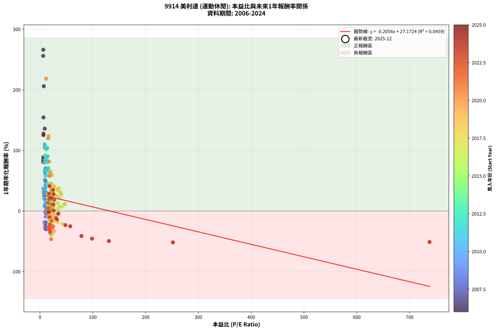
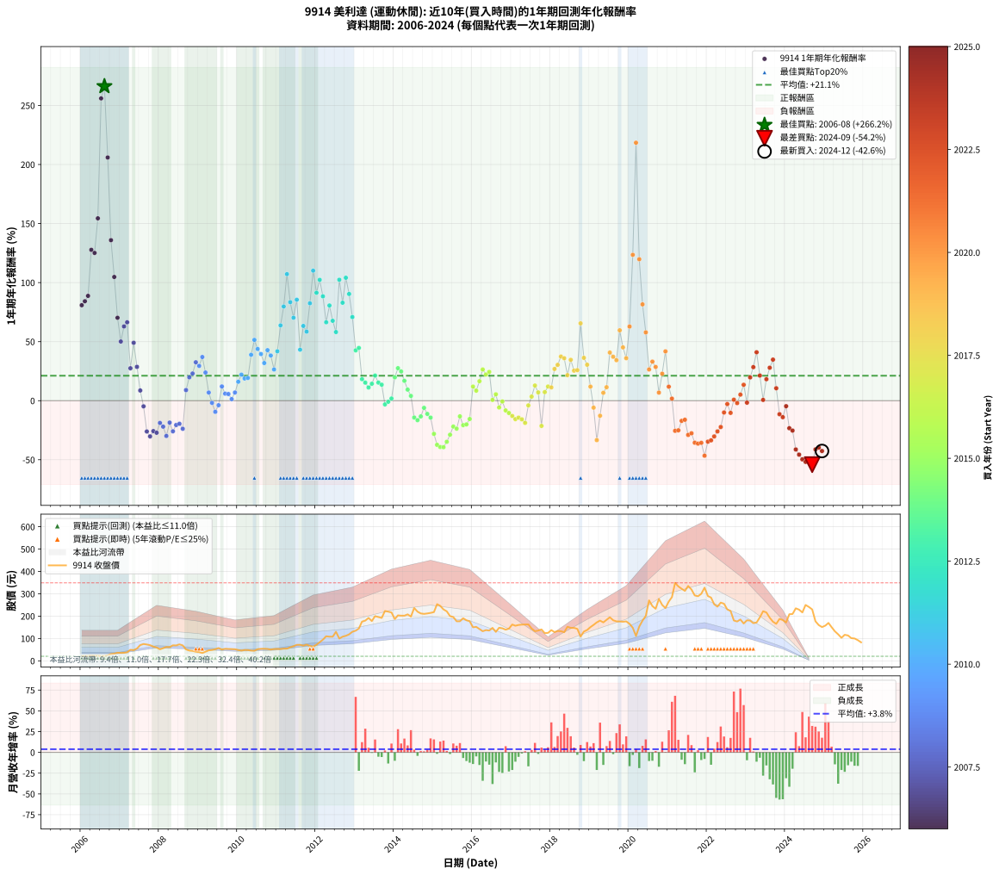

# 9914 美利達 - 本益比與未來報酬率分析

!!! info "報告資訊"
    - **股票代號**: 9914
    - **公司名稱**: 美利達
    - **產業別**: 運動休閒
    - **分析期間**: 2006-2024 (228 個數據點)
    - **資料來源**: Type 12 (ShowMonthlyK_ChartFlow) 月收盤價與本益比
    - **報酬率口徑**: 含現金股利 (簡化: 年度合計，假設每年7/1入帳)
    - **報告生成時間**: 2026-01-10 23:16:26 CST

## 📈 視覺化圖表

### 圖表1: 本益比 vs 未來報酬率關係

*圖表1：9914 美利達 本益比與1年期未來報酬率關係 (2006-2024)*

### 圖表2: 歷年買入時點的1年期實際報酬率

*圖表2：9914 美利達 歷年買入時點的1年期實際報酬率 (2006-2024)*

## 📍 買點訊號說明

本報告提供兩種買點提示訊號（顯示於圖表2的股價子圖中）：

### ▲ 小綠色三角形（回測驗證）
- **計算方式**: 使用全部歷史資料計算本益比第25百分位數
- **用途**: 事後驗證，顯示歷史上哪些時點確實為低估區
- **限制**: 當下無法判斷，僅供回測參考
- **特性**: 後見之明（Look-Ahead Bias）

### ▲ 小橘色三角形（即時訊號）
- **計算方式**: 使用截至當月的過去5年資料計算本益比第25百分位數
- **用途**: 實際投資決策，當時即可判斷
- **優勢**: 可操作性強，符合實務需求
- **特性**: 無後見之明，滾動窗口計算

!!! tip "如何使用兩種訊號"
    - **綠色▲** 幫助理解歷史估值機會，驗證策略有效性
    - **橘色▲** 可作為實際買進參考，但仍需搭配基本面分析
    - 兩種訊號重疊時，表示即時判斷與事後驗證一致，信心度較高
    - 僅有綠色▲時，表示當時無法判斷（需要未來資料才能確認）
    - 僅有橘色▲時，表示即時判斷為買點，但事後可能不是最佳時機

## 📊 估值分析摘要

| 指標 | 數值 |
|:---:|:---:|
| **目前本益比** (2024-12) | **nan 倍** |
| **歷史平均本益比** | 23.64 倍 |
| **估值水準** | 🟡 合理範圍 |
| **預期1年年化報酬率** | **+nan%** |
| **歷史平均報酬率** | +21.14% |
| **相關係數 (R²)** | 0.0459 |
| **趨勢線斜率** | -0.2056 |

!!! abstract "核心洞察"
    目前本益比接近歷史平均，預期報酬率符合長期趨勢

    根據歷史數據回測，9914 美利達 在目前本益比 **nan倍** 的估值水準下，
    預期未來1年年化報酬率約為 **+nan%**。

    **重要提醒**: 本分析基於歷史數據統計，實際報酬率會受到公司基本面變化、產業趨勢、
    總體經濟環境等多重因素影響。R² = 0.05 表示本益比可解釋約 4.6% 的報酬率變異。

## 📈 歷史估值統計

### 最佳買點 (最高報酬率)

| 項目 | 數值 |
|:---:|:---:|
| 起始時間 | 2006-08 |
| 當時本益比 | 6.21 倍 |
| 起始價格 | 21.1 元 |
| 1年後價格 | 75.4 元 |
| **1年年化報酬率** | **+266.20%** |

### 最差買點 (最低報酬率)

| 項目 | 數值 |
|:---:|:---:|
| 起始時間 | 2024-09 |
| 當時本益比 | nan 倍 |
| 起始價格 | 230.0 元 |
| 1年後價格 | 101.5 元 |
| **1年年化報酬率** | **-54.15%** |

## 🎯 投資啟示

### 本益比與報酬率關係

趨勢線方程式: **y = -0.2056x + 27.1724**

!!! note "負相關"
    本益比與未來報酬率呈現負相關。較低的本益比通常帶來較高的未來報酬率，
    但相關性不算非常強。**估值仍是重要參考指標之一**。

### 估值區間建議

基於歷史數據分析:

- **🟢 低估區** (P/E < 18.9): 預期報酬率較高，可考慮增加持股
- **🟡 合理區** (P/E 18.9-28.4): 預期報酬率符合長期趨勢，正常持有
- **🔴 高估區** (P/E > 28.4): 預期報酬率較低，可考慮減碼或觀望

!!! danger "風險提示"
    - 過去表現不代表未來結果
    - 本分析假設公司基本面無重大結構性變化
    - 產業環境劇變可能使歷史規律失效
    - 應結合公司財報、產業趨勢、總體經濟等多重因素綜合判斷

!!! success "長期投資觀點"
    歷史數據顯示，在合理或低估的估值水準買入並長期持有，
    往往能獲得較佳的投資報酬。**耐心等待好價格**是價值投資的核心原則。

## 📊 數據品質

- **資料來源**: GoodInfo.tw Type 12 (ShowMonthlyK_ChartFlow)
- **資料頻率**: 月度收盤價與本益比
- **回測期間**: 2006-2024
- **數據點數量**: 228 個 (每個點代表一次1年期回測)

### 計算方法說明

1. **1年期年化報酬率**:
   - 對每個歷史時點，計算其後1年的實際投資報酬率
   - 期末價值(不含股利): 期末價格
   - 期末價值(含現金股利): 期末價格 + 持有期間內的現金股利合計 (簡化: 年度合計，假設每年7/1入帳)
   - 公式: 年化報酬率 = [(期末價值/期初價格)^(1/年數) - 1] × 100%

2. **本益比 (P/E Ratio)**:
   - 使用當時的月收盤價與EPS計算
   - 資料來源: Type 12 月度河流圖本益比數據

3. **趨勢線 (Linear Regression)**:
   - 使用最小平方法擬合線性趨勢線
   - R²值衡量本益比對報酬率的解釋能力

---

*本報告由 Stock Analysis System v1.9.0 自動生成*
*數據更新時間: 2026-01-10 23:16:26 CST*

## 📋 月度回測明細表

（每一列對應時間線圖中的一個買入點；可用來對照 SVG 圖上的每個點。）

| 買入月份 | 賣出月份 | 回測期限_年 | 實際持有年數 | 買入本益比_倍 | 買入收盤價_元 | 賣出收盤價_元 | 現金股利合計_元 | 總報酬率_pct | 年化報酬率_pct |
| --- | --- | --- | --- | --- | --- | --- | --- | --- | --- |
| 2006-01 | 2007-01 | 1 | 0.999 | 6.04 | 20.55 | 35.45 | 1.70 | +80.78 | +80.85 |
| 2006-02 | 2007-02 | 1 | 0.999 | 6.03 | 20.50 | 36.05 | 1.70 | +84.15 | +84.22 |
| 2006-03 | 2007-03 | 1 | 0.999 | 6.24 | 21.20 | 38.30 | 1.70 | +88.68 | +88.76 |
| 2006-04 | 2007-04 | 1 | 0.999 | 6.60 | 22.45 | 49.40 | 1.70 | +127.62 | +127.75 |
| 2006-05 | 2007-05 | 1 | 0.999 | 6.47 | 22.00 | 47.80 | 1.70 | +125.00 | +125.13 |
| 2006-06 | 2007-06 | 1 | 0.999 | 6.56 | 22.30 | 55.00 | 1.70 | +154.26 | +154.42 |
| 2006-07 | 2007-07 | 1 | 0.999 | 5.97 | 20.30 | 70.40 | 1.80 | +255.67 | +255.97 |
| 2006-08 | 2007-08 | 1 | 0.999 | 6.21 | 21.10 | 75.40 | 1.80 | +265.88 | +266.20 |
| 2006-09 | 2007-09 | 1 | 0.999 | 7.21 | 24.50 | 73.10 | 1.80 | +205.71 | +205.95 |
| 2006-10 | 2007-10 | 1 | 0.999 | 8.96 | 30.45 | 70.00 | 1.80 | +135.80 | +135.93 |
| 2006-11 | 2007-11 | 1 | 0.999 | 9.43 | 32.05 | 63.80 | 1.80 | +104.68 | +104.78 |
| 2006-12 | 2007-12 | 1 | 0.999 | 10.65 | 36.20 | 59.80 | 1.80 | +70.17 | +70.23 |
| 2007-01 | 2008-01 | 1 | 0.999 | 9.76 | 35.45 | 51.40 | 1.80 | +50.07 | +50.11 |
| 2007-02 | 2008-02 | 1 | 0.999 | 9.33 | 36.05 | 56.90 | 1.80 | +62.83 | +62.88 |
| 2007-03 | 2008-03 | 1 | 1.002 | 9.35 | 38.30 | 62.00 | 1.80 | +66.58 | +66.41 |
| 2007-04 | 2008-04 | 1 | 1.002 | 11.42 | 49.40 | 61.20 | 1.80 | +27.53 | +27.47 |
| 2007-05 | 2008-05 | 1 | 1.002 | 10.49 | 47.80 | 69.50 | 1.80 | +49.16 | +49.04 |
| 2007-06 | 2008-06 | 1 | 1.002 | 11.48 | 55.00 | 69.00 | 1.80 | +28.73 | +28.66 |
| 2007-07 | 2008-07 | 1 | 1.002 | 14.02 | 70.40 | 73.70 | 2.80 | +8.66 | +8.65 |
| 2007-08 | 2008-08 | 1 | 1.002 | 14.35 | 75.40 | 69.00 | 2.80 | -4.77 | -4.76 |
| 2007-09 | 2008-09 | 1 | 1.002 | 13.33 | 73.10 | 51.20 | 2.80 | -26.13 | -26.08 |
| 2007-10 | 2008-10 | 1 | 1.002 | 12.24 | 70.00 | 46.00 | 2.80 | -30.29 | -30.23 |
| 2007-11 | 2008-11 | 1 | 1.002 | 10.73 | 63.80 | 44.55 | 2.80 | -25.78 | -25.74 |
| 2007-12 | 2008-12 | 1 | 1.002 | 9.68 | 59.80 | 40.75 | 2.80 | -27.17 | -27.13 |
| 2008-01 | 2009-01 | 1 | 1.002 | 8.39 | 51.40 | 38.90 | 2.80 | -18.87 | -18.84 |
| 2008-02 | 2009-03 | 1 | 1.081 | 9.37 | 56.90 | 40.70 | 2.80 | -23.55 | -21.99 |
| 2008-03 | 2009-03 | 1 | 0.999 | 10.31 | 62.00 | 40.70 | 2.80 | -29.84 | -29.86 |
| 2008-04 | 2009-04 | 1 | 0.999 | 10.27 | 61.20 | 47.05 | 2.80 | -18.55 | -18.56 |
| 2008-05 | 2009-05 | 1 | 0.999 | 11.77 | 69.50 | 48.70 | 2.80 | -25.90 | -25.91 |
| 2008-06 | 2009-06 | 1 | 0.999 | 11.79 | 69.00 | 52.00 | 2.80 | -20.58 | -20.59 |
| 2008-07 | 2009-07 | 1 | 0.999 | 12.72 | 73.70 | 57.30 | 2.00 | -19.54 | -19.55 |
| 2008-08 | 2009-08 | 1 | 0.999 | 12.02 | 69.00 | 50.60 | 2.00 | -23.77 | -23.78 |
| 2008-09 | 2009-09 | 1 | 0.999 | 9.01 | 51.20 | 53.80 | 2.00 | +8.98 | +8.99 |
| 2008-10 | 2009-10 | 1 | 0.999 | 8.17 | 46.00 | 53.10 | 2.00 | +19.78 | +19.80 |
| 2008-11 | 2009-11 | 1 | 0.999 | 7.99 | 44.55 | 52.80 | 2.00 | +23.01 | +23.03 |
| 2008-12 | 2009-12 | 1 | 0.999 | 7.38 | 40.75 | 52.00 | 2.00 | +32.52 | +32.54 |
| 2009-01 | 2010-01 | 1 | 0.999 | 7.15 | 38.90 | 48.35 | 2.00 | +29.43 | +29.46 |
| 2009-02 | 2010-02 | 1 | 0.999 | 6.51 | 34.90 | 45.80 | 2.00 | +36.96 | +36.99 |
| 2009-03 | 2010-03 | 1 | 0.999 | 7.71 | 40.70 | 48.40 | 2.00 | +23.83 | +23.85 |
| 2009-04 | 2010-04 | 1 | 0.999 | 9.05 | 47.05 | 48.30 | 2.00 | +6.91 | +6.91 |
| 2009-05 | 2010-05 | 1 | 0.999 | 9.52 | 48.70 | 45.80 | 2.00 | -1.85 | -1.85 |
| 2009-06 | 2010-06 | 1 | 0.999 | 10.33 | 52.00 | 45.10 | 2.00 | -9.42 | -9.43 |
| 2009-07 | 2010-07 | 1 | 0.999 | 11.57 | 57.30 | 52.10 | 3.00 | -3.84 | -3.84 |
| 2009-08 | 2010-08 | 1 | 0.999 | 10.38 | 50.60 | 53.70 | 3.00 | +12.06 | +12.06 |
| 2009-09 | 2010-09 | 1 | 0.999 | 11.23 | 53.80 | 54.00 | 3.00 | +5.95 | +5.95 |
| 2009-10 | 2010-10 | 1 | 0.999 | 11.27 | 53.10 | 53.10 | 3.00 | +5.65 | +5.65 |
| 2009-11 | 2010-11 | 1 | 0.999 | 11.40 | 52.80 | 50.50 | 3.00 | +1.33 | +1.33 |
| 2009-12 | 2010-12 | 1 | 0.999 | 11.43 | 52.00 | 52.60 | 3.00 | +6.92 | +6.93 |
| 2010-01 | 2011-01 | 1 | 0.999 | 10.53 | 48.35 | 53.10 | 3.00 | +16.03 | +16.04 |
| 2010-02 | 2011-02 | 1 | 0.999 | 9.89 | 45.80 | 52.90 | 3.00 | +22.05 | +22.07 |
| 2010-03 | 2011-03 | 1 | 0.999 | 10.36 | 48.40 | 54.50 | 3.00 | +18.80 | +18.82 |
| 2010-04 | 2011-04 | 1 | 0.999 | 10.25 | 48.30 | 54.60 | 3.00 | +19.25 | +19.27 |
| 2010-05 | 2011-05 | 1 | 0.999 | 9.63 | 45.80 | 60.60 | 3.00 | +38.86 | +38.90 |
| 2010-06 | 2011-06 | 1 | 0.999 | 9.41 | 45.10 | 65.30 | 3.00 | +51.44 | +51.48 |
| 2010-07 | 2011-07 | 1 | 0.999 | 10.77 | 52.10 | 71.60 | 3.30 | +43.76 | +43.80 |
| 2010-08 | 2011-08 | 1 | 0.999 | 11.01 | 53.70 | 71.60 | 3.30 | +39.48 | +39.51 |
| 2010-09 | 2011-09 | 1 | 0.999 | 10.98 | 54.00 | 67.90 | 3.30 | +31.85 | +31.88 |
| 2010-10 | 2011-10 | 1 | 0.999 | 10.71 | 53.10 | 72.50 | 3.30 | +42.75 | +42.78 |
| 2010-11 | 2011-11 | 1 | 0.999 | 10.10 | 50.50 | 66.50 | 3.30 | +38.22 | +38.25 |
| 2010-12 | 2011-12 | 1 | 0.999 | 10.44 | 52.60 | 63.20 | 3.30 | +26.43 | +26.45 |
| 2011-01 | 2012-01 | 1 | 0.999 | 10.15 | 53.10 | 72.00 | 3.30 | +41.81 | +41.84 |
| 2011-02 | 2012-02 | 1 | 0.999 | 9.76 | 52.90 | 83.30 | 3.30 | +63.71 | +63.76 |
| 2011-03 | 2012-03 | 1 | 1.002 | 9.71 | 54.50 | 94.80 | 3.30 | +80.00 | +79.78 |
| 2011-04 | 2012-04 | 1 | 1.002 | 9.41 | 54.60 | 110.00 | 3.30 | +107.51 | +107.20 |
| 2011-05 | 2012-05 | 1 | 1.002 | 10.11 | 60.60 | 108.00 | 3.30 | +83.66 | +83.43 |
| 2011-06 | 2012-06 | 1 | 1.002 | 10.56 | 65.30 | 108.00 | 3.30 | +70.44 | +70.26 |
| 2011-07 | 2012-07 | 1 | 1.002 | 11.23 | 71.60 | 130.00 | 3.00 | +85.75 | +85.52 |
| 2011-08 | 2012-08 | 1 | 1.002 | 10.90 | 71.60 | 99.60 | 3.00 | +43.30 | +43.19 |
| 2011-09 | 2012-09 | 1 | 1.002 | 10.05 | 67.90 | 108.00 | 3.00 | +63.48 | +63.31 |
| 2011-10 | 2012-10 | 1 | 1.002 | 10.43 | 72.50 | 112.00 | 3.00 | +58.62 | +58.47 |
| 2011-11 | 2012-11 | 1 | 1.002 | 9.31 | 66.50 | 118.50 | 3.00 | +82.71 | +82.48 |
| 2011-12 | 2012-12 | 1 | 1.002 | 8.62 | 63.20 | 130.00 | 3.00 | +110.44 | +110.12 |
| 2012-01 | 2013-01 | 1 | 1.002 | 9.73 | 72.00 | 135.00 | 3.00 | +91.67 | +91.41 |
| 2012-02 | 2013-03 | 1 | 1.081 | 11.14 | 83.30 | 175.50 | 3.00 | +114.29 | +102.33 |
| 2012-03 | 2013-03 | 1 | 0.999 | 12.56 | 94.80 | 175.50 | 3.00 | +88.29 | +88.37 |
| 2012-04 | 2013-04 | 1 | 0.999 | 14.44 | 110.00 | 180.00 | 3.00 | +66.36 | +66.42 |
| 2012-05 | 2013-05 | 1 | 0.999 | 14.04 | 108.00 | 192.00 | 3.00 | +80.56 | +80.63 |
| 2012-06 | 2013-06 | 1 | 0.999 | 13.91 | 108.00 | 178.00 | 3.00 | +67.59 | +67.65 |
| 2012-07 | 2013-07 | 1 | 0.999 | 16.59 | 130.00 | 200.00 | 5.50 | +58.08 | +58.13 |
| 2012-08 | 2013-08 | 1 | 0.999 | 12.59 | 99.60 | 196.00 | 5.50 | +102.31 | +102.41 |
| 2012-09 | 2013-09 | 1 | 0.999 | 13.53 | 108.00 | 192.00 | 5.50 | +82.87 | +82.95 |
| 2012-10 | 2013-10 | 1 | 0.999 | 13.90 | 112.00 | 223.00 | 5.50 | +104.02 | +104.12 |
| 2012-11 | 2013-11 | 1 | 0.999 | 14.58 | 118.50 | 220.00 | 5.50 | +90.30 | +90.38 |
| 2012-12 | 2013-12 | 1 | 0.999 | 15.85 | 130.00 | 216.50 | 5.50 | +70.77 | +70.83 |
| 2013-01 | 2014-01 | 1 | 0.999 | 16.13 | 135.00 | 187.00 | 5.50 | +42.59 | +42.63 |
| 2013-02 | 2014-02 | 1 | 0.999 | 16.93 | 144.50 | 203.50 | 5.50 | +44.64 | +44.67 |
| 2013-03 | 2014-03 | 1 | 0.999 | 20.17 | 175.50 | 202.00 | 5.50 | +18.23 | +18.25 |
| 2013-04 | 2014-04 | 1 | 0.999 | 20.29 | 180.00 | 202.00 | 5.50 | +15.28 | +15.29 |
| 2013-05 | 2014-05 | 1 | 0.999 | 21.24 | 192.00 | 208.00 | 5.50 | +11.20 | +11.21 |
| 2013-06 | 2014-06 | 1 | 0.999 | 19.34 | 178.00 | 198.00 | 5.50 | +14.33 | +14.34 |
| 2013-07 | 2014-07 | 1 | 0.999 | 21.34 | 200.00 | 236.50 | 6.00 | +21.25 | +21.27 |
| 2013-08 | 2014-08 | 1 | 0.999 | 20.55 | 196.00 | 220.00 | 6.00 | +15.31 | +15.32 |
| 2013-09 | 2014-09 | 1 | 0.999 | 19.78 | 192.00 | 212.00 | 6.00 | +13.54 | +13.55 |
| 2013-10 | 2014-10 | 1 | 0.999 | 22.58 | 223.00 | 210.00 | 6.00 | -3.14 | -3.14 |
| 2013-11 | 2014-11 | 1 | 0.999 | 21.91 | 220.00 | 212.00 | 6.00 | -0.91 | -0.91 |
| 2013-12 | 2014-12 | 1 | 0.999 | 21.20 | 216.50 | 214.50 | 6.00 | +1.85 | +1.85 |
| 2014-01 | 2015-01 | 1 | 0.999 | 18.17 | 187.00 | 218.00 | 6.00 | +19.79 | +19.80 |
| 2014-02 | 2015-02 | 1 | 0.999 | 19.61 | 203.50 | 253.50 | 6.00 | +27.52 | +27.54 |
| 2014-03 | 2015-03 | 1 | 0.999 | 19.32 | 202.00 | 246.00 | 6.00 | +24.75 | +24.77 |
| 2014-04 | 2015-04 | 1 | 0.999 | 19.17 | 202.00 | 230.00 | 6.00 | +16.83 | +16.84 |
| 2014-05 | 2015-05 | 1 | 0.999 | 19.58 | 208.00 | 221.50 | 6.00 | +9.38 | +9.38 |
| 2014-06 | 2015-06 | 1 | 0.999 | 18.50 | 198.00 | 200.00 | 6.00 | +4.04 | +4.04 |
| 2014-07 | 2015-07 | 1 | 0.999 | 21.92 | 236.50 | 196.00 | 6.80 | -14.25 | -14.26 |
| 2014-08 | 2015-08 | 1 | 0.999 | 20.24 | 220.00 | 177.00 | 6.80 | -16.45 | -16.46 |
| 2014-09 | 2015-09 | 1 | 0.999 | 19.36 | 212.00 | 177.00 | 6.80 | -13.30 | -13.31 |
| 2014-10 | 2015-10 | 1 | 0.999 | 19.03 | 210.00 | 190.50 | 6.80 | -6.05 | -6.05 |
| 2014-11 | 2015-11 | 1 | 0.999 | 19.07 | 212.00 | 181.50 | 6.80 | -11.18 | -11.19 |
| 2014-12 | 2015-12 | 1 | 0.999 | 19.15 | 214.50 | 177.00 | 6.80 | -14.31 | -14.32 |
| 2015-01 | 2016-01 | 1 | 0.999 | 19.61 | 218.00 | 150.00 | 6.80 | -28.07 | -28.09 |
| 2015-02 | 2016-02 | 1 | 0.999 | 22.99 | 253.50 | 152.00 | 6.80 | -37.36 | -37.38 |
| 2015-03 | 2016-03 | 1 | 1.002 | 22.48 | 246.00 | 142.50 | 6.80 | -39.31 | -39.25 |
| 2015-04 | 2016-04 | 1 | 1.002 | 21.19 | 230.00 | 132.50 | 6.80 | -39.43 | -39.37 |
| 2015-05 | 2016-05 | 1 | 1.002 | 20.56 | 221.50 | 137.50 | 6.80 | -34.85 | -34.80 |
| 2015-06 | 2016-06 | 1 | 1.002 | 18.72 | 200.00 | 135.50 | 6.80 | -28.85 | -28.80 |
| 2015-07 | 2016-07 | 1 | 1.002 | 18.49 | 196.00 | 147.50 | 5.50 | -21.94 | -21.90 |
| 2015-08 | 2016-08 | 1 | 1.002 | 16.84 | 177.00 | 129.50 | 5.50 | -23.73 | -23.69 |
| 2015-09 | 2016-09 | 1 | 1.002 | 16.97 | 177.00 | 148.00 | 5.50 | -13.28 | -13.25 |
| 2015-10 | 2016-10 | 1 | 1.002 | 18.42 | 190.50 | 145.50 | 5.50 | -20.73 | -20.70 |
| 2015-11 | 2016-11 | 1 | 1.002 | 17.70 | 181.50 | 139.50 | 5.50 | -20.11 | -20.07 |
| 2015-12 | 2016-12 | 1 | 1.002 | 17.40 | 177.00 | 144.00 | 5.50 | -15.54 | -15.51 |
| 2016-01 | 2017-01 | 1 | 1.002 | 15.22 | 150.00 | 162.50 | 5.50 | +12.00 | +11.97 |
| 2016-02 | 2017-03 | 1 | 1.081 | 15.92 | 152.00 | 160.50 | 5.50 | +9.21 | +8.49 |
| 2016-03 | 2017-03 | 1 | 0.999 | 15.43 | 142.50 | 160.50 | 5.50 | +16.49 | +16.50 |
| 2016-04 | 2017-04 | 1 | 0.999 | 14.85 | 132.50 | 162.00 | 5.50 | +26.42 | +26.44 |
| 2016-05 | 2017-05 | 1 | 0.999 | 15.97 | 137.50 | 162.50 | 5.50 | +22.18 | +22.20 |
| 2016-06 | 2017-06 | 1 | 0.999 | 16.34 | 135.50 | 163.00 | 5.50 | +24.35 | +24.37 |
| 2016-07 | 2017-07 | 1 | 0.999 | 18.48 | 147.50 | 144.50 | 4.00 | +0.68 | +0.68 |
| 2016-08 | 2017-08 | 1 | 0.999 | 16.88 | 129.50 | 132.50 | 4.00 | +5.41 | +5.41 |
| 2016-09 | 2017-09 | 1 | 0.999 | 20.12 | 148.00 | 135.50 | 4.00 | -5.74 | -5.75 |
| 2016-10 | 2017-10 | 1 | 0.999 | 20.65 | 145.50 | 140.50 | 4.00 | -0.69 | -0.69 |
| 2016-11 | 2017-11 | 1 | 0.999 | 20.72 | 139.50 | 124.00 | 4.00 | -8.24 | -8.25 |
| 2016-12 | 2017-12 | 1 | 0.999 | 22.43 | 144.00 | 125.00 | 4.00 | -10.42 | -10.42 |
| 2017-01 | 2018-01 | 1 | 0.999 | 26.61 | 162.50 | 137.50 | 4.00 | -12.92 | -12.93 |
| 2017-02 | 2018-02 | 1 | 0.999 | 27.09 | 157.00 | 128.50 | 4.00 | -15.61 | -15.61 |
| 2017-03 | 2018-03 | 1 | 0.999 | 29.27 | 160.50 | 133.50 | 4.00 | -14.33 | -14.34 |
| 2017-04 | 2018-04 | 1 | 0.999 | 31.33 | 162.00 | 132.50 | 4.00 | -15.74 | -15.75 |
| 2017-05 | 2018-05 | 1 | 0.999 | 33.45 | 162.50 | 128.00 | 4.00 | -18.77 | -18.78 |
| 2017-06 | 2018-06 | 1 | 0.999 | 35.86 | 163.00 | 152.50 | 4.00 | -3.99 | -3.99 |
| 2017-07 | 2018-07 | 1 | 0.999 | 34.14 | 144.50 | 147.50 | 2.00 | +3.46 | +3.46 |
| 2017-08 | 2018-08 | 1 | 0.999 | 33.80 | 132.50 | 147.50 | 2.00 | +12.83 | +12.84 |
| 2017-09 | 2018-09 | 1 | 0.999 | 37.56 | 135.50 | 143.00 | 2.00 | +7.01 | +7.02 |
| 2017-10 | 2018-10 | 1 | 0.999 | 42.64 | 140.50 | 108.50 | 2.00 | -21.35 | -21.37 |
| 2017-11 | 2018-11 | 1 | 0.999 | 41.58 | 124.00 | 131.00 | 2.00 | +7.26 | +7.26 |
| 2017-12 | 2018-12 | 1 | 0.999 | 46.82 | 125.00 | 138.00 | 2.00 | +12.00 | +12.01 |
| 2018-01 | 2019-01 | 1 | 0.999 | 47.02 | 137.50 | 151.00 | 2.00 | +11.27 | +11.28 |
| 2018-02 | 2019-02 | 1 | 0.999 | 40.43 | 128.50 | 161.00 | 2.00 | +26.85 | +26.87 |
| 2018-03 | 2019-03 | 1 | 0.999 | 38.89 | 133.50 | 172.00 | 2.00 | +30.34 | +30.36 |
| 2018-04 | 2019-04 | 1 | 0.999 | 35.94 | 132.50 | 180.00 | 2.00 | +37.36 | +37.39 |
| 2018-05 | 2019-05 | 1 | 0.999 | 32.48 | 128.00 | 172.00 | 2.00 | +35.94 | +35.97 |
| 2018-06 | 2019-06 | 1 | 0.999 | 36.35 | 152.50 | 183.50 | 2.00 | +21.64 | +21.66 |
| 2018-07 | 2019-07 | 1 | 0.999 | 33.15 | 147.50 | 195.00 | 3.50 | +34.58 | +34.60 |
| 2018-08 | 2019-08 | 1 | 0.999 | 31.36 | 147.50 | 181.50 | 3.50 | +25.42 | +25.44 |
| 2018-09 | 2019-09 | 1 | 0.999 | 28.85 | 143.00 | 176.50 | 3.50 | +25.87 | +25.89 |
| 2018-10 | 2019-10 | 1 | 0.999 | 20.82 | 108.50 | 176.00 | 3.50 | +65.44 | +65.49 |
| 2018-11 | 2019-11 | 1 | 0.999 | 23.97 | 131.00 | 175.00 | 3.50 | +36.26 | +36.29 |
| 2018-12 | 2019-12 | 1 | 0.999 | 24.13 | 138.00 | 176.50 | 3.50 | +30.43 | +30.46 |
| 2019-01 | 2020-01 | 1 | 0.999 | 25.42 | 151.00 | 165.50 | 3.50 | +11.92 | +11.93 |
| 2019-02 | 2020-02 | 1 | 0.999 | 26.13 | 161.00 | 148.00 | 3.50 | -5.90 | -5.90 |
| 2019-03 | 2020-03 | 1 | 1.002 | 26.95 | 172.00 | 111.00 | 3.50 | -33.43 | -33.37 |
| 2019-04 | 2020-04 | 1 | 1.002 | 27.26 | 180.00 | 153.50 | 3.50 | -12.78 | -12.75 |
| 2019-05 | 2020-05 | 1 | 1.002 | 25.20 | 172.00 | 180.00 | 3.50 | +6.69 | +6.67 |
| 2019-06 | 2020-06 | 1 | 1.002 | 26.05 | 183.50 | 201.00 | 3.50 | +11.44 | +11.42 |
| 2019-07 | 2020-07 | 1 | 1.002 | 26.84 | 195.00 | 270.50 | 4.20 | +40.87 | +40.77 |
| 2019-08 | 2020-08 | 1 | 1.002 | 24.24 | 181.50 | 245.00 | 4.20 | +37.30 | +37.21 |
| 2019-09 | 2020-09 | 1 | 1.002 | 22.90 | 176.50 | 233.00 | 4.20 | +34.39 | +34.31 |
| 2019-10 | 2020-10 | 1 | 1.002 | 22.20 | 176.00 | 277.00 | 4.20 | +59.77 | +59.62 |
| 2019-11 | 2020-11 | 1 | 1.002 | 21.47 | 175.00 | 250.00 | 4.20 | +45.26 | +45.15 |
| 2019-12 | 2020-12 | 1 | 1.002 | 21.09 | 176.50 | 236.00 | 4.20 | +36.09 | +36.00 |
| 2020-01 | 2021-01 | 1 | 1.002 | 18.84 | 165.50 | 265.50 | 4.20 | +62.96 | +62.80 |
| 2020-02 | 2021-03 | 1 | 1.081 | 16.08 | 148.00 | 349.00 | 4.20 | +138.65 | +123.52 |
| 2020-03 | 2021-03 | 1 | 0.999 | 11.54 | 111.00 | 349.00 | 4.20 | +218.20 | +218.45 |
| 2020-04 | 2021-04 | 1 | 0.999 | 15.30 | 153.50 | 333.00 | 4.20 | +119.67 | +119.79 |
| 2020-05 | 2021-05 | 1 | 0.999 | 17.23 | 180.00 | 322.50 | 4.20 | +81.50 | +81.57 |
| 2020-06 | 2021-06 | 1 | 0.999 | 18.50 | 201.00 | 313.00 | 4.20 | +57.81 | +57.86 |
| 2020-07 | 2021-07 | 1 | 0.999 | 23.98 | 270.50 | 335.00 | 7.00 | +26.43 | +26.45 |
| 2020-08 | 2021-08 | 1 | 0.999 | 20.95 | 245.00 | 319.00 | 7.00 | +33.06 | +33.09 |
| 2020-09 | 2021-09 | 1 | 0.999 | 19.24 | 233.00 | 292.50 | 7.00 | +28.54 | +28.56 |
| 2020-10 | 2021-10 | 1 | 0.999 | 22.11 | 277.00 | 289.00 | 7.00 | +6.86 | +6.86 |
| 2020-11 | 2021-11 | 1 | 0.999 | 19.31 | 250.00 | 300.00 | 7.00 | +22.80 | +22.82 |
| 2020-12 | 2021-12 | 1 | 0.999 | 17.66 | 236.00 | 327.50 | 7.00 | +41.74 | +41.77 |
| 2021-01 | 2022-01 | 1 | 0.999 | 19.60 | 265.50 | 290.00 | 7.00 | +11.86 | +11.87 |
| 2021-02 | 2022-02 | 1 | 0.999 | 20.77 | 285.00 | 283.00 | 7.00 | +1.75 | +1.76 |
| 2021-03 | 2022-03 | 1 | 0.999 | 25.09 | 349.00 | 253.00 | 7.00 | -25.50 | -25.52 |
| 2021-04 | 2022-04 | 1 | 0.999 | 23.63 | 333.00 | 242.50 | 7.00 | -25.08 | -25.09 |
| 2021-05 | 2022-05 | 1 | 0.999 | 22.60 | 322.50 | 260.50 | 7.00 | -17.05 | -17.06 |
| 2021-06 | 2022-06 | 1 | 0.999 | 21.65 | 313.00 | 255.50 | 7.00 | -16.13 | -16.14 |
| 2021-07 | 2022-07 | 1 | 0.999 | 22.89 | 335.00 | 230.00 | 8.00 | -28.96 | -28.97 |
| 2021-08 | 2022-08 | 1 | 0.999 | 21.52 | 319.00 | 223.00 | 8.00 | -27.59 | -27.60 |
| 2021-09 | 2022-09 | 1 | 0.999 | 19.50 | 292.50 | 180.50 | 8.00 | -35.56 | -35.57 |
| 2021-10 | 2022-10 | 1 | 0.999 | 19.03 | 289.00 | 176.00 | 8.00 | -36.33 | -36.35 |
| 2021-11 | 2022-11 | 1 | 0.999 | 19.52 | 300.00 | 185.00 | 8.00 | -35.67 | -35.69 |
| 2021-12 | 2022-12 | 1 | 0.999 | 21.06 | 327.50 | 167.00 | 8.00 | -46.56 | -46.59 |
| 2022-01 | 2023-01 | 1 | 0.999 | 19.08 | 290.00 | 181.50 | 8.00 | -34.66 | -34.67 |
| 2022-02 | 2023-02 | 1 | 0.999 | 19.06 | 283.00 | 180.00 | 8.00 | -33.57 | -33.59 |
| 2022-03 | 2023-03 | 1 | 0.999 | 17.45 | 253.00 | 168.50 | 8.00 | -30.24 | -30.25 |
| 2022-04 | 2023-04 | 1 | 0.999 | 17.14 | 242.50 | 171.50 | 8.00 | -25.98 | -25.99 |
| 2022-05 | 2023-05 | 1 | 0.999 | 18.88 | 260.50 | 194.50 | 8.00 | -22.26 | -22.28 |
| 2022-06 | 2023-06 | 1 | 0.999 | 19.00 | 255.50 | 222.00 | 8.00 | -9.98 | -9.99 |
| 2022-07 | 2023-07 | 1 | 0.999 | 17.57 | 230.00 | 216.50 | 7.00 | -2.83 | -2.83 |
| 2022-08 | 2023-08 | 1 | 0.999 | 17.50 | 223.00 | 193.00 | 7.00 | -10.31 | -10.32 |
| 2022-09 | 2023-09 | 1 | 0.999 | 14.57 | 180.50 | 175.00 | 7.00 | +0.83 | +0.83 |
| 2022-10 | 2023-10 | 1 | 0.999 | 14.62 | 176.00 | 165.50 | 7.00 | -1.99 | -1.99 |
| 2022-11 | 2023-11 | 1 | 0.999 | 15.82 | 185.00 | 187.50 | 7.00 | +5.14 | +5.14 |
| 2022-12 | 2023-12 | 1 | 0.999 | 14.73 | 167.00 | 182.50 | 7.00 | +13.47 | +13.48 |
| 2023-01 | 2024-01 | 1 | 0.999 | 16.70 | 181.50 | 171.50 | 7.00 | -1.65 | -1.65 |
| 2023-02 | 2024-02 | 1 | 0.999 | 17.32 | 180.00 | 208.50 | 7.00 | +19.72 | +19.74 |
| 2023-03 | 2024-03 | 1 | 1.002 | 16.99 | 168.50 | 209.50 | 7.00 | +28.49 | +28.42 |
| 2023-04 | 2024-04 | 1 | 1.002 | 18.15 | 171.50 | 235.00 | 7.00 | +41.11 | +41.01 |
| 2023-05 | 2024-05 | 1 | 1.002 | 21.68 | 194.50 | 229.00 | 7.00 | +21.34 | +21.29 |
| 2023-06 | 2024-06 | 1 | 1.002 | 26.12 | 222.00 | 216.50 | 7.00 | +0.68 | +0.67 |
| 2023-07 | 2024-07 | 1 | 1.002 | 26.97 | 216.50 | 250.00 | 6.00 | +18.24 | +18.20 |
| 2023-08 | 2024-08 | 1 | 1.002 | 25.55 | 193.00 | 241.00 | 6.00 | +27.98 | +27.91 |
| 2023-09 | 2024-09 | 1 | 1.002 | 24.72 | 175.00 | 230.00 | 6.00 | +34.86 | +34.77 |
| 2023-10 | 2024-10 | 1 | 1.002 | 25.05 | 165.50 | 177.00 | 6.00 | +10.57 | +10.55 |
| 2023-11 | 2024-11 | 1 | 1.002 | 30.57 | 187.50 | 160.00 | 6.00 | -11.47 | -11.44 |
| 2023-12 | 2024-12 | 1 | 1.002 | 32.24 | 182.50 | 151.00 | 6.00 | -13.97 | -13.95 |
| 2024-01 | 2025-01 | 1 | 1.002 | 34.35 | 171.50 | 157.50 | 6.00 | -4.66 | -4.66 |
| 2024-02 | 2025-03 | 1 | 1.081 | 48.19 | 208.50 | 150.50 | 6.00 | -24.94 | -23.30 |
| 2024-03 | 2025-03 | 1 | 0.999 | 57.24 | 209.50 | 150.50 | 6.00 | -25.30 | -25.31 |
| 2024-04 | 2025-04 | 1 | 0.999 | 78.51 | 235.00 | 132.00 | 6.00 | -41.28 | -41.30 |
| 2024-05 | 2025-05 | 1 | 0.999 | 98.42 | 229.00 | 118.50 | 6.00 | -45.63 | -45.66 |
| 2024-06 | 2025-06 | 1 | 0.999 | 130.40 | 216.50 | 103.00 | 6.00 | -49.65 | -49.68 |
| 2024-07 | 2025-07 | 1 | 0.999 | 251.70 | 250.00 | 116.50 | 4.00 | -51.80 | -51.82 |
| 2024-08 | 2025-08 | 1 | 0.999 | 737.80 | 241.00 | 113.50 | 4.00 | -51.24 | -51.27 |
| 2024-09 | 2025-09 | 1 | 0.999 |  | 230.00 | 101.50 | 4.00 | -54.13 | -54.15 |
| 2024-10 | 2025-10 | 1 | 0.999 |  | 177.00 | 100.00 | 4.00 | -41.24 | -41.26 |
| 2024-11 | 2025-11 | 1 | 0.999 |  | 160.00 | 92.50 | 4.00 | -39.69 | -39.71 |
| 2024-12 | 2025-12 | 1 | 0.999 |  | 151.00 | 82.70 | 4.00 | -42.58 | -42.60 |
