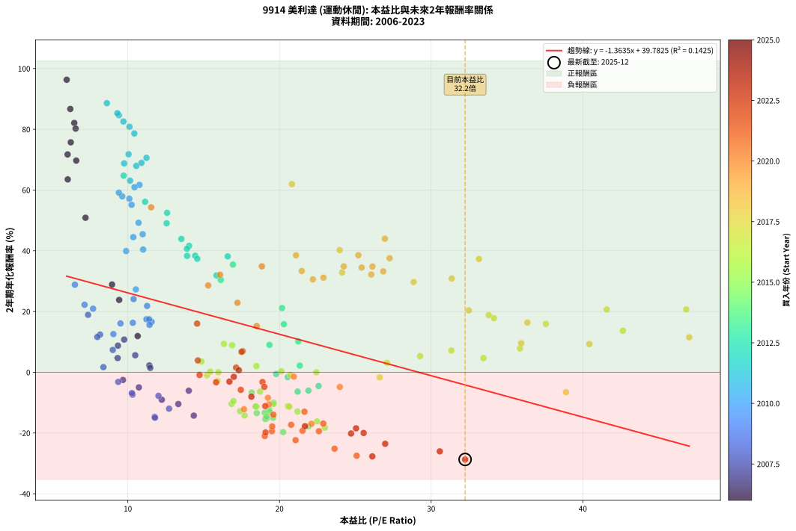
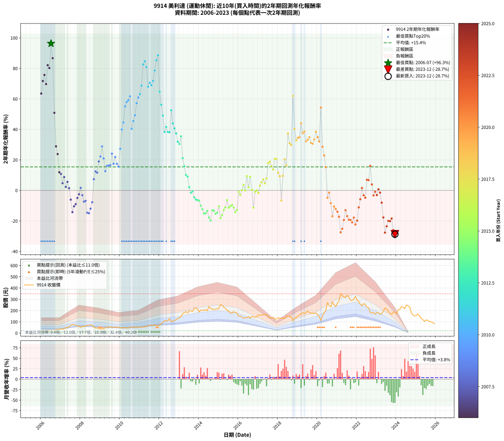

# 9914 美利達 - 本益比與未來報酬率分析

!!! info "報告資訊"
    - **股票代號**: 9914
    - **公司名稱**: 美利達
    - **產業別**: 運動休閒
    - **分析期間**: 2006-2023 (216 個數據點)
    - **資料來源**: Type 12 (ShowMonthlyK_ChartFlow) 月收盤價與本益比
    - **報酬率口徑**: 含現金股利 (簡化: 年度合計，假設每年7/1入帳)
    - **報告生成時間**: 2026-01-05 01:18:38 CST

## 📈 視覺化圖表

### 圖表1: 本益比 vs 未來報酬率關係

*圖表1：9914 美利達 本益比與2年期未來報酬率關係 (2006-2023)*

### 圖表2: 歷年買入時點的2年期實際報酬率

*圖表2：9914 美利達 歷年買入時點的2年期實際報酬率 (2006-2023)*

## 📍 買點訊號說明

本報告提供兩種買點提示訊號（顯示於圖表2的股價子圖中）：

### ▲ 小綠色三角形（回測驗證）
- **計算方式**: 使用全部歷史資料計算本益比第25百分位數
- **用途**: 事後驗證，顯示歷史上哪些時點確實為低估區
- **限制**: 當下無法判斷，僅供回測參考
- **特性**: 後見之明（Look-Ahead Bias）

### ▲ 小橘色三角形（即時訊號）
- **計算方式**: 使用截至當月的過去5年資料計算本益比第25百分位數
- **用途**: 實際投資決策，當時即可判斷
- **優勢**: 可操作性強，符合實務需求
- **特性**: 無後見之明，滾動窗口計算

!!! tip "如何使用兩種訊號"
    - **綠色▲** 幫助理解歷史估值機會，驗證策略有效性
    - **橘色▲** 可作為實際買進參考，但仍需搭配基本面分析
    - 兩種訊號重疊時，表示即時判斷與事後驗證一致，信心度較高
    - 僅有綠色▲時，表示當時無法判斷（需要未來資料才能確認）
    - 僅有橘色▲時，表示即時判斷為買點，但事後可能不是最佳時機

## 📊 估值分析摘要

| 指標 | 數值 |
|:---:|:---:|
| **目前本益比** (2023-12) | **32.24 倍** |
| **歷史平均本益比** | 17.87 倍 |
| **估值水準** | 🔴 相對高估 |
| **預期2年年化報酬率** | **-4.18%** |
| **歷史平均報酬率** | +15.42% |
| **相關係數 (R²)** | 0.1425 |
| **趨勢線斜率** | -1.3635 |

!!! abstract "核心洞察"
    目前本益比顯著高於歷史平均，預期未來報酬率可能較低

    根據歷史數據回測，9914 美利達 在目前本益比 **32.2倍** 的估值水準下，
    預期未來2年年化報酬率約為 **-4.2%**。

    **重要提醒**: 本分析基於歷史數據統計，實際報酬率會受到公司基本面變化、產業趨勢、
    總體經濟環境等多重因素影響。R² = 0.14 表示本益比可解釋約 14.3% 的報酬率變異。

## 📈 歷史估值統計

### 最佳買點 (最高報酬率)

| 項目 | 數值 |
|:---:|:---:|
| 起始時間 | 2006-07 |
| 當時本益比 | 5.97 倍 |
| 起始價格 | 20.3 元 |
| 2年後價格 | 73.7 元 |
| **2年年化報酬率** | **+96.31%** |

### 最差買點 (最低報酬率)

| 項目 | 數值 |
|:---:|:---:|
| 起始時間 | 2023-12 |
| 當時本益比 | 32.24 倍 |
| 起始價格 | 182.5 元 |
| 2年後價格 | 82.7 元 |
| **2年年化報酬率** | **-28.71%** |

## 🎯 投資啟示

### 本益比與報酬率關係

趨勢線方程式: **y = -1.3635x + 39.7825**

!!! warning "強負相關"
    本益比與未來報酬率呈現強負相關。在高本益比時期買入，未來報酬率顯著較低；
    在低本益比時期買入，未來報酬率顯著較高。**估值紀律至關重要**。

### 估值區間建議

基於歷史數據分析:

- **🟢 低估區** (P/E < 14.3): 預期報酬率較高，可考慮增加持股
- **🟡 合理區** (P/E 14.3-21.4): 預期報酬率符合長期趨勢，正常持有
- **🔴 高估區** (P/E > 21.4): 預期報酬率較低，可考慮減碼或觀望

!!! danger "風險提示"
    - 過去表現不代表未來結果
    - 本分析假設公司基本面無重大結構性變化
    - 產業環境劇變可能使歷史規律失效
    - 應結合公司財報、產業趨勢、總體經濟等多重因素綜合判斷

!!! success "長期投資觀點"
    歷史數據顯示，在合理或低估的估值水準買入並長期持有，
    往往能獲得較佳的投資報酬。**耐心等待好價格**是價值投資的核心原則。

## 📊 數據品質

- **資料來源**: GoodInfo.tw Type 12 (ShowMonthlyK_ChartFlow)
- **資料頻率**: 月度收盤價與本益比
- **回測期間**: 2006-2023
- **數據點數量**: 216 個 (每個點代表一次2年期回測)

### 計算方法說明

1. **2年期年化報酬率**:
   - 對每個歷史時點，計算其後2年的實際投資報酬率
   - 期末價值(不含股利): 期末價格
   - 期末價值(含現金股利): 期末價格 + 持有期間內的現金股利合計 (簡化: 年度合計，假設每年7/1入帳)
   - 公式: 年化報酬率 = [(期末價值/期初價格)^(1/年數) - 1] × 100%

2. **本益比 (P/E Ratio)**:
   - 使用當時的月收盤價與EPS計算
   - 資料來源: Type 12 月度河流圖本益比數據

3. **趨勢線 (Linear Regression)**:
   - 使用最小平方法擬合線性趨勢線
   - R²值衡量本益比對報酬率的解釋能力

---

*本報告由 Stock Analysis System v1.9.0 自動生成*
*數據更新時間: 2026-01-05 01:18:38 CST*

## 📋 月度回測明細表

（每一列對應時間線圖中的一個買入點；可用來對照 SVG 圖上的每個點。）

| 買入月份 | 賣出月份 | 回測期限_年 | 實際持有年數 | 買入本益比_倍 | 買入收盤價_元 | 賣出收盤價_元 | 現金股利合計_元 | 總報酬率_pct | 年化報酬率_pct |
| --- | --- | --- | --- | --- | --- | --- | --- | --- | --- |
| 2006-01 | 2008-01 | 2 | 1.999 | 6.04 | 20.55 | 51.40 | 3.50 | +167.15 | +63.50 |
| 2006-02 | 2008-02 | 2 | 1.999 | 6.03 | 20.50 | 56.90 | 3.50 | +194.63 | +71.71 |
| 2006-03 | 2008-03 | 2 | 2.001 | 6.24 | 21.20 | 62.00 | 3.50 | +208.96 | +75.71 |
| 2006-04 | 2008-04 | 2 | 2.001 | 6.60 | 22.45 | 61.20 | 3.50 | +188.20 | +69.70 |
| 2006-05 | 2008-05 | 2 | 2.001 | 6.47 | 22.00 | 69.50 | 3.50 | +231.82 | +82.08 |
| 2006-06 | 2008-06 | 2 | 2.001 | 6.56 | 22.30 | 69.00 | 3.50 | +225.11 | +80.24 |
| 2006-07 | 2008-07 | 2 | 2.001 | 5.97 | 20.30 | 73.70 | 4.60 | +285.71 | +96.31 |
| 2006-08 | 2008-08 | 2 | 2.001 | 6.21 | 21.10 | 69.00 | 4.60 | +248.82 | +86.69 |
| 2006-09 | 2008-09 | 2 | 2.001 | 7.21 | 24.50 | 51.20 | 4.60 | +127.76 | +50.87 |
| 2006-10 | 2008-10 | 2 | 2.001 | 8.96 | 30.45 | 46.00 | 4.60 | +66.17 | +28.89 |
| 2006-11 | 2008-11 | 2 | 2.001 | 9.43 | 32.05 | 44.55 | 4.60 | +53.35 | +23.82 |
| 2006-12 | 2008-12 | 2 | 2.001 | 10.65 | 36.20 | 40.75 | 4.60 | +25.28 | +11.92 |
| 2007-01 | 2009-01 | 2 | 2.001 | 9.76 | 35.45 | 38.90 | 4.60 | +22.71 | +10.77 |
| 2007-02 | 2009-02 | 2 | 2.001 | 9.33 | 36.05 | 34.90 | 4.60 | +9.57 | +4.67 |
| 2007-03 | 2009-03 | 2 | 2.001 | 9.35 | 38.30 | 40.70 | 4.60 | +18.28 | +8.75 |
| 2007-04 | 2009-04 | 2 | 2.001 | 11.42 | 49.40 | 47.05 | 4.60 | +4.55 | +2.25 |
| 2007-05 | 2009-05 | 2 | 2.001 | 10.49 | 47.80 | 48.70 | 4.60 | +11.51 | +5.59 |
| 2007-06 | 2009-06 | 2 | 2.001 | 11.48 | 55.00 | 52.00 | 4.60 | +2.91 | +1.44 |
| 2007-07 | 2009-07 | 2 | 2.001 | 14.02 | 70.40 | 57.30 | 4.80 | -11.79 | -6.08 |
| 2007-08 | 2009-08 | 2 | 2.001 | 14.35 | 75.40 | 50.60 | 4.80 | -26.53 | -14.27 |
| 2007-09 | 2009-09 | 2 | 2.001 | 13.33 | 73.10 | 53.80 | 4.80 | -19.84 | -10.46 |
| 2007-10 | 2009-10 | 2 | 2.001 | 12.24 | 70.00 | 53.10 | 4.80 | -17.29 | -9.05 |
| 2007-11 | 2009-11 | 2 | 2.001 | 10.73 | 63.80 | 52.80 | 4.80 | -9.72 | -4.98 |
| 2007-12 | 2009-12 | 2 | 2.001 | 9.68 | 59.80 | 52.00 | 4.80 | -5.02 | -2.54 |
| 2008-01 | 2010-01 | 2 | 2.001 | 8.39 | 51.40 | 48.35 | 4.80 | +3.40 | +1.69 |
| 2008-02 | 2010-03 | 2 | 2.081 | 9.37 | 56.90 | 48.40 | 4.80 | -6.50 | -3.18 |
| 2008-03 | 2010-03 | 2 | 1.999 | 10.31 | 62.00 | 48.40 | 4.80 | -14.19 | -7.37 |
| 2008-04 | 2010-04 | 2 | 1.999 | 10.27 | 61.20 | 48.30 | 4.80 | -13.24 | -6.86 |
| 2008-05 | 2010-05 | 2 | 1.999 | 11.77 | 69.50 | 45.80 | 4.80 | -27.19 | -14.68 |
| 2008-06 | 2010-06 | 2 | 1.999 | 11.79 | 69.00 | 45.10 | 4.80 | -27.68 | -14.97 |
| 2008-07 | 2010-07 | 2 | 1.999 | 12.72 | 73.70 | 52.10 | 5.00 | -22.52 | -11.99 |
| 2008-08 | 2010-08 | 2 | 1.999 | 12.02 | 69.00 | 53.70 | 5.00 | -14.93 | -7.77 |
| 2008-09 | 2010-09 | 2 | 1.999 | 9.01 | 51.20 | 54.00 | 5.00 | +15.23 | +7.35 |
| 2008-10 | 2010-10 | 2 | 1.999 | 8.17 | 46.00 | 53.10 | 5.00 | +26.30 | +12.39 |
| 2008-11 | 2010-11 | 2 | 1.999 | 7.99 | 44.55 | 50.50 | 5.00 | +24.58 | +11.62 |
| 2008-12 | 2010-12 | 2 | 1.999 | 7.38 | 40.75 | 52.60 | 5.00 | +41.35 | +18.90 |
| 2009-01 | 2011-01 | 2 | 1.999 | 7.15 | 38.90 | 53.10 | 5.00 | +49.36 | +22.23 |
| 2009-02 | 2011-02 | 2 | 1.999 | 6.51 | 34.90 | 52.90 | 5.00 | +65.90 | +28.83 |
| 2009-03 | 2011-03 | 2 | 1.999 | 7.71 | 40.70 | 54.50 | 5.00 | +46.19 | +20.93 |
| 2009-04 | 2011-04 | 2 | 1.999 | 9.05 | 47.05 | 54.60 | 5.00 | +26.67 | +12.56 |
| 2009-05 | 2011-05 | 2 | 1.999 | 9.52 | 48.70 | 60.60 | 5.00 | +34.70 | +16.07 |
| 2009-06 | 2011-06 | 2 | 1.999 | 10.33 | 52.00 | 65.30 | 5.00 | +35.19 | +16.28 |
| 2009-07 | 2011-07 | 2 | 1.999 | 11.57 | 57.30 | 71.60 | 6.30 | +35.95 | +16.61 |
| 2009-08 | 2011-08 | 2 | 1.999 | 10.38 | 50.60 | 71.60 | 6.30 | +53.95 | +24.10 |
| 2009-09 | 2011-09 | 2 | 1.999 | 11.23 | 53.80 | 67.90 | 6.30 | +37.92 | +17.45 |
| 2009-10 | 2011-10 | 2 | 1.999 | 11.27 | 53.10 | 72.50 | 6.30 | +48.40 | +21.84 |
| 2009-11 | 2011-11 | 2 | 1.999 | 11.40 | 52.80 | 66.50 | 6.30 | +37.88 | +17.43 |
| 2009-12 | 2011-12 | 2 | 1.999 | 11.43 | 52.00 | 63.20 | 6.30 | +33.65 | +15.62 |
| 2010-01 | 2012-01 | 2 | 1.999 | 10.53 | 48.35 | 72.00 | 6.30 | +61.94 | +27.28 |
| 2010-02 | 2012-02 | 2 | 1.999 | 9.89 | 45.80 | 83.30 | 6.30 | +95.63 | +39.90 |
| 2010-03 | 2012-03 | 2 | 2.001 | 10.36 | 48.40 | 94.80 | 6.30 | +108.88 | +44.49 |
| 2010-04 | 2012-04 | 2 | 2.001 | 10.25 | 48.30 | 110.00 | 6.30 | +140.79 | +55.13 |
| 2010-05 | 2012-05 | 2 | 2.001 | 9.63 | 45.80 | 108.00 | 6.30 | +149.56 | +57.93 |
| 2010-06 | 2012-06 | 2 | 2.001 | 9.41 | 45.10 | 108.00 | 6.30 | +153.44 | +59.15 |
| 2010-07 | 2012-07 | 2 | 2.001 | 10.77 | 52.10 | 130.00 | 6.30 | +161.61 | +61.69 |
| 2010-08 | 2012-08 | 2 | 2.001 | 11.01 | 53.70 | 99.60 | 6.30 | +97.21 | +40.40 |
| 2010-09 | 2012-09 | 2 | 2.001 | 10.98 | 54.00 | 108.00 | 6.30 | +111.67 | +45.45 |
| 2010-10 | 2012-10 | 2 | 2.001 | 10.71 | 53.10 | 112.00 | 6.30 | +122.79 | +49.22 |
| 2010-11 | 2012-11 | 2 | 2.001 | 10.10 | 50.50 | 118.50 | 6.30 | +147.13 | +57.15 |
| 2010-12 | 2012-12 | 2 | 2.001 | 10.44 | 52.60 | 130.00 | 6.30 | +159.13 | +60.92 |
| 2011-01 | 2013-01 | 2 | 2.001 | 10.15 | 53.10 | 135.00 | 6.30 | +166.10 | +63.07 |
| 2011-02 | 2013-02 | 2 | 2.001 | 9.76 | 52.90 | 144.50 | 6.30 | +185.07 | +68.78 |
| 2011-03 | 2013-03 | 2 | 2.001 | 9.71 | 54.50 | 175.50 | 6.30 | +233.58 | +82.57 |
| 2011-04 | 2013-04 | 2 | 2.001 | 9.41 | 54.60 | 180.00 | 6.30 | +241.21 | +84.64 |
| 2011-05 | 2013-05 | 2 | 2.001 | 10.11 | 60.60 | 192.00 | 6.30 | +227.23 | +80.82 |
| 2011-06 | 2013-06 | 2 | 2.001 | 10.56 | 65.30 | 178.00 | 6.30 | +182.24 | +67.94 |
| 2011-07 | 2013-07 | 2 | 2.001 | 11.23 | 71.60 | 200.00 | 8.50 | +191.20 | +70.58 |
| 2011-08 | 2013-08 | 2 | 2.001 | 10.90 | 71.60 | 196.00 | 8.50 | +185.61 | +68.94 |
| 2011-09 | 2013-09 | 2 | 2.001 | 10.05 | 67.90 | 192.00 | 8.50 | +195.29 | +71.78 |
| 2011-10 | 2013-10 | 2 | 2.001 | 10.43 | 72.50 | 223.00 | 8.50 | +219.31 | +78.62 |
| 2011-11 | 2013-11 | 2 | 2.001 | 9.31 | 66.50 | 220.00 | 8.50 | +243.61 | +85.29 |
| 2011-12 | 2013-12 | 2 | 2.001 | 8.62 | 63.20 | 216.50 | 8.50 | +256.01 | +88.60 |
| 2012-01 | 2014-01 | 2 | 2.001 | 9.73 | 72.00 | 187.00 | 8.50 | +171.53 | +64.72 |
| 2012-02 | 2014-03 | 2 | 2.081 | 11.14 | 83.30 | 202.00 | 8.50 | +152.70 | +56.13 |
| 2012-03 | 2014-03 | 2 | 1.999 | 12.56 | 94.80 | 202.00 | 8.50 | +122.05 | +49.05 |
| 2012-04 | 2014-04 | 2 | 1.999 | 14.44 | 110.00 | 202.00 | 8.50 | +91.36 | +38.36 |
| 2012-05 | 2014-05 | 2 | 1.999 | 14.04 | 108.00 | 208.00 | 8.50 | +100.46 | +41.62 |
| 2012-06 | 2014-06 | 2 | 1.999 | 13.91 | 108.00 | 198.00 | 8.50 | +91.20 | +38.31 |
| 2012-07 | 2014-07 | 2 | 1.999 | 16.59 | 130.00 | 236.50 | 11.50 | +90.77 | +38.15 |
| 2012-08 | 2014-08 | 2 | 1.999 | 12.59 | 99.60 | 220.00 | 11.50 | +132.43 | +52.50 |
| 2012-09 | 2014-09 | 2 | 1.999 | 13.53 | 108.00 | 212.00 | 11.50 | +106.94 | +43.89 |
| 2012-10 | 2014-10 | 2 | 1.999 | 13.90 | 112.00 | 210.00 | 11.50 | +97.77 | +40.66 |
| 2012-11 | 2014-11 | 2 | 1.999 | 14.58 | 118.50 | 212.00 | 11.50 | +88.61 | +37.36 |
| 2012-12 | 2014-12 | 2 | 1.999 | 15.85 | 130.00 | 214.50 | 11.50 | +73.85 | +31.88 |
| 2013-01 | 2015-01 | 2 | 1.999 | 16.13 | 135.00 | 218.00 | 11.50 | +70.00 | +30.41 |
| 2013-02 | 2015-02 | 2 | 1.999 | 16.93 | 144.50 | 253.50 | 11.50 | +83.39 | +35.45 |
| 2013-03 | 2015-03 | 2 | 1.999 | 20.17 | 175.50 | 246.00 | 11.50 | +46.72 | +21.15 |
| 2013-04 | 2015-04 | 2 | 1.999 | 20.29 | 180.00 | 230.00 | 11.50 | +34.17 | +15.84 |
| 2013-05 | 2015-05 | 2 | 1.999 | 21.24 | 192.00 | 221.50 | 11.50 | +21.35 | +10.17 |
| 2013-06 | 2015-06 | 2 | 1.999 | 19.34 | 178.00 | 200.00 | 11.50 | +18.82 | +9.01 |
| 2013-07 | 2015-07 | 2 | 1.999 | 21.34 | 200.00 | 196.00 | 12.80 | +4.40 | +2.18 |
| 2013-08 | 2015-08 | 2 | 1.999 | 20.55 | 196.00 | 177.00 | 12.80 | -3.16 | -1.60 |
| 2013-09 | 2015-09 | 2 | 1.999 | 19.78 | 192.00 | 177.00 | 12.80 | -1.15 | -0.57 |
| 2013-10 | 2015-10 | 2 | 1.999 | 22.58 | 223.00 | 190.50 | 12.80 | -8.83 | -4.52 |
| 2013-11 | 2015-11 | 2 | 1.999 | 21.91 | 220.00 | 181.50 | 12.80 | -11.68 | -6.03 |
| 2013-12 | 2015-12 | 2 | 1.999 | 21.20 | 216.50 | 177.00 | 12.80 | -12.33 | -6.37 |
| 2014-01 | 2016-01 | 2 | 1.999 | 18.17 | 187.00 | 150.00 | 12.80 | -12.94 | -6.70 |
| 2014-02 | 2016-02 | 2 | 1.999 | 19.61 | 203.50 | 152.00 | 12.80 | -19.02 | -10.02 |
| 2014-03 | 2016-03 | 2 | 2.001 | 19.32 | 202.00 | 142.50 | 12.80 | -23.12 | -12.31 |
| 2014-04 | 2016-04 | 2 | 2.001 | 19.17 | 202.00 | 132.50 | 12.80 | -28.07 | -15.18 |
| 2014-05 | 2016-05 | 2 | 2.001 | 19.58 | 208.00 | 137.50 | 12.80 | -27.74 | -14.98 |
| 2014-06 | 2016-06 | 2 | 2.001 | 18.50 | 198.00 | 135.50 | 12.80 | -25.10 | -13.45 |
| 2014-07 | 2016-07 | 2 | 2.001 | 21.92 | 236.50 | 147.50 | 12.30 | -32.43 | -17.79 |
| 2014-08 | 2016-08 | 2 | 2.001 | 20.24 | 220.00 | 129.50 | 12.30 | -35.55 | -19.70 |
| 2014-09 | 2016-09 | 2 | 2.001 | 19.36 | 212.00 | 148.00 | 12.30 | -24.39 | -13.04 |
| 2014-10 | 2016-10 | 2 | 2.001 | 19.03 | 210.00 | 145.50 | 12.30 | -24.86 | -13.31 |
| 2014-11 | 2016-11 | 2 | 2.001 | 19.07 | 212.00 | 139.50 | 12.30 | -28.40 | -15.37 |
| 2014-12 | 2016-12 | 2 | 2.001 | 19.15 | 214.50 | 144.00 | 12.30 | -27.13 | -14.63 |
| 2015-01 | 2017-01 | 2 | 2.001 | 19.61 | 218.00 | 162.50 | 12.30 | -19.82 | -10.45 |
| 2015-02 | 2017-02 | 2 | 2.001 | 22.99 | 253.50 | 157.00 | 12.30 | -33.21 | -18.27 |
| 2015-03 | 2017-03 | 2 | 2.001 | 22.48 | 246.00 | 160.50 | 12.30 | -29.76 | -16.18 |
| 2015-04 | 2017-04 | 2 | 2.001 | 21.19 | 230.00 | 162.00 | 12.30 | -24.22 | -12.94 |
| 2015-05 | 2017-05 | 2 | 2.001 | 20.56 | 221.50 | 162.50 | 12.30 | -21.08 | -11.16 |
| 2015-06 | 2017-06 | 2 | 2.001 | 18.72 | 200.00 | 163.00 | 12.30 | -12.35 | -6.37 |
| 2015-07 | 2017-07 | 2 | 2.001 | 18.49 | 196.00 | 144.50 | 9.50 | -21.43 | -11.35 |
| 2015-08 | 2017-08 | 2 | 2.001 | 16.84 | 177.00 | 132.50 | 9.50 | -19.77 | -10.42 |
| 2015-09 | 2017-09 | 2 | 2.001 | 16.97 | 177.00 | 135.50 | 9.50 | -18.08 | -9.48 |
| 2015-10 | 2017-10 | 2 | 2.001 | 18.42 | 190.50 | 140.50 | 9.50 | -21.26 | -11.26 |
| 2015-11 | 2017-11 | 2 | 2.001 | 17.70 | 181.50 | 124.00 | 9.50 | -26.45 | -14.23 |
| 2015-12 | 2017-12 | 2 | 2.001 | 17.40 | 177.00 | 125.00 | 9.50 | -24.01 | -12.82 |
| 2016-01 | 2018-01 | 2 | 2.001 | 15.22 | 150.00 | 137.50 | 9.50 | -2.00 | -1.00 |
| 2016-02 | 2018-03 | 2 | 2.081 | 15.92 | 152.00 | 133.50 | 9.50 | -5.92 | -2.89 |
| 2016-03 | 2018-03 | 2 | 1.999 | 15.43 | 142.50 | 133.50 | 9.50 | +0.35 | +0.18 |
| 2016-04 | 2018-04 | 2 | 1.999 | 14.85 | 132.50 | 132.50 | 9.50 | +7.17 | +3.53 |
| 2016-05 | 2018-05 | 2 | 1.999 | 15.97 | 137.50 | 128.00 | 9.50 | +0.00 | +0.00 |
| 2016-06 | 2018-06 | 2 | 1.999 | 16.34 | 135.50 | 152.50 | 9.50 | +19.56 | +9.35 |
| 2016-07 | 2018-07 | 2 | 1.999 | 18.48 | 147.50 | 147.50 | 6.00 | +4.07 | +2.02 |
| 2016-08 | 2018-08 | 2 | 1.999 | 16.88 | 129.50 | 147.50 | 6.00 | +18.53 | +8.88 |
| 2016-09 | 2018-09 | 2 | 1.999 | 20.12 | 148.00 | 143.00 | 6.00 | +0.68 | +0.34 |
| 2016-10 | 2018-10 | 2 | 1.999 | 20.65 | 145.50 | 108.50 | 6.00 | -21.31 | -11.30 |
| 2016-11 | 2018-11 | 2 | 1.999 | 20.72 | 139.50 | 131.00 | 6.00 | -1.79 | -0.90 |
| 2016-12 | 2018-12 | 2 | 1.999 | 22.43 | 144.00 | 138.00 | 6.00 | +0.00 | +0.00 |
| 2017-01 | 2019-01 | 2 | 1.999 | 26.61 | 162.50 | 151.00 | 6.00 | -3.38 | -1.71 |
| 2017-02 | 2019-02 | 2 | 1.999 | 27.09 | 157.00 | 161.00 | 6.00 | +6.37 | +3.14 |
| 2017-03 | 2019-03 | 2 | 1.999 | 29.27 | 160.50 | 172.00 | 6.00 | +10.90 | +5.31 |
| 2017-04 | 2019-04 | 2 | 1.999 | 31.33 | 162.00 | 180.00 | 6.00 | +14.81 | +7.16 |
| 2017-05 | 2019-05 | 2 | 1.999 | 33.45 | 162.50 | 172.00 | 6.00 | +9.54 | +4.66 |
| 2017-06 | 2019-06 | 2 | 1.999 | 35.86 | 163.00 | 183.50 | 6.00 | +16.26 | +7.83 |
| 2017-07 | 2019-07 | 2 | 1.999 | 34.14 | 144.50 | 195.00 | 5.50 | +38.75 | +17.81 |
| 2017-08 | 2019-08 | 2 | 1.999 | 33.80 | 132.50 | 181.50 | 5.50 | +41.13 | +18.81 |
| 2017-09 | 2019-09 | 2 | 1.999 | 37.56 | 135.50 | 176.50 | 5.50 | +34.32 | +15.91 |
| 2017-10 | 2019-10 | 2 | 1.999 | 42.64 | 140.50 | 176.00 | 5.50 | +29.18 | +13.67 |
| 2017-11 | 2019-11 | 2 | 1.999 | 41.58 | 124.00 | 175.00 | 5.50 | +45.56 | +20.67 |
| 2017-12 | 2019-12 | 2 | 1.999 | 46.82 | 125.00 | 176.50 | 5.50 | +45.60 | +20.68 |
| 2018-01 | 2020-01 | 2 | 1.999 | 47.02 | 137.50 | 165.50 | 5.50 | +24.36 | +11.53 |
| 2018-02 | 2020-02 | 2 | 1.999 | 40.43 | 128.50 | 148.00 | 5.50 | +19.46 | +9.30 |
| 2018-03 | 2020-03 | 2 | 2.001 | 38.89 | 133.50 | 111.00 | 5.50 | -12.73 | -6.58 |
| 2018-04 | 2020-04 | 2 | 2.001 | 35.94 | 132.50 | 153.50 | 5.50 | +20.00 | +9.54 |
| 2018-05 | 2020-05 | 2 | 2.001 | 32.48 | 128.00 | 180.00 | 5.50 | +44.92 | +20.37 |
| 2018-06 | 2020-06 | 2 | 2.001 | 36.35 | 152.50 | 201.00 | 5.50 | +35.41 | +16.35 |
| 2018-07 | 2020-07 | 2 | 2.001 | 33.15 | 147.50 | 270.50 | 7.70 | +88.61 | +37.31 |
| 2018-08 | 2020-08 | 2 | 2.001 | 31.36 | 147.50 | 245.00 | 7.70 | +71.32 | +30.87 |
| 2018-09 | 2020-09 | 2 | 2.001 | 28.85 | 143.00 | 233.00 | 7.70 | +68.32 | +29.72 |
| 2018-10 | 2020-10 | 2 | 2.001 | 20.82 | 108.50 | 277.00 | 7.70 | +162.40 | +61.93 |
| 2018-11 | 2020-11 | 2 | 2.001 | 23.97 | 131.00 | 250.00 | 7.70 | +96.72 | +40.22 |
| 2018-12 | 2020-12 | 2 | 2.001 | 24.13 | 138.00 | 236.00 | 7.70 | +76.59 | +32.86 |
| 2019-01 | 2021-01 | 2 | 2.001 | 25.42 | 151.00 | 265.50 | 7.70 | +80.93 | +34.48 |
| 2019-02 | 2021-02 | 2 | 2.001 | 26.13 | 161.00 | 285.00 | 7.70 | +81.80 | +34.81 |
| 2019-03 | 2021-03 | 2 | 2.001 | 26.95 | 172.00 | 349.00 | 7.70 | +107.38 | +43.97 |
| 2019-04 | 2021-04 | 2 | 2.001 | 27.26 | 180.00 | 333.00 | 7.70 | +89.28 | +37.55 |
| 2019-05 | 2021-05 | 2 | 2.001 | 25.20 | 172.00 | 322.50 | 7.70 | +91.98 | +38.52 |
| 2019-06 | 2021-06 | 2 | 2.001 | 26.05 | 183.50 | 313.00 | 7.70 | +74.77 | +32.17 |
| 2019-07 | 2021-07 | 2 | 2.001 | 26.84 | 195.00 | 335.00 | 11.20 | +77.54 | +33.22 |
| 2019-08 | 2021-08 | 2 | 2.001 | 24.24 | 181.50 | 319.00 | 11.20 | +81.93 | +34.85 |
| 2019-09 | 2021-09 | 2 | 2.001 | 22.90 | 176.50 | 292.50 | 11.20 | +72.07 | +31.15 |
| 2019-10 | 2021-10 | 2 | 2.001 | 22.20 | 176.00 | 289.00 | 11.20 | +70.57 | +30.58 |
| 2019-11 | 2021-11 | 2 | 2.001 | 21.47 | 175.00 | 300.00 | 11.20 | +77.83 | +33.33 |
| 2019-12 | 2021-12 | 2 | 2.001 | 21.09 | 176.50 | 327.50 | 11.20 | +91.90 | +38.50 |
| 2020-01 | 2022-01 | 2 | 2.001 | 18.84 | 165.50 | 290.00 | 11.20 | +81.99 | +34.88 |
| 2020-02 | 2022-03 | 2 | 2.081 | 16.08 | 148.00 | 253.00 | 11.20 | +78.51 | +32.11 |
| 2020-03 | 2022-03 | 2 | 1.999 | 11.54 | 111.00 | 253.00 | 11.20 | +138.02 | +54.32 |
| 2020-04 | 2022-04 | 2 | 1.999 | 15.30 | 153.50 | 242.50 | 11.20 | +65.28 | +28.58 |
| 2020-05 | 2022-05 | 2 | 1.999 | 17.23 | 180.00 | 260.50 | 11.20 | +50.94 | +22.88 |
| 2020-06 | 2022-06 | 2 | 1.999 | 18.50 | 201.00 | 255.50 | 11.20 | +32.69 | +15.20 |
| 2020-07 | 2022-07 | 2 | 1.999 | 23.98 | 270.50 | 230.00 | 15.00 | -9.43 | -4.83 |
| 2020-08 | 2022-08 | 2 | 1.999 | 20.95 | 245.00 | 223.00 | 15.00 | -2.86 | -1.44 |
| 2020-09 | 2022-09 | 2 | 1.999 | 19.24 | 233.00 | 180.50 | 15.00 | -16.09 | -8.41 |
| 2020-10 | 2022-10 | 2 | 1.999 | 22.11 | 277.00 | 176.00 | 15.00 | -31.05 | -16.97 |
| 2020-11 | 2022-11 | 2 | 1.999 | 19.31 | 250.00 | 185.00 | 15.00 | -20.00 | -10.56 |
| 2020-12 | 2022-12 | 2 | 1.999 | 17.66 | 236.00 | 167.00 | 15.00 | -22.88 | -12.19 |
| 2021-01 | 2023-01 | 2 | 1.999 | 19.60 | 265.50 | 181.50 | 15.00 | -25.99 | -13.98 |
| 2021-02 | 2023-02 | 2 | 1.999 | 20.77 | 285.00 | 180.00 | 15.00 | -31.58 | -17.29 |
| 2021-03 | 2023-03 | 2 | 1.999 | 25.09 | 349.00 | 168.50 | 15.00 | -47.42 | -27.50 |
| 2021-04 | 2023-04 | 2 | 1.999 | 23.63 | 333.00 | 171.50 | 15.00 | -43.99 | -25.18 |
| 2021-05 | 2023-05 | 2 | 1.999 | 22.60 | 322.50 | 194.50 | 15.00 | -35.04 | -19.41 |
| 2021-06 | 2023-06 | 2 | 1.999 | 21.65 | 313.00 | 222.00 | 15.00 | -24.28 | -12.99 |
| 2021-07 | 2023-07 | 2 | 1.999 | 22.89 | 335.00 | 216.50 | 15.00 | -30.90 | -16.88 |
| 2021-08 | 2023-08 | 2 | 1.999 | 21.52 | 319.00 | 193.00 | 15.00 | -34.80 | -19.26 |
| 2021-09 | 2023-09 | 2 | 1.999 | 19.50 | 292.50 | 175.00 | 15.00 | -35.04 | -19.42 |
| 2021-10 | 2023-10 | 2 | 1.999 | 19.03 | 289.00 | 165.50 | 15.00 | -37.54 | -20.98 |
| 2021-11 | 2023-11 | 2 | 1.999 | 19.52 | 300.00 | 187.50 | 15.00 | -32.50 | -17.85 |
| 2021-12 | 2023-12 | 2 | 1.999 | 21.06 | 327.50 | 182.50 | 15.00 | -39.69 | -22.36 |
| 2022-01 | 2024-01 | 2 | 1.999 | 19.08 | 290.00 | 171.50 | 15.00 | -35.69 | -19.82 |
| 2022-02 | 2024-02 | 2 | 1.999 | 19.06 | 283.00 | 208.50 | 15.00 | -21.02 | -11.14 |
| 2022-03 | 2024-03 | 2 | 2.001 | 17.45 | 253.00 | 209.50 | 15.00 | -11.26 | -5.80 |
| 2022-04 | 2024-04 | 2 | 2.001 | 17.14 | 242.50 | 235.00 | 15.00 | +3.09 | +1.53 |
| 2022-05 | 2024-05 | 2 | 2.001 | 18.88 | 260.50 | 229.00 | 15.00 | -6.33 | -3.22 |
| 2022-06 | 2024-06 | 2 | 2.001 | 19.00 | 255.50 | 216.50 | 15.00 | -9.39 | -4.81 |
| 2022-07 | 2024-07 | 2 | 2.001 | 17.57 | 230.00 | 250.00 | 13.00 | +14.35 | +6.93 |
| 2022-08 | 2024-08 | 2 | 2.001 | 17.50 | 223.00 | 241.00 | 13.00 | +13.90 | +6.72 |
| 2022-09 | 2024-09 | 2 | 2.001 | 14.57 | 180.50 | 230.00 | 13.00 | +34.63 | +16.02 |
| 2022-10 | 2024-10 | 2 | 2.001 | 14.62 | 176.00 | 177.00 | 13.00 | +7.95 | +3.90 |
| 2022-11 | 2024-11 | 2 | 2.001 | 15.82 | 185.00 | 160.00 | 13.00 | -6.49 | -3.30 |
| 2022-12 | 2024-12 | 2 | 2.001 | 14.73 | 167.00 | 151.00 | 13.00 | -1.80 | -0.90 |
| 2023-01 | 2025-01 | 2 | 2.001 | 16.70 | 181.50 | 157.50 | 13.00 | -6.06 | -3.08 |
| 2023-02 | 2025-02 | 2 | 2.001 | 17.32 | 180.00 | 169.50 | 13.00 | +1.39 | +0.69 |
| 2023-03 | 2025-03 | 2 | 2.001 | 16.99 | 168.50 | 150.50 | 13.00 | -2.97 | -1.49 |
| 2023-04 | 2025-04 | 2 | 2.001 | 18.15 | 171.50 | 132.00 | 13.00 | -15.45 | -8.04 |
| 2023-05 | 2025-05 | 2 | 2.001 | 21.68 | 194.50 | 118.50 | 13.00 | -32.39 | -17.76 |
| 2023-06 | 2025-06 | 2 | 2.001 | 26.12 | 222.00 | 103.00 | 13.00 | -47.75 | -27.70 |
| 2023-07 | 2025-07 | 2 | 2.001 | 26.97 | 216.50 | 116.50 | 10.00 | -41.57 | -23.55 |
| 2023-08 | 2025-08 | 2 | 2.001 | 25.55 | 193.00 | 113.50 | 10.00 | -36.01 | -19.99 |
| 2023-09 | 2025-09 | 2 | 2.001 | 24.72 | 175.00 | 101.50 | 10.00 | -36.29 | -20.17 |
| 2023-10 | 2025-10 | 2 | 2.001 | 25.05 | 165.50 | 100.00 | 10.00 | -33.53 | -18.46 |
| 2023-11 | 2025-11 | 2 | 2.001 | 30.57 | 187.50 | 92.50 | 10.00 | -45.33 | -26.05 |
| 2023-12 | 2025-12 | 2 | 2.001 | 32.24 | 182.50 | 82.70 | 10.00 | -49.21 | -28.71 |
