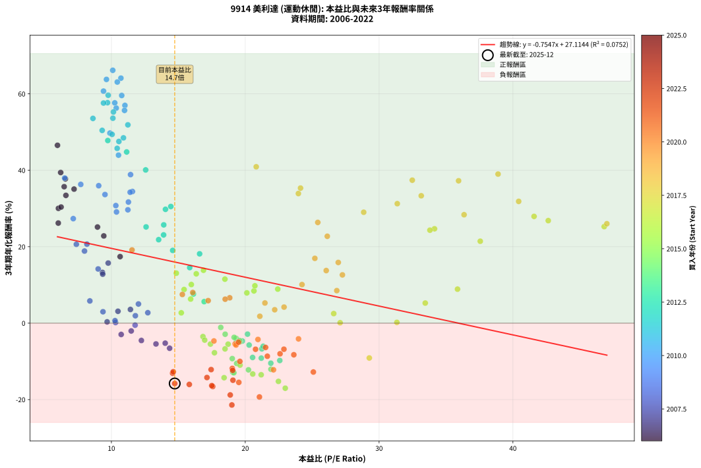
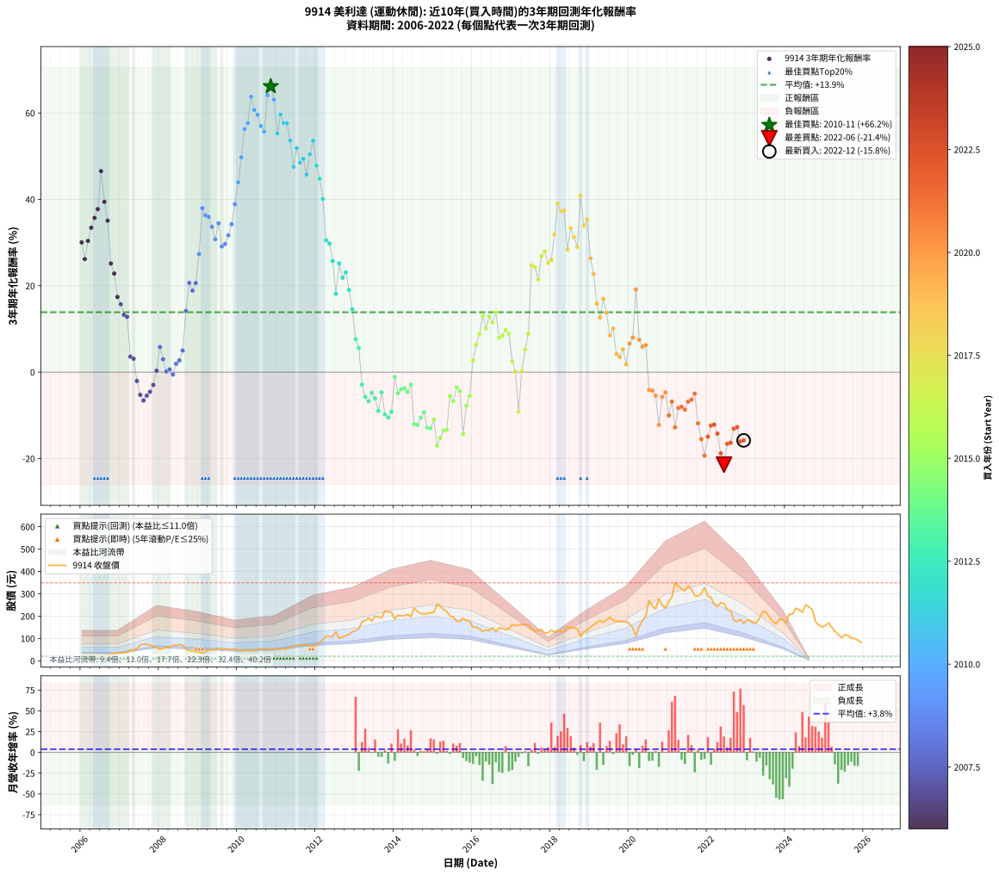

# 9914 美利達 - 本益比與未來報酬率分析

!!! info "報告資訊"
    - **股票代號**: 9914
    - **公司名稱**: 美利達
    - **產業別**: 運動休閒
    - **分析期間**: 2006-2022 (204 個數據點)
    - **資料來源**: Type 12 (ShowMonthlyK_ChartFlow) 月收盤價與本益比
    - **報酬率口徑**: 含現金股利 (簡化: 年度合計，假設每年7/1入帳)
    - **報告生成時間**: 2026-01-05 01:18:42 CST

## 📈 視覺化圖表

### 圖表1: 本益比 vs 未來報酬率關係

*圖表1：9914 美利達 本益比與3年期未來報酬率關係 (2006-2022)*

### 圖表2: 歷年買入時點的3年期實際報酬率

*圖表2：9914 美利達 歷年買入時點的3年期實際報酬率 (2006-2022)*

## 📍 買點訊號說明

本報告提供兩種買點提示訊號（顯示於圖表2的股價子圖中）：

### ▲ 小綠色三角形（回測驗證）
- **計算方式**: 使用全部歷史資料計算本益比第25百分位數
- **用途**: 事後驗證，顯示歷史上哪些時點確實為低估區
- **限制**: 當下無法判斷，僅供回測參考
- **特性**: 後見之明（Look-Ahead Bias）

### ▲ 小橘色三角形（即時訊號）
- **計算方式**: 使用截至當月的過去5年資料計算本益比第25百分位數
- **用途**: 實際投資決策，當時即可判斷
- **優勢**: 可操作性強，符合實務需求
- **特性**: 無後見之明，滾動窗口計算

!!! tip "如何使用兩種訊號"
    - **綠色▲** 幫助理解歷史估值機會，驗證策略有效性
    - **橘色▲** 可作為實際買進參考，但仍需搭配基本面分析
    - 兩種訊號重疊時，表示即時判斷與事後驗證一致，信心度較高
    - 僅有綠色▲時，表示當時無法判斷（需要未來資料才能確認）
    - 僅有橘色▲時，表示即時判斷為買點，但事後可能不是最佳時機

## 📊 估值分析摘要

| 指標 | 數值 |
|:---:|:---:|
| **目前本益比** (2022-12) | **14.73 倍** |
| **歷史平均本益比** | 17.54 倍 |
| **估值水準** | 🟡 合理範圍 |
| **預期3年年化報酬率** | **+16.00%** |
| **歷史平均報酬率** | +13.88% |
| **相關係數 (R²)** | 0.0752 |
| **趨勢線斜率** | -0.7547 |

!!! abstract "核心洞察"
    目前本益比接近歷史平均，預期報酬率符合長期趨勢

    根據歷史數據回測，9914 美利達 在目前本益比 **14.7倍** 的估值水準下，
    預期未來3年年化報酬率約為 **+16.0%**。

    **重要提醒**: 本分析基於歷史數據統計，實際報酬率會受到公司基本面變化、產業趨勢、
    總體經濟環境等多重因素影響。R² = 0.08 表示本益比可解釋約 7.5% 的報酬率變異。

## 📈 歷史估值統計

### 最佳買點 (最高報酬率)

| 項目 | 數值 |
|:---:|:---:|
| 起始時間 | 2010-11 |
| 當時本益比 | 10.10 倍 |
| 起始價格 | 50.5 元 |
| 3年後價格 | 220.0 元 |
| **3年年化報酬率** | **+66.17%** |

### 最差買點 (最低報酬率)

| 項目 | 數值 |
|:---:|:---:|
| 起始時間 | 2022-06 |
| 當時本益比 | 19.00 倍 |
| 起始價格 | 255.5 元 |
| 3年後價格 | 103.0 元 |
| **3年年化報酬率** | **-21.41%** |

## 🎯 投資啟示

### 本益比與報酬率關係

趨勢線方程式: **y = -0.7547x + 27.1144**

!!! warning "強負相關"
    本益比與未來報酬率呈現強負相關。在高本益比時期買入，未來報酬率顯著較低；
    在低本益比時期買入，未來報酬率顯著較高。**估值紀律至關重要**。

### 估值區間建議

基於歷史數據分析:

- **🟢 低估區** (P/E < 14.0): 預期報酬率較高，可考慮增加持股
- **🟡 合理區** (P/E 14.0-21.0): 預期報酬率符合長期趨勢，正常持有
- **🔴 高估區** (P/E > 21.0): 預期報酬率較低，可考慮減碼或觀望

!!! danger "風險提示"
    - 過去表現不代表未來結果
    - 本分析假設公司基本面無重大結構性變化
    - 產業環境劇變可能使歷史規律失效
    - 應結合公司財報、產業趨勢、總體經濟等多重因素綜合判斷

!!! success "長期投資觀點"
    歷史數據顯示，在合理或低估的估值水準買入並長期持有，
    往往能獲得較佳的投資報酬。**耐心等待好價格**是價值投資的核心原則。

## 📊 數據品質

- **資料來源**: GoodInfo.tw Type 12 (ShowMonthlyK_ChartFlow)
- **資料頻率**: 月度收盤價與本益比
- **回測期間**: 2006-2022
- **數據點數量**: 204 個 (每個點代表一次3年期回測)

### 計算方法說明

1. **3年期年化報酬率**:
   - 對每個歷史時點，計算其後3年的實際投資報酬率
   - 期末價值(不含股利): 期末價格
   - 期末價值(含現金股利): 期末價格 + 持有期間內的現金股利合計 (簡化: 年度合計，假設每年7/1入帳)
   - 公式: 年化報酬率 = [(期末價值/期初價格)^(1/年數) - 1] × 100%

2. **本益比 (P/E Ratio)**:
   - 使用當時的月收盤價與EPS計算
   - 資料來源: Type 12 月度河流圖本益比數據

3. **趨勢線 (Linear Regression)**:
   - 使用最小平方法擬合線性趨勢線
   - R²值衡量本益比對報酬率的解釋能力

---

*本報告由 Stock Analysis System v1.9.0 自動生成*
*數據更新時間: 2026-01-05 01:18:42 CST*

## 📋 月度回測明細表

（每一列對應時間線圖中的一個買入點；可用來對照 SVG 圖上的每個點。）

| 買入月份 | 賣出月份 | 回測期限_年 | 實際持有年數 | 買入本益比_倍 | 買入收盤價_元 | 賣出收盤價_元 | 現金股利合計_元 | 總報酬率_pct | 年化報酬率_pct |
| --- | --- | --- | --- | --- | --- | --- | --- | --- | --- |
| 2006-01 | 2009-01 | 3 | 3.001 | 6.04 | 20.55 | 38.90 | 6.30 | +119.95 | +30.04 |
| 2006-02 | 2009-02 | 3 | 3.001 | 6.03 | 20.50 | 34.90 | 6.30 | +100.98 | +26.19 |
| 2006-03 | 2009-03 | 3 | 3.001 | 6.24 | 21.20 | 40.70 | 6.30 | +121.70 | +30.39 |
| 2006-04 | 2009-04 | 3 | 3.001 | 6.60 | 22.45 | 47.05 | 6.30 | +137.64 | +33.44 |
| 2006-05 | 2009-05 | 3 | 3.001 | 6.47 | 22.00 | 48.70 | 6.30 | +150.00 | +35.71 |
| 2006-06 | 2009-06 | 3 | 3.001 | 6.56 | 22.30 | 52.00 | 6.30 | +161.43 | +37.75 |
| 2006-07 | 2009-07 | 3 | 3.001 | 5.97 | 20.30 | 57.30 | 6.60 | +214.78 | +46.54 |
| 2006-08 | 2009-08 | 3 | 3.001 | 6.21 | 21.10 | 50.60 | 6.60 | +171.09 | +39.42 |
| 2006-09 | 2009-09 | 3 | 3.001 | 7.21 | 24.50 | 53.80 | 6.60 | +146.53 | +35.08 |
| 2006-10 | 2009-10 | 3 | 3.001 | 8.96 | 30.45 | 53.10 | 6.60 | +96.06 | +25.15 |
| 2006-11 | 2009-11 | 3 | 3.001 | 9.43 | 32.05 | 52.80 | 6.60 | +85.34 | +22.83 |
| 2006-12 | 2009-12 | 3 | 3.001 | 10.65 | 36.20 | 52.00 | 6.60 | +61.88 | +17.41 |
| 2007-01 | 2010-01 | 3 | 3.001 | 9.76 | 35.45 | 48.35 | 6.60 | +55.01 | +15.73 |
| 2007-02 | 2010-02 | 3 | 3.001 | 9.33 | 36.05 | 45.80 | 6.60 | +45.35 | +13.27 |
| 2007-03 | 2010-03 | 3 | 3.001 | 9.35 | 38.30 | 48.40 | 6.60 | +43.60 | +12.82 |
| 2007-04 | 2010-04 | 3 | 3.001 | 11.42 | 49.40 | 48.30 | 6.60 | +11.13 | +3.58 |
| 2007-05 | 2010-05 | 3 | 3.001 | 10.49 | 47.80 | 45.80 | 6.60 | +9.62 | +3.11 |
| 2007-06 | 2010-06 | 3 | 3.001 | 11.48 | 55.00 | 45.10 | 6.60 | -6.00 | -2.04 |
| 2007-07 | 2010-07 | 3 | 3.001 | 14.02 | 70.40 | 52.10 | 7.80 | -14.91 | -5.24 |
| 2007-08 | 2010-08 | 3 | 3.001 | 14.35 | 75.40 | 53.70 | 7.80 | -18.44 | -6.57 |
| 2007-09 | 2010-09 | 3 | 3.001 | 13.33 | 73.10 | 54.00 | 7.80 | -15.46 | -5.44 |
| 2007-10 | 2010-10 | 3 | 3.001 | 12.24 | 70.00 | 53.10 | 7.80 | -13.00 | -4.53 |
| 2007-11 | 2010-11 | 3 | 3.001 | 10.73 | 63.80 | 50.50 | 7.80 | -8.62 | -2.96 |
| 2007-12 | 2010-12 | 3 | 3.001 | 9.68 | 59.80 | 52.60 | 7.80 | +1.00 | +0.33 |
| 2008-01 | 2011-01 | 3 | 3.001 | 8.39 | 51.40 | 53.10 | 7.80 | +18.48 | +5.81 |
| 2008-02 | 2011-03 | 3 | 3.080 | 9.37 | 56.90 | 54.50 | 7.80 | +9.49 | +2.99 |
| 2008-03 | 2011-03 | 3 | 2.998 | 10.31 | 62.00 | 54.50 | 7.80 | +0.48 | +0.16 |
| 2008-04 | 2011-04 | 3 | 2.998 | 10.27 | 61.20 | 54.60 | 7.80 | +1.96 | +0.65 |
| 2008-05 | 2011-05 | 3 | 2.998 | 11.77 | 69.50 | 60.60 | 7.80 | -1.58 | -0.53 |
| 2008-06 | 2011-06 | 3 | 2.998 | 11.79 | 69.00 | 65.30 | 7.80 | +5.94 | +1.94 |
| 2008-07 | 2011-07 | 3 | 2.998 | 12.72 | 73.70 | 71.60 | 8.30 | +8.41 | +2.73 |
| 2008-08 | 2011-08 | 3 | 2.998 | 12.02 | 69.00 | 71.60 | 8.30 | +15.80 | +5.01 |
| 2008-09 | 2011-09 | 3 | 2.998 | 9.01 | 51.20 | 67.90 | 8.30 | +48.83 | +14.18 |
| 2008-10 | 2011-10 | 3 | 2.998 | 8.17 | 46.00 | 72.50 | 8.30 | +75.65 | +20.67 |
| 2008-11 | 2011-11 | 3 | 2.998 | 7.99 | 44.55 | 66.50 | 8.30 | +67.90 | +18.87 |
| 2008-12 | 2011-12 | 3 | 2.998 | 7.38 | 40.75 | 63.20 | 8.30 | +75.46 | +20.63 |
| 2009-01 | 2012-01 | 3 | 2.998 | 7.15 | 38.90 | 72.00 | 8.30 | +106.43 | +27.35 |
| 2009-02 | 2012-02 | 3 | 2.998 | 6.51 | 34.90 | 83.30 | 8.30 | +162.46 | +37.97 |
| 2009-03 | 2012-03 | 3 | 3.001 | 7.71 | 40.70 | 94.80 | 8.30 | +153.32 | +36.31 |
| 2009-04 | 2012-04 | 3 | 3.001 | 9.05 | 47.05 | 110.00 | 8.30 | +151.43 | +35.97 |
| 2009-05 | 2012-05 | 3 | 3.001 | 9.52 | 48.70 | 108.00 | 8.30 | +138.81 | +33.66 |
| 2009-06 | 2012-06 | 3 | 3.001 | 10.33 | 52.00 | 108.00 | 8.30 | +123.65 | +30.77 |
| 2009-07 | 2012-07 | 3 | 3.001 | 11.57 | 57.30 | 130.00 | 9.30 | +143.11 | +34.45 |
| 2009-08 | 2012-08 | 3 | 3.001 | 10.38 | 50.60 | 99.60 | 9.30 | +115.22 | +29.10 |
| 2009-09 | 2012-09 | 3 | 3.001 | 11.23 | 53.80 | 108.00 | 9.30 | +118.03 | +29.66 |
| 2009-10 | 2012-10 | 3 | 3.001 | 11.27 | 53.10 | 112.00 | 9.30 | +128.44 | +31.69 |
| 2009-11 | 2012-11 | 3 | 3.001 | 11.40 | 52.80 | 118.50 | 9.30 | +142.05 | +34.26 |
| 2009-12 | 2012-12 | 3 | 3.001 | 11.43 | 52.00 | 130.00 | 9.30 | +167.88 | +38.87 |
| 2010-01 | 2013-01 | 3 | 3.001 | 10.53 | 48.35 | 135.00 | 9.30 | +198.45 | +43.96 |
| 2010-02 | 2013-02 | 3 | 3.001 | 9.89 | 45.80 | 144.50 | 9.30 | +235.81 | +49.74 |
| 2010-03 | 2013-03 | 3 | 3.001 | 10.36 | 48.40 | 175.50 | 9.30 | +281.82 | +56.28 |
| 2010-04 | 2013-04 | 3 | 3.001 | 10.25 | 48.30 | 180.00 | 9.30 | +291.93 | +57.65 |
| 2010-05 | 2013-05 | 3 | 3.001 | 9.63 | 45.80 | 192.00 | 9.30 | +339.52 | +63.79 |
| 2010-06 | 2013-06 | 3 | 3.001 | 9.41 | 45.10 | 178.00 | 9.30 | +315.30 | +60.72 |
| 2010-07 | 2013-07 | 3 | 3.001 | 10.77 | 52.10 | 200.00 | 11.80 | +306.53 | +59.58 |
| 2010-08 | 2013-08 | 3 | 3.001 | 11.01 | 53.70 | 196.00 | 11.80 | +286.96 | +56.98 |
| 2010-09 | 2013-09 | 3 | 3.001 | 10.98 | 54.00 | 192.00 | 11.80 | +277.41 | +55.68 |
| 2010-10 | 2013-10 | 3 | 3.001 | 10.71 | 53.10 | 223.00 | 11.80 | +342.18 | +64.12 |
| 2010-11 | 2013-11 | 3 | 3.001 | 10.10 | 50.50 | 220.00 | 11.80 | +359.01 | +66.17 |
| 2010-12 | 2013-12 | 3 | 3.001 | 10.44 | 52.60 | 216.50 | 11.80 | +334.03 | +63.10 |
| 2011-01 | 2014-01 | 3 | 3.001 | 10.15 | 53.10 | 187.00 | 11.80 | +274.39 | +55.26 |
| 2011-02 | 2014-02 | 3 | 3.001 | 9.76 | 52.90 | 203.50 | 11.80 | +306.99 | +59.64 |
| 2011-03 | 2014-03 | 3 | 3.001 | 9.71 | 54.50 | 202.00 | 11.80 | +292.29 | +57.70 |
| 2011-04 | 2014-04 | 3 | 3.001 | 9.41 | 54.60 | 202.00 | 11.80 | +291.58 | +57.60 |
| 2011-05 | 2014-05 | 3 | 3.001 | 10.11 | 60.60 | 208.00 | 11.80 | +262.71 | +53.63 |
| 2011-06 | 2014-06 | 3 | 3.001 | 10.56 | 65.30 | 198.00 | 11.80 | +221.29 | +47.55 |
| 2011-07 | 2014-07 | 3 | 3.001 | 11.23 | 71.60 | 236.50 | 14.50 | +250.56 | +51.90 |
| 2011-08 | 2014-08 | 3 | 3.001 | 10.90 | 71.60 | 220.00 | 14.50 | +227.51 | +48.49 |
| 2011-09 | 2014-09 | 3 | 3.001 | 10.05 | 67.90 | 212.00 | 14.50 | +233.58 | +49.40 |
| 2011-10 | 2014-10 | 3 | 3.001 | 10.43 | 72.50 | 210.00 | 14.50 | +209.66 | +45.74 |
| 2011-11 | 2014-11 | 3 | 3.001 | 9.31 | 66.50 | 212.00 | 14.50 | +240.60 | +50.44 |
| 2011-12 | 2014-12 | 3 | 3.001 | 8.62 | 63.20 | 214.50 | 14.50 | +262.34 | +53.58 |
| 2012-01 | 2015-01 | 3 | 3.001 | 9.73 | 72.00 | 218.00 | 14.50 | +222.92 | +47.79 |
| 2012-02 | 2015-03 | 3 | 3.080 | 11.14 | 83.30 | 246.00 | 14.50 | +212.73 | +44.80 |
| 2012-03 | 2015-03 | 3 | 2.998 | 12.56 | 94.80 | 246.00 | 14.50 | +174.79 | +40.10 |
| 2012-04 | 2015-04 | 3 | 2.998 | 14.44 | 110.00 | 230.00 | 14.50 | +122.27 | +30.53 |
| 2012-05 | 2015-05 | 3 | 2.998 | 14.04 | 108.00 | 221.50 | 14.50 | +118.52 | +29.79 |
| 2012-06 | 2015-06 | 3 | 2.998 | 13.91 | 108.00 | 200.00 | 14.50 | +98.61 | +25.72 |
| 2012-07 | 2015-07 | 3 | 2.998 | 16.59 | 130.00 | 196.00 | 18.30 | +64.85 | +18.14 |
| 2012-08 | 2015-08 | 3 | 2.998 | 12.59 | 99.60 | 177.00 | 18.30 | +96.08 | +25.18 |
| 2012-09 | 2015-09 | 3 | 2.998 | 13.53 | 108.00 | 177.00 | 18.30 | +80.83 | +21.85 |
| 2012-10 | 2015-10 | 3 | 2.998 | 13.90 | 112.00 | 190.50 | 18.30 | +86.43 | +23.09 |
| 2012-11 | 2015-11 | 3 | 2.998 | 14.58 | 118.50 | 181.50 | 18.30 | +68.61 | +19.04 |
| 2012-12 | 2015-12 | 3 | 2.998 | 15.85 | 130.00 | 177.00 | 18.30 | +50.23 | +14.54 |
| 2013-01 | 2016-01 | 3 | 2.998 | 16.13 | 135.00 | 150.00 | 18.30 | +24.67 | +7.63 |
| 2013-02 | 2016-02 | 3 | 2.998 | 16.93 | 144.50 | 152.00 | 18.30 | +17.85 | +5.63 |
| 2013-03 | 2016-03 | 3 | 3.001 | 20.17 | 175.50 | 142.50 | 18.30 | -8.38 | -2.87 |
| 2013-04 | 2016-04 | 3 | 3.001 | 20.29 | 180.00 | 132.50 | 18.30 | -16.22 | -5.73 |
| 2013-05 | 2016-05 | 3 | 3.001 | 21.24 | 192.00 | 137.50 | 18.30 | -18.85 | -6.73 |
| 2013-06 | 2016-06 | 3 | 3.001 | 19.34 | 178.00 | 135.50 | 18.30 | -13.60 | -4.75 |
| 2013-07 | 2016-07 | 3 | 3.001 | 21.34 | 200.00 | 147.50 | 18.30 | -17.10 | -6.06 |
| 2013-08 | 2016-08 | 3 | 3.001 | 20.55 | 196.00 | 129.50 | 18.30 | -24.59 | -8.98 |
| 2013-09 | 2016-09 | 3 | 3.001 | 19.78 | 192.00 | 148.00 | 18.30 | -13.39 | -4.68 |
| 2013-10 | 2016-10 | 3 | 3.001 | 22.58 | 223.00 | 145.50 | 18.30 | -26.55 | -9.77 |
| 2013-11 | 2016-11 | 3 | 3.001 | 21.91 | 220.00 | 139.50 | 18.30 | -28.27 | -10.48 |
| 2013-12 | 2016-12 | 3 | 3.001 | 21.20 | 216.50 | 144.00 | 18.30 | -25.03 | -9.16 |
| 2014-01 | 2017-01 | 3 | 3.001 | 18.17 | 187.00 | 162.50 | 18.30 | -3.32 | -1.12 |
| 2014-02 | 2017-02 | 3 | 3.001 | 19.61 | 203.50 | 157.00 | 18.30 | -13.86 | -4.85 |
| 2014-03 | 2017-03 | 3 | 3.001 | 19.32 | 202.00 | 160.50 | 18.30 | -11.49 | -3.98 |
| 2014-04 | 2017-04 | 3 | 3.001 | 19.17 | 202.00 | 162.00 | 18.30 | -10.74 | -3.72 |
| 2014-05 | 2017-05 | 3 | 3.001 | 19.58 | 208.00 | 162.50 | 18.30 | -13.08 | -4.56 |
| 2014-06 | 2017-06 | 3 | 3.001 | 18.50 | 198.00 | 163.00 | 18.30 | -8.43 | -2.89 |
| 2014-07 | 2017-07 | 3 | 3.001 | 21.92 | 236.50 | 144.50 | 16.30 | -32.01 | -12.06 |
| 2014-08 | 2017-08 | 3 | 3.001 | 20.24 | 220.00 | 132.50 | 16.30 | -32.36 | -12.22 |
| 2014-09 | 2017-09 | 3 | 3.001 | 19.36 | 212.00 | 135.50 | 16.30 | -28.40 | -10.53 |
| 2014-10 | 2017-10 | 3 | 3.001 | 19.03 | 210.00 | 140.50 | 16.30 | -25.33 | -9.28 |
| 2014-11 | 2017-11 | 3 | 3.001 | 19.07 | 212.00 | 124.00 | 16.30 | -33.82 | -12.85 |
| 2014-12 | 2017-12 | 3 | 3.001 | 19.15 | 214.50 | 125.00 | 16.30 | -34.13 | -12.99 |
| 2015-01 | 2018-01 | 3 | 3.001 | 19.61 | 218.00 | 137.50 | 16.30 | -29.45 | -10.98 |
| 2015-02 | 2018-02 | 3 | 3.001 | 22.99 | 253.50 | 128.50 | 16.30 | -42.88 | -17.02 |
| 2015-03 | 2018-03 | 3 | 3.001 | 22.48 | 246.00 | 133.50 | 16.30 | -39.11 | -15.24 |
| 2015-04 | 2018-04 | 3 | 3.001 | 21.19 | 230.00 | 132.50 | 16.30 | -35.30 | -13.51 |
| 2015-05 | 2018-05 | 3 | 3.001 | 20.56 | 221.50 | 128.00 | 16.30 | -34.85 | -13.31 |
| 2015-06 | 2018-06 | 3 | 3.001 | 18.72 | 200.00 | 152.50 | 16.30 | -15.60 | -5.50 |
| 2015-07 | 2018-07 | 3 | 3.001 | 18.49 | 196.00 | 147.50 | 11.50 | -18.88 | -6.73 |
| 2015-08 | 2018-08 | 3 | 3.001 | 16.84 | 177.00 | 147.50 | 11.50 | -10.17 | -3.51 |
| 2015-09 | 2018-09 | 3 | 3.001 | 16.97 | 177.00 | 143.00 | 11.50 | -12.71 | -4.43 |
| 2015-10 | 2018-10 | 3 | 3.001 | 18.42 | 190.50 | 108.50 | 11.50 | -37.01 | -14.27 |
| 2015-11 | 2018-11 | 3 | 3.001 | 17.70 | 181.50 | 131.00 | 11.50 | -21.49 | -7.75 |
| 2015-12 | 2018-12 | 3 | 3.001 | 17.40 | 177.00 | 138.00 | 11.50 | -15.54 | -5.47 |
| 2016-01 | 2019-01 | 3 | 3.001 | 15.22 | 150.00 | 151.00 | 11.50 | +8.33 | +2.70 |
| 2016-02 | 2019-03 | 3 | 3.080 | 15.92 | 152.00 | 172.00 | 11.50 | +20.72 | +6.31 |
| 2016-03 | 2019-03 | 3 | 2.998 | 15.43 | 142.50 | 172.00 | 11.50 | +28.77 | +8.80 |
| 2016-04 | 2019-04 | 3 | 2.998 | 14.85 | 132.50 | 180.00 | 11.50 | +44.53 | +13.07 |
| 2016-05 | 2019-05 | 3 | 2.998 | 15.97 | 137.50 | 172.00 | 11.50 | +33.45 | +10.10 |
| 2016-06 | 2019-06 | 3 | 2.998 | 16.34 | 135.50 | 183.50 | 11.50 | +43.91 | +12.91 |
| 2016-07 | 2019-07 | 3 | 2.998 | 18.48 | 147.50 | 195.00 | 9.50 | +38.64 | +11.51 |
| 2016-08 | 2019-08 | 3 | 2.998 | 16.88 | 129.50 | 181.50 | 9.50 | +47.49 | +13.84 |
| 2016-09 | 2019-09 | 3 | 2.998 | 20.12 | 148.00 | 176.50 | 9.50 | +25.68 | +7.92 |
| 2016-10 | 2019-10 | 3 | 2.998 | 20.65 | 145.50 | 176.00 | 9.50 | +27.49 | +8.44 |
| 2016-11 | 2019-11 | 3 | 2.998 | 20.72 | 139.50 | 175.00 | 9.50 | +32.26 | +9.77 |
| 2016-12 | 2019-12 | 3 | 2.998 | 22.43 | 144.00 | 176.50 | 9.50 | +29.17 | +8.91 |
| 2017-01 | 2020-01 | 3 | 2.998 | 26.61 | 162.50 | 165.50 | 9.50 | +7.69 | +2.50 |
| 2017-02 | 2020-02 | 3 | 2.998 | 27.09 | 157.00 | 148.00 | 9.50 | +0.32 | +0.11 |
| 2017-03 | 2020-03 | 3 | 3.001 | 29.27 | 160.50 | 111.00 | 9.50 | -24.92 | -9.11 |
| 2017-04 | 2020-04 | 3 | 3.001 | 31.33 | 162.00 | 153.50 | 9.50 | +0.62 | +0.21 |
| 2017-05 | 2020-05 | 3 | 3.001 | 33.45 | 162.50 | 180.00 | 9.50 | +16.62 | +5.26 |
| 2017-06 | 2020-06 | 3 | 3.001 | 35.86 | 163.00 | 201.00 | 9.50 | +29.14 | +8.90 |
| 2017-07 | 2020-07 | 3 | 3.001 | 34.14 | 144.50 | 270.50 | 9.70 | +93.91 | +24.69 |
| 2017-08 | 2020-08 | 3 | 3.001 | 33.80 | 132.50 | 245.00 | 9.70 | +92.23 | +24.33 |
| 2017-09 | 2020-09 | 3 | 3.001 | 37.56 | 135.50 | 233.00 | 9.70 | +79.11 | +21.44 |
| 2017-10 | 2020-10 | 3 | 3.001 | 42.64 | 140.50 | 277.00 | 9.70 | +104.06 | +26.83 |
| 2017-11 | 2020-11 | 3 | 3.001 | 41.58 | 124.00 | 250.00 | 9.70 | +109.44 | +27.94 |
| 2017-12 | 2020-12 | 3 | 3.001 | 46.82 | 125.00 | 236.00 | 9.70 | +96.56 | +25.26 |
| 2018-01 | 2021-01 | 3 | 3.001 | 47.02 | 137.50 | 265.50 | 9.70 | +100.15 | +26.02 |
| 2018-02 | 2021-02 | 3 | 3.001 | 40.43 | 128.50 | 285.00 | 9.70 | +129.34 | +31.87 |
| 2018-03 | 2021-03 | 3 | 3.001 | 38.89 | 133.50 | 349.00 | 9.70 | +168.69 | +39.01 |
| 2018-04 | 2021-04 | 3 | 3.001 | 35.94 | 132.50 | 333.00 | 9.70 | +158.64 | +37.26 |
| 2018-05 | 2021-05 | 3 | 3.001 | 32.48 | 128.00 | 322.50 | 9.70 | +159.53 | +37.41 |
| 2018-06 | 2021-06 | 3 | 3.001 | 36.35 | 152.50 | 313.00 | 9.70 | +111.61 | +28.38 |
| 2018-07 | 2021-07 | 3 | 3.001 | 33.15 | 147.50 | 335.00 | 14.70 | +137.08 | +33.33 |
| 2018-08 | 2021-08 | 3 | 3.001 | 31.36 | 147.50 | 319.00 | 14.70 | +126.24 | +31.27 |
| 2018-09 | 2021-09 | 3 | 3.001 | 28.85 | 143.00 | 292.50 | 14.70 | +114.83 | +29.02 |
| 2018-10 | 2021-10 | 3 | 3.001 | 20.82 | 108.50 | 289.00 | 14.70 | +179.91 | +40.92 |
| 2018-11 | 2021-11 | 3 | 3.001 | 23.97 | 131.00 | 300.00 | 14.70 | +140.23 | +33.92 |
| 2018-12 | 2021-12 | 3 | 3.001 | 24.13 | 138.00 | 327.50 | 14.70 | +147.97 | +35.34 |
| 2019-01 | 2022-01 | 3 | 3.001 | 25.42 | 151.00 | 290.00 | 14.70 | +101.79 | +26.36 |
| 2019-02 | 2022-02 | 3 | 3.001 | 26.13 | 161.00 | 283.00 | 14.70 | +84.91 | +22.73 |
| 2019-03 | 2022-03 | 3 | 3.001 | 26.95 | 172.00 | 253.00 | 14.70 | +55.64 | +15.88 |
| 2019-04 | 2022-04 | 3 | 3.001 | 27.26 | 180.00 | 242.50 | 14.70 | +42.89 | +12.63 |
| 2019-05 | 2022-05 | 3 | 3.001 | 25.20 | 172.00 | 260.50 | 14.70 | +60.00 | +16.96 |
| 2019-06 | 2022-06 | 3 | 3.001 | 26.05 | 183.50 | 255.50 | 14.70 | +47.25 | +13.76 |
| 2019-07 | 2022-07 | 3 | 3.001 | 26.84 | 195.00 | 230.00 | 19.20 | +27.79 | +8.52 |
| 2019-08 | 2022-08 | 3 | 3.001 | 24.24 | 181.50 | 223.00 | 19.20 | +33.44 | +10.09 |
| 2019-09 | 2022-09 | 3 | 3.001 | 22.90 | 176.50 | 180.50 | 19.20 | +13.14 | +4.20 |
| 2019-10 | 2022-10 | 3 | 3.001 | 22.20 | 176.00 | 176.00 | 19.20 | +10.91 | +3.51 |
| 2019-11 | 2022-11 | 3 | 3.001 | 21.47 | 175.00 | 185.00 | 19.20 | +16.69 | +5.28 |
| 2019-12 | 2022-12 | 3 | 3.001 | 21.09 | 176.50 | 167.00 | 19.20 | +5.50 | +1.80 |
| 2020-01 | 2023-01 | 3 | 3.001 | 18.84 | 165.50 | 181.50 | 19.20 | +21.27 | +6.64 |
| 2020-02 | 2023-03 | 3 | 3.080 | 16.08 | 148.00 | 168.50 | 19.20 | +26.82 | +8.02 |
| 2020-03 | 2023-03 | 3 | 2.998 | 11.54 | 111.00 | 168.50 | 19.20 | +69.10 | +19.15 |
| 2020-04 | 2023-04 | 3 | 2.998 | 15.30 | 153.50 | 171.50 | 19.20 | +24.23 | +7.51 |
| 2020-05 | 2023-05 | 3 | 2.998 | 17.23 | 180.00 | 194.50 | 19.20 | +18.72 | +5.89 |
| 2020-06 | 2023-06 | 3 | 2.998 | 18.50 | 201.00 | 222.00 | 19.20 | +20.00 | +6.27 |
| 2020-07 | 2023-07 | 3 | 2.998 | 23.98 | 270.50 | 216.50 | 22.00 | -11.83 | -4.11 |
| 2020-08 | 2023-08 | 3 | 2.998 | 20.95 | 245.00 | 193.00 | 22.00 | -12.24 | -4.26 |
| 2020-09 | 2023-09 | 3 | 2.998 | 19.24 | 233.00 | 175.00 | 22.00 | -15.45 | -5.44 |
| 2020-10 | 2023-10 | 3 | 2.998 | 22.11 | 277.00 | 165.50 | 22.00 | -32.31 | -12.21 |
| 2020-11 | 2023-11 | 3 | 2.998 | 19.31 | 250.00 | 187.50 | 22.00 | -16.20 | -5.72 |
| 2020-12 | 2023-12 | 3 | 2.998 | 17.66 | 236.00 | 182.50 | 22.00 | -13.35 | -4.67 |
| 2021-01 | 2024-01 | 3 | 2.998 | 19.60 | 265.50 | 171.50 | 22.00 | -27.12 | -10.01 |
| 2021-02 | 2024-02 | 3 | 2.998 | 20.77 | 285.00 | 208.50 | 22.00 | -19.12 | -6.83 |
| 2021-03 | 2024-03 | 3 | 3.001 | 25.09 | 349.00 | 209.50 | 22.00 | -33.67 | -12.79 |
| 2021-04 | 2024-04 | 3 | 3.001 | 23.63 | 333.00 | 235.00 | 22.00 | -22.82 | -8.27 |
| 2021-05 | 2024-05 | 3 | 3.001 | 22.60 | 322.50 | 229.00 | 22.00 | -22.17 | -8.01 |
| 2021-06 | 2024-06 | 3 | 3.001 | 21.65 | 313.00 | 216.50 | 22.00 | -23.80 | -8.66 |
| 2021-07 | 2024-07 | 3 | 3.001 | 22.89 | 335.00 | 250.00 | 21.00 | -19.10 | -6.82 |
| 2021-08 | 2024-08 | 3 | 3.001 | 21.52 | 319.00 | 241.00 | 21.00 | -17.87 | -6.35 |
| 2021-09 | 2024-09 | 3 | 3.001 | 19.50 | 292.50 | 230.00 | 21.00 | -14.19 | -4.97 |
| 2021-10 | 2024-10 | 3 | 3.001 | 19.03 | 289.00 | 177.00 | 21.00 | -31.49 | -11.84 |
| 2021-11 | 2024-11 | 3 | 3.001 | 19.52 | 300.00 | 160.00 | 21.00 | -39.67 | -15.50 |
| 2021-12 | 2024-12 | 3 | 3.001 | 21.06 | 327.50 | 151.00 | 21.00 | -47.48 | -19.31 |
| 2022-01 | 2025-01 | 3 | 3.001 | 19.08 | 290.00 | 157.50 | 21.00 | -38.45 | -14.93 |
| 2022-02 | 2025-02 | 3 | 3.001 | 19.06 | 283.00 | 169.50 | 21.00 | -32.69 | -12.36 |
| 2022-03 | 2025-03 | 3 | 3.001 | 17.45 | 253.00 | 150.50 | 21.00 | -32.21 | -12.15 |
| 2022-04 | 2025-04 | 3 | 3.001 | 17.14 | 242.50 | 132.00 | 21.00 | -36.91 | -14.23 |
| 2022-05 | 2025-05 | 3 | 3.001 | 18.88 | 260.50 | 118.50 | 21.00 | -46.45 | -18.79 |
| 2022-06 | 2025-06 | 3 | 3.001 | 19.00 | 255.50 | 103.00 | 21.00 | -51.47 | -21.41 |
| 2022-07 | 2025-07 | 3 | 3.001 | 17.57 | 230.00 | 116.50 | 17.00 | -41.96 | -16.58 |
| 2022-08 | 2025-08 | 3 | 3.001 | 17.50 | 223.00 | 113.50 | 17.00 | -41.48 | -16.35 |
| 2022-09 | 2025-09 | 3 | 3.001 | 14.57 | 180.50 | 101.50 | 17.00 | -34.35 | -13.09 |
| 2022-10 | 2025-10 | 3 | 3.001 | 14.62 | 176.00 | 100.00 | 17.00 | -33.52 | -12.72 |
| 2022-11 | 2025-11 | 3 | 3.001 | 15.82 | 185.00 | 92.50 | 17.00 | -40.81 | -16.04 |
| 2022-12 | 2025-12 | 3 | 3.001 | 14.73 | 167.00 | 82.70 | 17.00 | -40.30 | -15.79 |
