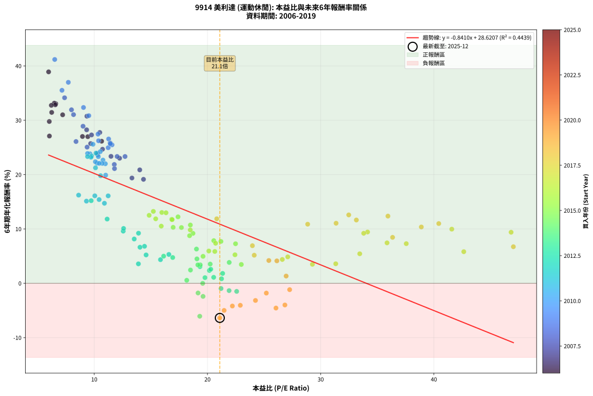
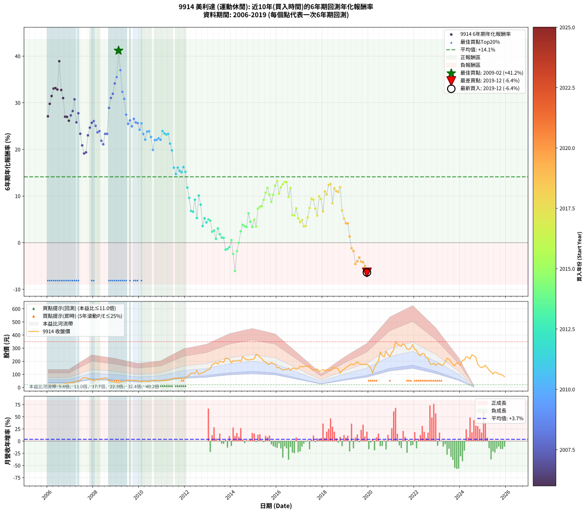

# 9914 美利達 - 本益比與未來報酬率分析

!!! info "報告資訊"
    - **股票代號**: 9914
    - **公司名稱**: 美利達
    - **產業別**: 運動休閒
    - **分析期間**: 2006-2019 (168 個數據點)
    - **資料來源**: Type 12 (ShowMonthlyK_ChartFlow) 月收盤價與本益比
    - **報酬率口徑**: 含現金股利 (簡化: 年度合計，假設每年7/1入帳)
    - **報告生成時間**: 2026-01-04 08:52:11 CST

## 📈 視覺化圖表

### 圖表1: 本益比 vs 未來報酬率關係

*圖表1：9914 美利達 本益比與6年期未來報酬率關係 (2006-2019)*

### 圖表2: 歷年買入時點的6年期實際報酬率

*圖表2：9914 美利達 歷年買入時點的6年期實際報酬率 (2006-2019)*

## 📍 買點訊號說明

本報告提供兩種買點提示訊號（顯示於圖表2的股價子圖中）：

### ▲ 小綠色三角形（回測驗證）
- **計算方式**: 使用全部歷史資料計算本益比第25百分位數
- **用途**: 事後驗證，顯示歷史上哪些時點確實為低估區
- **限制**: 當下無法判斷，僅供回測參考
- **特性**: 後見之明（Look-Ahead Bias）

### ▲ 小橘色三角形（即時訊號）
- **計算方式**: 使用截至當月的過去5年資料計算本益比第25百分位數
- **用途**: 實際投資決策，當時即可判斷
- **優勢**: 可操作性強，符合實務需求
- **特性**: 無後見之明，滾動窗口計算

!!! tip "如何使用兩種訊號"
    - **綠色▲** 幫助理解歷史估值機會，驗證策略有效性
    - **橘色▲** 可作為實際買進參考，但仍需搭配基本面分析
    - 兩種訊號重疊時，表示即時判斷與事後驗證一致，信心度較高
    - 僅有綠色▲時，表示當時無法判斷（需要未來資料才能確認）
    - 僅有橘色▲時，表示即時判斷為買點，但事後可能不是最佳時機

## 📊 估值分析摘要

| 指標 | 數值 |
|:---:|:---:|
| **目前本益比** (2019-12) | **21.09 倍** |
| **歷史平均本益比** | 17.23 倍 |
| **估值水準** | 🔴 相對高估 |
| **預期6年年化報酬率** | **+10.88%** |
| **歷史平均報酬率** | +14.13% |
| **相關係數 (R²)** | 0.4439 |
| **趨勢線斜率** | -0.8410 |

!!! abstract "核心洞察"
    目前本益比顯著高於歷史平均，預期未來報酬率可能較低

    根據歷史數據回測，9914 美利達 在目前本益比 **21.1倍** 的估值水準下，
    預期未來6年年化報酬率約為 **+10.9%**。

    **重要提醒**: 本分析基於歷史數據統計，實際報酬率會受到公司基本面變化、產業趨勢、
    總體經濟環境等多重因素影響。R² = 0.44 表示本益比可解釋約 44.4% 的報酬率變異。

## 📈 歷史估值統計

### 最佳買點 (最高報酬率)

| 項目 | 數值 |
|:---:|:---:|
| 起始時間 | 2009-02 |
| 當時本益比 | 6.51 倍 |
| 起始價格 | 34.9 元 |
| 6年後價格 | 253.5 元 |
| **6年年化報酬率** | **+41.19%** |

### 最差買點 (最低報酬率)

| 項目 | 數值 |
|:---:|:---:|
| 起始時間 | 2019-12 |
| 當時本益比 | 21.09 倍 |
| 起始價格 | 176.5 元 |
| 6年後價格 | 82.7 元 |
| **6年年化報酬率** | **-6.37%** |

## 🎯 投資啟示

### 本益比與報酬率關係

趨勢線方程式: **y = -0.8410x + 28.6207**

!!! warning "強負相關"
    本益比與未來報酬率呈現強負相關。在高本益比時期買入，未來報酬率顯著較低；
    在低本益比時期買入，未來報酬率顯著較高。**估值紀律至關重要**。

### 估值區間建議

基於歷史數據分析:

- **🟢 低估區** (P/E < 13.8): 預期報酬率較高，可考慮增加持股
- **🟡 合理區** (P/E 13.8-20.7): 預期報酬率符合長期趨勢，正常持有
- **🔴 高估區** (P/E > 20.7): 預期報酬率較低，可考慮減碼或觀望

!!! danger "風險提示"
    - 過去表現不代表未來結果
    - 本分析假設公司基本面無重大結構性變化
    - 產業環境劇變可能使歷史規律失效
    - 應結合公司財報、產業趨勢、總體經濟等多重因素綜合判斷

!!! success "長期投資觀點"
    歷史數據顯示，在合理或低估的估值水準買入並長期持有，
    往往能獲得較佳的投資報酬。**耐心等待好價格**是價值投資的核心原則。

## 📊 數據品質

- **資料來源**: GoodInfo.tw Type 12 (ShowMonthlyK_ChartFlow)
- **資料頻率**: 月度收盤價與本益比
- **回測期間**: 2006-2019
- **數據點數量**: 168 個 (每個點代表一次6年期回測)

### 計算方法說明

1. **6年期年化報酬率**:
   - 對每個歷史時點，計算其後6年的實際投資報酬率
   - 期末價值(不含股利): 期末價格
   - 期末價值(含現金股利): 期末價格 + 持有期間內的現金股利合計 (簡化: 年度合計，假設每年7/1入帳)
   - 公式: 年化報酬率 = [(期末價值/期初價格)^(1/年數) - 1] × 100%

2. **本益比 (P/E Ratio)**:
   - 使用當時的月收盤價與EPS計算
   - 資料來源: Type 12 月度河流圖本益比數據

3. **趨勢線 (Linear Regression)**:
   - 使用最小平方法擬合線性趨勢線
   - R²值衡量本益比對報酬率的解釋能力

---

*本報告由 Stock Analysis System v1.9.0 自動生成*
*數據更新時間: 2026-01-04 08:52:11 CST*

## 📋 月度回測明細表

（每一列對應時間線圖中的一個買入點；可用來對照 SVG 圖上的每個點。）

| 買入月份 | 賣出月份 | 回測期限_年 | 實際持有年數 | 買入本益比_倍 | 買入收盤價_元 | 賣出收盤價_元 | 現金股利合計_元 | 總報酬率_pct | 年化報酬率_pct |
| --- | --- | --- | --- | --- | --- | --- | --- | --- | --- |
| 2006-01 | 2012-01 | 6 | 5.999 | 6.04 | 20.55 | 72.00 | 14.60 | +321.41 | +27.10 |
| 2006-02 | 2012-02 | 6 | 5.999 | 6.03 | 20.50 | 83.30 | 14.60 | +377.56 | +29.78 |
| 2006-03 | 2012-03 | 6 | 6.001 | 6.24 | 21.20 | 94.80 | 14.60 | +416.04 | +31.45 |
| 2006-04 | 2012-04 | 6 | 6.001 | 6.60 | 22.45 | 110.00 | 14.60 | +455.01 | +33.05 |
| 2006-05 | 2012-05 | 6 | 6.001 | 6.47 | 22.00 | 108.00 | 14.60 | +457.27 | +33.14 |
| 2006-06 | 2012-06 | 6 | 6.001 | 6.56 | 22.30 | 108.00 | 14.60 | +449.78 | +32.84 |
| 2006-07 | 2012-07 | 6 | 6.001 | 5.97 | 20.30 | 130.00 | 15.90 | +618.72 | +38.91 |
| 2006-08 | 2012-08 | 6 | 6.001 | 6.21 | 21.10 | 99.60 | 15.90 | +447.39 | +32.75 |
| 2006-09 | 2012-09 | 6 | 6.001 | 7.21 | 24.50 | 108.00 | 15.90 | +405.71 | +31.01 |
| 2006-10 | 2012-10 | 6 | 6.001 | 8.96 | 30.45 | 112.00 | 15.90 | +320.03 | +27.02 |
| 2006-11 | 2012-11 | 6 | 6.001 | 9.43 | 32.05 | 118.50 | 15.90 | +319.34 | +26.98 |
| 2006-12 | 2012-12 | 6 | 6.001 | 10.65 | 36.20 | 130.00 | 15.90 | +303.04 | +26.14 |
| 2007-01 | 2013-01 | 6 | 6.001 | 9.76 | 35.45 | 135.00 | 15.90 | +325.67 | +27.30 |
| 2007-02 | 2013-02 | 6 | 6.001 | 9.33 | 36.05 | 144.50 | 15.90 | +344.94 | +28.24 |
| 2007-03 | 2013-03 | 6 | 6.001 | 9.35 | 38.30 | 175.50 | 15.90 | +399.74 | +30.75 |
| 2007-04 | 2013-04 | 6 | 6.001 | 11.42 | 49.40 | 180.00 | 15.90 | +296.56 | +25.80 |
| 2007-05 | 2013-05 | 6 | 6.001 | 10.49 | 47.80 | 192.00 | 15.90 | +334.94 | +27.76 |
| 2007-06 | 2013-06 | 6 | 6.001 | 11.48 | 55.00 | 178.00 | 15.90 | +252.55 | +23.36 |
| 2007-07 | 2013-07 | 6 | 6.001 | 14.02 | 70.40 | 200.00 | 19.60 | +211.93 | +20.87 |
| 2007-08 | 2013-08 | 6 | 6.001 | 14.35 | 75.40 | 196.00 | 19.60 | +185.94 | +19.13 |
| 2007-09 | 2013-09 | 6 | 6.001 | 13.33 | 73.10 | 192.00 | 19.60 | +189.47 | +19.38 |
| 2007-10 | 2013-10 | 6 | 6.001 | 12.24 | 70.00 | 223.00 | 19.60 | +246.57 | +23.01 |
| 2007-11 | 2013-11 | 6 | 6.001 | 10.73 | 63.80 | 220.00 | 19.60 | +275.55 | +24.67 |
| 2007-12 | 2013-12 | 6 | 6.001 | 9.68 | 59.80 | 216.50 | 19.60 | +294.82 | +25.71 |
| 2008-01 | 2014-01 | 6 | 6.001 | 8.39 | 51.40 | 187.00 | 19.60 | +301.95 | +26.09 |
| 2008-02 | 2014-03 | 6 | 6.081 | 9.37 | 56.90 | 202.00 | 19.60 | +289.46 | +25.06 |
| 2008-03 | 2014-03 | 6 | 5.999 | 10.31 | 62.00 | 202.00 | 19.60 | +257.42 | +23.66 |
| 2008-04 | 2014-04 | 6 | 5.999 | 10.27 | 61.20 | 202.00 | 19.60 | +262.09 | +23.92 |
| 2008-05 | 2014-05 | 6 | 5.999 | 11.77 | 69.50 | 208.00 | 19.60 | +227.48 | +21.87 |
| 2008-06 | 2014-06 | 6 | 5.999 | 11.79 | 69.00 | 198.00 | 19.60 | +215.36 | +21.10 |
| 2008-07 | 2014-07 | 6 | 5.999 | 12.72 | 73.70 | 236.50 | 22.80 | +251.83 | +23.33 |
| 2008-08 | 2014-08 | 6 | 5.999 | 12.02 | 69.00 | 220.00 | 22.80 | +251.88 | +23.34 |
| 2008-09 | 2014-09 | 6 | 5.999 | 9.01 | 51.20 | 212.00 | 22.80 | +358.59 | +28.90 |
| 2008-10 | 2014-10 | 6 | 5.999 | 8.17 | 46.00 | 210.00 | 22.80 | +406.09 | +31.04 |
| 2008-11 | 2014-11 | 6 | 5.999 | 7.99 | 44.55 | 212.00 | 22.80 | +427.05 | +31.93 |
| 2008-12 | 2014-12 | 6 | 5.999 | 7.38 | 40.75 | 214.50 | 22.80 | +482.33 | +34.14 |
| 2009-01 | 2015-01 | 6 | 5.999 | 7.15 | 38.90 | 218.00 | 22.80 | +519.02 | +35.51 |
| 2009-02 | 2015-02 | 6 | 5.999 | 6.51 | 34.90 | 253.50 | 22.80 | +691.69 | +41.19 |
| 2009-03 | 2015-03 | 6 | 5.999 | 7.71 | 40.70 | 246.00 | 22.80 | +560.44 | +36.98 |
| 2009-04 | 2015-04 | 6 | 5.999 | 9.05 | 47.05 | 230.00 | 22.80 | +437.30 | +32.35 |
| 2009-05 | 2015-05 | 6 | 5.999 | 9.52 | 48.70 | 221.50 | 22.80 | +401.64 | +30.85 |
| 2009-06 | 2015-06 | 6 | 5.999 | 10.33 | 52.00 | 200.00 | 22.80 | +328.46 | +27.45 |
| 2009-07 | 2015-07 | 6 | 5.999 | 11.57 | 57.30 | 196.00 | 27.60 | +290.23 | +25.48 |
| 2009-08 | 2015-08 | 6 | 5.999 | 10.38 | 50.60 | 177.00 | 27.60 | +304.35 | +26.23 |
| 2009-09 | 2015-09 | 6 | 5.999 | 11.23 | 53.80 | 177.00 | 27.60 | +280.30 | +24.94 |
| 2009-10 | 2015-10 | 6 | 5.999 | 11.27 | 53.10 | 190.50 | 27.60 | +310.73 | +26.56 |
| 2009-11 | 2015-11 | 6 | 5.999 | 11.40 | 52.80 | 181.50 | 27.60 | +296.02 | +25.79 |
| 2009-12 | 2015-12 | 6 | 5.999 | 11.43 | 52.00 | 177.00 | 27.60 | +293.46 | +25.65 |
| 2010-01 | 2016-01 | 6 | 5.999 | 10.53 | 48.35 | 150.00 | 27.60 | +267.32 | +24.22 |
| 2010-02 | 2016-02 | 6 | 5.999 | 9.89 | 45.80 | 152.00 | 27.60 | +292.14 | +25.58 |
| 2010-03 | 2016-03 | 6 | 6.001 | 10.36 | 48.40 | 142.50 | 27.60 | +251.45 | +23.30 |
| 2010-04 | 2016-04 | 6 | 6.001 | 10.25 | 48.30 | 132.50 | 27.60 | +231.47 | +22.10 |
| 2010-05 | 2016-05 | 6 | 6.001 | 9.63 | 45.80 | 137.50 | 27.60 | +260.48 | +23.82 |
| 2010-06 | 2016-06 | 6 | 6.001 | 9.41 | 45.10 | 135.50 | 27.60 | +261.64 | +23.89 |
| 2010-07 | 2016-07 | 6 | 6.001 | 10.77 | 52.10 | 147.50 | 30.10 | +240.88 | +22.67 |
| 2010-08 | 2016-08 | 6 | 6.001 | 11.01 | 53.70 | 129.50 | 30.10 | +197.21 | +19.90 |
| 2010-09 | 2016-09 | 6 | 6.001 | 10.98 | 54.00 | 148.00 | 30.10 | +229.81 | +22.00 |
| 2010-10 | 2016-10 | 6 | 6.001 | 10.71 | 53.10 | 145.50 | 30.10 | +230.70 | +22.05 |
| 2010-11 | 2016-11 | 6 | 6.001 | 10.10 | 50.50 | 139.50 | 30.10 | +235.84 | +22.37 |
| 2010-12 | 2016-12 | 6 | 6.001 | 10.44 | 52.60 | 144.00 | 30.10 | +230.99 | +22.07 |
| 2011-01 | 2017-01 | 6 | 6.001 | 10.15 | 53.10 | 162.50 | 30.10 | +262.71 | +23.95 |
| 2011-02 | 2017-02 | 6 | 6.001 | 9.76 | 52.90 | 157.00 | 30.10 | +253.69 | +23.43 |
| 2011-03 | 2017-03 | 6 | 6.001 | 9.71 | 54.50 | 160.50 | 30.10 | +249.72 | +23.20 |
| 2011-04 | 2017-04 | 6 | 6.001 | 9.41 | 54.60 | 162.00 | 30.10 | +251.83 | +23.32 |
| 2011-05 | 2017-05 | 6 | 6.001 | 10.11 | 60.60 | 162.50 | 30.10 | +217.82 | +21.25 |
| 2011-06 | 2017-06 | 6 | 6.001 | 10.56 | 65.30 | 163.00 | 30.10 | +195.71 | +19.80 |
| 2011-07 | 2017-07 | 6 | 6.001 | 11.23 | 71.60 | 144.50 | 30.80 | +144.83 | +16.09 |
| 2011-08 | 2017-08 | 6 | 6.001 | 10.90 | 71.60 | 132.50 | 30.80 | +128.07 | +14.73 |
| 2011-09 | 2017-09 | 6 | 6.001 | 10.05 | 67.90 | 135.50 | 30.80 | +144.92 | +16.10 |
| 2011-10 | 2017-10 | 6 | 6.001 | 10.43 | 72.50 | 140.50 | 30.80 | +136.28 | +15.40 |
| 2011-11 | 2017-11 | 6 | 6.001 | 9.31 | 66.50 | 124.00 | 30.80 | +132.78 | +15.12 |
| 2011-12 | 2017-12 | 6 | 6.001 | 8.62 | 63.20 | 125.00 | 30.80 | +146.52 | +16.22 |
| 2012-01 | 2018-01 | 6 | 6.001 | 9.73 | 72.00 | 137.50 | 30.80 | +133.75 | +15.20 |
| 2012-02 | 2018-03 | 6 | 6.081 | 11.14 | 83.30 | 133.50 | 30.80 | +97.24 | +11.82 |
| 2012-03 | 2018-03 | 6 | 5.999 | 12.56 | 94.80 | 133.50 | 30.80 | +73.31 | +9.60 |
| 2012-04 | 2018-04 | 6 | 5.999 | 14.44 | 110.00 | 132.50 | 30.80 | +48.45 | +6.81 |
| 2012-05 | 2018-05 | 6 | 5.999 | 14.04 | 108.00 | 128.00 | 30.80 | +47.04 | +6.64 |
| 2012-06 | 2018-06 | 6 | 5.999 | 13.91 | 108.00 | 152.50 | 30.80 | +69.72 | +9.22 |
| 2012-07 | 2018-07 | 6 | 5.999 | 16.59 | 130.00 | 147.50 | 29.80 | +36.38 | +5.31 |
| 2012-08 | 2018-08 | 6 | 5.999 | 12.59 | 99.60 | 147.50 | 29.80 | +78.01 | +10.09 |
| 2012-09 | 2018-09 | 6 | 5.999 | 13.53 | 108.00 | 143.00 | 29.80 | +60.00 | +8.15 |
| 2012-10 | 2018-10 | 6 | 5.999 | 13.90 | 112.00 | 108.50 | 29.80 | +23.48 | +3.58 |
| 2012-11 | 2018-11 | 6 | 5.999 | 14.58 | 118.50 | 131.00 | 29.80 | +35.70 | +5.22 |
| 2012-12 | 2018-12 | 6 | 5.999 | 15.85 | 130.00 | 138.00 | 29.80 | +29.08 | +4.35 |
| 2013-01 | 2019-01 | 6 | 5.999 | 16.13 | 135.00 | 151.00 | 29.80 | +33.93 | +4.99 |
| 2013-02 | 2019-02 | 6 | 5.999 | 16.93 | 144.50 | 161.00 | 29.80 | +32.04 | +4.74 |
| 2013-03 | 2019-03 | 6 | 5.999 | 20.17 | 175.50 | 172.00 | 29.80 | +14.99 | +2.36 |
| 2013-04 | 2019-04 | 6 | 5.999 | 20.29 | 180.00 | 180.00 | 29.80 | +16.56 | +2.59 |
| 2013-05 | 2019-05 | 6 | 5.999 | 21.24 | 192.00 | 172.00 | 29.80 | +5.10 | +0.83 |
| 2013-06 | 2019-06 | 6 | 5.999 | 19.34 | 178.00 | 183.50 | 29.80 | +19.83 | +3.06 |
| 2013-07 | 2019-07 | 6 | 5.999 | 21.34 | 200.00 | 195.00 | 27.80 | +11.40 | +1.82 |
| 2013-08 | 2019-08 | 6 | 5.999 | 20.55 | 196.00 | 181.50 | 27.80 | +6.79 | +1.10 |
| 2013-09 | 2019-09 | 6 | 5.999 | 19.78 | 192.00 | 176.50 | 27.80 | +6.41 | +1.04 |
| 2013-10 | 2019-10 | 6 | 5.999 | 22.58 | 223.00 | 176.00 | 27.80 | -8.61 | -1.49 |
| 2013-11 | 2019-11 | 6 | 5.999 | 21.91 | 220.00 | 175.00 | 27.80 | -7.82 | -1.35 |
| 2013-12 | 2019-12 | 6 | 5.999 | 21.20 | 216.50 | 176.50 | 27.80 | -5.64 | -0.96 |
| 2014-01 | 2020-01 | 6 | 5.999 | 18.17 | 187.00 | 165.50 | 27.80 | +3.37 | +0.55 |
| 2014-02 | 2020-02 | 6 | 5.999 | 19.61 | 203.50 | 148.00 | 27.80 | -13.61 | -2.41 |
| 2014-03 | 2020-03 | 6 | 6.001 | 19.32 | 202.00 | 111.00 | 27.80 | -31.29 | -6.06 |
| 2014-04 | 2020-04 | 6 | 6.001 | 19.17 | 202.00 | 153.50 | 27.80 | -10.25 | -1.79 |
| 2014-05 | 2020-05 | 6 | 6.001 | 19.58 | 208.00 | 180.00 | 27.80 | -0.10 | -0.02 |
| 2014-06 | 2020-06 | 6 | 6.001 | 18.50 | 198.00 | 201.00 | 27.80 | +15.56 | +2.44 |
| 2014-07 | 2020-07 | 6 | 6.001 | 21.92 | 236.50 | 270.50 | 26.00 | +25.37 | +3.84 |
| 2014-08 | 2020-08 | 6 | 6.001 | 20.24 | 220.00 | 245.00 | 26.00 | +23.18 | +3.54 |
| 2014-09 | 2020-09 | 6 | 6.001 | 19.36 | 212.00 | 233.00 | 26.00 | +22.17 | +3.39 |
| 2014-10 | 2020-10 | 6 | 6.001 | 19.03 | 210.00 | 277.00 | 26.00 | +44.29 | +6.30 |
| 2014-11 | 2020-11 | 6 | 6.001 | 19.07 | 212.00 | 250.00 | 26.00 | +30.19 | +4.49 |
| 2014-12 | 2020-12 | 6 | 6.001 | 19.15 | 214.50 | 236.00 | 26.00 | +22.14 | +3.39 |
| 2015-01 | 2021-01 | 6 | 6.001 | 19.61 | 218.00 | 265.50 | 26.00 | +33.72 | +4.96 |
| 2015-02 | 2021-02 | 6 | 6.001 | 22.99 | 253.50 | 285.00 | 26.00 | +22.68 | +3.47 |
| 2015-03 | 2021-03 | 6 | 6.001 | 22.48 | 246.00 | 349.00 | 26.00 | +52.44 | +7.28 |
| 2015-04 | 2021-04 | 6 | 6.001 | 21.19 | 230.00 | 333.00 | 26.00 | +56.09 | +7.70 |
| 2015-05 | 2021-05 | 6 | 6.001 | 20.56 | 221.50 | 322.50 | 26.00 | +57.34 | +7.84 |
| 2015-06 | 2021-06 | 6 | 6.001 | 18.72 | 200.00 | 313.00 | 26.00 | +69.50 | +9.19 |
| 2015-07 | 2021-07 | 6 | 6.001 | 18.49 | 196.00 | 335.00 | 26.20 | +84.29 | +10.72 |
| 2015-08 | 2021-08 | 6 | 6.001 | 16.84 | 177.00 | 319.00 | 26.20 | +95.03 | +11.77 |
| 2015-09 | 2021-09 | 6 | 6.001 | 16.97 | 177.00 | 292.50 | 26.20 | +80.06 | +10.30 |
| 2015-10 | 2021-10 | 6 | 6.001 | 18.42 | 190.50 | 289.00 | 26.20 | +65.46 | +8.75 |
| 2015-11 | 2021-11 | 6 | 6.001 | 17.70 | 181.50 | 300.00 | 26.20 | +79.72 | +10.26 |
| 2015-12 | 2021-12 | 6 | 6.001 | 17.40 | 177.00 | 327.50 | 26.20 | +99.83 | +12.23 |
| 2016-01 | 2022-01 | 6 | 6.001 | 15.22 | 150.00 | 290.00 | 26.20 | +110.80 | +13.23 |
| 2016-02 | 2022-03 | 6 | 6.081 | 15.92 | 152.00 | 253.00 | 26.20 | +83.68 | +10.52 |
| 2016-03 | 2022-03 | 6 | 5.999 | 15.43 | 142.50 | 253.00 | 26.20 | +95.93 | +11.87 |
| 2016-04 | 2022-04 | 6 | 5.999 | 14.85 | 132.50 | 242.50 | 26.20 | +102.79 | +12.51 |
| 2016-05 | 2022-05 | 6 | 5.999 | 15.97 | 137.50 | 260.50 | 26.20 | +108.51 | +13.03 |
| 2016-06 | 2022-06 | 6 | 5.999 | 16.34 | 135.50 | 255.50 | 26.20 | +107.90 | +12.98 |
| 2016-07 | 2022-07 | 6 | 5.999 | 18.48 | 147.50 | 230.00 | 28.70 | +75.39 | +9.82 |
| 2016-08 | 2022-08 | 6 | 5.999 | 16.88 | 129.50 | 223.00 | 28.70 | +94.36 | +11.72 |
| 2016-09 | 2022-09 | 6 | 5.999 | 20.12 | 148.00 | 180.50 | 28.70 | +41.35 | +5.94 |
| 2016-10 | 2022-10 | 6 | 5.999 | 20.65 | 145.50 | 176.00 | 28.70 | +40.69 | +5.86 |
| 2016-11 | 2022-11 | 6 | 5.999 | 20.72 | 139.50 | 185.00 | 28.70 | +53.19 | +7.37 |
| 2016-12 | 2022-12 | 6 | 5.999 | 22.43 | 144.00 | 167.00 | 28.70 | +35.90 | +5.25 |
| 2017-01 | 2023-01 | 6 | 5.999 | 26.61 | 162.50 | 181.50 | 28.70 | +29.35 | +4.38 |
| 2017-02 | 2023-02 | 6 | 5.999 | 27.09 | 157.00 | 180.00 | 28.70 | +32.93 | +4.86 |
| 2017-03 | 2023-03 | 6 | 5.999 | 29.27 | 160.50 | 168.50 | 28.70 | +22.87 | +3.49 |
| 2017-04 | 2023-04 | 6 | 5.999 | 31.33 | 162.00 | 171.50 | 28.70 | +23.58 | +3.59 |
| 2017-05 | 2023-05 | 6 | 5.999 | 33.45 | 162.50 | 194.50 | 28.70 | +37.35 | +5.43 |
| 2017-06 | 2023-06 | 6 | 5.999 | 35.86 | 163.00 | 222.00 | 28.70 | +53.80 | +7.44 |
| 2017-07 | 2023-07 | 6 | 5.999 | 34.14 | 144.50 | 216.50 | 31.70 | +71.76 | +9.44 |
| 2017-08 | 2023-08 | 6 | 5.999 | 33.80 | 132.50 | 193.00 | 31.70 | +69.58 | +9.20 |
| 2017-09 | 2023-09 | 6 | 5.999 | 37.56 | 135.50 | 175.00 | 31.70 | +52.55 | +7.29 |
| 2017-10 | 2023-10 | 6 | 5.999 | 42.64 | 140.50 | 165.50 | 31.70 | +40.36 | +5.81 |
| 2017-11 | 2023-11 | 6 | 5.999 | 41.58 | 124.00 | 187.50 | 31.70 | +76.77 | +9.96 |
| 2017-12 | 2023-12 | 6 | 5.999 | 46.82 | 125.00 | 182.50 | 31.70 | +71.36 | +9.39 |
| 2018-01 | 2024-01 | 6 | 5.999 | 47.02 | 137.50 | 171.50 | 31.70 | +47.78 | +6.73 |
| 2018-02 | 2024-02 | 6 | 5.999 | 40.43 | 128.50 | 208.50 | 31.70 | +86.93 | +10.99 |
| 2018-03 | 2024-03 | 6 | 6.001 | 38.89 | 133.50 | 209.50 | 31.70 | +80.67 | +10.36 |
| 2018-04 | 2024-04 | 6 | 6.001 | 35.94 | 132.50 | 235.00 | 31.70 | +101.28 | +12.36 |
| 2018-05 | 2024-05 | 6 | 6.001 | 32.48 | 128.00 | 229.00 | 31.70 | +103.67 | +12.58 |
| 2018-06 | 2024-06 | 6 | 6.001 | 36.35 | 152.50 | 216.50 | 31.70 | +62.75 | +8.45 |
| 2018-07 | 2024-07 | 6 | 6.001 | 33.15 | 147.50 | 250.00 | 35.70 | +93.69 | +11.65 |
| 2018-08 | 2024-08 | 6 | 6.001 | 31.36 | 147.50 | 241.00 | 35.70 | +87.59 | +11.05 |
| 2018-09 | 2024-09 | 6 | 6.001 | 28.85 | 143.00 | 230.00 | 35.70 | +85.80 | +10.87 |
| 2018-10 | 2024-10 | 6 | 6.001 | 20.82 | 108.50 | 177.00 | 35.70 | +96.04 | +11.87 |
| 2018-11 | 2024-11 | 6 | 6.001 | 23.97 | 131.00 | 160.00 | 35.70 | +49.39 | +6.92 |
| 2018-12 | 2024-12 | 6 | 6.001 | 24.13 | 138.00 | 151.00 | 35.70 | +35.29 | +5.17 |
| 2019-01 | 2025-01 | 6 | 6.001 | 25.42 | 151.00 | 157.50 | 35.70 | +27.95 | +4.19 |
| 2019-02 | 2025-02 | 6 | 6.001 | 26.13 | 161.00 | 169.50 | 35.70 | +27.45 | +4.12 |
| 2019-03 | 2025-03 | 6 | 6.001 | 26.95 | 172.00 | 150.50 | 35.70 | +8.26 | +1.33 |
| 2019-04 | 2025-04 | 6 | 6.001 | 27.26 | 180.00 | 132.00 | 35.70 | -6.83 | -1.17 |
| 2019-05 | 2025-05 | 6 | 6.001 | 25.20 | 172.00 | 118.50 | 35.70 | -10.35 | -1.80 |
| 2019-06 | 2025-06 | 6 | 6.001 | 26.05 | 183.50 | 103.00 | 35.70 | -24.41 | -4.56 |
| 2019-07 | 2025-07 | 6 | 6.001 | 26.84 | 195.00 | 116.50 | 36.20 | -21.69 | -3.99 |
| 2019-08 | 2025-08 | 6 | 6.001 | 24.24 | 181.50 | 113.50 | 36.20 | -17.52 | -3.16 |
| 2019-09 | 2025-09 | 6 | 6.001 | 22.90 | 176.50 | 101.50 | 36.20 | -21.98 | -4.05 |
| 2019-10 | 2025-10 | 6 | 6.001 | 22.20 | 176.00 | 100.00 | 36.20 | -22.61 | -4.18 |
| 2019-11 | 2025-11 | 6 | 6.001 | 21.47 | 175.00 | 92.50 | 36.20 | -26.46 | -4.99 |
| 2019-12 | 2025-12 | 6 | 6.001 | 21.09 | 176.50 | 82.70 | 36.20 | -32.63 | -6.37 |
