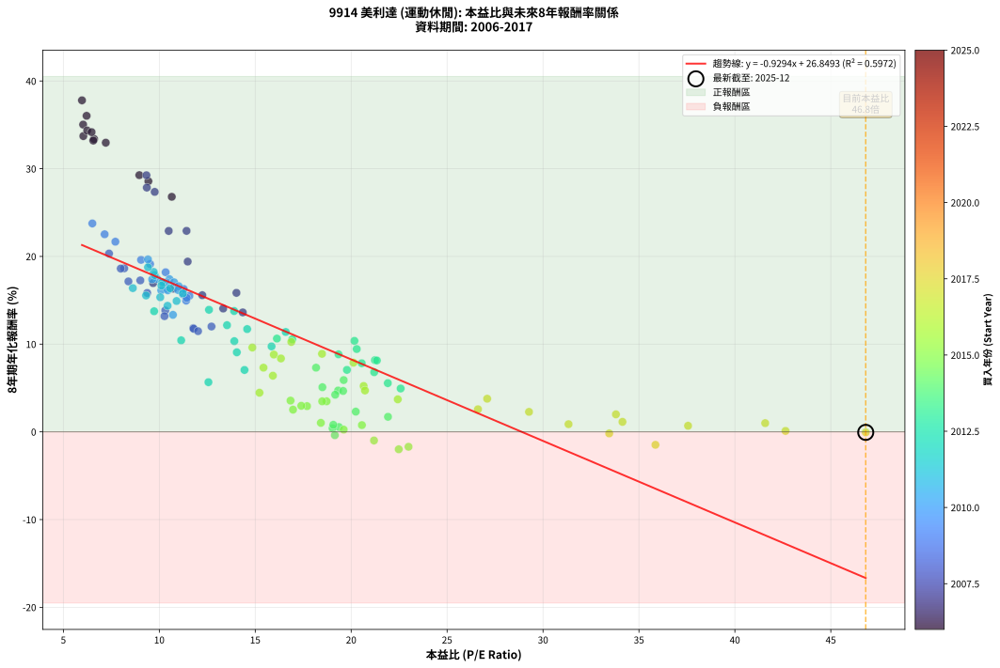
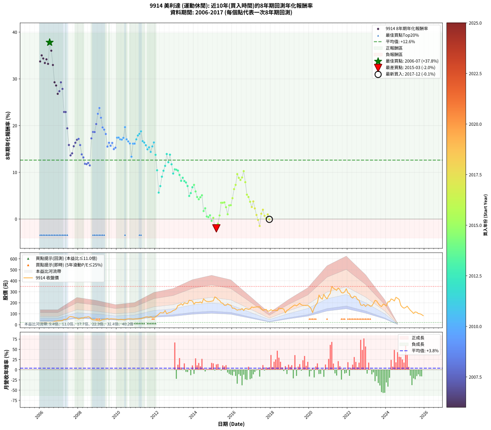

# 9914 美利達 - 本益比與未來報酬率分析

!!! info "報告資訊"
    - **股票代號**: 9914
    - **公司名稱**: 美利達
    - **產業別**: 運動休閒
    - **分析期間**: 2006-2017 (144 個數據點)
    - **資料來源**: Type 12 (ShowMonthlyK_ChartFlow) 月收盤價與本益比
    - **報酬率口徑**: 含現金股利 (簡化: 年度合計，假設每年7/1入帳)
    - **報告生成時間**: 2026-01-06 19:18:06 CST

## 📈 視覺化圖表

### 圖表1: 本益比 vs 未來報酬率關係

*圖表1：9914 美利達 本益比與8年期未來報酬率關係 (2006-2017)*

### 圖表2: 歷年買入時點的8年期實際報酬率

*圖表2：9914 美利達 歷年買入時點的8年期實際報酬率 (2006-2017)*

## 📍 買點訊號說明

本報告提供兩種買點提示訊號（顯示於圖表2的股價子圖中）：

### ▲ 小綠色三角形（回測驗證）
- **計算方式**: 使用全部歷史資料計算本益比第25百分位數
- **用途**: 事後驗證，顯示歷史上哪些時點確實為低估區
- **限制**: 當下無法判斷，僅供回測參考
- **特性**: 後見之明（Look-Ahead Bias）

### ▲ 小橘色三角形（即時訊號）
- **計算方式**: 使用截至當月的過去5年資料計算本益比第25百分位數
- **用途**: 實際投資決策，當時即可判斷
- **優勢**: 可操作性強，符合實務需求
- **特性**: 無後見之明，滾動窗口計算

!!! tip "如何使用兩種訊號"
    - **綠色▲** 幫助理解歷史估值機會，驗證策略有效性
    - **橘色▲** 可作為實際買進參考，但仍需搭配基本面分析
    - 兩種訊號重疊時，表示即時判斷與事後驗證一致，信心度較高
    - 僅有綠色▲時，表示當時無法判斷（需要未來資料才能確認）
    - 僅有橘色▲時，表示即時判斷為買點，但事後可能不是最佳時機

## 📊 估值分析摘要

| 指標 | 數值 |
|:---:|:---:|
| **目前本益比** (2017-12) | **46.82 倍** |
| **歷史平均本益比** | 15.32 倍 |
| **估值水準** | 🔴 相對高估 |
| **預期8年年化報酬率** | **-16.67%** |
| **歷史平均報酬率** | +12.61% |
| **相關係數 (R²)** | 0.5972 |
| **趨勢線斜率** | -0.9294 |

!!! abstract "核心洞察"
    目前本益比顯著高於歷史平均，預期未來報酬率可能較低

    根據歷史數據回測，9914 美利達 在目前本益比 **46.8倍** 的估值水準下，
    預期未來8年年化報酬率約為 **-16.7%**。

    **重要提醒**: 本分析基於歷史數據統計，實際報酬率會受到公司基本面變化、產業趨勢、
    總體經濟環境等多重因素影響。R² = 0.60 表示本益比可解釋約 59.7% 的報酬率變異。

## 📈 歷史估值統計

### 最佳買點 (最高報酬率)

| 項目 | 數值 |
|:---:|:---:|
| 起始時間 | 2006-07 |
| 當時本益比 | 5.97 倍 |
| 起始價格 | 20.3 元 |
| 8年後價格 | 236.5 元 |
| **8年年化報酬率** | **+37.80%** |

### 最差買點 (最低報酬率)

| 項目 | 數值 |
|:---:|:---:|
| 起始時間 | 2015-03 |
| 當時本益比 | 22.48 倍 |
| 起始價格 | 246.0 元 |
| 8年後價格 | 168.5 元 |
| **8年年化報酬率** | **-1.99%** |

## 🎯 投資啟示

### 本益比與報酬率關係

趨勢線方程式: **y = -0.9294x + 26.8493**

!!! warning "強負相關"
    本益比與未來報酬率呈現強負相關。在高本益比時期買入，未來報酬率顯著較低；
    在低本益比時期買入，未來報酬率顯著較高。**估值紀律至關重要**。

### 估值區間建議

基於歷史數據分析:

- **🟢 低估區** (P/E < 12.3): 預期報酬率較高，可考慮增加持股
- **🟡 合理區** (P/E 12.3-18.4): 預期報酬率符合長期趨勢，正常持有
- **🔴 高估區** (P/E > 18.4): 預期報酬率較低，可考慮減碼或觀望

!!! danger "風險提示"
    - 過去表現不代表未來結果
    - 本分析假設公司基本面無重大結構性變化
    - 產業環境劇變可能使歷史規律失效
    - 應結合公司財報、產業趨勢、總體經濟等多重因素綜合判斷

!!! success "長期投資觀點"
    歷史數據顯示，在合理或低估的估值水準買入並長期持有，
    往往能獲得較佳的投資報酬。**耐心等待好價格**是價值投資的核心原則。

## 📊 數據品質

- **資料來源**: GoodInfo.tw Type 12 (ShowMonthlyK_ChartFlow)
- **資料頻率**: 月度收盤價與本益比
- **回測期間**: 2006-2017
- **數據點數量**: 144 個 (每個點代表一次8年期回測)

### 計算方法說明

1. **8年期年化報酬率**:
   - 對每個歷史時點，計算其後8年的實際投資報酬率
   - 期末價值(不含股利): 期末價格
   - 期末價值(含現金股利): 期末價格 + 持有期間內的現金股利合計 (簡化: 年度合計，假設每年7/1入帳)
   - 公式: 年化報酬率 = [(期末價值/期初價格)^(1/年數) - 1] × 100%

2. **本益比 (P/E Ratio)**:
   - 使用當時的月收盤價與EPS計算
   - 資料來源: Type 12 月度河流圖本益比數據

3. **趨勢線 (Linear Regression)**:
   - 使用最小平方法擬合線性趨勢線
   - R²值衡量本益比對報酬率的解釋能力

---

*本報告由 Stock Analysis System v1.9.0 自動生成*
*數據更新時間: 2026-01-06 19:18:06 CST*

## 📋 月度回測明細表

（每一列對應時間線圖中的一個買入點；可用來對照 SVG 圖上的每個點。）

| 買入月份 | 賣出月份 | 回測期限_年 | 實際持有年數 | 買入本益比_倍 | 買入收盤價_元 | 賣出收盤價_元 | 現金股利合計_元 | 總報酬率_pct | 年化報酬率_pct |
| --- | --- | --- | --- | --- | --- | --- | --- | --- | --- |
| 2006-01 | 2014-01 | 8 | 8.000 | 6.04 | 20.55 | 187.00 | 23.10 | +922.38 | +33.72 |
| 2006-02 | 2014-02 | 8 | 8.000 | 6.03 | 20.50 | 203.50 | 23.10 | +1005.37 | +35.03 |
| 2006-03 | 2014-03 | 8 | 8.000 | 6.24 | 21.20 | 202.00 | 23.10 | +961.79 | +34.36 |
| 2006-04 | 2014-04 | 8 | 8.000 | 6.60 | 22.45 | 202.00 | 23.10 | +902.67 | +33.40 |
| 2006-05 | 2014-05 | 8 | 8.000 | 6.47 | 22.00 | 208.00 | 23.10 | +950.45 | +34.18 |
| 2006-06 | 2014-06 | 8 | 8.000 | 6.56 | 22.30 | 198.00 | 23.10 | +891.48 | +33.21 |
| 2006-07 | 2014-07 | 8 | 8.000 | 5.97 | 20.30 | 236.50 | 27.40 | +1200.00 | +37.80 |
| 2006-08 | 2014-08 | 8 | 8.000 | 6.21 | 21.10 | 220.00 | 27.40 | +1072.51 | +36.03 |
| 2006-09 | 2014-09 | 8 | 8.000 | 7.21 | 24.50 | 212.00 | 27.40 | +877.14 | +32.97 |
| 2006-10 | 2014-10 | 8 | 8.000 | 8.96 | 30.45 | 210.00 | 27.40 | +679.64 | +29.27 |
| 2006-11 | 2014-11 | 8 | 8.000 | 9.43 | 32.05 | 212.00 | 27.40 | +646.96 | +28.58 |
| 2006-12 | 2014-12 | 8 | 8.000 | 10.65 | 36.20 | 214.50 | 27.40 | +568.23 | +26.80 |
| 2007-01 | 2015-01 | 8 | 8.000 | 9.76 | 35.45 | 218.00 | 27.40 | +592.24 | +27.36 |
| 2007-02 | 2015-02 | 8 | 8.000 | 9.33 | 36.05 | 253.50 | 27.40 | +679.20 | +29.26 |
| 2007-03 | 2015-03 | 8 | 8.000 | 9.35 | 38.30 | 246.00 | 27.40 | +613.84 | +27.85 |
| 2007-04 | 2015-04 | 8 | 8.000 | 11.42 | 49.40 | 230.00 | 27.40 | +421.05 | +22.92 |
| 2007-05 | 2015-05 | 8 | 8.000 | 10.49 | 47.80 | 221.50 | 27.40 | +420.71 | +22.91 |
| 2007-06 | 2015-06 | 8 | 8.000 | 11.48 | 55.00 | 200.00 | 27.40 | +313.45 | +19.41 |
| 2007-07 | 2015-07 | 8 | 8.000 | 14.02 | 70.40 | 196.00 | 32.40 | +224.43 | +15.85 |
| 2007-08 | 2015-08 | 8 | 8.000 | 14.35 | 75.40 | 177.00 | 32.40 | +177.72 | +13.62 |
| 2007-09 | 2015-09 | 8 | 8.000 | 13.33 | 73.10 | 177.00 | 32.40 | +186.46 | +14.06 |
| 2007-10 | 2015-10 | 8 | 8.000 | 12.24 | 70.00 | 190.50 | 32.40 | +218.43 | +15.58 |
| 2007-11 | 2015-11 | 8 | 8.000 | 10.73 | 63.80 | 181.50 | 32.40 | +235.27 | +16.33 |
| 2007-12 | 2015-12 | 8 | 8.000 | 9.68 | 59.80 | 177.00 | 32.40 | +250.17 | +16.96 |
| 2008-01 | 2016-01 | 8 | 8.000 | 8.39 | 51.40 | 150.00 | 32.40 | +254.86 | +17.15 |
| 2008-02 | 2016-02 | 8 | 8.000 | 9.37 | 56.90 | 152.00 | 32.40 | +224.08 | +15.83 |
| 2008-03 | 2016-03 | 8 | 8.000 | 10.31 | 62.00 | 142.50 | 32.40 | +182.10 | +13.84 |
| 2008-04 | 2016-04 | 8 | 8.000 | 10.27 | 61.20 | 132.50 | 32.40 | +169.44 | +13.19 |
| 2008-05 | 2016-05 | 8 | 8.000 | 11.77 | 69.50 | 137.50 | 32.40 | +144.46 | +11.82 |
| 2008-06 | 2016-06 | 8 | 8.000 | 11.79 | 69.00 | 135.50 | 32.40 | +143.33 | +11.76 |
| 2008-07 | 2016-07 | 8 | 8.000 | 12.72 | 73.70 | 147.50 | 35.10 | +147.76 | +12.01 |
| 2008-08 | 2016-08 | 8 | 8.000 | 12.02 | 69.00 | 129.50 | 35.10 | +138.55 | +11.48 |
| 2008-09 | 2016-09 | 8 | 8.000 | 9.01 | 51.20 | 148.00 | 35.10 | +257.62 | +17.27 |
| 2008-10 | 2016-10 | 8 | 8.000 | 8.17 | 46.00 | 145.50 | 35.10 | +292.61 | +18.64 |
| 2008-11 | 2016-11 | 8 | 8.000 | 7.99 | 44.55 | 139.50 | 35.10 | +291.92 | +18.62 |
| 2008-12 | 2016-12 | 8 | 8.000 | 7.38 | 40.75 | 144.00 | 35.10 | +339.51 | +20.33 |
| 2009-01 | 2017-01 | 8 | 8.000 | 7.15 | 38.90 | 162.50 | 35.10 | +407.97 | +22.53 |
| 2009-02 | 2017-02 | 8 | 8.000 | 6.51 | 34.90 | 157.00 | 35.10 | +450.43 | +23.76 |
| 2009-03 | 2017-03 | 8 | 8.000 | 7.71 | 40.70 | 160.50 | 35.10 | +380.59 | +21.68 |
| 2009-04 | 2017-04 | 8 | 8.000 | 9.05 | 47.05 | 162.00 | 35.10 | +318.92 | +19.61 |
| 2009-05 | 2017-05 | 8 | 8.000 | 9.52 | 48.70 | 162.50 | 35.10 | +305.75 | +19.13 |
| 2009-06 | 2017-06 | 8 | 8.000 | 10.33 | 52.00 | 163.00 | 35.10 | +280.96 | +18.20 |
| 2009-07 | 2017-07 | 8 | 8.000 | 11.57 | 57.30 | 144.50 | 37.10 | +216.93 | +15.51 |
| 2009-08 | 2017-08 | 8 | 8.000 | 10.38 | 50.60 | 132.50 | 37.10 | +235.18 | +16.32 |
| 2009-09 | 2017-09 | 8 | 8.000 | 11.23 | 53.80 | 135.50 | 37.10 | +220.82 | +15.69 |
| 2009-10 | 2017-10 | 8 | 8.000 | 11.27 | 53.10 | 140.50 | 37.10 | +234.46 | +16.29 |
| 2009-11 | 2017-11 | 8 | 8.000 | 11.40 | 52.80 | 124.00 | 37.10 | +205.11 | +14.96 |
| 2009-12 | 2017-12 | 8 | 8.000 | 11.43 | 52.00 | 125.00 | 37.10 | +211.73 | +15.27 |
| 2010-01 | 2018-01 | 8 | 8.000 | 10.53 | 48.35 | 137.50 | 37.10 | +261.12 | +17.41 |
| 2010-02 | 2018-02 | 8 | 8.000 | 9.89 | 45.80 | 128.50 | 37.10 | +261.57 | +17.43 |
| 2010-03 | 2018-03 | 8 | 8.000 | 10.36 | 48.40 | 133.50 | 37.10 | +252.48 | +17.06 |
| 2010-04 | 2018-04 | 8 | 8.000 | 10.25 | 48.30 | 132.50 | 37.10 | +251.14 | +17.00 |
| 2010-05 | 2018-05 | 8 | 8.000 | 9.63 | 45.80 | 128.00 | 37.10 | +260.48 | +17.38 |
| 2010-06 | 2018-06 | 8 | 8.000 | 9.41 | 45.10 | 152.50 | 37.10 | +320.40 | +19.66 |
| 2010-07 | 2018-07 | 8 | 8.000 | 10.77 | 52.10 | 147.50 | 36.10 | +252.40 | +17.05 |
| 2010-08 | 2018-08 | 8 | 8.000 | 11.01 | 53.70 | 147.50 | 36.10 | +241.90 | +16.61 |
| 2010-09 | 2018-09 | 8 | 8.000 | 10.98 | 54.00 | 143.00 | 36.10 | +231.67 | +16.17 |
| 2010-10 | 2018-10 | 8 | 8.000 | 10.71 | 53.10 | 108.50 | 36.10 | +172.32 | +13.34 |
| 2010-11 | 2018-11 | 8 | 8.000 | 10.10 | 50.50 | 131.00 | 36.10 | +230.89 | +16.13 |
| 2010-12 | 2018-12 | 8 | 8.000 | 10.44 | 52.60 | 138.00 | 36.10 | +230.99 | +16.14 |
| 2011-01 | 2019-01 | 8 | 8.000 | 10.15 | 53.10 | 151.00 | 36.10 | +252.35 | +17.05 |
| 2011-02 | 2019-02 | 8 | 8.000 | 9.76 | 52.90 | 161.00 | 36.10 | +272.59 | +17.87 |
| 2011-03 | 2019-03 | 8 | 8.000 | 9.71 | 54.50 | 172.00 | 36.10 | +281.83 | +18.23 |
| 2011-04 | 2019-04 | 8 | 8.000 | 9.41 | 54.60 | 180.00 | 36.10 | +295.79 | +18.76 |
| 2011-05 | 2019-05 | 8 | 8.000 | 10.11 | 60.60 | 172.00 | 36.10 | +243.40 | +16.67 |
| 2011-06 | 2019-06 | 8 | 8.000 | 10.56 | 65.30 | 183.50 | 36.10 | +236.29 | +16.37 |
| 2011-07 | 2019-07 | 8 | 8.000 | 11.23 | 71.60 | 195.00 | 36.30 | +223.04 | +15.79 |
| 2011-08 | 2019-08 | 8 | 8.000 | 10.90 | 71.60 | 181.50 | 36.30 | +204.19 | +14.92 |
| 2011-09 | 2019-09 | 8 | 8.000 | 10.05 | 67.90 | 176.50 | 36.30 | +213.40 | +15.35 |
| 2011-10 | 2019-10 | 8 | 8.000 | 10.43 | 72.50 | 176.00 | 36.30 | +192.83 | +14.37 |
| 2011-11 | 2019-11 | 8 | 8.000 | 9.31 | 66.50 | 175.00 | 36.30 | +217.74 | +15.55 |
| 2011-12 | 2019-12 | 8 | 8.000 | 8.62 | 63.20 | 176.50 | 36.30 | +236.71 | +16.39 |
| 2012-01 | 2020-01 | 8 | 8.000 | 9.73 | 72.00 | 165.50 | 36.30 | +180.28 | +13.75 |
| 2012-02 | 2020-02 | 8 | 8.000 | 11.14 | 83.30 | 148.00 | 36.30 | +121.25 | +10.44 |
| 2012-03 | 2020-03 | 8 | 8.000 | 12.56 | 94.80 | 111.00 | 36.30 | +55.38 | +5.66 |
| 2012-04 | 2020-04 | 8 | 8.000 | 14.44 | 110.00 | 153.50 | 36.30 | +72.55 | +7.06 |
| 2012-05 | 2020-05 | 8 | 8.000 | 14.04 | 108.00 | 180.00 | 36.30 | +100.28 | +9.07 |
| 2012-06 | 2020-06 | 8 | 8.000 | 13.91 | 108.00 | 201.00 | 36.30 | +119.72 | +10.34 |
| 2012-07 | 2020-07 | 8 | 8.000 | 16.59 | 130.00 | 270.50 | 37.50 | +136.92 | +11.38 |
| 2012-08 | 2020-08 | 8 | 8.000 | 12.59 | 99.60 | 245.00 | 37.50 | +183.63 | +13.92 |
| 2012-09 | 2020-09 | 8 | 8.000 | 13.53 | 108.00 | 233.00 | 37.50 | +150.46 | +12.16 |
| 2012-10 | 2020-10 | 8 | 8.000 | 13.90 | 112.00 | 277.00 | 37.50 | +180.80 | +13.78 |
| 2012-11 | 2020-11 | 8 | 8.000 | 14.58 | 118.50 | 250.00 | 37.50 | +142.62 | +11.72 |
| 2012-12 | 2020-12 | 8 | 8.000 | 15.85 | 130.00 | 236.00 | 37.50 | +110.38 | +9.74 |
| 2013-01 | 2021-01 | 8 | 8.000 | 16.13 | 135.00 | 265.50 | 37.50 | +124.44 | +10.63 |
| 2013-02 | 2021-02 | 8 | 8.000 | 16.93 | 144.50 | 285.00 | 37.50 | +123.18 | +10.56 |
| 2013-03 | 2021-03 | 8 | 8.000 | 20.17 | 175.50 | 349.00 | 37.50 | +120.23 | +10.37 |
| 2013-04 | 2021-04 | 8 | 8.000 | 20.29 | 180.00 | 333.00 | 37.50 | +105.83 | +9.44 |
| 2013-05 | 2021-05 | 8 | 8.000 | 21.24 | 192.00 | 322.50 | 37.50 | +87.50 | +8.17 |
| 2013-06 | 2021-06 | 8 | 8.000 | 19.34 | 178.00 | 313.00 | 37.50 | +96.91 | +8.84 |
| 2013-07 | 2021-07 | 8 | 8.000 | 21.34 | 200.00 | 335.00 | 39.00 | +87.00 | +8.14 |
| 2013-08 | 2021-08 | 8 | 8.000 | 20.55 | 196.00 | 319.00 | 39.00 | +82.65 | +7.82 |
| 2013-09 | 2021-09 | 8 | 8.000 | 19.78 | 192.00 | 292.50 | 39.00 | +72.66 | +7.07 |
| 2013-10 | 2021-10 | 8 | 8.000 | 22.58 | 223.00 | 289.00 | 39.00 | +47.09 | +4.94 |
| 2013-11 | 2021-11 | 8 | 8.000 | 21.91 | 220.00 | 300.00 | 39.00 | +54.09 | +5.55 |
| 2013-12 | 2021-12 | 8 | 8.000 | 21.20 | 216.50 | 327.50 | 39.00 | +69.28 | +6.80 |
| 2014-01 | 2022-01 | 8 | 8.000 | 18.17 | 187.00 | 290.00 | 39.00 | +75.94 | +7.32 |
| 2014-02 | 2022-02 | 8 | 8.000 | 19.61 | 203.50 | 283.00 | 39.00 | +58.23 | +5.90 |
| 2014-03 | 2022-03 | 8 | 8.000 | 19.32 | 202.00 | 253.00 | 39.00 | +44.55 | +4.71 |
| 2014-04 | 2022-04 | 8 | 8.000 | 19.17 | 202.00 | 242.50 | 39.00 | +39.36 | +4.24 |
| 2014-05 | 2022-05 | 8 | 8.000 | 19.58 | 208.00 | 260.50 | 39.00 | +43.99 | +4.66 |
| 2014-06 | 2022-06 | 8 | 8.000 | 18.50 | 198.00 | 255.50 | 39.00 | +48.74 | +5.09 |
| 2014-07 | 2022-07 | 8 | 8.000 | 21.92 | 236.50 | 230.00 | 41.00 | +14.59 | +1.72 |
| 2014-08 | 2022-08 | 8 | 8.000 | 20.24 | 220.00 | 223.00 | 41.00 | +20.00 | +2.31 |
| 2014-09 | 2022-09 | 8 | 8.000 | 19.36 | 212.00 | 180.50 | 41.00 | +4.48 | +0.55 |
| 2014-10 | 2022-10 | 8 | 8.000 | 19.03 | 210.00 | 176.00 | 41.00 | +3.33 | +0.41 |
| 2014-11 | 2022-11 | 8 | 8.000 | 19.07 | 212.00 | 185.00 | 41.00 | +6.60 | +0.80 |
| 2014-12 | 2022-12 | 8 | 8.000 | 19.15 | 214.50 | 167.00 | 41.00 | -3.03 | -0.38 |
| 2015-01 | 2023-01 | 8 | 8.000 | 19.61 | 218.00 | 181.50 | 41.00 | +2.06 | +0.26 |
| 2015-02 | 2023-02 | 8 | 8.000 | 22.99 | 253.50 | 180.00 | 41.00 | -12.82 | -1.70 |
| 2015-03 | 2023-03 | 8 | 8.000 | 22.48 | 246.00 | 168.50 | 41.00 | -14.84 | -1.99 |
| 2015-04 | 2023-04 | 8 | 8.000 | 21.19 | 230.00 | 171.50 | 41.00 | -7.61 | -0.98 |
| 2015-05 | 2023-05 | 8 | 8.000 | 20.56 | 221.50 | 194.50 | 41.00 | +6.32 | +0.77 |
| 2015-06 | 2023-06 | 8 | 8.000 | 18.72 | 200.00 | 222.00 | 41.00 | +31.50 | +3.48 |
| 2015-07 | 2023-07 | 8 | 8.000 | 18.49 | 196.00 | 216.50 | 41.20 | +31.48 | +3.48 |
| 2015-08 | 2023-08 | 8 | 8.000 | 16.84 | 177.00 | 193.00 | 41.20 | +32.32 | +3.56 |
| 2015-09 | 2023-09 | 8 | 8.000 | 16.97 | 177.00 | 175.00 | 41.20 | +22.15 | +2.53 |
| 2015-10 | 2023-10 | 8 | 8.000 | 18.42 | 190.50 | 165.50 | 41.20 | +8.50 | +1.03 |
| 2015-11 | 2023-11 | 8 | 8.000 | 17.70 | 181.50 | 187.50 | 41.20 | +26.01 | +2.93 |
| 2015-12 | 2023-12 | 8 | 8.000 | 17.40 | 177.00 | 182.50 | 41.20 | +26.38 | +2.97 |
| 2016-01 | 2024-01 | 8 | 8.000 | 15.22 | 150.00 | 171.50 | 41.20 | +41.80 | +4.46 |
| 2016-02 | 2024-02 | 8 | 8.000 | 15.92 | 152.00 | 208.50 | 41.20 | +64.28 | +6.40 |
| 2016-03 | 2024-03 | 8 | 8.000 | 15.43 | 142.50 | 209.50 | 41.20 | +75.93 | +7.32 |
| 2016-04 | 2024-04 | 8 | 8.000 | 14.85 | 132.50 | 235.00 | 41.20 | +108.45 | +9.62 |
| 2016-05 | 2024-05 | 8 | 8.000 | 15.97 | 137.50 | 229.00 | 41.20 | +96.51 | +8.81 |
| 2016-06 | 2024-06 | 8 | 8.000 | 16.34 | 135.50 | 216.50 | 41.20 | +90.18 | +8.37 |
| 2016-07 | 2024-07 | 8 | 8.000 | 18.48 | 147.50 | 250.00 | 41.70 | +97.76 | +8.90 |
| 2016-08 | 2024-08 | 8 | 8.000 | 16.88 | 129.50 | 241.00 | 41.70 | +118.30 | +10.25 |
| 2016-09 | 2024-09 | 8 | 8.000 | 20.12 | 148.00 | 230.00 | 41.70 | +83.58 | +7.89 |
| 2016-10 | 2024-10 | 8 | 8.000 | 20.65 | 145.50 | 177.00 | 41.70 | +50.31 | +5.23 |
| 2016-11 | 2024-11 | 8 | 8.000 | 20.72 | 139.50 | 160.00 | 41.70 | +44.59 | +4.72 |
| 2016-12 | 2024-12 | 8 | 8.000 | 22.43 | 144.00 | 151.00 | 41.70 | +33.82 | +3.71 |
| 2017-01 | 2025-01 | 8 | 8.000 | 26.61 | 162.50 | 157.50 | 41.70 | +22.58 | +2.58 |
| 2017-02 | 2025-02 | 8 | 8.000 | 27.09 | 157.00 | 169.50 | 41.70 | +34.52 | +3.78 |
| 2017-03 | 2025-03 | 8 | 8.000 | 29.27 | 160.50 | 150.50 | 41.70 | +19.75 | +2.28 |
| 2017-04 | 2025-04 | 8 | 8.000 | 31.33 | 162.00 | 132.00 | 41.70 | +7.22 | +0.88 |
| 2017-05 | 2025-05 | 8 | 8.000 | 33.45 | 162.50 | 118.50 | 41.70 | -1.42 | -0.18 |
| 2017-06 | 2025-06 | 8 | 8.000 | 35.86 | 163.00 | 103.00 | 41.70 | -11.23 | -1.48 |
| 2017-07 | 2025-07 | 8 | 8.000 | 34.14 | 144.50 | 116.50 | 41.70 | +9.48 | +1.14 |
| 2017-08 | 2025-08 | 8 | 8.000 | 33.80 | 132.50 | 113.50 | 41.70 | +17.13 | +2.00 |
| 2017-09 | 2025-09 | 8 | 8.000 | 37.56 | 135.50 | 101.50 | 41.70 | +5.68 | +0.69 |
| 2017-10 | 2025-10 | 8 | 8.000 | 42.64 | 140.50 | 100.00 | 41.70 | +0.85 | +0.11 |
| 2017-11 | 2025-11 | 8 | 8.000 | 41.58 | 124.00 | 92.50 | 41.70 | +8.23 | +0.99 |
| 2017-12 | 2025-12 | 8 | 8.000 | 46.82 | 125.00 | 82.70 | 41.70 | -0.48 | -0.06 |
