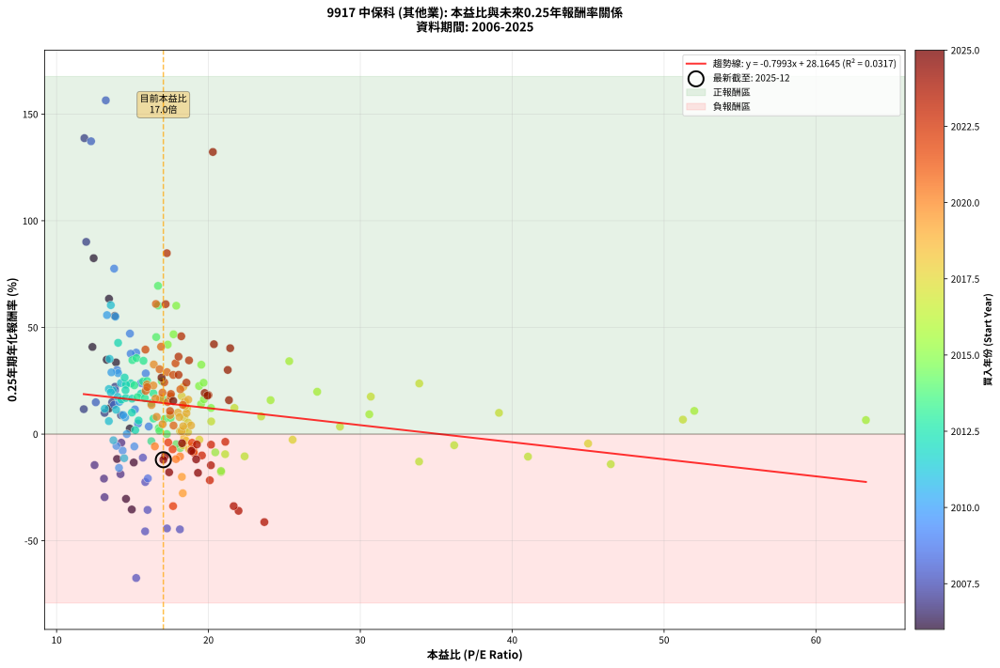
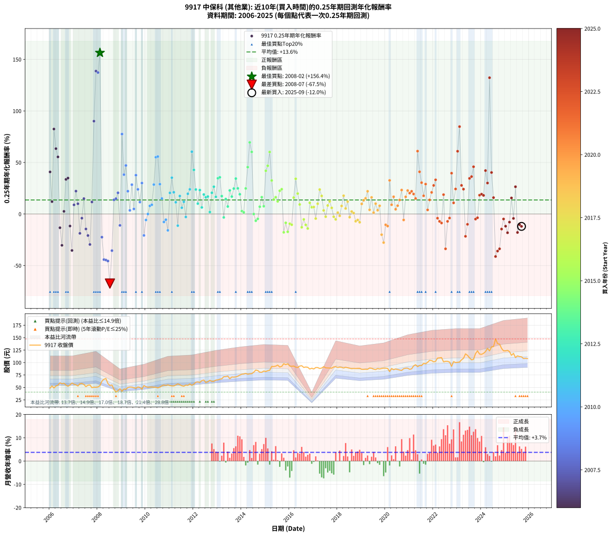

# 9917 中保科 - 本益比與未來報酬率分析

!!! info "報告資訊"
    - **股票代號**: 9917
    - **公司名稱**: 中保科
    - **產業別**: 其他業
    - **分析期間**: 2006-2025 (237 個數據點)
    - **資料來源**: Type 12 (ShowMonthlyK_ChartFlow) 月收盤價與本益比
    - **報酬率口徑**: 含現金股利 (簡化: 年度合計，假設每年7/1入帳)
    - **報告生成時間**: 2026-01-05 01:19:09 CST

## 📈 視覺化圖表

### 圖表1: 本益比 vs 未來報酬率關係

*圖表1：9917 中保科 本益比與0.25年期未來報酬率關係 (2006-2025)*

### 圖表2: 歷年買入時點的0.25年期實際報酬率

*圖表2：9917 中保科 歷年買入時點的0.25年期實際報酬率 (2006-2025)*

## 📍 買點訊號說明

本報告提供兩種買點提示訊號（顯示於圖表2的股價子圖中）：

### ▲ 小綠色三角形（回測驗證）
- **計算方式**: 使用全部歷史資料計算本益比第25百分位數
- **用途**: 事後驗證，顯示歷史上哪些時點確實為低估區
- **限制**: 當下無法判斷，僅供回測參考
- **特性**: 後見之明（Look-Ahead Bias）

### ▲ 小橘色三角形（即時訊號）
- **計算方式**: 使用截至當月的過去5年資料計算本益比第25百分位數
- **用途**: 實際投資決策，當時即可判斷
- **優勢**: 可操作性強，符合實務需求
- **特性**: 無後見之明，滾動窗口計算

!!! tip "如何使用兩種訊號"
    - **綠色▲** 幫助理解歷史估值機會，驗證策略有效性
    - **橘色▲** 可作為實際買進參考，但仍需搭配基本面分析
    - 兩種訊號重疊時，表示即時判斷與事後驗證一致，信心度較高
    - 僅有綠色▲時，表示當時無法判斷（需要未來資料才能確認）
    - 僅有橘色▲時，表示即時判斷為買點，但事後可能不是最佳時機

## 📊 估值分析摘要

| 指標 | 數值 |
|:---:|:---:|
| **目前本益比** (2025-09) | **17.03 倍** |
| **歷史平均本益比** | 18.18 倍 |
| **估值水準** | 🟡 合理範圍 |
| **預期0.25年年化報酬率** | **+14.55%** |
| **歷史平均報酬率** | +13.63% |
| **相關係數 (R²)** | 0.0317 |
| **趨勢線斜率** | -0.7993 |

!!! abstract "核心洞察"
    目前本益比接近歷史平均，預期報酬率符合長期趨勢

    根據歷史數據回測，9917 中保科 在目前本益比 **17.0倍** 的估值水準下，
    預期未來0.25年年化報酬率約為 **+14.6%**。

    **重要提醒**: 本分析基於歷史數據統計，實際報酬率會受到公司基本面變化、產業趨勢、
    總體經濟環境等多重因素影響。R² = 0.03 表示本益比可解釋約 3.2% 的報酬率變異。

## 📈 歷史估值統計

### 最佳買點 (最高報酬率)

| 項目 | 數值 |
|:---:|:---:|
| 起始時間 | 2008-02 |
| 當時本益比 | 13.24 倍 |
| 起始價格 | 53.7 元 |
| 0.25年後價格 | 67.9 元 |
| **0.25年年化報酬率** | **+156.44%** |

### 最差買點 (最低報酬率)

| 項目 | 數值 |
|:---:|:---:|
| 起始時間 | 2008-07 |
| 當時本益比 | 15.24 倍 |
| 起始價格 | 54.0 元 |
| 0.25年後價格 | 40.7 元 |
| **0.25年年化報酬率** | **-67.46%** |

## 🎯 投資啟示

### 本益比與報酬率關係

趨勢線方程式: **y = -0.7993x + 28.1645**

!!! warning "強負相關"
    本益比與未來報酬率呈現強負相關。在高本益比時期買入，未來報酬率顯著較低；
    在低本益比時期買入，未來報酬率顯著較高。**估值紀律至關重要**。

### 估值區間建議

基於歷史數據分析:

- **🟢 低估區** (P/E < 14.5): 預期報酬率較高，可考慮增加持股
- **🟡 合理區** (P/E 14.5-21.8): 預期報酬率符合長期趨勢，正常持有
- **🔴 高估區** (P/E > 21.8): 預期報酬率較低，可考慮減碼或觀望

!!! danger "風險提示"
    - 過去表現不代表未來結果
    - 本分析假設公司基本面無重大結構性變化
    - 產業環境劇變可能使歷史規律失效
    - 應結合公司財報、產業趨勢、總體經濟等多重因素綜合判斷

!!! success "長期投資觀點"
    歷史數據顯示，在合理或低估的估值水準買入並長期持有，
    往往能獲得較佳的投資報酬。**耐心等待好價格**是價值投資的核心原則。

## 📊 數據品質

- **資料來源**: GoodInfo.tw Type 12 (ShowMonthlyK_ChartFlow)
- **資料頻率**: 月度收盤價與本益比
- **回測期間**: 2006-2025
- **數據點數量**: 237 個 (每個點代表一次0.25年期回測)

### 計算方法說明

1. **0.25年期年化報酬率**:
   - 對每個歷史時點，計算其後0.25年的實際投資報酬率
   - 期末價值(不含股利): 期末價格
   - 期末價值(含現金股利): 期末價格 + 持有期間內的現金股利合計 (簡化: 年度合計，假設每年7/1入帳)
   - 公式: 年化報酬率 = [(期末價值/期初價格)^(1/年數) - 1] × 100%

2. **本益比 (P/E Ratio)**:
   - 使用當時的月收盤價與EPS計算
   - 資料來源: Type 12 月度河流圖本益比數據

3. **趨勢線 (Linear Regression)**:
   - 使用最小平方法擬合線性趨勢線
   - R²值衡量本益比對報酬率的解釋能力

---

*本報告由 Stock Analysis System v1.9.0 自動生成*
*數據更新時間: 2026-01-05 01:19:09 CST*

## 📋 月度回測明細表

（每一列對應時間線圖中的一個買入點；可用來對照 SVG 圖上的每個點。）

| 買入月份 | 賣出月份 | 回測期限_年 | 實際持有年數 | 買入本益比_倍 | 買入收盤價_元 | 賣出收盤價_元 | 現金股利合計_元 | 總報酬率_pct | 年化報酬率_pct |
| --- | --- | --- | --- | --- | --- | --- | --- | --- | --- |
| 2006-01 | 2006-05 | 0.25 | 0.329 | 12.36 | 48.70 | 54.50 | 0.00 | +11.91 | +40.84 |
| 2006-02 | 2006-05 | 0.25 | 0.246 | 13.45 | 53.00 | 54.50 | 0.00 | +2.83 | +11.99 |
| 2006-03 | 2006-07 | 0.25 | 0.334 | 12.44 | 49.00 | 57.40 | 2.50 | +22.24 | +82.46 |
| 2006-04 | 2006-07 | 0.25 | 0.249 | 13.45 | 53.00 | 57.40 | 2.50 | +13.02 | +63.43 |
| 2006-05 | 2006-08 | 0.25 | 0.252 | 13.83 | 54.50 | 58.40 | 2.50 | +11.74 | +55.40 |
| 2006-06 | 2006-09 | 0.25 | 0.252 | 15.08 | 59.40 | 54.80 | 2.50 | -3.54 | -13.32 |
| 2006-07 | 2006-10 | 0.25 | 0.252 | 14.57 | 57.40 | 52.40 | 0.00 | -8.71 | -30.36 |
| 2006-08 | 2006-12 | 0.25 | 0.334 | 14.82 | 58.40 | 58.90 | 0.00 | +0.86 | +2.59 |
| 2006-09 | 2006-12 | 0.25 | 0.249 | 13.91 | 54.80 | 58.90 | 0.00 | +7.48 | +33.59 |
| 2006-10 | 2007-01 | 0.25 | 0.252 | 13.30 | 52.40 | 56.50 | 0.00 | +7.82 | +34.86 |
| 2006-11 | 2007-03 | 0.25 | 0.329 | 13.98 | 55.10 | 52.90 | 0.00 | -3.99 | -11.66 |
| 2006-12 | 2007-03 | 0.25 | 0.246 | 14.95 | 58.90 | 52.90 | 0.00 | -10.19 | -35.34 |
| 2007-01 | 2007-05 | 0.25 | 0.329 | 14.24 | 56.50 | 58.10 | 0.00 | +2.83 | +8.87 |
| 2007-02 | 2007-05 | 0.25 | 0.246 | 13.85 | 55.30 | 58.10 | 0.00 | +5.06 | +22.20 |
| 2007-03 | 2007-07 | 0.25 | 0.334 | 13.16 | 52.90 | 51.60 | 3.00 | +3.21 | +9.93 |
| 2007-04 | 2007-07 | 0.25 | 0.249 | 14.21 | 57.50 | 51.60 | 3.00 | -5.04 | -18.76 |
| 2007-05 | 2007-08 | 0.25 | 0.252 | 14.26 | 58.10 | 54.50 | 3.00 | -1.03 | -4.04 |
| 2007-06 | 2007-09 | 0.25 | 0.252 | 13.66 | 56.00 | 55.00 | 3.00 | +3.57 | +14.95 |
| 2007-07 | 2007-10 | 0.25 | 0.252 | 12.50 | 51.60 | 49.60 | 0.00 | -3.88 | -14.52 |
| 2007-08 | 2007-12 | 0.25 | 0.334 | 13.12 | 54.50 | 50.40 | 0.00 | -7.52 | -20.88 |
| 2007-09 | 2007-12 | 0.25 | 0.249 | 13.16 | 55.00 | 50.40 | 0.00 | -8.36 | -29.57 |
| 2007-10 | 2008-01 | 0.25 | 0.252 | 11.79 | 49.60 | 51.00 | 0.00 | +2.82 | +11.68 |
| 2007-11 | 2008-03 | 0.25 | 0.331 | 11.95 | 50.60 | 62.60 | 0.00 | +23.72 | +90.10 |
| 2007-12 | 2008-03 | 0.25 | 0.249 | 11.83 | 50.40 | 62.60 | 0.00 | +24.21 | +138.71 |
| 2008-01 | 2008-05 | 0.25 | 0.331 | 12.27 | 51.00 | 67.90 | 0.00 | +33.14 | +137.25 |
| 2008-02 | 2008-05 | 0.25 | 0.249 | 13.24 | 53.70 | 67.90 | 0.00 | +26.44 | +156.44 |
| 2008-03 | 2008-07 | 0.25 | 0.334 | 15.84 | 62.60 | 54.00 | 3.50 | -8.15 | -22.46 |
| 2008-04 | 2008-07 | 0.25 | 0.249 | 17.27 | 66.50 | 54.00 | 3.50 | -13.53 | -44.22 |
| 2008-05 | 2008-08 | 0.25 | 0.252 | 18.12 | 67.90 | 55.00 | 3.50 | -13.84 | -44.65 |
| 2008-06 | 2008-09 | 0.25 | 0.252 | 15.83 | 57.70 | 46.00 | 3.50 | -14.21 | -45.59 |
| 2008-07 | 2008-10 | 0.25 | 0.252 | 15.24 | 54.00 | 40.70 | 0.00 | -24.63 | -67.46 |
| 2008-08 | 2008-12 | 0.25 | 0.334 | 15.99 | 55.00 | 47.50 | 0.00 | -13.64 | -35.53 |
| 2008-09 | 2008-12 | 0.25 | 0.249 | 13.78 | 46.00 | 47.50 | 0.00 | +3.26 | +13.75 |
| 2008-10 | 2009-01 | 0.25 | 0.252 | 12.58 | 40.70 | 42.15 | 0.00 | +3.56 | +14.91 |
| 2008-11 | 2009-03 | 0.25 | 0.329 | 13.85 | 43.40 | 46.15 | 0.00 | +6.34 | +20.56 |
| 2008-12 | 2009-03 | 0.25 | 0.246 | 15.68 | 47.50 | 46.15 | 0.00 | -2.84 | -11.04 |
| 2009-01 | 2009-05 | 0.25 | 0.329 | 13.79 | 42.15 | 50.90 | 0.00 | +20.76 | +77.56 |
| 2009-02 | 2009-05 | 0.25 | 0.246 | 15.24 | 47.00 | 50.90 | 0.00 | +8.30 | +38.20 |
| 2009-03 | 2009-07 | 0.25 | 0.334 | 14.83 | 46.15 | 49.50 | 3.00 | +13.76 | +47.10 |
| 2009-04 | 2009-07 | 0.25 | 0.249 | 15.91 | 49.95 | 49.50 | 3.00 | +5.11 | +22.12 |
| 2009-05 | 2009-08 | 0.25 | 0.252 | 16.07 | 50.90 | 48.35 | 3.00 | +0.88 | +3.56 |
| 2009-06 | 2009-09 | 0.25 | 0.252 | 15.87 | 50.70 | 51.00 | 3.00 | +6.51 | +28.45 |
| 2009-07 | 2009-10 | 0.25 | 0.252 | 15.36 | 49.50 | 50.10 | 0.00 | +1.21 | +4.90 |
| 2009-08 | 2009-12 | 0.25 | 0.334 | 14.88 | 48.35 | 53.80 | 0.00 | +11.27 | +37.68 |
| 2009-09 | 2009-12 | 0.25 | 0.249 | 15.56 | 51.00 | 53.80 | 0.00 | +5.49 | +23.93 |
| 2009-10 | 2010-01 | 0.25 | 0.252 | 15.16 | 50.10 | 51.50 | 0.00 | +2.79 | +11.56 |
| 2009-11 | 2010-03 | 0.25 | 0.329 | 13.98 | 46.60 | 50.80 | 0.00 | +9.01 | +30.04 |
| 2009-12 | 2010-03 | 0.25 | 0.246 | 16.01 | 53.80 | 50.80 | 0.00 | -5.58 | -20.77 |
| 2010-01 | 2010-05 | 0.25 | 0.329 | 15.12 | 51.50 | 50.50 | 0.00 | -1.94 | -5.79 |
| 2010-02 | 2010-05 | 0.25 | 0.246 | 14.62 | 50.50 | 50.50 | 0.00 | +0.00 | +0.00 |
| 2010-03 | 2010-07 | 0.25 | 0.334 | 14.51 | 50.80 | 49.10 | 3.00 | +2.56 | +7.86 |
| 2010-04 | 2010-07 | 0.25 | 0.249 | 14.38 | 51.00 | 49.10 | 3.00 | +2.16 | +8.94 |
| 2010-05 | 2010-08 | 0.25 | 0.252 | 14.05 | 50.50 | 50.80 | 3.00 | +6.53 | +28.57 |
| 2010-06 | 2010-09 | 0.25 | 0.252 | 13.87 | 50.50 | 53.40 | 3.00 | +11.68 | +55.07 |
| 2010-07 | 2010-10 | 0.25 | 0.252 | 13.32 | 49.10 | 54.90 | 0.00 | +11.81 | +55.78 |
| 2010-08 | 2010-12 | 0.25 | 0.334 | 13.61 | 50.80 | 55.30 | 0.00 | +8.86 | +28.93 |
| 2010-09 | 2010-12 | 0.25 | 0.249 | 14.13 | 53.40 | 55.30 | 0.00 | +3.56 | +15.07 |
| 2010-10 | 2011-01 | 0.25 | 0.252 | 14.35 | 54.90 | 53.80 | 0.00 | -2.00 | -7.72 |
| 2010-11 | 2011-03 | 0.25 | 0.329 | 13.94 | 54.00 | 53.00 | 0.00 | -1.85 | -5.53 |
| 2010-12 | 2011-03 | 0.25 | 0.246 | 14.11 | 55.30 | 53.00 | 0.00 | -4.16 | -15.84 |
| 2011-01 | 2011-05 | 0.25 | 0.329 | 13.70 | 53.80 | 57.20 | 0.00 | +6.32 | +20.51 |
| 2011-02 | 2011-05 | 0.25 | 0.246 | 13.49 | 53.10 | 57.20 | 0.00 | +7.72 | +35.24 |
| 2011-03 | 2011-07 | 0.25 | 0.334 | 13.44 | 53.00 | 53.40 | 3.10 | +6.60 | +21.10 |
| 2011-04 | 2011-07 | 0.25 | 0.249 | 13.92 | 55.00 | 53.40 | 3.10 | +2.73 | +11.40 |
| 2011-05 | 2011-08 | 0.25 | 0.252 | 14.45 | 57.20 | 52.40 | 3.10 | -2.97 | -11.29 |
| 2011-06 | 2011-09 | 0.25 | 0.252 | 14.02 | 55.60 | 54.80 | 3.10 | +4.14 | +17.46 |
| 2011-07 | 2011-10 | 0.25 | 0.252 | 13.44 | 53.40 | 54.20 | 0.00 | +1.50 | +6.08 |
| 2011-08 | 2011-12 | 0.25 | 0.334 | 13.17 | 52.40 | 54.40 | 0.00 | +3.82 | +11.87 |
| 2011-09 | 2011-12 | 0.25 | 0.249 | 13.74 | 54.80 | 54.40 | 0.00 | -0.73 | -2.90 |
| 2011-10 | 2012-01 | 0.25 | 0.252 | 13.57 | 54.20 | 56.70 | 0.00 | +4.61 | +19.61 |
| 2011-11 | 2012-03 | 0.25 | 0.331 | 14.24 | 57.00 | 61.20 | 0.00 | +7.37 | +23.94 |
| 2011-12 | 2012-03 | 0.25 | 0.249 | 13.57 | 54.40 | 61.20 | 0.00 | +12.50 | +60.44 |
| 2012-01 | 2012-05 | 0.25 | 0.331 | 14.05 | 56.70 | 63.80 | 0.00 | +12.52 | +42.78 |
| 2012-02 | 2012-05 | 0.25 | 0.249 | 14.89 | 60.50 | 63.80 | 0.00 | +5.45 | +23.76 |
| 2012-03 | 2012-07 | 0.25 | 0.334 | 14.96 | 61.20 | 59.90 | 3.30 | +3.27 | +10.11 |
| 2012-04 | 2012-07 | 0.25 | 0.249 | 14.57 | 60.00 | 59.90 | 3.30 | +5.33 | +23.19 |
| 2012-05 | 2012-08 | 0.25 | 0.252 | 15.40 | 63.80 | 61.50 | 3.30 | +1.57 | +6.37 |
| 2012-06 | 2012-09 | 0.25 | 0.252 | 15.56 | 64.90 | 64.50 | 3.30 | +4.47 | +18.95 |
| 2012-07 | 2012-10 | 0.25 | 0.252 | 14.27 | 59.90 | 62.20 | 0.00 | +3.84 | +16.14 |
| 2012-08 | 2012-12 | 0.25 | 0.334 | 14.56 | 61.50 | 64.80 | 0.00 | +5.37 | +16.94 |
| 2012-09 | 2012-12 | 0.25 | 0.249 | 15.18 | 64.50 | 64.80 | 0.00 | +0.47 | +1.88 |
| 2012-10 | 2013-01 | 0.25 | 0.252 | 14.54 | 62.20 | 65.20 | 0.00 | +4.82 | +20.56 |
| 2012-11 | 2013-03 | 0.25 | 0.329 | 14.48 | 62.30 | 67.30 | 0.00 | +8.03 | +26.49 |
| 2012-12 | 2013-03 | 0.25 | 0.246 | 14.97 | 64.80 | 67.30 | 0.00 | +3.86 | +16.61 |
| 2013-01 | 2013-05 | 0.25 | 0.329 | 14.99 | 65.20 | 71.90 | 0.00 | +10.28 | +34.68 |
| 2013-02 | 2013-05 | 0.25 | 0.246 | 15.26 | 66.70 | 71.90 | 0.00 | +7.80 | +35.62 |
| 2013-03 | 2013-07 | 0.25 | 0.334 | 15.33 | 67.30 | 67.60 | 3.40 | +5.50 | +17.38 |
| 2013-04 | 2013-07 | 0.25 | 0.249 | 16.24 | 71.60 | 67.60 | 3.40 | -0.84 | -3.32 |
| 2013-05 | 2013-08 | 0.25 | 0.252 | 16.23 | 71.90 | 71.00 | 3.40 | +3.48 | +14.53 |
| 2013-06 | 2013-09 | 0.25 | 0.252 | 16.38 | 72.90 | 70.80 | 3.40 | +1.78 | +7.27 |
| 2013-07 | 2013-10 | 0.25 | 0.252 | 15.12 | 67.60 | 71.20 | 0.00 | +5.33 | +22.87 |
| 2013-08 | 2013-12 | 0.25 | 0.334 | 15.81 | 71.00 | 74.80 | 0.00 | +5.35 | +16.89 |
| 2013-09 | 2013-12 | 0.25 | 0.249 | 15.70 | 70.80 | 74.80 | 0.00 | +5.65 | +24.68 |
| 2013-10 | 2014-01 | 0.25 | 0.252 | 15.72 | 71.20 | 76.70 | 0.00 | +7.72 | +34.37 |
| 2013-11 | 2014-03 | 0.25 | 0.329 | 15.96 | 72.60 | 78.10 | 0.00 | +7.58 | +24.89 |
| 2013-12 | 2014-03 | 0.25 | 0.246 | 16.37 | 74.80 | 78.10 | 0.00 | +4.41 | +19.15 |
| 2014-01 | 2014-05 | 0.25 | 0.329 | 16.73 | 76.70 | 77.40 | 0.00 | +0.91 | +2.80 |
| 2014-02 | 2014-05 | 0.25 | 0.246 | 16.77 | 77.10 | 77.40 | 0.00 | +0.39 | +1.59 |
| 2014-03 | 2014-07 | 0.25 | 0.334 | 16.93 | 78.10 | 80.60 | 3.50 | +7.68 | +24.81 |
| 2014-04 | 2014-07 | 0.25 | 0.249 | 16.56 | 76.60 | 80.60 | 3.50 | +9.79 | +45.49 |
| 2014-05 | 2014-08 | 0.25 | 0.252 | 16.68 | 77.40 | 84.90 | 3.50 | +14.21 | +69.48 |
| 2014-06 | 2014-09 | 0.25 | 0.252 | 16.69 | 77.70 | 84.00 | 3.50 | +12.61 | +60.25 |
| 2014-07 | 2014-10 | 0.25 | 0.252 | 17.26 | 80.60 | 80.60 | 0.00 | +0.00 | +0.00 |
| 2014-08 | 2014-12 | 0.25 | 0.334 | 18.13 | 84.90 | 83.00 | 0.00 | -2.24 | -6.55 |
| 2014-09 | 2014-12 | 0.25 | 0.249 | 17.88 | 84.00 | 83.00 | 0.00 | -1.19 | -4.69 |
| 2014-10 | 2015-01 | 0.25 | 0.252 | 17.11 | 80.60 | 82.00 | 0.00 | +1.74 | +7.08 |
| 2014-11 | 2015-03 | 0.25 | 0.329 | 17.01 | 80.40 | 84.50 | 0.00 | +5.10 | +16.34 |
| 2014-12 | 2015-03 | 0.25 | 0.246 | 17.51 | 83.00 | 84.50 | 0.00 | +1.81 | +7.54 |
| 2015-01 | 2015-05 | 0.25 | 0.329 | 17.32 | 82.00 | 92.00 | 0.00 | +12.20 | +41.94 |
| 2015-02 | 2015-05 | 0.25 | 0.246 | 17.70 | 83.70 | 92.00 | 0.00 | +9.92 | +46.77 |
| 2015-03 | 2015-07 | 0.25 | 0.334 | 17.88 | 84.50 | 94.90 | 4.00 | +17.04 | +60.18 |
| 2015-04 | 2015-07 | 0.25 | 0.249 | 19.53 | 92.20 | 94.90 | 4.00 | +7.27 | +32.52 |
| 2015-05 | 2015-08 | 0.25 | 0.252 | 19.51 | 92.00 | 91.10 | 4.00 | +3.37 | +14.06 |
| 2015-06 | 2015-09 | 0.25 | 0.252 | 19.70 | 92.80 | 92.40 | 4.00 | +3.88 | +16.31 |
| 2015-07 | 2015-10 | 0.25 | 0.252 | 20.17 | 94.90 | 97.70 | 0.00 | +2.95 | +12.24 |
| 2015-08 | 2015-12 | 0.25 | 0.334 | 19.38 | 91.10 | 97.50 | 0.00 | +7.03 | +22.54 |
| 2015-09 | 2015-12 | 0.25 | 0.249 | 19.68 | 92.40 | 97.50 | 0.00 | +5.52 | +24.07 |
| 2015-10 | 2016-01 | 0.25 | 0.252 | 20.83 | 97.70 | 93.00 | 0.00 | -4.81 | -17.78 |
| 2015-11 | 2016-03 | 0.25 | 0.331 | 20.45 | 95.80 | 93.00 | 0.00 | -2.92 | -8.56 |
| 2015-12 | 2016-03 | 0.25 | 0.249 | 20.83 | 97.50 | 93.00 | 0.00 | -4.62 | -17.28 |
| 2016-01 | 2016-05 | 0.25 | 0.331 | 21.10 | 93.00 | 90.00 | 0.00 | -3.23 | -9.42 |
| 2016-02 | 2016-05 | 0.25 | 0.249 | 22.38 | 92.50 | 90.00 | 0.00 | -2.70 | -10.41 |
| 2016-03 | 2016-07 | 0.25 | 0.334 | 24.09 | 93.00 | 93.70 | 4.00 | +5.05 | +15.91 |
| 2016-04 | 2016-07 | 0.25 | 0.249 | 25.32 | 90.80 | 93.70 | 4.00 | +7.60 | +34.18 |
| 2016-05 | 2016-08 | 0.25 | 0.252 | 27.16 | 90.00 | 90.20 | 4.00 | +4.67 | +19.85 |
| 2016-06 | 2016-09 | 0.25 | 0.252 | 30.59 | 93.00 | 91.10 | 4.00 | +2.26 | +9.27 |
| 2016-07 | 2016-10 | 0.25 | 0.252 | 33.87 | 93.70 | 90.50 | 0.00 | -3.42 | -12.89 |
| 2016-08 | 2016-12 | 0.25 | 0.334 | 36.18 | 90.20 | 88.60 | 0.00 | -1.77 | -5.22 |
| 2016-09 | 2016-12 | 0.25 | 0.249 | 41.04 | 91.10 | 88.60 | 0.00 | -2.74 | -10.57 |
| 2016-10 | 2017-01 | 0.25 | 0.252 | 46.49 | 90.50 | 87.10 | 0.00 | -3.76 | -14.10 |
| 2016-11 | 2017-03 | 0.25 | 0.329 | 51.99 | 87.00 | 90.00 | 0.00 | +3.45 | +10.87 |
| 2016-12 | 2017-03 | 0.25 | 0.246 | 63.29 | 88.60 | 90.00 | 0.00 | +1.58 | +6.57 |
| 2017-01 | 2017-05 | 0.25 | 0.329 | 51.24 | 87.10 | 89.00 | 0.00 | +2.18 | +6.79 |
| 2017-02 | 2017-05 | 0.25 | 0.246 | 45.00 | 90.00 | 89.00 | 0.00 | -1.11 | -4.43 |
| 2017-03 | 2017-07 | 0.25 | 0.334 | 39.13 | 90.00 | 89.40 | 3.50 | +3.22 | +9.96 |
| 2017-04 | 2017-07 | 0.25 | 0.249 | 33.88 | 88.10 | 89.40 | 3.50 | +5.45 | +23.73 |
| 2017-05 | 2017-08 | 0.25 | 0.252 | 30.69 | 89.00 | 89.20 | 3.50 | +4.16 | +17.55 |
| 2017-06 | 2017-09 | 0.25 | 0.252 | 28.66 | 91.70 | 89.00 | 3.50 | +0.87 | +3.51 |
| 2017-07 | 2017-10 | 0.25 | 0.252 | 25.54 | 89.40 | 88.80 | 0.00 | -0.67 | -2.64 |
| 2017-08 | 2017-12 | 0.25 | 0.334 | 23.47 | 89.20 | 91.60 | 0.00 | +2.69 | +8.27 |
| 2017-09 | 2017-12 | 0.25 | 0.249 | 21.71 | 89.00 | 91.60 | 0.00 | +2.92 | +12.25 |
| 2017-10 | 2018-01 | 0.25 | 0.252 | 20.18 | 88.80 | 90.10 | 0.00 | +1.46 | +5.94 |
| 2017-11 | 2018-03 | 0.25 | 0.329 | 19.40 | 91.20 | 90.40 | 0.00 | -0.88 | -2.65 |
| 2017-12 | 2018-03 | 0.25 | 0.246 | 18.32 | 91.60 | 90.40 | 0.00 | -1.31 | -5.21 |
| 2018-01 | 2018-05 | 0.25 | 0.329 | 18.13 | 90.10 | 90.50 | 0.00 | +0.44 | +1.36 |
| 2018-02 | 2018-05 | 0.25 | 0.246 | 18.40 | 90.90 | 90.50 | 0.00 | -0.44 | -1.77 |
| 2018-03 | 2018-07 | 0.25 | 0.334 | 18.41 | 90.40 | 88.70 | 4.00 | +2.54 | +7.81 |
| 2018-04 | 2018-07 | 0.25 | 0.249 | 18.24 | 89.00 | 88.70 | 4.00 | +4.16 | +17.76 |
| 2018-05 | 2018-08 | 0.25 | 0.252 | 18.66 | 90.50 | 87.70 | 4.00 | +1.33 | +5.37 |
| 2018-06 | 2018-09 | 0.25 | 0.252 | 18.59 | 89.60 | 88.20 | 4.00 | +2.90 | +12.03 |
| 2018-07 | 2018-10 | 0.25 | 0.252 | 18.52 | 88.70 | 88.00 | 0.00 | -0.79 | -3.10 |
| 2018-08 | 2018-12 | 0.25 | 0.334 | 18.42 | 87.70 | 88.40 | 0.00 | +0.80 | +2.41 |
| 2018-09 | 2018-12 | 0.25 | 0.249 | 18.65 | 88.20 | 88.40 | 0.00 | +0.23 | +0.91 |
| 2018-10 | 2019-01 | 0.25 | 0.252 | 18.72 | 88.00 | 86.40 | 0.00 | -1.82 | -7.03 |
| 2018-11 | 2019-03 | 0.25 | 0.329 | 18.91 | 88.30 | 86.60 | 0.00 | -1.93 | -5.75 |
| 2018-12 | 2019-03 | 0.25 | 0.246 | 19.05 | 88.40 | 86.60 | 0.00 | -2.04 | -8.01 |
| 2019-01 | 2019-05 | 0.25 | 0.329 | 18.55 | 86.40 | 89.10 | 0.00 | +3.12 | +9.82 |
| 2019-02 | 2019-05 | 0.25 | 0.246 | 18.48 | 86.40 | 89.10 | 0.00 | +3.12 | +13.30 |
| 2019-03 | 2019-07 | 0.25 | 0.334 | 18.45 | 86.60 | 86.80 | 4.00 | +4.85 | +15.23 |
| 2019-04 | 2019-07 | 0.25 | 0.249 | 18.34 | 86.40 | 86.80 | 4.00 | +5.09 | +22.06 |
| 2019-05 | 2019-08 | 0.25 | 0.252 | 18.85 | 89.10 | 86.00 | 4.00 | +1.01 | +4.07 |
| 2019-06 | 2019-09 | 0.25 | 0.252 | 18.67 | 88.60 | 88.00 | 4.00 | +3.84 | +16.13 |
| 2019-07 | 2019-10 | 0.25 | 0.252 | 18.23 | 86.80 | 87.10 | 0.00 | +0.35 | +1.38 |
| 2019-08 | 2019-12 | 0.25 | 0.334 | 17.99 | 86.00 | 88.80 | 0.00 | +3.26 | +10.07 |
| 2019-09 | 2019-12 | 0.25 | 0.249 | 18.34 | 88.00 | 88.80 | 0.00 | +0.91 | +3.70 |
| 2019-10 | 2020-01 | 0.25 | 0.252 | 18.09 | 87.10 | 88.80 | 0.00 | +1.95 | +7.98 |
| 2019-11 | 2020-03 | 0.25 | 0.331 | 18.25 | 88.20 | 81.90 | 0.00 | -7.14 | -20.04 |
| 2019-12 | 2020-03 | 0.25 | 0.249 | 18.31 | 88.80 | 81.90 | 0.00 | -7.77 | -27.72 |
| 2020-01 | 2020-05 | 0.25 | 0.331 | 18.13 | 88.80 | 85.60 | 0.00 | -3.60 | -10.49 |
| 2020-02 | 2020-05 | 0.25 | 0.249 | 17.86 | 88.30 | 85.60 | 0.00 | -3.06 | -11.72 |
| 2020-03 | 2020-07 | 0.25 | 0.334 | 16.40 | 81.90 | 86.00 | 4.00 | +9.89 | +32.62 |
| 2020-04 | 2020-07 | 0.25 | 0.249 | 17.48 | 88.10 | 86.00 | 4.00 | +2.16 | +8.94 |
| 2020-05 | 2020-08 | 0.25 | 0.252 | 16.83 | 85.60 | 85.00 | 4.00 | +3.97 | +16.72 |
| 2020-06 | 2020-09 | 0.25 | 0.252 | 16.98 | 87.20 | 84.20 | 4.00 | +1.15 | +4.63 |
| 2020-07 | 2020-10 | 0.25 | 0.252 | 16.59 | 86.00 | 87.70 | 0.00 | +1.98 | +8.08 |
| 2020-08 | 2020-12 | 0.25 | 0.334 | 16.25 | 85.00 | 88.70 | 0.00 | +4.35 | +13.61 |
| 2020-09 | 2020-12 | 0.25 | 0.249 | 15.95 | 84.20 | 88.70 | 0.00 | +5.34 | +23.24 |
| 2020-10 | 2021-01 | 0.25 | 0.252 | 16.47 | 87.70 | 86.40 | 0.00 | -1.48 | -5.76 |
| 2020-11 | 2021-03 | 0.25 | 0.329 | 16.51 | 88.70 | 93.30 | 0.00 | +5.19 | +16.64 |
| 2020-12 | 2021-03 | 0.25 | 0.246 | 16.37 | 88.70 | 93.30 | 0.00 | +5.19 | +22.78 |
| 2021-01 | 2021-05 | 0.25 | 0.329 | 15.87 | 86.40 | 91.80 | 0.00 | +6.25 | +20.26 |
| 2021-02 | 2021-05 | 0.25 | 0.246 | 15.97 | 87.40 | 91.80 | 0.00 | +5.03 | +22.06 |
| 2021-03 | 2021-07 | 0.25 | 0.334 | 16.97 | 93.30 | 94.00 | 5.00 | +6.11 | +19.43 |
| 2021-04 | 2021-07 | 0.25 | 0.249 | 17.31 | 95.60 | 94.00 | 5.00 | +3.56 | +15.06 |
| 2021-05 | 2021-08 | 0.25 | 0.252 | 16.54 | 91.80 | 98.50 | 5.00 | +12.75 | +61.00 |
| 2021-06 | 2021-09 | 0.25 | 0.252 | 16.88 | 94.10 | 97.60 | 5.00 | +9.03 | +40.96 |
| 2021-07 | 2021-10 | 0.25 | 0.252 | 16.78 | 94.00 | 100.50 | 0.00 | +6.91 | +30.40 |
| 2021-08 | 2021-12 | 0.25 | 0.334 | 17.51 | 98.50 | 104.00 | 0.00 | +5.58 | +17.66 |
| 2021-09 | 2021-12 | 0.25 | 0.249 | 17.27 | 97.60 | 104.00 | 0.00 | +6.56 | +29.04 |
| 2021-10 | 2022-01 | 0.25 | 0.252 | 17.70 | 100.50 | 101.50 | 0.00 | +1.00 | +4.01 |
| 2021-11 | 2022-03 | 0.25 | 0.329 | 18.32 | 104.50 | 109.00 | 0.00 | +4.31 | +13.69 |
| 2021-12 | 2022-03 | 0.25 | 0.246 | 18.15 | 104.00 | 109.00 | 0.00 | +4.81 | +20.99 |
| 2022-01 | 2022-05 | 0.25 | 0.329 | 17.68 | 101.50 | 110.00 | 0.00 | +8.37 | +27.73 |
| 2022-02 | 2022-05 | 0.25 | 0.246 | 17.83 | 102.50 | 110.00 | 0.00 | +7.32 | +33.19 |
| 2022-03 | 2022-07 | 0.25 | 0.334 | 18.92 | 109.00 | 102.50 | 5.00 | -1.38 | -4.06 |
| 2022-04 | 2022-07 | 0.25 | 0.249 | 18.98 | 109.50 | 102.50 | 5.00 | -1.83 | -7.13 |
| 2022-05 | 2022-08 | 0.25 | 0.252 | 19.03 | 110.00 | 102.50 | 5.00 | -2.27 | -8.72 |
| 2022-06 | 2022-09 | 0.25 | 0.252 | 17.53 | 101.50 | 101.00 | 5.00 | +4.43 | +18.79 |
| 2022-07 | 2022-10 | 0.25 | 0.252 | 17.67 | 102.50 | 92.40 | 0.00 | -9.85 | -33.76 |
| 2022-08 | 2022-12 | 0.25 | 0.334 | 17.64 | 102.50 | 100.00 | 0.00 | -2.44 | -7.13 |
| 2022-09 | 2022-12 | 0.25 | 0.249 | 17.35 | 101.00 | 100.00 | 0.00 | -0.99 | -3.92 |
| 2022-10 | 2023-01 | 0.25 | 0.252 | 15.85 | 92.40 | 100.50 | 0.00 | +8.77 | +39.60 |
| 2022-11 | 2023-03 | 0.25 | 0.329 | 17.47 | 102.00 | 105.50 | 0.00 | +3.43 | +10.81 |
| 2022-12 | 2023-03 | 0.25 | 0.246 | 17.09 | 100.00 | 105.50 | 0.00 | +5.50 | +24.27 |
| 2023-01 | 2023-05 | 0.25 | 0.329 | 17.18 | 100.50 | 117.50 | 0.00 | +16.92 | +60.91 |
| 2023-02 | 2023-05 | 0.25 | 0.246 | 17.26 | 101.00 | 117.50 | 0.00 | +16.34 | +84.80 |
| 2023-03 | 2023-07 | 0.25 | 0.334 | 18.03 | 105.50 | 109.50 | 5.00 | +8.53 | +27.77 |
| 2023-04 | 2023-07 | 0.25 | 0.249 | 18.55 | 108.50 | 109.50 | 5.00 | +5.53 | +24.11 |
| 2023-05 | 2023-08 | 0.25 | 0.252 | 20.09 | 117.50 | 105.50 | 5.00 | -5.96 | -21.64 |
| 2023-06 | 2023-09 | 0.25 | 0.252 | 19.57 | 114.50 | 106.50 | 5.00 | -2.62 | -10.00 |
| 2023-07 | 2023-10 | 0.25 | 0.252 | 18.72 | 109.50 | 118.00 | 0.00 | +7.76 | +34.56 |
| 2023-08 | 2023-12 | 0.25 | 0.334 | 18.03 | 105.50 | 117.00 | 0.00 | +10.90 | +36.31 |
| 2023-09 | 2023-12 | 0.25 | 0.249 | 18.21 | 106.50 | 117.00 | 0.00 | +9.86 | +45.85 |
| 2023-10 | 2024-01 | 0.25 | 0.252 | 20.17 | 118.00 | 116.50 | 0.00 | -1.27 | -4.95 |
| 2023-11 | 2024-03 | 0.25 | 0.331 | 21.11 | 123.50 | 122.00 | 0.00 | -1.21 | -3.62 |
| 2023-12 | 2024-03 | 0.25 | 0.249 | 20.00 | 117.00 | 122.00 | 0.00 | +4.27 | +18.29 |
| 2024-01 | 2024-05 | 0.25 | 0.331 | 19.75 | 116.50 | 123.50 | 0.00 | +6.01 | +19.26 |
| 2024-02 | 2024-05 | 0.25 | 0.249 | 19.93 | 118.50 | 123.50 | 0.00 | +4.22 | +18.04 |
| 2024-03 | 2024-07 | 0.25 | 0.334 | 20.36 | 122.00 | 132.00 | 5.20 | +12.46 | +42.12 |
| 2024-04 | 2024-07 | 0.25 | 0.249 | 21.27 | 128.50 | 132.00 | 5.20 | +6.77 | +30.08 |
| 2024-05 | 2024-08 | 0.25 | 0.252 | 20.29 | 123.50 | 147.50 | 5.20 | +23.64 | +132.24 |
| 2024-06 | 2024-09 | 0.25 | 0.252 | 21.43 | 131.50 | 138.00 | 5.20 | +8.90 | +40.27 |
| 2024-07 | 2024-10 | 0.25 | 0.252 | 21.35 | 132.00 | 137.00 | 0.00 | +3.79 | +15.91 |
| 2024-08 | 2024-12 | 0.25 | 0.334 | 23.68 | 147.50 | 123.50 | 0.00 | -16.27 | -41.24 |
| 2024-09 | 2024-12 | 0.25 | 0.249 | 21.98 | 138.00 | 123.50 | 0.00 | -10.51 | -35.95 |
| 2024-10 | 2025-01 | 0.25 | 0.252 | 21.66 | 137.00 | 123.50 | 0.00 | -9.85 | -33.76 |
| 2024-11 | 2025-03 | 0.25 | 0.329 | 20.16 | 128.50 | 122.00 | 0.00 | -5.06 | -14.61 |
| 2024-12 | 2025-03 | 0.25 | 0.246 | 19.24 | 123.50 | 122.00 | 0.00 | -1.21 | -4.84 |
| 2025-01 | 2025-05 | 0.25 | 0.329 | 19.19 | 123.50 | 118.50 | 0.00 | -4.05 | -11.82 |
| 2025-02 | 2025-05 | 0.25 | 0.246 | 19.31 | 124.50 | 118.50 | 0.00 | -4.82 | -18.16 |
| 2025-03 | 2025-07 | 0.25 | 0.334 | 18.88 | 122.00 | 113.50 | 5.20 | -2.70 | -7.88 |
| 2025-04 | 2025-07 | 0.25 | 0.249 | 17.68 | 114.50 | 113.50 | 5.20 | +3.67 | +15.56 |
| 2025-05 | 2025-08 | 0.25 | 0.252 | 18.26 | 118.50 | 112.00 | 5.20 | -1.10 | -4.28 |
| 2025-06 | 2025-09 | 0.25 | 0.252 | 16.91 | 110.00 | 111.50 | 5.20 | +6.09 | +26.46 |
| 2025-07 | 2025-10 | 0.25 | 0.252 | 17.41 | 113.50 | 108.00 | 0.00 | -4.85 | -17.90 |
| 2025-08 | 2025-12 | 0.25 | 0.334 | 17.14 | 112.00 | 108.00 | 0.00 | -3.57 | -10.32 |
| 2025-09 | 2025-12 | 0.25 | 0.249 | 17.03 | 111.50 | 108.00 | 0.00 | -3.14 | -12.02 |
