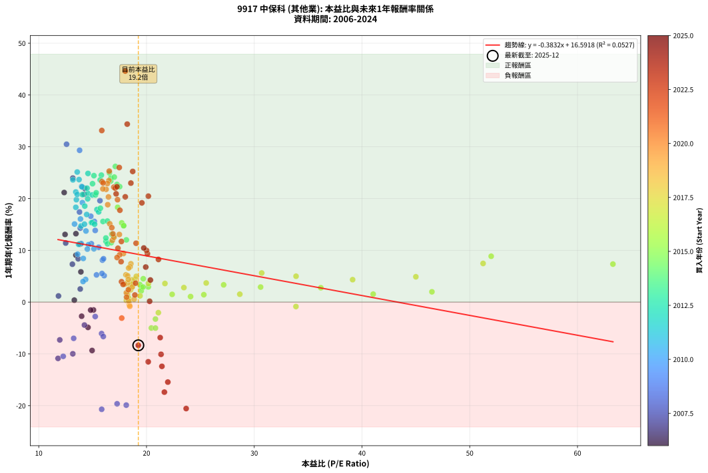
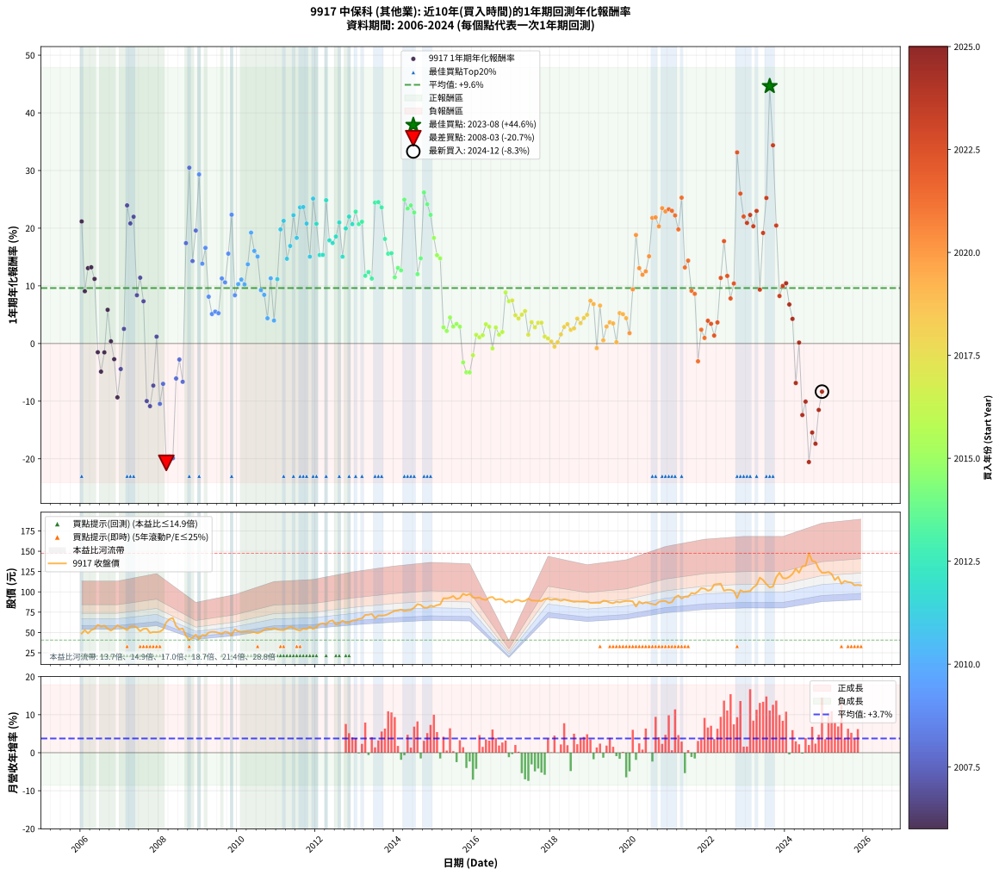

# 9917 中保科 - 本益比與未來報酬率分析

!!! info "報告資訊"
    - **股票代號**: 9917
    - **公司名稱**: 中保科
    - **產業別**: 其他業
    - **分析期間**: 2006-2024 (228 個數據點)
    - **資料來源**: Type 12 (ShowMonthlyK_ChartFlow) 月收盤價與本益比
    - **報酬率口徑**: 含現金股利 (簡化: 年度合計，假設每年7/1入帳)
    - **報告生成時間**: 2026-01-05 01:19:17 CST

## 📈 視覺化圖表

### 圖表1: 本益比 vs 未來報酬率關係

*圖表1：9917 中保科 本益比與1年期未來報酬率關係 (2006-2024)*

### 圖表2: 歷年買入時點的1年期實際報酬率

*圖表2：9917 中保科 歷年買入時點的1年期實際報酬率 (2006-2024)*

## 📍 買點訊號說明

本報告提供兩種買點提示訊號（顯示於圖表2的股價子圖中）：

### ▲ 小綠色三角形（回測驗證）
- **計算方式**: 使用全部歷史資料計算本益比第25百分位數
- **用途**: 事後驗證，顯示歷史上哪些時點確實為低估區
- **限制**: 當下無法判斷，僅供回測參考
- **特性**: 後見之明（Look-Ahead Bias）

### ▲ 小橘色三角形（即時訊號）
- **計算方式**: 使用截至當月的過去5年資料計算本益比第25百分位數
- **用途**: 實際投資決策，當時即可判斷
- **優勢**: 可操作性強，符合實務需求
- **特性**: 無後見之明，滾動窗口計算

!!! tip "如何使用兩種訊號"
    - **綠色▲** 幫助理解歷史估值機會，驗證策略有效性
    - **橘色▲** 可作為實際買進參考，但仍需搭配基本面分析
    - 兩種訊號重疊時，表示即時判斷與事後驗證一致，信心度較高
    - 僅有綠色▲時，表示當時無法判斷（需要未來資料才能確認）
    - 僅有橘色▲時，表示即時判斷為買點，但事後可能不是最佳時機

## 📊 估值分析摘要

| 指標 | 數值 |
|:---:|:---:|
| **目前本益比** (2024-12) | **19.24 倍** |
| **歷史平均本益比** | 18.19 倍 |
| **估值水準** | 🟡 合理範圍 |
| **預期1年年化報酬率** | **+9.22%** |
| **歷史平均報酬率** | +9.62% |
| **相關係數 (R²)** | 0.0527 |
| **趨勢線斜率** | -0.3832 |

!!! abstract "核心洞察"
    目前本益比接近歷史平均，預期報酬率符合長期趨勢

    根據歷史數據回測，9917 中保科 在目前本益比 **19.2倍** 的估值水準下，
    預期未來1年年化報酬率約為 **+9.2%**。

    **重要提醒**: 本分析基於歷史數據統計，實際報酬率會受到公司基本面變化、產業趨勢、
    總體經濟環境等多重因素影響。R² = 0.05 表示本益比可解釋約 5.3% 的報酬率變異。

## 📈 歷史估值統計

### 最佳買點 (最高報酬率)

| 項目 | 數值 |
|:---:|:---:|
| 起始時間 | 2023-08 |
| 當時本益比 | 18.03 倍 |
| 起始價格 | 105.5 元 |
| 1年後價格 | 147.5 元 |
| **1年年化報酬率** | **+44.63%** |

### 最差買點 (最低報酬率)

| 項目 | 數值 |
|:---:|:---:|
| 起始時間 | 2008-03 |
| 當時本益比 | 15.84 倍 |
| 起始價格 | 62.6 元 |
| 1年後價格 | 46.1 元 |
| **1年年化報酬率** | **-20.70%** |

## 🎯 投資啟示

### 本益比與報酬率關係

趨勢線方程式: **y = -0.3832x + 16.5918**

!!! note "負相關"
    本益比與未來報酬率呈現負相關。較低的本益比通常帶來較高的未來報酬率，
    但相關性不算非常強。**估值仍是重要參考指標之一**。

### 估值區間建議

基於歷史數據分析:

- **🟢 低估區** (P/E < 14.6): 預期報酬率較高，可考慮增加持股
- **🟡 合理區** (P/E 14.6-21.8): 預期報酬率符合長期趨勢，正常持有
- **🔴 高估區** (P/E > 21.8): 預期報酬率較低，可考慮減碼或觀望

!!! danger "風險提示"
    - 過去表現不代表未來結果
    - 本分析假設公司基本面無重大結構性變化
    - 產業環境劇變可能使歷史規律失效
    - 應結合公司財報、產業趨勢、總體經濟等多重因素綜合判斷

!!! success "長期投資觀點"
    歷史數據顯示，在合理或低估的估值水準買入並長期持有，
    往往能獲得較佳的投資報酬。**耐心等待好價格**是價值投資的核心原則。

## 📊 數據品質

- **資料來源**: GoodInfo.tw Type 12 (ShowMonthlyK_ChartFlow)
- **資料頻率**: 月度收盤價與本益比
- **回測期間**: 2006-2024
- **數據點數量**: 228 個 (每個點代表一次1年期回測)

### 計算方法說明

1. **1年期年化報酬率**:
   - 對每個歷史時點，計算其後1年的實際投資報酬率
   - 期末價值(不含股利): 期末價格
   - 期末價值(含現金股利): 期末價格 + 持有期間內的現金股利合計 (簡化: 年度合計，假設每年7/1入帳)
   - 公式: 年化報酬率 = [(期末價值/期初價格)^(1/年數) - 1] × 100%

2. **本益比 (P/E Ratio)**:
   - 使用當時的月收盤價與EPS計算
   - 資料來源: Type 12 月度河流圖本益比數據

3. **趨勢線 (Linear Regression)**:
   - 使用最小平方法擬合線性趨勢線
   - R²值衡量本益比對報酬率的解釋能力

---

*本報告由 Stock Analysis System v1.9.0 自動生成*
*數據更新時間: 2026-01-05 01:19:17 CST*

## 📋 月度回測明細表

（每一列對應時間線圖中的一個買入點；可用來對照 SVG 圖上的每個點。）

| 買入月份 | 賣出月份 | 回測期限_年 | 實際持有年數 | 買入本益比_倍 | 買入收盤價_元 | 賣出收盤價_元 | 現金股利合計_元 | 總報酬率_pct | 年化報酬率_pct |
| --- | --- | --- | --- | --- | --- | --- | --- | --- | --- |
| 2006-01 | 2007-01 | 1 | 0.999 | 12.36 | 48.70 | 56.50 | 2.50 | +21.15 | +21.17 |
| 2006-02 | 2007-02 | 1 | 0.999 | 13.45 | 53.00 | 55.30 | 2.50 | +9.06 | +9.06 |
| 2006-03 | 2007-03 | 1 | 0.999 | 12.44 | 49.00 | 52.90 | 2.50 | +13.06 | +13.07 |
| 2006-04 | 2007-04 | 1 | 0.999 | 13.45 | 53.00 | 57.50 | 2.50 | +13.21 | +13.22 |
| 2006-05 | 2007-05 | 1 | 0.999 | 13.83 | 54.50 | 58.10 | 2.50 | +11.19 | +11.20 |
| 2006-06 | 2007-06 | 1 | 0.999 | 15.08 | 59.40 | 56.00 | 2.50 | -1.52 | -1.52 |
| 2006-07 | 2007-07 | 1 | 0.999 | 14.57 | 57.40 | 51.60 | 3.00 | -4.88 | -4.88 |
| 2006-08 | 2007-08 | 1 | 0.999 | 14.82 | 58.40 | 54.50 | 3.00 | -1.54 | -1.54 |
| 2006-09 | 2007-09 | 1 | 0.999 | 13.91 | 54.80 | 55.00 | 3.00 | +5.84 | +5.84 |
| 2006-10 | 2007-10 | 1 | 0.999 | 13.30 | 52.40 | 49.60 | 3.00 | +0.38 | +0.38 |
| 2006-11 | 2007-11 | 1 | 0.999 | 13.98 | 55.10 | 50.60 | 3.00 | -2.72 | -2.72 |
| 2006-12 | 2007-12 | 1 | 0.999 | 14.95 | 58.90 | 50.40 | 3.00 | -9.34 | -9.34 |
| 2007-01 | 2008-01 | 1 | 0.999 | 14.24 | 56.50 | 51.00 | 3.00 | -4.42 | -4.43 |
| 2007-02 | 2008-02 | 1 | 0.999 | 13.85 | 55.30 | 53.70 | 3.00 | +2.53 | +2.53 |
| 2007-03 | 2008-03 | 1 | 1.002 | 13.16 | 52.90 | 62.60 | 3.00 | +24.01 | +23.95 |
| 2007-04 | 2008-04 | 1 | 1.002 | 14.21 | 57.50 | 66.50 | 3.00 | +20.87 | +20.82 |
| 2007-05 | 2008-05 | 1 | 1.002 | 14.26 | 58.10 | 67.90 | 3.00 | +22.03 | +21.98 |
| 2007-06 | 2008-06 | 1 | 1.002 | 13.66 | 56.00 | 57.70 | 3.00 | +8.39 | +8.37 |
| 2007-07 | 2008-07 | 1 | 1.002 | 12.50 | 51.60 | 54.00 | 3.50 | +11.43 | +11.41 |
| 2007-08 | 2008-08 | 1 | 1.002 | 13.12 | 54.50 | 55.00 | 3.50 | +7.34 | +7.32 |
| 2007-09 | 2008-09 | 1 | 1.002 | 13.16 | 55.00 | 46.00 | 3.50 | -10.00 | -9.98 |
| 2007-10 | 2008-10 | 1 | 1.002 | 11.79 | 49.60 | 40.70 | 3.50 | -10.89 | -10.87 |
| 2007-11 | 2008-11 | 1 | 1.002 | 11.95 | 50.60 | 43.40 | 3.50 | -7.31 | -7.30 |
| 2007-12 | 2008-12 | 1 | 1.002 | 11.83 | 50.40 | 47.50 | 3.50 | +1.19 | +1.19 |
| 2008-01 | 2009-01 | 1 | 1.002 | 12.27 | 51.00 | 42.15 | 3.50 | -10.49 | -10.47 |
| 2008-02 | 2009-03 | 1 | 1.081 | 13.24 | 53.70 | 46.15 | 3.50 | -7.54 | -6.99 |
| 2008-03 | 2009-03 | 1 | 0.999 | 15.84 | 62.60 | 46.15 | 3.50 | -20.69 | -20.70 |
| 2008-04 | 2009-04 | 1 | 0.999 | 17.27 | 66.50 | 49.95 | 3.50 | -19.62 | -19.64 |
| 2008-05 | 2009-05 | 1 | 0.999 | 18.12 | 67.90 | 50.90 | 3.50 | -19.88 | -19.89 |
| 2008-06 | 2009-06 | 1 | 0.999 | 15.83 | 57.70 | 50.70 | 3.50 | -6.07 | -6.07 |
| 2008-07 | 2009-07 | 1 | 0.999 | 15.24 | 54.00 | 49.50 | 3.00 | -2.78 | -2.78 |
| 2008-08 | 2009-08 | 1 | 0.999 | 15.99 | 55.00 | 48.35 | 3.00 | -6.64 | -6.64 |
| 2008-09 | 2009-09 | 1 | 0.999 | 13.78 | 46.00 | 51.00 | 3.00 | +17.39 | +17.40 |
| 2008-10 | 2009-10 | 1 | 0.999 | 12.58 | 40.70 | 50.10 | 3.00 | +30.47 | +30.49 |
| 2008-11 | 2009-11 | 1 | 0.999 | 13.85 | 43.40 | 46.60 | 3.00 | +14.29 | +14.30 |
| 2008-12 | 2009-12 | 1 | 0.999 | 15.68 | 47.50 | 53.80 | 3.00 | +19.58 | +19.59 |
| 2009-01 | 2010-01 | 1 | 0.999 | 13.79 | 42.15 | 51.50 | 3.00 | +29.30 | +29.32 |
| 2009-02 | 2010-02 | 1 | 0.999 | 15.24 | 47.00 | 50.50 | 3.00 | +13.83 | +13.84 |
| 2009-03 | 2010-03 | 1 | 0.999 | 14.83 | 46.15 | 50.80 | 3.00 | +16.58 | +16.59 |
| 2009-04 | 2010-04 | 1 | 0.999 | 15.91 | 49.95 | 51.00 | 3.00 | +8.11 | +8.11 |
| 2009-05 | 2010-05 | 1 | 0.999 | 16.07 | 50.90 | 50.50 | 3.00 | +5.11 | +5.11 |
| 2009-06 | 2010-06 | 1 | 0.999 | 15.87 | 50.70 | 50.50 | 3.00 | +5.52 | +5.53 |
| 2009-07 | 2010-07 | 1 | 0.999 | 15.36 | 49.50 | 49.10 | 3.00 | +5.25 | +5.26 |
| 2009-08 | 2010-08 | 1 | 0.999 | 14.88 | 48.35 | 50.80 | 3.00 | +11.27 | +11.28 |
| 2009-09 | 2010-09 | 1 | 0.999 | 15.56 | 51.00 | 53.40 | 3.00 | +10.59 | +10.60 |
| 2009-10 | 2010-10 | 1 | 0.999 | 15.16 | 50.10 | 54.90 | 3.00 | +15.57 | +15.58 |
| 2009-11 | 2010-11 | 1 | 0.999 | 13.98 | 46.60 | 54.00 | 3.00 | +22.32 | +22.33 |
| 2009-12 | 2010-12 | 1 | 0.999 | 16.01 | 53.80 | 55.30 | 3.00 | +8.36 | +8.37 |
| 2010-01 | 2011-01 | 1 | 0.999 | 15.12 | 51.50 | 53.80 | 3.00 | +10.29 | +10.30 |
| 2010-02 | 2011-02 | 1 | 0.999 | 14.62 | 50.50 | 53.10 | 3.00 | +11.09 | +11.10 |
| 2010-03 | 2011-03 | 1 | 0.999 | 14.51 | 50.80 | 53.00 | 3.00 | +10.24 | +10.24 |
| 2010-04 | 2011-04 | 1 | 0.999 | 14.38 | 51.00 | 55.00 | 3.00 | +13.73 | +13.74 |
| 2010-05 | 2011-05 | 1 | 0.999 | 14.05 | 50.50 | 57.20 | 3.00 | +19.21 | +19.22 |
| 2010-06 | 2011-06 | 1 | 0.999 | 13.87 | 50.50 | 55.60 | 3.00 | +16.04 | +16.05 |
| 2010-07 | 2011-07 | 1 | 0.999 | 13.32 | 49.10 | 53.40 | 3.10 | +15.07 | +15.08 |
| 2010-08 | 2011-08 | 1 | 0.999 | 13.61 | 50.80 | 52.40 | 3.10 | +9.25 | +9.26 |
| 2010-09 | 2011-09 | 1 | 0.999 | 14.13 | 53.40 | 54.80 | 3.10 | +8.43 | +8.43 |
| 2010-10 | 2011-10 | 1 | 0.999 | 14.35 | 54.90 | 54.20 | 3.10 | +4.37 | +4.37 |
| 2010-11 | 2011-11 | 1 | 0.999 | 13.94 | 54.00 | 57.00 | 3.10 | +11.30 | +11.30 |
| 2010-12 | 2011-12 | 1 | 0.999 | 14.11 | 55.30 | 54.40 | 3.10 | +3.98 | +3.98 |
| 2011-01 | 2012-01 | 1 | 0.999 | 13.70 | 53.80 | 56.70 | 3.10 | +11.15 | +11.16 |
| 2011-02 | 2012-02 | 1 | 0.999 | 13.49 | 53.10 | 60.50 | 3.10 | +19.77 | +19.79 |
| 2011-03 | 2012-03 | 1 | 1.002 | 13.44 | 53.00 | 61.20 | 3.10 | +21.32 | +21.27 |
| 2011-04 | 2012-04 | 1 | 1.002 | 13.92 | 55.00 | 60.00 | 3.10 | +14.73 | +14.69 |
| 2011-05 | 2012-05 | 1 | 1.002 | 14.45 | 57.20 | 63.80 | 3.10 | +16.96 | +16.92 |
| 2011-06 | 2012-06 | 1 | 1.002 | 14.02 | 55.60 | 64.90 | 3.10 | +22.30 | +22.25 |
| 2011-07 | 2012-07 | 1 | 1.002 | 13.44 | 53.40 | 59.90 | 3.30 | +18.35 | +18.31 |
| 2011-08 | 2012-08 | 1 | 1.002 | 13.17 | 52.40 | 61.50 | 3.30 | +23.66 | +23.61 |
| 2011-09 | 2012-09 | 1 | 1.002 | 13.74 | 54.80 | 64.50 | 3.30 | +23.72 | +23.67 |
| 2011-10 | 2012-10 | 1 | 1.002 | 13.57 | 54.20 | 62.20 | 3.30 | +20.85 | +20.80 |
| 2011-11 | 2012-11 | 1 | 1.002 | 14.24 | 57.00 | 62.30 | 3.30 | +15.09 | +15.05 |
| 2011-12 | 2012-12 | 1 | 1.002 | 13.57 | 54.40 | 64.80 | 3.30 | +25.18 | +25.13 |
| 2012-01 | 2013-01 | 1 | 1.002 | 14.05 | 56.70 | 65.20 | 3.30 | +20.81 | +20.76 |
| 2012-02 | 2013-03 | 1 | 1.081 | 14.89 | 60.50 | 67.30 | 3.30 | +16.69 | +15.35 |
| 2012-03 | 2013-03 | 1 | 0.999 | 14.96 | 61.20 | 67.30 | 3.30 | +15.36 | +15.37 |
| 2012-04 | 2013-04 | 1 | 0.999 | 14.57 | 60.00 | 71.60 | 3.30 | +24.83 | +24.85 |
| 2012-05 | 2013-05 | 1 | 0.999 | 15.40 | 63.80 | 71.90 | 3.30 | +17.87 | +17.88 |
| 2012-06 | 2013-06 | 1 | 0.999 | 15.56 | 64.90 | 72.90 | 3.30 | +17.41 | +17.42 |
| 2012-07 | 2013-07 | 1 | 0.999 | 14.27 | 59.90 | 67.60 | 3.40 | +18.53 | +18.54 |
| 2012-08 | 2013-08 | 1 | 0.999 | 14.56 | 61.50 | 71.00 | 3.40 | +20.98 | +20.99 |
| 2012-09 | 2013-09 | 1 | 0.999 | 15.18 | 64.50 | 70.80 | 3.40 | +15.04 | +15.05 |
| 2012-10 | 2013-10 | 1 | 0.999 | 14.54 | 62.20 | 71.20 | 3.40 | +19.94 | +19.95 |
| 2012-11 | 2013-11 | 1 | 0.999 | 14.48 | 62.30 | 72.60 | 3.40 | +21.99 | +22.01 |
| 2012-12 | 2013-12 | 1 | 0.999 | 14.97 | 64.80 | 74.80 | 3.40 | +20.68 | +20.69 |
| 2013-01 | 2014-01 | 1 | 0.999 | 14.99 | 65.20 | 76.70 | 3.40 | +22.85 | +22.87 |
| 2013-02 | 2014-02 | 1 | 0.999 | 15.26 | 66.70 | 77.10 | 3.40 | +20.69 | +20.71 |
| 2013-03 | 2014-03 | 1 | 0.999 | 15.33 | 67.30 | 78.10 | 3.40 | +21.10 | +21.12 |
| 2013-04 | 2014-04 | 1 | 0.999 | 16.24 | 71.60 | 76.60 | 3.40 | +11.73 | +11.74 |
| 2013-05 | 2014-05 | 1 | 0.999 | 16.23 | 71.90 | 77.40 | 3.40 | +12.38 | +12.39 |
| 2013-06 | 2014-06 | 1 | 0.999 | 16.38 | 72.90 | 77.70 | 3.40 | +11.25 | +11.26 |
| 2013-07 | 2014-07 | 1 | 0.999 | 15.12 | 67.60 | 80.60 | 3.50 | +24.41 | +24.43 |
| 2013-08 | 2014-08 | 1 | 0.999 | 15.81 | 71.00 | 84.90 | 3.50 | +24.51 | +24.53 |
| 2013-09 | 2014-09 | 1 | 0.999 | 15.70 | 70.80 | 84.00 | 3.50 | +23.59 | +23.61 |
| 2013-10 | 2014-10 | 1 | 0.999 | 15.72 | 71.20 | 80.60 | 3.50 | +18.12 | +18.13 |
| 2013-11 | 2014-11 | 1 | 0.999 | 15.96 | 72.60 | 80.40 | 3.50 | +15.56 | +15.58 |
| 2013-12 | 2014-12 | 1 | 0.999 | 16.37 | 74.80 | 83.00 | 3.50 | +15.64 | +15.65 |
| 2014-01 | 2015-01 | 1 | 0.999 | 16.73 | 76.70 | 82.00 | 3.50 | +11.47 | +11.48 |
| 2014-02 | 2015-02 | 1 | 0.999 | 16.77 | 77.10 | 83.70 | 3.50 | +13.10 | +13.11 |
| 2014-03 | 2015-03 | 1 | 0.999 | 16.93 | 78.10 | 84.50 | 3.50 | +12.68 | +12.69 |
| 2014-04 | 2015-04 | 1 | 0.999 | 16.56 | 76.60 | 92.20 | 3.50 | +24.93 | +24.95 |
| 2014-05 | 2015-05 | 1 | 0.999 | 16.68 | 77.40 | 92.00 | 3.50 | +23.39 | +23.40 |
| 2014-06 | 2015-06 | 1 | 0.999 | 16.69 | 77.70 | 92.80 | 3.50 | +23.94 | +23.96 |
| 2014-07 | 2015-07 | 1 | 0.999 | 17.26 | 80.60 | 94.90 | 4.00 | +22.70 | +22.72 |
| 2014-08 | 2015-08 | 1 | 0.999 | 18.13 | 84.90 | 91.10 | 4.00 | +12.01 | +12.02 |
| 2014-09 | 2015-09 | 1 | 0.999 | 17.88 | 84.00 | 92.40 | 4.00 | +14.76 | +14.77 |
| 2014-10 | 2015-10 | 1 | 0.999 | 17.11 | 80.60 | 97.70 | 4.00 | +26.18 | +26.20 |
| 2014-11 | 2015-11 | 1 | 0.999 | 17.01 | 80.40 | 95.80 | 4.00 | +24.13 | +24.15 |
| 2014-12 | 2015-12 | 1 | 0.999 | 17.51 | 83.00 | 97.50 | 4.00 | +22.29 | +22.31 |
| 2015-01 | 2016-01 | 1 | 0.999 | 17.32 | 82.00 | 93.00 | 4.00 | +18.29 | +18.31 |
| 2015-02 | 2016-02 | 1 | 0.999 | 17.70 | 83.70 | 92.50 | 4.00 | +15.29 | +15.30 |
| 2015-03 | 2016-03 | 1 | 1.002 | 17.88 | 84.50 | 93.00 | 4.00 | +14.79 | +14.76 |
| 2015-04 | 2016-04 | 1 | 1.002 | 19.53 | 92.20 | 90.80 | 4.00 | +2.82 | +2.81 |
| 2015-05 | 2016-05 | 1 | 1.002 | 19.51 | 92.00 | 90.00 | 4.00 | +2.17 | +2.17 |
| 2015-06 | 2016-06 | 1 | 1.002 | 19.70 | 92.80 | 93.00 | 4.00 | +4.53 | +4.52 |
| 2015-07 | 2016-07 | 1 | 1.002 | 20.17 | 94.90 | 93.70 | 4.00 | +2.95 | +2.94 |
| 2015-08 | 2016-08 | 1 | 1.002 | 19.38 | 91.10 | 90.20 | 4.00 | +3.40 | +3.40 |
| 2015-09 | 2016-09 | 1 | 1.002 | 19.68 | 92.40 | 91.10 | 4.00 | +2.92 | +2.92 |
| 2015-10 | 2016-10 | 1 | 1.002 | 20.83 | 97.70 | 90.50 | 4.00 | -3.28 | -3.27 |
| 2015-11 | 2016-11 | 1 | 1.002 | 20.45 | 95.80 | 87.00 | 4.00 | -5.01 | -5.00 |
| 2015-12 | 2016-12 | 1 | 1.002 | 20.83 | 97.50 | 88.60 | 4.00 | -5.03 | -5.02 |
| 2016-01 | 2017-01 | 1 | 1.002 | 21.10 | 93.00 | 87.10 | 4.00 | -2.04 | -2.04 |
| 2016-02 | 2017-03 | 1 | 1.081 | 22.38 | 92.50 | 90.00 | 4.00 | +1.62 | +1.50 |
| 2016-03 | 2017-03 | 1 | 0.999 | 24.09 | 93.00 | 90.00 | 4.00 | +1.08 | +1.08 |
| 2016-04 | 2017-04 | 1 | 0.999 | 25.32 | 90.80 | 88.10 | 4.00 | +1.43 | +1.43 |
| 2016-05 | 2017-05 | 1 | 0.999 | 27.16 | 90.00 | 89.00 | 4.00 | +3.33 | +3.34 |
| 2016-06 | 2017-06 | 1 | 0.999 | 30.59 | 93.00 | 91.70 | 4.00 | +2.90 | +2.91 |
| 2016-07 | 2017-07 | 1 | 0.999 | 33.87 | 93.70 | 89.40 | 3.50 | -0.85 | -0.85 |
| 2016-08 | 2017-08 | 1 | 0.999 | 36.18 | 90.20 | 89.20 | 3.50 | +2.77 | +2.77 |
| 2016-09 | 2017-09 | 1 | 0.999 | 41.04 | 91.10 | 89.00 | 3.50 | +1.54 | +1.54 |
| 2016-10 | 2017-10 | 1 | 0.999 | 46.49 | 90.50 | 88.80 | 3.50 | +1.99 | +1.99 |
| 2016-11 | 2017-11 | 1 | 0.999 | 51.99 | 87.00 | 91.20 | 3.50 | +8.85 | +8.86 |
| 2016-12 | 2017-12 | 1 | 0.999 | 63.29 | 88.60 | 91.60 | 3.50 | +7.34 | +7.34 |
| 2017-01 | 2018-01 | 1 | 0.999 | 51.24 | 87.10 | 90.10 | 3.50 | +7.46 | +7.47 |
| 2017-02 | 2018-02 | 1 | 0.999 | 45.00 | 90.00 | 90.90 | 3.50 | +4.89 | +4.89 |
| 2017-03 | 2018-03 | 1 | 0.999 | 39.13 | 90.00 | 90.40 | 3.50 | +4.33 | +4.34 |
| 2017-04 | 2018-04 | 1 | 0.999 | 33.88 | 88.10 | 89.00 | 3.50 | +4.99 | +5.00 |
| 2017-05 | 2018-05 | 1 | 0.999 | 30.69 | 89.00 | 90.50 | 3.50 | +5.62 | +5.62 |
| 2017-06 | 2018-06 | 1 | 0.999 | 28.66 | 91.70 | 89.60 | 3.50 | +1.53 | +1.53 |
| 2017-07 | 2018-07 | 1 | 0.999 | 25.54 | 89.40 | 88.70 | 4.00 | +3.69 | +3.69 |
| 2017-08 | 2018-08 | 1 | 0.999 | 23.47 | 89.20 | 87.70 | 4.00 | +2.80 | +2.80 |
| 2017-09 | 2018-09 | 1 | 0.999 | 21.71 | 89.00 | 88.20 | 4.00 | +3.60 | +3.60 |
| 2017-10 | 2018-10 | 1 | 0.999 | 20.18 | 88.80 | 88.00 | 4.00 | +3.60 | +3.61 |
| 2017-11 | 2018-11 | 1 | 0.999 | 19.40 | 91.20 | 88.30 | 4.00 | +1.21 | +1.21 |
| 2017-12 | 2018-12 | 1 | 0.999 | 18.32 | 91.60 | 88.40 | 4.00 | +0.87 | +0.87 |
| 2018-01 | 2019-01 | 1 | 0.999 | 18.13 | 90.10 | 86.40 | 4.00 | +0.33 | +0.33 |
| 2018-02 | 2019-02 | 1 | 0.999 | 18.40 | 90.90 | 86.40 | 4.00 | -0.55 | -0.55 |
| 2018-03 | 2019-03 | 1 | 0.999 | 18.41 | 90.40 | 86.60 | 4.00 | +0.22 | +0.22 |
| 2018-04 | 2019-04 | 1 | 0.999 | 18.24 | 89.00 | 86.40 | 4.00 | +1.57 | +1.57 |
| 2018-05 | 2019-05 | 1 | 0.999 | 18.66 | 90.50 | 89.10 | 4.00 | +2.87 | +2.87 |
| 2018-06 | 2019-06 | 1 | 0.999 | 18.59 | 89.60 | 88.60 | 4.00 | +3.35 | +3.35 |
| 2018-07 | 2019-07 | 1 | 0.999 | 18.52 | 88.70 | 86.80 | 4.00 | +2.37 | +2.37 |
| 2018-08 | 2019-08 | 1 | 0.999 | 18.42 | 87.70 | 86.00 | 4.00 | +2.62 | +2.62 |
| 2018-09 | 2019-09 | 1 | 0.999 | 18.65 | 88.20 | 88.00 | 4.00 | +4.31 | +4.31 |
| 2018-10 | 2019-10 | 1 | 0.999 | 18.72 | 88.00 | 87.10 | 4.00 | +3.52 | +3.53 |
| 2018-11 | 2019-11 | 1 | 0.999 | 18.91 | 88.30 | 88.20 | 4.00 | +4.42 | +4.42 |
| 2018-12 | 2019-12 | 1 | 0.999 | 19.05 | 88.40 | 88.80 | 4.00 | +4.98 | +4.98 |
| 2019-01 | 2020-01 | 1 | 0.999 | 18.55 | 86.40 | 88.80 | 4.00 | +7.41 | +7.41 |
| 2019-02 | 2020-02 | 1 | 0.999 | 18.48 | 86.40 | 88.30 | 4.00 | +6.83 | +6.83 |
| 2019-03 | 2020-03 | 1 | 1.002 | 18.45 | 86.60 | 81.90 | 4.00 | -0.81 | -0.81 |
| 2019-04 | 2020-04 | 1 | 1.002 | 18.34 | 86.40 | 88.10 | 4.00 | +6.60 | +6.58 |
| 2019-05 | 2020-05 | 1 | 1.002 | 18.85 | 89.10 | 85.60 | 4.00 | +0.56 | +0.56 |
| 2019-06 | 2020-06 | 1 | 1.002 | 18.67 | 88.60 | 87.20 | 4.00 | +2.93 | +2.93 |
| 2019-07 | 2020-07 | 1 | 1.002 | 18.23 | 86.80 | 86.00 | 4.00 | +3.69 | +3.68 |
| 2019-08 | 2020-08 | 1 | 1.002 | 17.99 | 86.00 | 85.00 | 4.00 | +3.49 | +3.48 |
| 2019-09 | 2020-09 | 1 | 1.002 | 18.34 | 88.00 | 84.20 | 4.00 | +0.23 | +0.23 |
| 2019-10 | 2020-10 | 1 | 1.002 | 18.09 | 87.10 | 87.70 | 4.00 | +5.28 | +5.27 |
| 2019-11 | 2020-11 | 1 | 1.002 | 18.25 | 88.20 | 88.70 | 4.00 | +5.10 | +5.09 |
| 2019-12 | 2020-12 | 1 | 1.002 | 18.31 | 88.80 | 88.70 | 4.00 | +4.39 | +4.38 |
| 2020-01 | 2021-01 | 1 | 1.002 | 18.13 | 88.80 | 86.40 | 4.00 | +1.80 | +1.80 |
| 2020-02 | 2021-03 | 1 | 1.081 | 17.86 | 88.30 | 93.30 | 4.00 | +10.19 | +9.39 |
| 2020-03 | 2021-03 | 1 | 0.999 | 16.40 | 81.90 | 93.30 | 4.00 | +18.80 | +18.82 |
| 2020-04 | 2021-04 | 1 | 0.999 | 17.48 | 88.10 | 95.60 | 4.00 | +13.05 | +13.06 |
| 2020-05 | 2021-05 | 1 | 0.999 | 16.83 | 85.60 | 91.80 | 4.00 | +11.92 | +11.92 |
| 2020-06 | 2021-06 | 1 | 0.999 | 16.98 | 87.20 | 94.10 | 4.00 | +12.50 | +12.51 |
| 2020-07 | 2021-07 | 1 | 0.999 | 16.59 | 86.00 | 94.00 | 5.00 | +15.12 | +15.13 |
| 2020-08 | 2021-08 | 1 | 0.999 | 16.25 | 85.00 | 98.50 | 5.00 | +21.76 | +21.78 |
| 2020-09 | 2021-09 | 1 | 0.999 | 15.95 | 84.20 | 97.60 | 5.00 | +21.85 | +21.87 |
| 2020-10 | 2021-10 | 1 | 0.999 | 16.47 | 87.70 | 100.50 | 5.00 | +20.30 | +20.31 |
| 2020-11 | 2021-11 | 1 | 0.999 | 16.51 | 88.70 | 104.50 | 5.00 | +23.45 | +23.47 |
| 2020-12 | 2021-12 | 1 | 0.999 | 16.37 | 88.70 | 104.00 | 5.00 | +22.89 | +22.90 |
| 2021-01 | 2022-01 | 1 | 0.999 | 15.87 | 86.40 | 101.50 | 5.00 | +23.26 | +23.28 |
| 2021-02 | 2022-02 | 1 | 0.999 | 15.97 | 87.40 | 102.50 | 5.00 | +23.00 | +23.02 |
| 2021-03 | 2022-03 | 1 | 0.999 | 16.97 | 93.30 | 109.00 | 5.00 | +22.19 | +22.20 |
| 2021-04 | 2022-04 | 1 | 0.999 | 17.31 | 95.60 | 109.50 | 5.00 | +19.77 | +19.78 |
| 2021-05 | 2022-05 | 1 | 0.999 | 16.54 | 91.80 | 110.00 | 5.00 | +25.27 | +25.29 |
| 2021-06 | 2022-06 | 1 | 0.999 | 16.88 | 94.10 | 101.50 | 5.00 | +13.18 | +13.19 |
| 2021-07 | 2022-07 | 1 | 0.999 | 16.78 | 94.00 | 102.50 | 5.00 | +14.36 | +14.37 |
| 2021-08 | 2022-08 | 1 | 0.999 | 17.51 | 98.50 | 102.50 | 5.00 | +9.14 | +9.14 |
| 2021-09 | 2022-09 | 1 | 0.999 | 17.27 | 97.60 | 101.00 | 5.00 | +8.61 | +8.61 |
| 2021-10 | 2022-10 | 1 | 0.999 | 17.70 | 100.50 | 92.40 | 5.00 | -3.08 | -3.09 |
| 2021-11 | 2022-11 | 1 | 0.999 | 18.32 | 104.50 | 102.00 | 5.00 | +2.39 | +2.39 |
| 2021-12 | 2022-12 | 1 | 0.999 | 18.15 | 104.00 | 100.00 | 5.00 | +0.96 | +0.96 |
| 2022-01 | 2023-01 | 1 | 0.999 | 17.68 | 101.50 | 100.50 | 5.00 | +3.94 | +3.94 |
| 2022-02 | 2023-02 | 1 | 0.999 | 17.83 | 102.50 | 101.00 | 5.00 | +3.41 | +3.42 |
| 2022-03 | 2023-03 | 1 | 0.999 | 18.92 | 109.00 | 105.50 | 5.00 | +1.38 | +1.38 |
| 2022-04 | 2023-04 | 1 | 0.999 | 18.98 | 109.50 | 108.50 | 5.00 | +3.65 | +3.66 |
| 2022-05 | 2023-05 | 1 | 0.999 | 19.03 | 110.00 | 117.50 | 5.00 | +11.36 | +11.37 |
| 2022-06 | 2023-06 | 1 | 0.999 | 17.53 | 101.50 | 114.50 | 5.00 | +17.73 | +17.75 |
| 2022-07 | 2023-07 | 1 | 0.999 | 17.67 | 102.50 | 109.50 | 5.00 | +11.71 | +11.72 |
| 2022-08 | 2023-08 | 1 | 0.999 | 17.64 | 102.50 | 105.50 | 5.00 | +7.80 | +7.81 |
| 2022-09 | 2023-09 | 1 | 0.999 | 17.35 | 101.00 | 106.50 | 5.00 | +10.40 | +10.40 |
| 2022-10 | 2023-10 | 1 | 0.999 | 15.85 | 92.40 | 118.00 | 5.00 | +33.12 | +33.14 |
| 2022-11 | 2023-11 | 1 | 0.999 | 17.47 | 102.00 | 123.50 | 5.00 | +25.98 | +26.00 |
| 2022-12 | 2023-12 | 1 | 0.999 | 17.09 | 100.00 | 117.00 | 5.00 | +22.00 | +22.02 |
| 2023-01 | 2024-01 | 1 | 0.999 | 17.18 | 100.50 | 116.50 | 5.00 | +20.90 | +20.91 |
| 2023-02 | 2024-02 | 1 | 0.999 | 17.26 | 101.00 | 118.50 | 5.00 | +22.28 | +22.29 |
| 2023-03 | 2024-03 | 1 | 1.002 | 18.03 | 105.50 | 122.00 | 5.00 | +20.38 | +20.33 |
| 2023-04 | 2024-04 | 1 | 1.002 | 18.55 | 108.50 | 128.50 | 5.00 | +23.04 | +22.99 |
| 2023-05 | 2024-05 | 1 | 1.002 | 20.09 | 117.50 | 123.50 | 5.00 | +9.36 | +9.34 |
| 2023-06 | 2024-06 | 1 | 1.002 | 19.57 | 114.50 | 131.50 | 5.00 | +19.21 | +19.17 |
| 2023-07 | 2024-07 | 1 | 1.002 | 18.72 | 109.50 | 132.00 | 5.20 | +25.30 | +25.24 |
| 2023-08 | 2024-08 | 1 | 1.002 | 18.03 | 105.50 | 147.50 | 5.20 | +44.74 | +44.63 |
| 2023-09 | 2024-09 | 1 | 1.002 | 18.21 | 106.50 | 138.00 | 5.20 | +34.46 | +34.38 |
| 2023-10 | 2024-10 | 1 | 1.002 | 20.17 | 118.00 | 137.00 | 5.20 | +20.51 | +20.46 |
| 2023-11 | 2024-11 | 1 | 1.002 | 21.11 | 123.50 | 128.50 | 5.20 | +8.26 | +8.24 |
| 2023-12 | 2024-12 | 1 | 1.002 | 20.00 | 117.00 | 123.50 | 5.20 | +10.00 | +9.98 |
| 2024-01 | 2025-01 | 1 | 1.002 | 19.75 | 116.50 | 123.50 | 5.20 | +10.47 | +10.45 |
| 2024-02 | 2025-03 | 1 | 1.081 | 19.93 | 118.50 | 122.00 | 5.20 | +7.34 | +6.77 |
| 2024-03 | 2025-03 | 1 | 0.999 | 20.36 | 122.00 | 122.00 | 5.20 | +4.26 | +4.27 |
| 2024-04 | 2025-04 | 1 | 0.999 | 21.27 | 128.50 | 114.50 | 5.20 | -6.85 | -6.85 |
| 2024-05 | 2025-05 | 1 | 0.999 | 20.29 | 123.50 | 118.50 | 5.20 | +0.16 | +0.16 |
| 2024-06 | 2025-06 | 1 | 0.999 | 21.43 | 131.50 | 110.00 | 5.20 | -12.40 | -12.40 |
| 2024-07 | 2025-07 | 1 | 0.999 | 21.35 | 132.00 | 113.50 | 5.20 | -10.08 | -10.08 |
| 2024-08 | 2025-08 | 1 | 0.999 | 23.68 | 147.50 | 112.00 | 5.20 | -20.54 | -20.55 |
| 2024-09 | 2025-09 | 1 | 0.999 | 21.98 | 138.00 | 111.50 | 5.20 | -15.43 | -15.44 |
| 2024-10 | 2025-10 | 1 | 0.999 | 21.66 | 137.00 | 108.00 | 5.20 | -17.37 | -17.38 |
| 2024-11 | 2025-11 | 1 | 0.999 | 20.16 | 128.50 | 108.50 | 5.20 | -11.52 | -11.52 |
| 2024-12 | 2025-12 | 1 | 0.999 | 19.24 | 123.50 | 108.00 | 5.20 | -8.34 | -8.35 |
