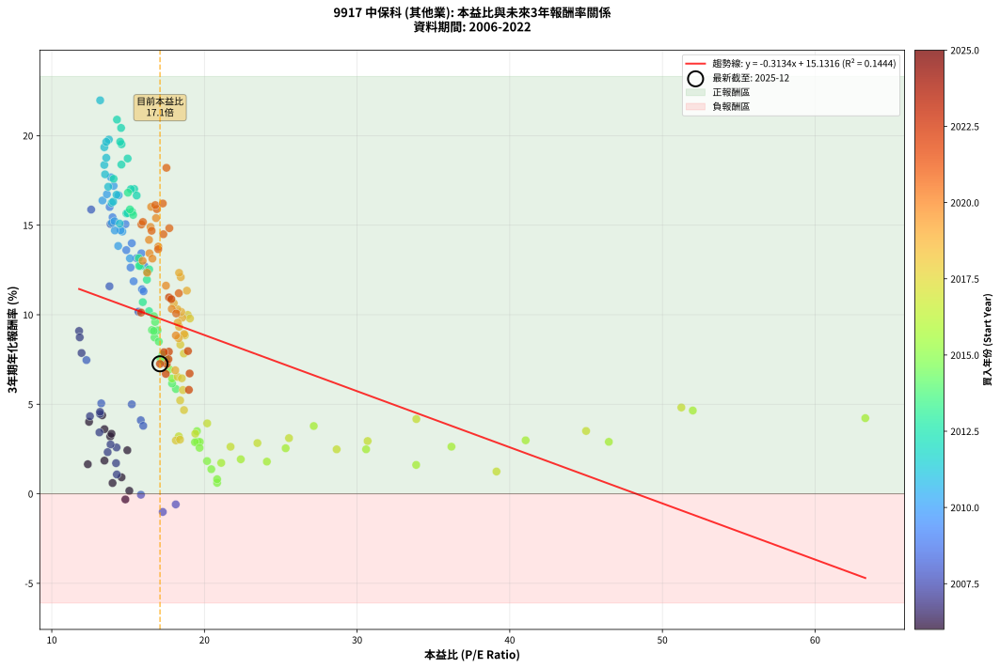
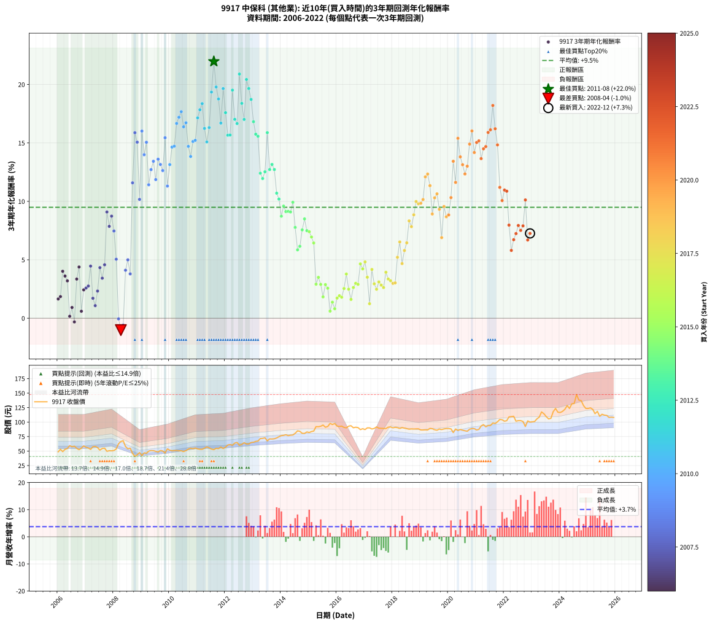

# 9917 中保科 - 本益比與未來報酬率分析

!!! info "報告資訊"
    - **股票代號**: 9917
    - **公司名稱**: 中保科
    - **產業別**: 其他業
    - **分析期間**: 2006-2022 (204 個數據點)
    - **資料來源**: Type 12 (ShowMonthlyK_ChartFlow) 月收盤價與本益比
    - **報酬率口徑**: 含現金股利 (簡化: 年度合計，假設每年7/1入帳)
    - **報告生成時間**: 2026-01-07 19:20:35 CST

## 📈 視覺化圖表

### 圖表1: 本益比 vs 未來報酬率關係

*圖表1：9917 中保科 本益比與3年期未來報酬率關係 (2006-2022)*

### 圖表2: 歷年買入時點的3年期實際報酬率

*圖表2：9917 中保科 歷年買入時點的3年期實際報酬率 (2006-2022)*

## 📍 買點訊號說明

本報告提供兩種買點提示訊號（顯示於圖表2的股價子圖中）：

### ▲ 小綠色三角形（回測驗證）
- **計算方式**: 使用全部歷史資料計算本益比第25百分位數
- **用途**: 事後驗證，顯示歷史上哪些時點確實為低估區
- **限制**: 當下無法判斷，僅供回測參考
- **特性**: 後見之明（Look-Ahead Bias）

### ▲ 小橘色三角形（即時訊號）
- **計算方式**: 使用截至當月的過去5年資料計算本益比第25百分位數
- **用途**: 實際投資決策，當時即可判斷
- **優勢**: 可操作性強，符合實務需求
- **特性**: 無後見之明，滾動窗口計算

!!! tip "如何使用兩種訊號"
    - **綠色▲** 幫助理解歷史估值機會，驗證策略有效性
    - **橘色▲** 可作為實際買進參考，但仍需搭配基本面分析
    - 兩種訊號重疊時，表示即時判斷與事後驗證一致，信心度較高
    - 僅有綠色▲時，表示當時無法判斷（需要未來資料才能確認）
    - 僅有橘色▲時，表示即時判斷為買點，但事後可能不是最佳時機

## 📊 估值分析摘要

| 指標 | 數值 |
|:---:|:---:|
| **目前本益比** (2022-12) | **17.09 倍** |
| **歷史平均本益比** | 17.99 倍 |
| **估值水準** | 🟡 合理範圍 |
| **預期3年年化報酬率** | **+9.78%** |
| **歷史平均報酬率** | +9.49% |
| **相關係數 (R²)** | 0.1444 |
| **趨勢線斜率** | -0.3134 |

!!! abstract "核心洞察"
    目前本益比接近歷史平均，預期報酬率符合長期趨勢

    根據歷史數據回測，9917 中保科 在目前本益比 **17.1倍** 的估值水準下，
    預期未來3年年化報酬率約為 **+9.8%**。

    **重要提醒**: 本分析基於歷史數據統計，實際報酬率會受到公司基本面變化、產業趨勢、
    總體經濟環境等多重因素影響。R² = 0.14 表示本益比可解釋約 14.4% 的報酬率變異。

## 📈 歷史估值統計

### 最佳買點 (最高報酬率)

| 項目 | 數值 |
|:---:|:---:|
| 起始時間 | 2011-08 |
| 當時本益比 | 13.17 倍 |
| 起始價格 | 52.4 元 |
| 3年後價格 | 84.9 元 |
| **3年年化報酬率** | **+21.97%** |

### 最差買點 (最低報酬率)

| 項目 | 數值 |
|:---:|:---:|
| 起始時間 | 2008-04 |
| 當時本益比 | 17.27 倍 |
| 起始價格 | 66.5 元 |
| 3年後價格 | 55.0 元 |
| **3年年化報酬率** | **-1.01%** |

## 🎯 投資啟示

### 本益比與報酬率關係

趨勢線方程式: **y = -0.3134x + 15.1316**

!!! note "負相關"
    本益比與未來報酬率呈現負相關。較低的本益比通常帶來較高的未來報酬率，
    但相關性不算非常強。**估值仍是重要參考指標之一**。

### 估值區間建議

基於歷史數據分析:

- **🟢 低估區** (P/E < 14.4): 預期報酬率較高，可考慮增加持股
- **🟡 合理區** (P/E 14.4-21.6): 預期報酬率符合長期趨勢，正常持有
- **🔴 高估區** (P/E > 21.6): 預期報酬率較低，可考慮減碼或觀望

!!! danger "風險提示"
    - 過去表現不代表未來結果
    - 本分析假設公司基本面無重大結構性變化
    - 產業環境劇變可能使歷史規律失效
    - 應結合公司財報、產業趨勢、總體經濟等多重因素綜合判斷

!!! success "長期投資觀點"
    歷史數據顯示，在合理或低估的估值水準買入並長期持有，
    往往能獲得較佳的投資報酬。**耐心等待好價格**是價值投資的核心原則。

## 📊 數據品質

- **資料來源**: GoodInfo.tw Type 12 (ShowMonthlyK_ChartFlow)
- **資料頻率**: 月度收盤價與本益比
- **回測期間**: 2006-2022
- **數據點數量**: 204 個 (每個點代表一次3年期回測)

### 計算方法說明

1. **3年期年化報酬率**:
   - 對每個歷史時點，計算其後3年的實際投資報酬率
   - 期末價值(不含股利): 期末價格
   - 期末價值(含現金股利): 期末價格 + 持有期間內的現金股利合計 (簡化: 年度合計，假設每年7/1入帳)
   - 公式: 年化報酬率 = [(期末價值/期初價格)^(1/年數) - 1] × 100%

2. **本益比 (P/E Ratio)**:
   - 使用當時的月收盤價與EPS計算
   - 資料來源: Type 12 月度河流圖本益比數據

3. **趨勢線 (Linear Regression)**:
   - 使用最小平方法擬合線性趨勢線
   - R²值衡量本益比對報酬率的解釋能力

---

*本報告由 Stock Analysis System v1.9.0 自動生成*
*數據更新時間: 2026-01-07 19:20:35 CST*

## 📋 月度回測明細表

（每一列對應時間線圖中的一個買入點；可用來對照 SVG 圖上的每個點。）

| 買入月份 | 賣出月份 | 回測期限_年 | 實際持有年數 | 買入本益比_倍 | 買入收盤價_元 | 賣出收盤價_元 | 現金股利合計_元 | 總報酬率_pct | 年化報酬率_pct |
| --- | --- | --- | --- | --- | --- | --- | --- | --- | --- |
| 2006-01 | 2009-01 | 3 | 3.001 | 12.36 | 48.70 | 42.15 | 9.00 | +5.03 | +1.65 |
| 2006-02 | 2009-02 | 3 | 3.001 | 13.45 | 53.00 | 47.00 | 9.00 | +5.66 | +1.85 |
| 2006-03 | 2009-03 | 3 | 3.001 | 12.44 | 49.00 | 46.15 | 9.00 | +12.55 | +4.02 |
| 2006-04 | 2009-04 | 3 | 3.001 | 13.45 | 53.00 | 49.95 | 9.00 | +11.23 | +3.61 |
| 2006-05 | 2009-05 | 3 | 3.001 | 13.83 | 54.50 | 50.90 | 9.00 | +9.91 | +3.20 |
| 2006-06 | 2009-06 | 3 | 3.001 | 15.08 | 59.40 | 50.70 | 9.00 | +0.51 | +0.17 |
| 2006-07 | 2009-07 | 3 | 3.001 | 14.57 | 57.40 | 49.50 | 9.50 | +2.79 | +0.92 |
| 2006-08 | 2009-08 | 3 | 3.001 | 14.82 | 58.40 | 48.35 | 9.50 | -0.94 | -0.31 |
| 2006-09 | 2009-09 | 3 | 3.001 | 13.91 | 54.80 | 51.00 | 9.50 | +10.40 | +3.35 |
| 2006-10 | 2009-10 | 3 | 3.001 | 13.30 | 52.40 | 50.10 | 9.50 | +13.74 | +4.38 |
| 2006-11 | 2009-11 | 3 | 3.001 | 13.98 | 55.10 | 46.60 | 9.50 | +1.81 | +0.60 |
| 2006-12 | 2009-12 | 3 | 3.001 | 14.95 | 58.90 | 53.80 | 9.50 | +7.47 | +2.43 |
| 2007-01 | 2010-01 | 3 | 3.001 | 14.24 | 56.50 | 51.50 | 9.50 | +7.96 | +2.59 |
| 2007-02 | 2010-02 | 3 | 3.001 | 13.85 | 55.30 | 50.50 | 9.50 | +8.50 | +2.76 |
| 2007-03 | 2010-03 | 3 | 3.001 | 13.16 | 52.90 | 50.80 | 9.50 | +13.99 | +4.46 |
| 2007-04 | 2010-04 | 3 | 3.001 | 14.21 | 57.50 | 51.00 | 9.50 | +5.22 | +1.71 |
| 2007-05 | 2010-05 | 3 | 3.001 | 14.26 | 58.10 | 50.50 | 9.50 | +3.27 | +1.08 |
| 2007-06 | 2010-06 | 3 | 3.001 | 13.66 | 56.00 | 50.50 | 9.50 | +7.14 | +2.33 |
| 2007-07 | 2010-07 | 3 | 3.001 | 12.50 | 51.60 | 49.10 | 9.50 | +13.57 | +4.33 |
| 2007-08 | 2010-08 | 3 | 3.001 | 13.12 | 54.50 | 50.80 | 9.50 | +10.64 | +3.43 |
| 2007-09 | 2010-09 | 3 | 3.001 | 13.16 | 55.00 | 53.40 | 9.50 | +14.36 | +4.57 |
| 2007-10 | 2010-10 | 3 | 3.001 | 11.79 | 49.60 | 54.90 | 9.50 | +29.84 | +9.09 |
| 2007-11 | 2010-11 | 3 | 3.001 | 11.95 | 50.60 | 54.00 | 9.50 | +25.49 | +7.86 |
| 2007-12 | 2010-12 | 3 | 3.001 | 11.83 | 50.40 | 55.30 | 9.50 | +28.57 | +8.74 |
| 2008-01 | 2011-01 | 3 | 3.001 | 12.27 | 51.00 | 53.80 | 9.50 | +24.12 | +7.47 |
| 2008-02 | 2011-03 | 3 | 3.080 | 13.24 | 53.70 | 53.00 | 9.50 | +16.39 | +5.05 |
| 2008-03 | 2011-03 | 3 | 2.998 | 15.84 | 62.60 | 53.00 | 9.50 | -0.16 | -0.05 |
| 2008-04 | 2011-04 | 3 | 2.998 | 17.27 | 66.50 | 55.00 | 9.50 | -3.01 | -1.01 |
| 2008-05 | 2011-05 | 3 | 2.998 | 18.12 | 67.90 | 57.20 | 9.50 | -1.77 | -0.59 |
| 2008-06 | 2011-06 | 3 | 2.998 | 15.83 | 57.70 | 55.60 | 9.50 | +12.82 | +4.11 |
| 2008-07 | 2011-07 | 3 | 2.998 | 15.24 | 54.00 | 53.40 | 9.10 | +15.74 | +5.00 |
| 2008-08 | 2011-08 | 3 | 2.998 | 15.99 | 55.00 | 52.40 | 9.10 | +11.82 | +3.80 |
| 2008-09 | 2011-09 | 3 | 2.998 | 13.78 | 46.00 | 54.80 | 9.10 | +38.91 | +11.59 |
| 2008-10 | 2011-10 | 3 | 2.998 | 12.58 | 40.70 | 54.20 | 9.10 | +55.53 | +15.87 |
| 2008-11 | 2011-11 | 3 | 2.998 | 13.85 | 43.40 | 57.00 | 9.10 | +52.30 | +15.07 |
| 2008-12 | 2011-12 | 3 | 2.998 | 15.68 | 47.50 | 54.40 | 9.10 | +33.68 | +10.17 |
| 2009-01 | 2012-01 | 3 | 2.998 | 13.79 | 42.15 | 56.70 | 9.10 | +56.11 | +16.02 |
| 2009-02 | 2012-02 | 3 | 2.998 | 15.24 | 47.00 | 60.50 | 9.10 | +48.09 | +13.99 |
| 2009-03 | 2012-03 | 3 | 3.001 | 14.83 | 46.15 | 61.20 | 9.10 | +52.33 | +15.06 |
| 2009-04 | 2012-04 | 3 | 3.001 | 15.91 | 49.95 | 60.00 | 9.10 | +38.34 | +11.42 |
| 2009-05 | 2012-05 | 3 | 3.001 | 16.07 | 50.90 | 63.80 | 9.10 | +43.22 | +12.72 |
| 2009-06 | 2012-06 | 3 | 3.001 | 15.87 | 50.70 | 64.90 | 9.10 | +45.96 | +13.43 |
| 2009-07 | 2012-07 | 3 | 3.001 | 15.36 | 49.50 | 59.90 | 9.40 | +40.00 | +11.87 |
| 2009-08 | 2012-08 | 3 | 3.001 | 14.88 | 48.35 | 61.50 | 9.40 | +46.64 | +13.61 |
| 2009-09 | 2012-09 | 3 | 3.001 | 15.56 | 51.00 | 64.50 | 9.40 | +44.90 | +13.16 |
| 2009-10 | 2012-10 | 3 | 3.001 | 15.16 | 50.10 | 62.20 | 9.40 | +42.91 | +12.64 |
| 2009-11 | 2012-11 | 3 | 3.001 | 13.98 | 46.60 | 62.30 | 9.40 | +53.86 | +15.44 |
| 2009-12 | 2012-12 | 3 | 3.001 | 16.01 | 53.80 | 64.80 | 9.40 | +37.92 | +11.31 |
| 2010-01 | 2013-01 | 3 | 3.001 | 15.12 | 51.50 | 65.20 | 9.40 | +44.85 | +13.14 |
| 2010-02 | 2013-02 | 3 | 3.001 | 14.62 | 50.50 | 66.70 | 9.40 | +50.69 | +14.64 |
| 2010-03 | 2013-03 | 3 | 3.001 | 14.51 | 50.80 | 67.30 | 9.40 | +50.98 | +14.72 |
| 2010-04 | 2013-04 | 3 | 3.001 | 14.38 | 51.00 | 71.60 | 9.40 | +58.82 | +16.67 |
| 2010-05 | 2013-05 | 3 | 3.001 | 14.05 | 50.50 | 71.90 | 9.40 | +60.99 | +17.20 |
| 2010-06 | 2013-06 | 3 | 3.001 | 13.87 | 50.50 | 72.90 | 9.40 | +62.97 | +17.68 |
| 2010-07 | 2013-07 | 3 | 3.001 | 13.32 | 49.10 | 67.60 | 9.80 | +57.64 | +16.38 |
| 2010-08 | 2013-08 | 3 | 3.001 | 13.61 | 50.80 | 71.00 | 9.80 | +59.06 | +16.73 |
| 2010-09 | 2013-09 | 3 | 3.001 | 14.13 | 53.40 | 70.80 | 9.80 | +50.94 | +14.71 |
| 2010-10 | 2013-10 | 3 | 3.001 | 14.35 | 54.90 | 71.20 | 9.80 | +47.54 | +13.84 |
| 2010-11 | 2013-11 | 3 | 3.001 | 13.94 | 54.00 | 72.60 | 9.80 | +52.59 | +15.12 |
| 2010-12 | 2013-12 | 3 | 3.001 | 14.11 | 55.30 | 74.80 | 9.80 | +52.98 | +15.22 |
| 2011-01 | 2014-01 | 3 | 3.001 | 13.70 | 53.80 | 76.70 | 9.80 | +60.78 | +17.15 |
| 2011-02 | 2014-02 | 3 | 3.001 | 13.49 | 53.10 | 77.10 | 9.80 | +63.65 | +17.84 |
| 2011-03 | 2014-03 | 3 | 3.001 | 13.44 | 53.00 | 78.10 | 9.80 | +65.85 | +18.36 |
| 2011-04 | 2014-04 | 3 | 3.001 | 13.92 | 55.00 | 76.60 | 9.80 | +57.09 | +16.24 |
| 2011-05 | 2014-05 | 3 | 3.001 | 14.45 | 57.20 | 77.40 | 9.80 | +52.45 | +15.09 |
| 2011-06 | 2014-06 | 3 | 3.001 | 14.02 | 55.60 | 77.70 | 9.80 | +57.37 | +16.31 |
| 2011-07 | 2014-07 | 3 | 3.001 | 13.44 | 53.40 | 80.60 | 10.20 | +70.04 | +19.35 |
| 2011-08 | 2014-08 | 3 | 3.001 | 13.17 | 52.40 | 84.90 | 10.20 | +81.49 | +21.97 |
| 2011-09 | 2014-09 | 3 | 3.001 | 13.74 | 54.80 | 84.00 | 10.20 | +71.90 | +19.79 |
| 2011-10 | 2014-10 | 3 | 3.001 | 13.57 | 54.20 | 80.60 | 10.20 | +67.53 | +18.76 |
| 2011-11 | 2014-11 | 3 | 3.001 | 14.24 | 57.00 | 80.40 | 10.20 | +58.95 | +16.70 |
| 2011-12 | 2014-12 | 3 | 3.001 | 13.57 | 54.40 | 83.00 | 10.20 | +71.32 | +19.65 |
| 2012-01 | 2015-01 | 3 | 3.001 | 14.05 | 56.70 | 82.00 | 10.20 | +62.61 | +17.59 |
| 2012-02 | 2015-03 | 3 | 3.080 | 14.89 | 60.50 | 84.50 | 10.20 | +56.53 | +15.66 |
| 2012-03 | 2015-03 | 3 | 2.998 | 14.96 | 61.20 | 84.50 | 10.20 | +54.74 | +15.68 |
| 2012-04 | 2015-04 | 3 | 2.998 | 14.57 | 60.00 | 92.20 | 10.20 | +70.67 | +19.52 |
| 2012-05 | 2015-05 | 3 | 2.998 | 15.40 | 63.80 | 92.00 | 10.20 | +60.19 | +17.02 |
| 2012-06 | 2015-06 | 3 | 2.998 | 15.56 | 64.90 | 92.80 | 10.20 | +58.71 | +16.66 |
| 2012-07 | 2015-07 | 3 | 2.998 | 14.27 | 59.90 | 94.90 | 10.90 | +76.63 | +20.90 |
| 2012-08 | 2015-08 | 3 | 2.998 | 14.56 | 61.50 | 91.10 | 10.90 | +65.85 | +18.38 |
| 2012-09 | 2015-09 | 3 | 2.998 | 15.18 | 64.50 | 92.40 | 10.90 | +60.16 | +17.01 |
| 2012-10 | 2015-10 | 3 | 2.998 | 14.54 | 62.20 | 97.70 | 10.90 | +74.60 | +20.43 |
| 2012-11 | 2015-11 | 3 | 2.998 | 14.48 | 62.30 | 95.80 | 10.90 | +71.27 | +19.66 |
| 2012-12 | 2015-12 | 3 | 2.998 | 14.97 | 64.80 | 97.50 | 10.90 | +67.28 | +18.72 |
| 2013-01 | 2016-01 | 3 | 2.998 | 14.99 | 65.20 | 93.00 | 10.90 | +59.36 | +16.82 |
| 2013-02 | 2016-02 | 3 | 2.998 | 15.26 | 66.70 | 92.50 | 10.90 | +55.02 | +15.75 |
| 2013-03 | 2016-03 | 3 | 3.001 | 15.33 | 67.30 | 93.00 | 10.90 | +54.38 | +15.57 |
| 2013-04 | 2016-04 | 3 | 3.001 | 16.24 | 71.60 | 90.80 | 10.90 | +42.04 | +12.41 |
| 2013-05 | 2016-05 | 3 | 3.001 | 16.23 | 71.90 | 90.00 | 10.90 | +40.33 | +11.95 |
| 2013-06 | 2016-06 | 3 | 3.001 | 16.38 | 72.90 | 93.00 | 10.90 | +42.52 | +12.53 |
| 2013-07 | 2016-07 | 3 | 3.001 | 15.12 | 67.60 | 93.70 | 11.50 | +55.62 | +15.88 |
| 2013-08 | 2016-08 | 3 | 3.001 | 15.81 | 71.00 | 90.20 | 11.50 | +43.24 | +12.72 |
| 2013-09 | 2016-09 | 3 | 3.001 | 15.70 | 70.80 | 91.10 | 11.50 | +44.92 | +13.16 |
| 2013-10 | 2016-10 | 3 | 3.001 | 15.72 | 71.20 | 90.50 | 11.50 | +43.26 | +12.73 |
| 2013-11 | 2016-11 | 3 | 3.001 | 15.96 | 72.60 | 87.00 | 11.50 | +35.67 | +10.70 |
| 2013-12 | 2016-12 | 3 | 3.001 | 16.37 | 74.80 | 88.60 | 11.50 | +33.82 | +10.20 |
| 2014-01 | 2017-01 | 3 | 3.001 | 16.73 | 76.70 | 87.10 | 11.50 | +28.55 | +8.73 |
| 2014-02 | 2017-02 | 3 | 3.001 | 16.77 | 77.10 | 90.00 | 11.50 | +31.65 | +9.60 |
| 2014-03 | 2017-03 | 3 | 3.001 | 16.93 | 78.10 | 90.00 | 11.50 | +29.96 | +9.13 |
| 2014-04 | 2017-04 | 3 | 3.001 | 16.56 | 76.60 | 88.10 | 11.50 | +30.03 | +9.14 |
| 2014-05 | 2017-05 | 3 | 3.001 | 16.68 | 77.40 | 89.00 | 11.50 | +29.84 | +9.09 |
| 2014-06 | 2017-06 | 3 | 3.001 | 16.69 | 77.70 | 91.70 | 11.50 | +32.82 | +9.92 |
| 2014-07 | 2017-07 | 3 | 3.001 | 17.26 | 80.60 | 89.40 | 11.50 | +25.19 | +7.77 |
| 2014-08 | 2017-08 | 3 | 3.001 | 18.13 | 84.90 | 89.20 | 11.50 | +18.61 | +5.85 |
| 2014-09 | 2017-09 | 3 | 3.001 | 17.88 | 84.00 | 89.00 | 11.50 | +19.64 | +6.16 |
| 2014-10 | 2017-10 | 3 | 3.001 | 17.11 | 80.60 | 88.80 | 11.50 | +24.44 | +7.56 |
| 2014-11 | 2017-11 | 3 | 3.001 | 17.01 | 80.40 | 91.20 | 11.50 | +27.74 | +8.50 |
| 2014-12 | 2017-12 | 3 | 3.001 | 17.51 | 83.00 | 91.60 | 11.50 | +24.22 | +7.49 |
| 2015-01 | 2018-01 | 3 | 3.001 | 17.32 | 82.00 | 90.10 | 11.50 | +23.90 | +7.40 |
| 2015-02 | 2018-02 | 3 | 3.001 | 17.70 | 83.70 | 90.90 | 11.50 | +22.34 | +6.95 |
| 2015-03 | 2018-03 | 3 | 3.001 | 17.88 | 84.50 | 90.40 | 11.50 | +20.59 | +6.44 |
| 2015-04 | 2018-04 | 3 | 3.001 | 19.53 | 92.20 | 89.00 | 11.50 | +9.00 | +2.91 |
| 2015-05 | 2018-05 | 3 | 3.001 | 19.51 | 92.00 | 90.50 | 11.50 | +10.87 | +3.50 |
| 2015-06 | 2018-06 | 3 | 3.001 | 19.70 | 92.80 | 89.60 | 11.50 | +8.94 | +2.90 |
| 2015-07 | 2018-07 | 3 | 3.001 | 20.17 | 94.90 | 88.70 | 11.50 | +5.58 | +1.83 |
| 2015-08 | 2018-08 | 3 | 3.001 | 19.38 | 91.10 | 87.70 | 11.50 | +8.89 | +2.88 |
| 2015-09 | 2018-09 | 3 | 3.001 | 19.68 | 92.40 | 88.20 | 11.50 | +7.90 | +2.57 |
| 2015-10 | 2018-10 | 3 | 3.001 | 20.83 | 97.70 | 88.00 | 11.50 | +1.84 | +0.61 |
| 2015-11 | 2018-11 | 3 | 3.001 | 20.45 | 95.80 | 88.30 | 11.50 | +4.18 | +1.37 |
| 2015-12 | 2018-12 | 3 | 3.001 | 20.83 | 97.50 | 88.40 | 11.50 | +2.46 | +0.81 |
| 2016-01 | 2019-01 | 3 | 3.001 | 21.10 | 93.00 | 86.40 | 11.50 | +5.27 | +1.73 |
| 2016-02 | 2019-03 | 3 | 3.080 | 22.38 | 92.50 | 86.60 | 11.50 | +6.05 | +1.93 |
| 2016-03 | 2019-03 | 3 | 2.998 | 24.09 | 93.00 | 86.60 | 11.50 | +5.48 | +1.80 |
| 2016-04 | 2019-04 | 3 | 2.998 | 25.32 | 90.80 | 86.40 | 11.50 | +7.82 | +2.54 |
| 2016-05 | 2019-05 | 3 | 2.998 | 27.16 | 90.00 | 89.10 | 11.50 | +11.78 | +3.78 |
| 2016-06 | 2019-06 | 3 | 2.998 | 30.59 | 93.00 | 88.60 | 11.50 | +7.63 | +2.48 |
| 2016-07 | 2019-07 | 3 | 2.998 | 33.87 | 93.70 | 86.80 | 11.50 | +4.91 | +1.61 |
| 2016-08 | 2019-08 | 3 | 2.998 | 36.18 | 90.20 | 86.00 | 11.50 | +8.09 | +2.63 |
| 2016-09 | 2019-09 | 3 | 2.998 | 41.04 | 91.10 | 88.00 | 11.50 | +9.22 | +2.99 |
| 2016-10 | 2019-10 | 3 | 2.998 | 46.49 | 90.50 | 87.10 | 11.50 | +8.95 | +2.90 |
| 2016-11 | 2019-11 | 3 | 2.998 | 51.99 | 87.00 | 88.20 | 11.50 | +14.60 | +4.65 |
| 2016-12 | 2019-12 | 3 | 2.998 | 63.29 | 88.60 | 88.80 | 11.50 | +13.21 | +4.22 |
| 2017-01 | 2020-01 | 3 | 2.998 | 51.24 | 87.10 | 88.80 | 11.50 | +15.15 | +4.82 |
| 2017-02 | 2020-02 | 3 | 2.998 | 45.00 | 90.00 | 88.30 | 11.50 | +10.89 | +3.51 |
| 2017-03 | 2020-03 | 3 | 3.001 | 39.13 | 90.00 | 81.90 | 11.50 | +3.78 | +1.24 |
| 2017-04 | 2020-04 | 3 | 3.001 | 33.88 | 88.10 | 88.10 | 11.50 | +13.05 | +4.17 |
| 2017-05 | 2020-05 | 3 | 3.001 | 30.69 | 89.00 | 85.60 | 11.50 | +9.10 | +2.95 |
| 2017-06 | 2020-06 | 3 | 3.001 | 28.66 | 91.70 | 87.20 | 11.50 | +7.63 | +2.48 |
| 2017-07 | 2020-07 | 3 | 3.001 | 25.54 | 89.40 | 86.00 | 12.00 | +9.62 | +3.11 |
| 2017-08 | 2020-08 | 3 | 3.001 | 23.47 | 89.20 | 85.00 | 12.00 | +8.74 | +2.83 |
| 2017-09 | 2020-09 | 3 | 3.001 | 21.71 | 89.00 | 84.20 | 12.00 | +8.09 | +2.63 |
| 2017-10 | 2020-10 | 3 | 3.001 | 20.18 | 88.80 | 87.70 | 12.00 | +12.27 | +3.93 |
| 2017-11 | 2020-11 | 3 | 3.001 | 19.40 | 91.20 | 88.70 | 12.00 | +10.42 | +3.36 |
| 2017-12 | 2020-12 | 3 | 3.001 | 18.32 | 91.60 | 88.70 | 12.00 | +9.93 | +3.21 |
| 2018-01 | 2021-01 | 3 | 3.001 | 18.13 | 90.10 | 86.40 | 12.00 | +9.21 | +2.98 |
| 2018-02 | 2021-02 | 3 | 3.001 | 18.40 | 90.90 | 87.40 | 12.00 | +9.35 | +3.02 |
| 2018-03 | 2021-03 | 3 | 3.001 | 18.41 | 90.40 | 93.30 | 12.00 | +16.48 | +5.22 |
| 2018-04 | 2021-04 | 3 | 3.001 | 18.24 | 89.00 | 95.60 | 12.00 | +20.90 | +6.53 |
| 2018-05 | 2021-05 | 3 | 3.001 | 18.66 | 90.50 | 91.80 | 12.00 | +14.70 | +4.68 |
| 2018-06 | 2021-06 | 3 | 3.001 | 18.59 | 89.60 | 94.10 | 12.00 | +18.42 | +5.79 |
| 2018-07 | 2021-07 | 3 | 3.001 | 18.52 | 88.70 | 94.00 | 13.00 | +20.63 | +6.45 |
| 2018-08 | 2021-08 | 3 | 3.001 | 18.42 | 87.70 | 98.50 | 13.00 | +27.14 | +8.33 |
| 2018-09 | 2021-09 | 3 | 3.001 | 18.65 | 88.20 | 97.60 | 13.00 | +25.40 | +7.83 |
| 2018-10 | 2021-10 | 3 | 3.001 | 18.72 | 88.00 | 100.50 | 13.00 | +28.98 | +8.85 |
| 2018-11 | 2021-11 | 3 | 3.001 | 18.91 | 88.30 | 104.50 | 13.00 | +33.07 | +9.99 |
| 2018-12 | 2021-12 | 3 | 3.001 | 19.05 | 88.40 | 104.00 | 13.00 | +32.35 | +9.79 |
| 2019-01 | 2022-01 | 3 | 3.001 | 18.55 | 86.40 | 101.50 | 13.00 | +32.52 | +9.84 |
| 2019-02 | 2022-02 | 3 | 3.001 | 18.48 | 86.40 | 102.50 | 13.00 | +33.68 | +10.16 |
| 2019-03 | 2022-03 | 3 | 3.001 | 18.45 | 86.60 | 109.00 | 13.00 | +40.88 | +12.10 |
| 2019-04 | 2022-04 | 3 | 3.001 | 18.34 | 86.40 | 109.50 | 13.00 | +41.78 | +12.34 |
| 2019-05 | 2022-05 | 3 | 3.001 | 18.85 | 89.10 | 110.00 | 13.00 | +38.05 | +11.34 |
| 2019-06 | 2022-06 | 3 | 3.001 | 18.67 | 88.60 | 101.50 | 13.00 | +29.23 | +8.92 |
| 2019-07 | 2022-07 | 3 | 3.001 | 18.23 | 86.80 | 102.50 | 14.00 | +34.22 | +10.30 |
| 2019-08 | 2022-08 | 3 | 3.001 | 17.99 | 86.00 | 102.50 | 14.00 | +35.47 | +10.65 |
| 2019-09 | 2022-09 | 3 | 3.001 | 18.34 | 88.00 | 101.00 | 14.00 | +30.68 | +9.33 |
| 2019-10 | 2022-10 | 3 | 3.001 | 18.09 | 87.10 | 92.40 | 14.00 | +22.16 | +6.90 |
| 2019-11 | 2022-11 | 3 | 3.001 | 18.25 | 88.20 | 102.00 | 14.00 | +31.52 | +9.56 |
| 2019-12 | 2022-12 | 3 | 3.001 | 18.31 | 88.80 | 100.00 | 14.00 | +28.38 | +8.68 |
| 2020-01 | 2023-01 | 3 | 3.001 | 18.13 | 88.80 | 100.50 | 14.00 | +28.94 | +8.84 |
| 2020-02 | 2023-03 | 3 | 3.080 | 17.86 | 88.30 | 105.50 | 14.00 | +35.33 | +10.32 |
| 2020-03 | 2023-03 | 3 | 2.998 | 16.40 | 81.90 | 105.50 | 14.00 | +45.91 | +13.43 |
| 2020-04 | 2023-04 | 3 | 2.998 | 17.48 | 88.10 | 108.50 | 14.00 | +39.05 | +11.62 |
| 2020-05 | 2023-05 | 3 | 2.998 | 16.83 | 85.60 | 117.50 | 14.00 | +53.62 | +15.40 |
| 2020-06 | 2023-06 | 3 | 2.998 | 16.98 | 87.20 | 114.50 | 14.00 | +47.36 | +13.81 |
| 2020-07 | 2023-07 | 3 | 2.998 | 16.59 | 86.00 | 109.50 | 15.00 | +44.77 | +13.13 |
| 2020-08 | 2023-08 | 3 | 2.998 | 16.25 | 85.00 | 105.50 | 15.00 | +41.76 | +12.35 |
| 2020-09 | 2023-09 | 3 | 2.998 | 15.95 | 84.20 | 106.50 | 15.00 | +44.30 | +13.01 |
| 2020-10 | 2023-10 | 3 | 2.998 | 16.47 | 87.70 | 118.00 | 15.00 | +51.65 | +14.90 |
| 2020-11 | 2023-11 | 3 | 2.998 | 16.51 | 88.70 | 123.50 | 15.00 | +56.14 | +16.03 |
| 2020-12 | 2023-12 | 3 | 2.998 | 16.37 | 88.70 | 117.00 | 15.00 | +48.82 | +14.18 |
| 2021-01 | 2024-01 | 3 | 2.998 | 15.87 | 86.40 | 116.50 | 15.00 | +52.20 | +15.04 |
| 2021-02 | 2024-02 | 3 | 2.998 | 15.97 | 87.40 | 118.50 | 15.00 | +52.75 | +15.18 |
| 2021-03 | 2024-03 | 3 | 3.001 | 16.97 | 93.30 | 122.00 | 15.00 | +46.84 | +13.66 |
| 2021-04 | 2024-04 | 3 | 3.001 | 17.31 | 95.60 | 128.50 | 15.00 | +50.10 | +14.49 |
| 2021-05 | 2024-05 | 3 | 3.001 | 16.54 | 91.80 | 123.50 | 15.00 | +50.87 | +14.69 |
| 2021-06 | 2024-06 | 3 | 3.001 | 16.88 | 94.10 | 131.50 | 15.00 | +55.69 | +15.90 |
| 2021-07 | 2024-07 | 3 | 3.001 | 16.78 | 94.00 | 132.00 | 15.20 | +56.60 | +16.12 |
| 2021-08 | 2024-08 | 3 | 3.001 | 17.51 | 98.50 | 147.50 | 15.20 | +65.18 | +18.20 |
| 2021-09 | 2024-09 | 3 | 3.001 | 17.27 | 97.60 | 138.00 | 15.20 | +56.97 | +16.21 |
| 2021-10 | 2024-10 | 3 | 3.001 | 17.70 | 100.50 | 137.00 | 15.20 | +51.44 | +14.83 |
| 2021-11 | 2024-11 | 3 | 3.001 | 18.32 | 104.50 | 128.50 | 15.20 | +37.51 | +11.20 |
| 2021-12 | 2024-12 | 3 | 3.001 | 18.15 | 104.00 | 123.50 | 15.20 | +33.37 | +10.07 |
| 2022-01 | 2025-01 | 3 | 3.001 | 17.68 | 101.50 | 123.50 | 15.20 | +36.65 | +10.97 |
| 2022-02 | 2025-02 | 3 | 3.001 | 17.83 | 102.50 | 124.50 | 15.20 | +36.29 | +10.87 |
| 2022-03 | 2025-03 | 3 | 3.001 | 18.92 | 109.00 | 122.00 | 15.20 | +25.87 | +7.97 |
| 2022-04 | 2025-04 | 3 | 3.001 | 18.98 | 109.50 | 114.50 | 15.20 | +18.45 | +5.80 |
| 2022-05 | 2025-05 | 3 | 3.001 | 19.03 | 110.00 | 118.50 | 15.20 | +21.55 | +6.72 |
| 2022-06 | 2025-06 | 3 | 3.001 | 17.53 | 101.50 | 110.00 | 15.20 | +23.35 | +7.24 |
| 2022-07 | 2025-07 | 3 | 3.001 | 17.67 | 102.50 | 113.50 | 15.40 | +25.76 | +7.94 |
| 2022-08 | 2025-08 | 3 | 3.001 | 17.64 | 102.50 | 112.00 | 15.40 | +24.29 | +7.52 |
| 2022-09 | 2025-09 | 3 | 3.001 | 17.35 | 101.00 | 111.50 | 15.40 | +25.64 | +7.90 |
| 2022-10 | 2025-10 | 3 | 3.001 | 15.85 | 92.40 | 108.00 | 15.40 | +33.55 | +10.12 |
| 2022-11 | 2025-11 | 3 | 3.001 | 17.47 | 102.00 | 108.50 | 15.40 | +21.47 | +6.70 |
| 2022-12 | 2025-12 | 3 | 3.001 | 17.09 | 100.00 | 108.00 | 15.40 | +23.40 | +7.26 |
