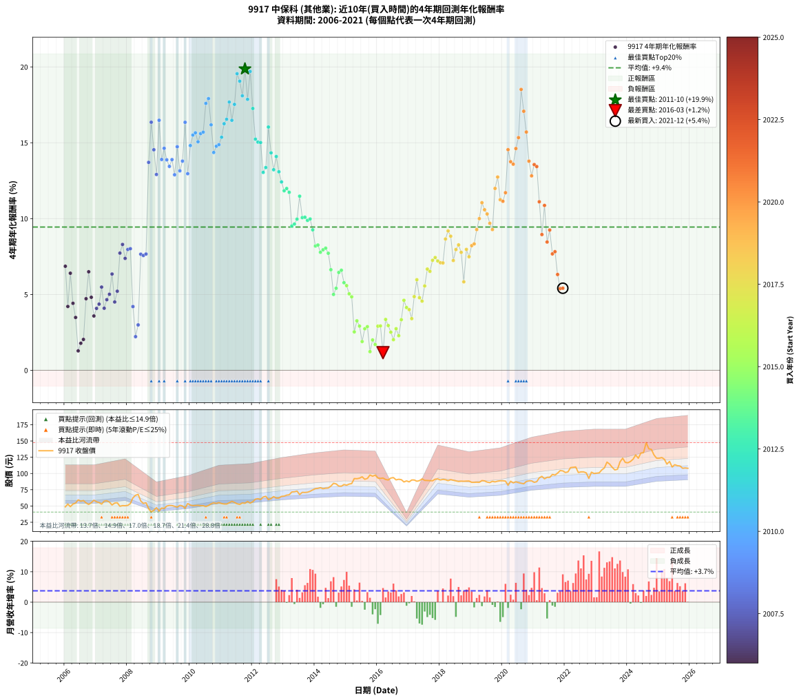

# 9917 中保科 - 本益比與未來報酬率分析

!!! info "報告資訊"
    - **股票代號**: 9917
    - **公司名稱**: 中保科
    - **產業別**: 其他業
    - **分析期間**: 2006-2021 (192 個數據點)
    - **資料來源**: Type 12 (ShowMonthlyK_ChartFlow) 月收盤價與本益比
    - **報酬率口徑**: 含現金股利 (簡化: 年度合計，假設每年7/1入帳)
    - **報告生成時間**: 2026-01-13 14:06:44 CST

## 📈 視覺化圖表

### 圖表1: 本益比 vs 未來報酬率關係

*圖表1：9917 中保科 本益比與4年期未來報酬率關係 (2006-2021)*

### 圖表2: 歷年買入時點的4年期實際報酬率

*圖表2：9917 中保科 歷年買入時點的4年期實際報酬率 (2006-2021)*

## 📍 買點訊號說明

本報告提供兩種買點提示訊號（顯示於圖表2的股價子圖中）：

### ▲ 小綠色三角形（回測驗證）
- **計算方式**: 使用全部歷史資料計算本益比第25百分位數
- **用途**: 事後驗證，顯示歷史上哪些時點確實為低估區
- **限制**: 當下無法判斷，僅供回測參考
- **特性**: 後見之明（Look-Ahead Bias）

### ▲ 小橘色三角形（即時訊號）
- **計算方式**: 使用截至當月的過去5年資料計算本益比第25百分位數
- **用途**: 實際投資決策，當時即可判斷
- **優勢**: 可操作性強，符合實務需求
- **特性**: 無後見之明，滾動窗口計算

!!! tip "如何使用兩種訊號"
    - **綠色▲** 幫助理解歷史估值機會，驗證策略有效性
    - **橘色▲** 可作為實際買進參考，但仍需搭配基本面分析
    - 兩種訊號重疊時，表示即時判斷與事後驗證一致，信心度較高
    - 僅有綠色▲時，表示當時無法判斷（需要未來資料才能確認）
    - 僅有橘色▲時，表示即時判斷為買點，但事後可能不是最佳時機

## 📊 估值分析摘要

| 指標 | 數值 |
|:---:|:---:|
| **目前本益比** (2021-12) | **18.15 倍** |
| **歷史平均本益比** | 18.00 倍 |
| **估值水準** | 🟡 合理範圍 |
| **預期4年年化報酬率** | **+9.40%** |
| **歷史平均報酬率** | +9.44% |
| **相關係數 (R²)** | 0.1809 |
| **趨勢線斜率** | -0.2904 |

!!! abstract "核心洞察"
    目前本益比接近歷史平均，預期報酬率符合長期趨勢

    根據歷史數據回測，9917 中保科 在目前本益比 **18.1倍** 的估值水準下，
    預期未來4年年化報酬率約為 **+9.4%**。

    **重要提醒**: 本分析基於歷史數據統計，實際報酬率會受到公司基本面變化、產業趨勢、
    總體經濟環境等多重因素影響。R² = 0.18 表示本益比可解釋約 18.1% 的報酬率變異。

## 📈 歷史估值統計

### 最佳買點 (最高報酬率)

| 項目 | 數值 |
|:---:|:---:|
| 起始時間 | 2011-10 |
| 當時本益比 | 13.57 倍 |
| 起始價格 | 54.2 元 |
| 4年後價格 | 97.7 元 |
| **4年年化報酬率** | **+19.87%** |

### 最差買點 (最低報酬率)

| 項目 | 數值 |
|:---:|:---:|
| 起始時間 | 2016-03 |
| 當時本益比 | 24.09 倍 |
| 起始價格 | 93.0 元 |
| 4年後價格 | 81.9 元 |
| **4年年化報酬率** | **+1.16%** |

## 🎯 投資啟示

### 本益比與報酬率關係

趨勢線方程式: **y = -0.2904x + 14.6727**

!!! note "負相關"
    本益比與未來報酬率呈現負相關。較低的本益比通常帶來較高的未來報酬率，
    但相關性不算非常強。**估值仍是重要參考指標之一**。

### 估值區間建議

基於歷史數據分析:

- **🟢 低估區** (P/E < 14.4): 預期報酬率較高，可考慮增加持股
- **🟡 合理區** (P/E 14.4-21.6): 預期報酬率符合長期趨勢，正常持有
- **🔴 高估區** (P/E > 21.6): 預期報酬率較低，可考慮減碼或觀望

!!! danger "風險提示"
    - 過去表現不代表未來結果
    - 本分析假設公司基本面無重大結構性變化
    - 產業環境劇變可能使歷史規律失效
    - 應結合公司財報、產業趨勢、總體經濟等多重因素綜合判斷

!!! success "長期投資觀點"
    歷史數據顯示，在合理或低估的估值水準買入並長期持有，
    往往能獲得較佳的投資報酬。**耐心等待好價格**是價值投資的核心原則。

## 📊 數據品質

- **資料來源**: GoodInfo.tw Type 12 (ShowMonthlyK_ChartFlow)
- **資料頻率**: 月度收盤價與本益比
- **回測期間**: 2006-2021
- **數據點數量**: 192 個 (每個點代表一次4年期回測)

### 計算方法說明

1. **4年期年化報酬率**:
   - 對每個歷史時點，計算其後4年的實際投資報酬率
   - 期末價值(不含股利): 期末價格
   - 期末價值(含現金股利): 期末價格 + 持有期間內的現金股利合計 (簡化: 年度合計，假設每年7/1入帳)
   - 公式: 年化報酬率 = [(期末價值/期初價格)^(1/年數) - 1] × 100%

2. **本益比 (P/E Ratio)**:
   - 使用當時的月收盤價與EPS計算
   - 資料來源: Type 12 月度河流圖本益比數據

3. **趨勢線 (Linear Regression)**:
   - 使用最小平方法擬合線性趨勢線
   - R²值衡量本益比對報酬率的解釋能力

---

*本報告由 Stock Analysis System v1.9.0 自動生成*
*數據更新時間: 2026-01-13 14:06:44 CST*

## 📋 月度回測明細表

（每一列對應時間線圖中的一個買入點；可用來對照 SVG 圖上的每個點。）

| 買入月份 | 賣出月份 | 回測期限_年 | 實際持有年數 | 買入本益比_倍 | 買入收盤價_元 | 賣出收盤價_元 | 現金股利合計_元 | 總報酬率_pct | 年化報酬率_pct |
| --- | --- | --- | --- | --- | --- | --- | --- | --- | --- |
| 2006-01 | 2010-01 | 4 | 4.000 | 12.36 | 48.70 | 51.50 | 12.00 | +30.39 | +6.86 |
| 2006-02 | 2010-02 | 4 | 4.000 | 13.45 | 53.00 | 50.50 | 12.00 | +17.92 | +4.21 |
| 2006-03 | 2010-03 | 4 | 4.000 | 12.44 | 49.00 | 50.80 | 12.00 | +28.16 | +6.40 |
| 2006-04 | 2010-04 | 4 | 4.000 | 13.45 | 53.00 | 51.00 | 12.00 | +18.87 | +4.42 |
| 2006-05 | 2010-05 | 4 | 4.000 | 13.83 | 54.50 | 50.50 | 12.00 | +14.68 | +3.48 |
| 2006-06 | 2010-06 | 4 | 4.000 | 15.08 | 59.40 | 50.50 | 12.00 | +5.22 | +1.28 |
| 2006-07 | 2010-07 | 4 | 4.000 | 14.57 | 57.40 | 49.10 | 12.50 | +7.32 | +1.78 |
| 2006-08 | 2010-08 | 4 | 4.000 | 14.82 | 58.40 | 50.80 | 12.50 | +8.39 | +2.03 |
| 2006-09 | 2010-09 | 4 | 4.000 | 13.91 | 54.80 | 53.40 | 12.50 | +20.26 | +4.72 |
| 2006-10 | 2010-10 | 4 | 4.000 | 13.30 | 52.40 | 54.90 | 12.50 | +28.63 | +6.50 |
| 2006-11 | 2010-11 | 4 | 4.000 | 13.98 | 55.10 | 54.00 | 12.50 | +20.69 | +4.81 |
| 2006-12 | 2010-12 | 4 | 4.000 | 14.95 | 58.90 | 55.30 | 12.50 | +15.11 | +3.58 |
| 2007-01 | 2011-01 | 4 | 4.000 | 14.24 | 56.50 | 53.80 | 12.50 | +17.35 | +4.08 |
| 2007-02 | 2011-02 | 4 | 4.000 | 13.85 | 55.30 | 53.10 | 12.50 | +18.63 | +4.36 |
| 2007-03 | 2011-03 | 4 | 4.000 | 13.16 | 52.90 | 53.00 | 12.50 | +23.82 | +5.49 |
| 2007-04 | 2011-04 | 4 | 4.000 | 14.21 | 57.50 | 55.00 | 12.50 | +17.39 | +4.09 |
| 2007-05 | 2011-05 | 4 | 4.000 | 14.26 | 58.10 | 57.20 | 12.50 | +19.97 | +4.66 |
| 2007-06 | 2011-06 | 4 | 4.000 | 13.66 | 56.00 | 55.60 | 12.50 | +21.61 | +5.01 |
| 2007-07 | 2011-07 | 4 | 4.000 | 12.50 | 51.60 | 53.40 | 12.60 | +27.91 | +6.35 |
| 2007-08 | 2011-08 | 4 | 4.000 | 13.12 | 54.50 | 52.40 | 12.60 | +19.27 | +4.50 |
| 2007-09 | 2011-09 | 4 | 4.000 | 13.16 | 55.00 | 54.80 | 12.60 | +22.55 | +5.21 |
| 2007-10 | 2011-10 | 4 | 4.000 | 11.79 | 49.60 | 54.20 | 12.60 | +34.68 | +7.73 |
| 2007-11 | 2011-11 | 4 | 4.000 | 11.95 | 50.60 | 57.00 | 12.60 | +37.55 | +8.30 |
| 2007-12 | 2011-12 | 4 | 4.000 | 11.83 | 50.40 | 54.40 | 12.60 | +32.94 | +7.38 |
| 2008-01 | 2012-01 | 4 | 4.000 | 12.27 | 51.00 | 56.70 | 12.60 | +35.88 | +7.97 |
| 2008-02 | 2012-02 | 4 | 4.000 | 13.24 | 53.70 | 60.50 | 12.60 | +36.13 | +8.02 |
| 2008-03 | 2012-03 | 4 | 4.000 | 15.84 | 62.60 | 61.20 | 12.60 | +17.89 | +4.20 |
| 2008-04 | 2012-04 | 4 | 4.000 | 17.27 | 66.50 | 60.00 | 12.60 | +9.17 | +2.22 |
| 2008-05 | 2012-05 | 4 | 4.000 | 18.12 | 67.90 | 63.80 | 12.60 | +12.52 | +2.99 |
| 2008-06 | 2012-06 | 4 | 4.000 | 15.83 | 57.70 | 64.90 | 12.60 | +34.32 | +7.65 |
| 2008-07 | 2012-07 | 4 | 4.000 | 15.24 | 54.00 | 59.90 | 12.40 | +33.89 | +7.57 |
| 2008-08 | 2012-08 | 4 | 4.000 | 15.99 | 55.00 | 61.50 | 12.40 | +34.36 | +7.66 |
| 2008-09 | 2012-09 | 4 | 4.000 | 13.78 | 46.00 | 64.50 | 12.40 | +67.17 | +13.71 |
| 2008-10 | 2012-10 | 4 | 4.000 | 12.58 | 40.70 | 62.20 | 12.40 | +83.29 | +16.36 |
| 2008-11 | 2012-11 | 4 | 4.000 | 13.85 | 43.40 | 62.30 | 12.40 | +72.12 | +14.54 |
| 2008-12 | 2012-12 | 4 | 4.000 | 15.68 | 47.50 | 64.80 | 12.40 | +62.53 | +12.91 |
| 2009-01 | 2013-01 | 4 | 4.000 | 13.79 | 42.15 | 65.20 | 12.40 | +84.10 | +16.48 |
| 2009-02 | 2013-02 | 4 | 4.000 | 15.24 | 47.00 | 66.70 | 12.40 | +68.30 | +13.90 |
| 2009-03 | 2013-03 | 4 | 4.000 | 14.83 | 46.15 | 67.30 | 12.40 | +72.70 | +14.64 |
| 2009-04 | 2013-04 | 4 | 4.000 | 15.91 | 49.95 | 71.60 | 12.40 | +68.17 | +13.88 |
| 2009-05 | 2013-05 | 4 | 4.000 | 16.07 | 50.90 | 71.90 | 12.40 | +65.62 | +13.44 |
| 2009-06 | 2013-06 | 4 | 4.000 | 15.87 | 50.70 | 72.90 | 12.40 | +68.24 | +13.89 |
| 2009-07 | 2013-07 | 4 | 4.000 | 15.36 | 49.50 | 67.60 | 12.80 | +62.42 | +12.89 |
| 2009-08 | 2013-08 | 4 | 4.000 | 14.88 | 48.35 | 71.00 | 12.80 | +73.32 | +14.74 |
| 2009-09 | 2013-09 | 4 | 4.000 | 15.56 | 51.00 | 70.80 | 12.80 | +63.92 | +13.15 |
| 2009-10 | 2013-10 | 4 | 4.000 | 15.16 | 50.10 | 71.20 | 12.80 | +67.66 | +13.79 |
| 2009-11 | 2013-11 | 4 | 4.000 | 13.98 | 46.60 | 72.60 | 12.80 | +83.26 | +16.35 |
| 2009-12 | 2013-12 | 4 | 4.000 | 16.01 | 53.80 | 74.80 | 12.80 | +62.83 | +12.96 |
| 2010-01 | 2014-01 | 4 | 4.000 | 15.12 | 51.50 | 76.70 | 12.80 | +73.79 | +14.82 |
| 2010-02 | 2014-02 | 4 | 4.000 | 14.62 | 50.50 | 77.10 | 12.80 | +78.02 | +15.51 |
| 2010-03 | 2014-03 | 4 | 4.000 | 14.51 | 50.80 | 78.10 | 12.80 | +78.94 | +15.66 |
| 2010-04 | 2014-04 | 4 | 4.000 | 14.38 | 51.00 | 76.60 | 12.80 | +75.29 | +15.06 |
| 2010-05 | 2014-05 | 4 | 4.000 | 14.05 | 50.50 | 77.40 | 12.80 | +78.61 | +15.61 |
| 2010-06 | 2014-06 | 4 | 4.000 | 13.87 | 50.50 | 77.70 | 12.80 | +79.21 | +15.70 |
| 2010-07 | 2014-07 | 4 | 4.000 | 13.32 | 49.10 | 80.60 | 13.30 | +91.24 | +17.60 |
| 2010-08 | 2014-08 | 4 | 4.000 | 13.61 | 50.80 | 84.90 | 13.30 | +93.31 | +17.91 |
| 2010-09 | 2014-09 | 4 | 4.000 | 14.13 | 53.40 | 84.00 | 13.30 | +82.21 | +16.18 |
| 2010-10 | 2014-10 | 4 | 4.000 | 14.35 | 54.90 | 80.60 | 13.30 | +71.04 | +14.36 |
| 2010-11 | 2014-11 | 4 | 4.000 | 13.94 | 54.00 | 80.40 | 13.30 | +73.52 | +14.77 |
| 2010-12 | 2014-12 | 4 | 4.000 | 14.11 | 55.30 | 83.00 | 13.30 | +74.14 | +14.87 |
| 2011-01 | 2015-01 | 4 | 4.000 | 13.70 | 53.80 | 82.00 | 13.30 | +77.14 | +15.37 |
| 2011-02 | 2015-02 | 4 | 4.000 | 13.49 | 53.10 | 83.70 | 13.30 | +82.67 | +16.26 |
| 2011-03 | 2015-03 | 4 | 4.000 | 13.44 | 53.00 | 84.50 | 13.30 | +84.53 | +16.55 |
| 2011-04 | 2015-04 | 4 | 4.000 | 13.92 | 55.00 | 92.20 | 13.30 | +91.82 | +17.69 |
| 2011-05 | 2015-05 | 4 | 4.000 | 14.45 | 57.20 | 92.00 | 13.30 | +84.09 | +16.48 |
| 2011-06 | 2015-06 | 4 | 4.000 | 14.02 | 55.60 | 92.80 | 13.30 | +90.83 | +17.53 |
| 2011-07 | 2015-07 | 4 | 4.000 | 13.44 | 53.40 | 94.90 | 14.20 | +104.31 | +19.56 |
| 2011-08 | 2015-08 | 4 | 4.000 | 13.17 | 52.40 | 91.10 | 14.20 | +100.95 | +19.06 |
| 2011-09 | 2015-09 | 4 | 4.000 | 13.74 | 54.80 | 92.40 | 14.20 | +94.53 | +18.10 |
| 2011-10 | 2015-10 | 4 | 4.000 | 13.57 | 54.20 | 97.70 | 14.20 | +106.46 | +19.87 |
| 2011-11 | 2015-11 | 4 | 4.000 | 14.24 | 57.00 | 95.80 | 14.20 | +92.98 | +17.86 |
| 2011-12 | 2015-12 | 4 | 4.000 | 13.57 | 54.40 | 97.50 | 14.20 | +105.33 | +19.71 |
| 2012-01 | 2016-01 | 4 | 4.000 | 14.05 | 56.70 | 93.00 | 14.20 | +89.07 | +17.26 |
| 2012-02 | 2016-02 | 4 | 4.000 | 14.89 | 60.50 | 92.50 | 14.20 | +76.36 | +15.24 |
| 2012-03 | 2016-03 | 4 | 4.000 | 14.96 | 61.20 | 93.00 | 14.20 | +75.16 | +15.04 |
| 2012-04 | 2016-04 | 4 | 4.000 | 14.57 | 60.00 | 90.80 | 14.20 | +75.00 | +15.02 |
| 2012-05 | 2016-05 | 4 | 4.000 | 15.40 | 63.80 | 90.00 | 14.20 | +63.32 | +13.05 |
| 2012-06 | 2016-06 | 4 | 4.000 | 15.56 | 64.90 | 93.00 | 14.20 | +65.18 | +13.37 |
| 2012-07 | 2016-07 | 4 | 4.000 | 14.27 | 59.90 | 93.70 | 14.90 | +81.30 | +16.04 |
| 2012-08 | 2016-08 | 4 | 4.000 | 14.56 | 61.50 | 90.20 | 14.90 | +70.89 | +14.34 |
| 2012-09 | 2016-09 | 4 | 4.000 | 15.18 | 64.50 | 91.10 | 14.90 | +64.34 | +13.22 |
| 2012-10 | 2016-10 | 4 | 4.000 | 14.54 | 62.20 | 90.50 | 14.90 | +69.45 | +14.09 |
| 2012-11 | 2016-11 | 4 | 4.000 | 14.48 | 62.30 | 87.00 | 14.90 | +63.56 | +13.09 |
| 2012-12 | 2016-12 | 4 | 4.000 | 14.97 | 64.80 | 88.60 | 14.90 | +59.72 | +12.42 |
| 2013-01 | 2017-01 | 4 | 4.000 | 14.99 | 65.20 | 87.10 | 14.90 | +56.44 | +11.84 |
| 2013-02 | 2017-02 | 4 | 4.000 | 15.26 | 66.70 | 90.00 | 14.90 | +57.27 | +11.99 |
| 2013-03 | 2017-03 | 4 | 4.000 | 15.33 | 67.30 | 90.00 | 14.90 | +55.87 | +11.74 |
| 2013-04 | 2017-04 | 4 | 4.000 | 16.24 | 71.60 | 88.10 | 14.90 | +43.85 | +9.52 |
| 2013-05 | 2017-05 | 4 | 4.000 | 16.23 | 71.90 | 89.00 | 14.90 | +44.51 | +9.64 |
| 2013-06 | 2017-06 | 4 | 4.000 | 16.38 | 72.90 | 91.70 | 14.90 | +46.23 | +9.97 |
| 2013-07 | 2017-07 | 4 | 4.000 | 15.12 | 67.60 | 89.40 | 15.00 | +54.44 | +11.48 |
| 2013-08 | 2017-08 | 4 | 4.000 | 15.81 | 71.00 | 89.20 | 15.00 | +46.76 | +10.07 |
| 2013-09 | 2017-09 | 4 | 4.000 | 15.70 | 70.80 | 89.00 | 15.00 | +46.89 | +10.09 |
| 2013-10 | 2017-10 | 4 | 4.000 | 15.72 | 71.20 | 88.80 | 15.00 | +45.79 | +9.88 |
| 2013-11 | 2017-11 | 4 | 4.000 | 15.96 | 72.60 | 91.20 | 15.00 | +46.28 | +9.98 |
| 2013-12 | 2017-12 | 4 | 4.000 | 16.37 | 74.80 | 91.60 | 15.00 | +42.51 | +9.26 |
| 2014-01 | 2018-01 | 4 | 4.000 | 16.73 | 76.70 | 90.10 | 15.00 | +37.03 | +8.19 |
| 2014-02 | 2018-02 | 4 | 4.000 | 16.77 | 77.10 | 90.90 | 15.00 | +37.35 | +8.26 |
| 2014-03 | 2018-03 | 4 | 4.000 | 16.93 | 78.10 | 90.40 | 15.00 | +34.96 | +7.78 |
| 2014-04 | 2018-04 | 4 | 4.000 | 16.56 | 76.60 | 89.00 | 15.00 | +35.77 | +7.94 |
| 2014-05 | 2018-05 | 4 | 4.000 | 16.68 | 77.40 | 90.50 | 15.00 | +36.30 | +8.05 |
| 2014-06 | 2018-06 | 4 | 4.000 | 16.69 | 77.70 | 89.60 | 15.00 | +34.62 | +7.72 |
| 2014-07 | 2018-07 | 4 | 4.000 | 17.26 | 80.60 | 88.70 | 15.50 | +29.28 | +6.63 |
| 2014-08 | 2018-08 | 4 | 4.000 | 18.13 | 84.90 | 87.70 | 15.50 | +21.55 | +5.00 |
| 2014-09 | 2018-09 | 4 | 4.000 | 17.88 | 84.00 | 88.20 | 15.50 | +23.45 | +5.41 |
| 2014-10 | 2018-10 | 4 | 4.000 | 17.11 | 80.60 | 88.00 | 15.50 | +28.41 | +6.45 |
| 2014-11 | 2018-11 | 4 | 4.000 | 17.01 | 80.40 | 88.30 | 15.50 | +29.10 | +6.59 |
| 2014-12 | 2018-12 | 4 | 4.000 | 17.51 | 83.00 | 88.40 | 15.50 | +25.18 | +5.78 |
| 2015-01 | 2019-01 | 4 | 4.000 | 17.32 | 82.00 | 86.40 | 15.50 | +24.27 | +5.58 |
| 2015-02 | 2019-02 | 4 | 4.000 | 17.70 | 83.70 | 86.40 | 15.50 | +21.74 | +5.04 |
| 2015-03 | 2019-03 | 4 | 4.000 | 17.88 | 84.50 | 86.60 | 15.50 | +20.83 | +4.84 |
| 2015-04 | 2019-04 | 4 | 4.000 | 19.53 | 92.20 | 86.40 | 15.50 | +10.52 | +2.53 |
| 2015-05 | 2019-05 | 4 | 4.000 | 19.51 | 92.00 | 89.10 | 15.50 | +13.70 | +3.26 |
| 2015-06 | 2019-06 | 4 | 4.000 | 19.70 | 92.80 | 88.60 | 15.50 | +12.18 | +2.91 |
| 2015-07 | 2019-07 | 4 | 4.000 | 20.17 | 94.90 | 86.80 | 15.50 | +7.80 | +1.89 |
| 2015-08 | 2019-08 | 4 | 4.000 | 19.38 | 91.10 | 86.00 | 15.50 | +11.42 | +2.74 |
| 2015-09 | 2019-09 | 4 | 4.000 | 19.68 | 92.40 | 88.00 | 15.50 | +12.01 | +2.88 |
| 2015-10 | 2019-10 | 4 | 4.000 | 20.83 | 97.70 | 87.10 | 15.50 | +5.02 | +1.23 |
| 2015-11 | 2019-11 | 4 | 4.000 | 20.45 | 95.80 | 88.20 | 15.50 | +8.25 | +2.00 |
| 2015-12 | 2019-12 | 4 | 4.000 | 20.83 | 97.50 | 88.80 | 15.50 | +6.97 | +1.70 |
| 2016-01 | 2020-01 | 4 | 4.000 | 21.10 | 93.00 | 88.80 | 15.50 | +12.15 | +2.91 |
| 2016-02 | 2020-02 | 4 | 4.000 | 22.38 | 92.50 | 88.30 | 15.50 | +12.22 | +2.92 |
| 2016-03 | 2020-03 | 4 | 4.000 | 24.09 | 93.00 | 81.90 | 15.50 | +4.73 | +1.16 |
| 2016-04 | 2020-04 | 4 | 4.000 | 25.32 | 90.80 | 88.10 | 15.50 | +14.10 | +3.35 |
| 2016-05 | 2020-05 | 4 | 4.000 | 27.16 | 90.00 | 85.60 | 15.50 | +12.33 | +2.95 |
| 2016-06 | 2020-06 | 4 | 4.000 | 30.59 | 93.00 | 87.20 | 15.50 | +10.43 | +2.51 |
| 2016-07 | 2020-07 | 4 | 4.000 | 33.87 | 93.70 | 86.00 | 15.50 | +8.32 | +2.02 |
| 2016-08 | 2020-08 | 4 | 4.000 | 36.18 | 90.20 | 85.00 | 15.50 | +11.42 | +2.74 |
| 2016-09 | 2020-09 | 4 | 4.000 | 41.04 | 91.10 | 84.20 | 15.50 | +9.44 | +2.28 |
| 2016-10 | 2020-10 | 4 | 4.000 | 46.49 | 90.50 | 87.70 | 15.50 | +14.03 | +3.34 |
| 2016-11 | 2020-11 | 4 | 4.000 | 51.99 | 87.00 | 88.70 | 15.50 | +19.77 | +4.61 |
| 2016-12 | 2020-12 | 4 | 4.000 | 63.29 | 88.60 | 88.70 | 15.50 | +17.61 | +4.14 |
| 2017-01 | 2021-01 | 4 | 4.000 | 51.24 | 87.10 | 86.40 | 15.50 | +16.99 | +4.00 |
| 2017-02 | 2021-02 | 4 | 4.000 | 45.00 | 90.00 | 87.40 | 15.50 | +14.33 | +3.41 |
| 2017-03 | 2021-03 | 4 | 4.000 | 39.13 | 90.00 | 93.30 | 15.50 | +20.89 | +4.86 |
| 2017-04 | 2021-04 | 4 | 4.000 | 33.88 | 88.10 | 95.60 | 15.50 | +26.11 | +5.97 |
| 2017-05 | 2021-05 | 4 | 4.000 | 30.69 | 89.00 | 91.80 | 15.50 | +20.56 | +4.79 |
| 2017-06 | 2021-06 | 4 | 4.000 | 28.66 | 91.70 | 94.10 | 15.50 | +19.52 | +4.56 |
| 2017-07 | 2021-07 | 4 | 4.000 | 25.54 | 89.40 | 94.00 | 17.00 | +24.16 | +5.56 |
| 2017-08 | 2021-08 | 4 | 4.000 | 23.47 | 89.20 | 98.50 | 17.00 | +29.48 | +6.67 |
| 2017-09 | 2021-09 | 4 | 4.000 | 21.71 | 89.00 | 97.60 | 17.00 | +28.76 | +6.52 |
| 2017-10 | 2021-10 | 4 | 4.000 | 20.18 | 88.80 | 100.50 | 17.00 | +32.32 | +7.25 |
| 2017-11 | 2021-11 | 4 | 4.000 | 19.40 | 91.20 | 104.50 | 17.00 | +33.22 | +7.43 |
| 2017-12 | 2021-12 | 4 | 4.000 | 18.32 | 91.60 | 104.00 | 17.00 | +32.10 | +7.21 |
| 2018-01 | 2022-01 | 4 | 4.000 | 18.13 | 90.10 | 101.50 | 17.00 | +31.52 | +7.09 |
| 2018-02 | 2022-02 | 4 | 4.000 | 18.40 | 90.90 | 102.50 | 17.00 | +31.46 | +7.08 |
| 2018-03 | 2022-03 | 4 | 4.000 | 18.41 | 90.40 | 109.00 | 17.00 | +39.38 | +8.66 |
| 2018-04 | 2022-04 | 4 | 4.000 | 18.24 | 89.00 | 109.50 | 17.00 | +42.13 | +9.19 |
| 2018-05 | 2022-05 | 4 | 4.000 | 18.66 | 90.50 | 110.00 | 17.00 | +40.33 | +8.84 |
| 2018-06 | 2022-06 | 4 | 4.000 | 18.59 | 89.60 | 101.50 | 17.00 | +32.25 | +7.24 |
| 2018-07 | 2022-07 | 4 | 4.000 | 18.52 | 88.70 | 102.50 | 18.00 | +35.85 | +7.96 |
| 2018-08 | 2022-08 | 4 | 4.000 | 18.42 | 87.70 | 102.50 | 18.00 | +37.40 | +8.27 |
| 2018-09 | 2022-09 | 4 | 4.000 | 18.65 | 88.20 | 101.00 | 18.00 | +34.92 | +7.78 |
| 2018-10 | 2022-10 | 4 | 4.000 | 18.72 | 88.00 | 92.40 | 18.00 | +25.45 | +5.83 |
| 2018-11 | 2022-11 | 4 | 4.000 | 18.91 | 88.30 | 102.00 | 18.00 | +35.90 | +7.97 |
| 2018-12 | 2022-12 | 4 | 4.000 | 19.05 | 88.40 | 100.00 | 18.00 | +33.48 | +7.49 |
| 2019-01 | 2023-01 | 4 | 4.000 | 18.55 | 86.40 | 100.50 | 18.00 | +37.15 | +8.22 |
| 2019-02 | 2023-02 | 4 | 4.000 | 18.48 | 86.40 | 101.00 | 18.00 | +37.73 | +8.33 |
| 2019-03 | 2023-03 | 4 | 4.000 | 18.45 | 86.60 | 105.50 | 18.00 | +42.61 | +9.28 |
| 2019-04 | 2023-04 | 4 | 4.000 | 18.34 | 86.40 | 108.50 | 18.00 | +46.41 | +10.00 |
| 2019-05 | 2023-05 | 4 | 4.000 | 18.85 | 89.10 | 117.50 | 18.00 | +52.08 | +11.05 |
| 2019-06 | 2023-06 | 4 | 4.000 | 18.67 | 88.60 | 114.50 | 18.00 | +49.55 | +10.58 |
| 2019-07 | 2023-07 | 4 | 4.000 | 18.23 | 86.80 | 109.50 | 19.00 | +48.04 | +10.31 |
| 2019-08 | 2023-08 | 4 | 4.000 | 17.99 | 86.00 | 105.50 | 19.00 | +44.77 | +9.69 |
| 2019-09 | 2023-09 | 4 | 4.000 | 18.34 | 88.00 | 106.50 | 19.00 | +42.61 | +9.28 |
| 2019-10 | 2023-10 | 4 | 4.000 | 18.09 | 87.10 | 118.00 | 19.00 | +57.29 | +11.99 |
| 2019-11 | 2023-11 | 4 | 4.000 | 18.25 | 88.20 | 123.50 | 19.00 | +61.56 | +12.74 |
| 2019-12 | 2023-12 | 4 | 4.000 | 18.31 | 88.80 | 117.00 | 19.00 | +53.15 | +11.25 |
| 2020-01 | 2024-01 | 4 | 4.000 | 18.13 | 88.80 | 116.50 | 19.00 | +52.59 | +11.14 |
| 2020-02 | 2024-02 | 4 | 4.000 | 17.86 | 88.30 | 118.50 | 19.00 | +55.72 | +11.71 |
| 2020-03 | 2024-03 | 4 | 4.000 | 16.40 | 81.90 | 122.00 | 19.00 | +72.16 | +14.55 |
| 2020-04 | 2024-04 | 4 | 4.000 | 17.48 | 88.10 | 128.50 | 19.00 | +67.42 | +13.75 |
| 2020-05 | 2024-05 | 4 | 4.000 | 16.83 | 85.60 | 123.50 | 19.00 | +66.47 | +13.59 |
| 2020-06 | 2024-06 | 4 | 4.000 | 16.98 | 87.20 | 131.50 | 19.00 | +72.59 | +14.62 |
| 2020-07 | 2024-07 | 4 | 4.000 | 16.59 | 86.00 | 132.00 | 20.20 | +76.98 | +15.34 |
| 2020-08 | 2024-08 | 4 | 4.000 | 16.25 | 85.00 | 147.50 | 20.20 | +97.29 | +18.52 |
| 2020-09 | 2024-09 | 4 | 4.000 | 15.95 | 84.20 | 138.00 | 20.20 | +87.89 | +17.08 |
| 2020-10 | 2024-10 | 4 | 4.000 | 16.47 | 87.70 | 137.00 | 20.20 | +79.25 | +15.71 |
| 2020-11 | 2024-11 | 4 | 4.000 | 16.51 | 88.70 | 128.50 | 20.20 | +67.64 | +13.79 |
| 2020-12 | 2024-12 | 4 | 4.000 | 16.37 | 88.70 | 123.50 | 20.20 | +62.01 | +12.82 |
| 2021-01 | 2025-01 | 4 | 4.000 | 15.87 | 86.40 | 123.50 | 20.20 | +66.32 | +13.56 |
| 2021-02 | 2025-02 | 4 | 4.000 | 15.97 | 87.40 | 124.50 | 20.20 | +65.56 | +13.43 |
| 2021-03 | 2025-03 | 4 | 4.000 | 16.97 | 93.30 | 122.00 | 20.20 | +52.41 | +11.11 |
| 2021-04 | 2025-04 | 4 | 4.000 | 17.31 | 95.60 | 114.50 | 20.20 | +40.90 | +8.95 |
| 2021-05 | 2025-05 | 4 | 4.000 | 16.54 | 91.80 | 118.50 | 20.20 | +51.09 | +10.87 |
| 2021-06 | 2025-06 | 4 | 4.000 | 16.88 | 94.10 | 110.00 | 20.20 | +38.36 | +8.46 |
| 2021-07 | 2025-07 | 4 | 4.000 | 16.78 | 94.00 | 113.50 | 20.40 | +42.45 | +9.25 |
| 2021-08 | 2025-08 | 4 | 4.000 | 17.51 | 98.50 | 112.00 | 20.40 | +34.42 | +7.67 |
| 2021-09 | 2025-09 | 4 | 4.000 | 17.27 | 97.60 | 111.50 | 20.40 | +35.14 | +7.82 |
| 2021-10 | 2025-10 | 4 | 4.000 | 17.70 | 100.50 | 108.00 | 20.40 | +27.76 | +6.32 |
| 2021-11 | 2025-11 | 4 | 4.000 | 18.32 | 104.50 | 108.50 | 20.40 | +23.35 | +5.39 |
| 2021-12 | 2025-12 | 4 | 4.000 | 18.15 | 104.00 | 108.00 | 20.40 | +23.46 | +5.41 |
