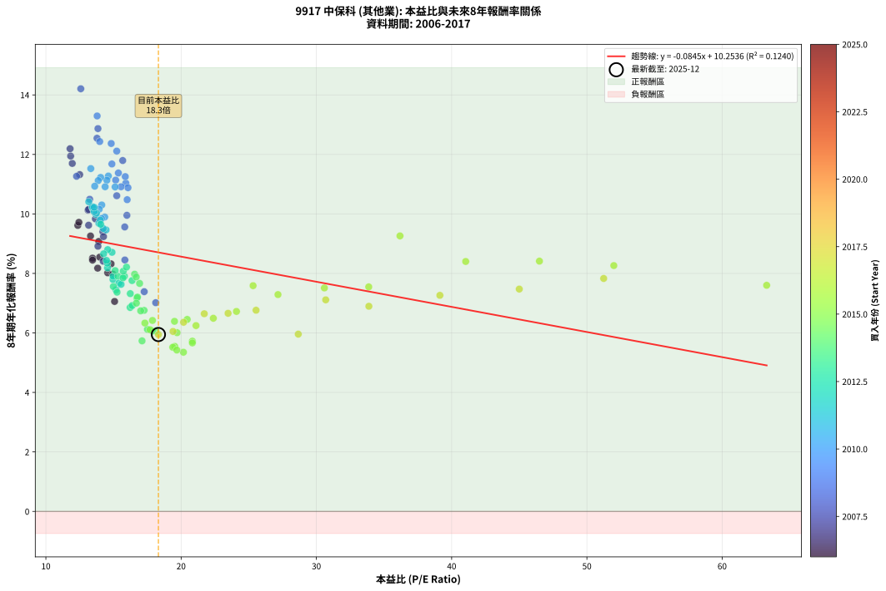
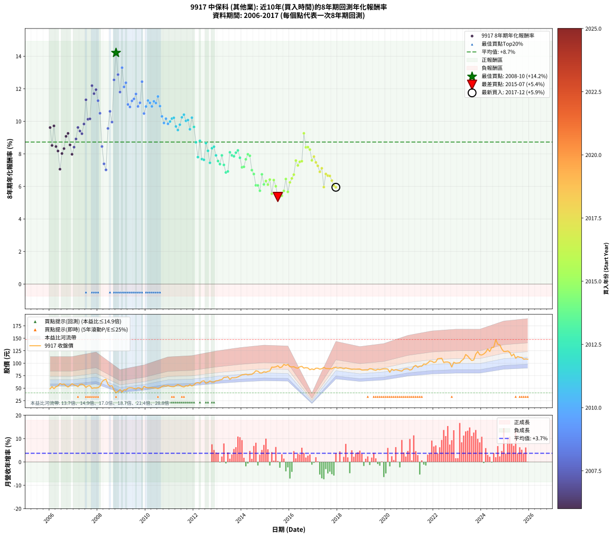

# 9917 中保科 - 本益比與未來報酬率分析

!!! info "報告資訊"
    - **股票代號**: 9917
    - **公司名稱**: 中保科
    - **產業別**: 其他業
    - **分析期間**: 2006-2017 (144 個數據點)
    - **資料來源**: Type 12 (ShowMonthlyK_ChartFlow) 月收盤價與本益比
    - **報酬率口徑**: 含現金股利 (簡化: 年度合計，假設每年7/1入帳)
    - **報告生成時間**: 2026-01-11 21:27:40 CST

## 📈 視覺化圖表

### 圖表1: 本益比 vs 未來報酬率關係

*圖表1：9917 中保科 本益比與8年期未來報酬率關係 (2006-2017)*

### 圖表2: 歷年買入時點的8年期實際報酬率

*圖表2：9917 中保科 歷年買入時點的8年期實際報酬率 (2006-2017)*

## 📍 買點訊號說明

本報告提供兩種買點提示訊號（顯示於圖表2的股價子圖中）：

### ▲ 小綠色三角形（回測驗證）
- **計算方式**: 使用全部歷史資料計算本益比第25百分位數
- **用途**: 事後驗證，顯示歷史上哪些時點確實為低估區
- **限制**: 當下無法判斷，僅供回測參考
- **特性**: 後見之明（Look-Ahead Bias）

### ▲ 小橘色三角形（即時訊號）
- **計算方式**: 使用截至當月的過去5年資料計算本益比第25百分位數
- **用途**: 實際投資決策，當時即可判斷
- **優勢**: 可操作性強，符合實務需求
- **特性**: 無後見之明，滾動窗口計算

!!! tip "如何使用兩種訊號"
    - **綠色▲** 幫助理解歷史估值機會，驗證策略有效性
    - **橘色▲** 可作為實際買進參考，但仍需搭配基本面分析
    - 兩種訊號重疊時，表示即時判斷與事後驗證一致，信心度較高
    - 僅有綠色▲時，表示當時無法判斷（需要未來資料才能確認）
    - 僅有橘色▲時，表示即時判斷為買點，但事後可能不是最佳時機

## 📊 估值分析摘要

| 指標 | 數值 |
|:---:|:---:|
| **目前本益比** (2017-12) | **18.32 倍** |
| **歷史平均本益比** | 18.10 倍 |
| **估值水準** | 🟡 合理範圍 |
| **預期8年年化報酬率** | **+8.71%** |
| **歷史平均報酬率** | +8.72% |
| **相關係數 (R²)** | 0.1240 |
| **趨勢線斜率** | -0.0845 |

!!! abstract "核心洞察"
    目前本益比接近歷史平均，預期報酬率符合長期趨勢

    根據歷史數據回測，9917 中保科 在目前本益比 **18.3倍** 的估值水準下，
    預期未來8年年化報酬率約為 **+8.7%**。

    **重要提醒**: 本分析基於歷史數據統計，實際報酬率會受到公司基本面變化、產業趨勢、
    總體經濟環境等多重因素影響。R² = 0.12 表示本益比可解釋約 12.4% 的報酬率變異。

## 📈 歷史估值統計

### 最佳買點 (最高報酬率)

| 項目 | 數值 |
|:---:|:---:|
| 起始時間 | 2008-10 |
| 當時本益比 | 12.58 倍 |
| 起始價格 | 40.7 元 |
| 8年後價格 | 90.5 元 |
| **8年年化報酬率** | **+14.21%** |

### 最差買點 (最低報酬率)

| 項目 | 數值 |
|:---:|:---:|
| 起始時間 | 2015-07 |
| 當時本益比 | 20.17 倍 |
| 起始價格 | 94.9 元 |
| 8年後價格 | 109.5 元 |
| **8年年化報酬率** | **+5.35%** |

## 🎯 投資啟示

### 本益比與報酬率關係

趨勢線方程式: **y = -0.0845x + 10.2536**

!!! note "負相關"
    本益比與未來報酬率呈現負相關。較低的本益比通常帶來較高的未來報酬率，
    但相關性不算非常強。**估值仍是重要參考指標之一**。

### 估值區間建議

基於歷史數據分析:

- **🟢 低估區** (P/E < 14.5): 預期報酬率較高，可考慮增加持股
- **🟡 合理區** (P/E 14.5-21.7): 預期報酬率符合長期趨勢，正常持有
- **🔴 高估區** (P/E > 21.7): 預期報酬率較低，可考慮減碼或觀望

!!! danger "風險提示"
    - 過去表現不代表未來結果
    - 本分析假設公司基本面無重大結構性變化
    - 產業環境劇變可能使歷史規律失效
    - 應結合公司財報、產業趨勢、總體經濟等多重因素綜合判斷

!!! success "長期投資觀點"
    歷史數據顯示，在合理或低估的估值水準買入並長期持有，
    往往能獲得較佳的投資報酬。**耐心等待好價格**是價值投資的核心原則。

## 📊 數據品質

- **資料來源**: GoodInfo.tw Type 12 (ShowMonthlyK_ChartFlow)
- **資料頻率**: 月度收盤價與本益比
- **回測期間**: 2006-2017
- **數據點數量**: 144 個 (每個點代表一次8年期回測)

### 計算方法說明

1. **8年期年化報酬率**:
   - 對每個歷史時點，計算其後8年的實際投資報酬率
   - 期末價值(不含股利): 期末價格
   - 期末價值(含現金股利): 期末價格 + 持有期間內的現金股利合計 (簡化: 年度合計，假設每年7/1入帳)
   - 公式: 年化報酬率 = [(期末價值/期初價格)^(1/年數) - 1] × 100%

2. **本益比 (P/E Ratio)**:
   - 使用當時的月收盤價與EPS計算
   - 資料來源: Type 12 月度河流圖本益比數據

3. **趨勢線 (Linear Regression)**:
   - 使用最小平方法擬合線性趨勢線
   - R²值衡量本益比對報酬率的解釋能力

---

*本報告由 Stock Analysis System v1.9.0 自動生成*
*數據更新時間: 2026-01-11 21:27:40 CST*

## 📋 月度回測明細表

（每一列對應時間線圖中的一個買入點；可用來對照 SVG 圖上的每個點。）

| 買入月份 | 賣出月份 | 回測期限_年 | 實際持有年數 | 買入本益比_倍 | 買入收盤價_元 | 賣出收盤價_元 | 現金股利合計_元 | 總報酬率_pct | 年化報酬率_pct |
| --- | --- | --- | --- | --- | --- | --- | --- | --- | --- |
| 2006-01 | 2014-01 | 8 | 8.000 | 12.36 | 48.70 | 76.70 | 24.80 | +108.42 | +9.61 |
| 2006-02 | 2014-02 | 8 | 8.000 | 13.45 | 53.00 | 77.10 | 24.80 | +92.26 | +8.51 |
| 2006-03 | 2014-03 | 8 | 8.000 | 12.44 | 49.00 | 78.10 | 24.80 | +110.00 | +9.72 |
| 2006-04 | 2014-04 | 8 | 8.000 | 13.45 | 53.00 | 76.60 | 24.80 | +91.32 | +8.45 |
| 2006-05 | 2014-05 | 8 | 8.000 | 13.83 | 54.50 | 77.40 | 24.80 | +87.52 | +8.18 |
| 2006-06 | 2014-06 | 8 | 8.000 | 15.08 | 59.40 | 77.70 | 24.80 | +72.56 | +7.06 |
| 2006-07 | 2014-07 | 8 | 8.000 | 14.57 | 57.40 | 80.60 | 25.80 | +85.37 | +8.02 |
| 2006-08 | 2014-08 | 8 | 8.000 | 14.82 | 58.40 | 84.90 | 25.80 | +89.55 | +8.32 |
| 2006-09 | 2014-09 | 8 | 8.000 | 13.91 | 54.80 | 84.00 | 25.80 | +100.36 | +9.08 |
| 2006-10 | 2014-10 | 8 | 8.000 | 13.30 | 52.40 | 80.60 | 25.80 | +103.05 | +9.26 |
| 2006-11 | 2014-11 | 8 | 8.000 | 13.98 | 55.10 | 80.40 | 25.80 | +92.74 | +8.55 |
| 2006-12 | 2014-12 | 8 | 8.000 | 14.95 | 58.90 | 83.00 | 25.80 | +84.72 | +7.97 |
| 2007-01 | 2015-01 | 8 | 8.000 | 14.24 | 56.50 | 82.00 | 25.80 | +90.80 | +8.41 |
| 2007-02 | 2015-02 | 8 | 8.000 | 13.85 | 55.30 | 83.70 | 25.80 | +98.01 | +8.91 |
| 2007-03 | 2015-03 | 8 | 8.000 | 13.16 | 52.90 | 84.50 | 25.80 | +108.51 | +9.62 |
| 2007-04 | 2015-04 | 8 | 8.000 | 14.21 | 57.50 | 92.20 | 25.80 | +105.22 | +9.40 |
| 2007-05 | 2015-05 | 8 | 8.000 | 14.26 | 58.10 | 92.00 | 25.80 | +102.75 | +9.24 |
| 2007-06 | 2015-06 | 8 | 8.000 | 13.66 | 56.00 | 92.80 | 25.80 | +111.79 | +9.83 |
| 2007-07 | 2015-07 | 8 | 8.000 | 12.50 | 51.60 | 94.90 | 26.80 | +135.85 | +11.32 |
| 2007-08 | 2015-08 | 8 | 8.000 | 13.12 | 54.50 | 91.10 | 26.80 | +116.33 | +10.13 |
| 2007-09 | 2015-09 | 8 | 8.000 | 13.16 | 55.00 | 92.40 | 26.80 | +116.73 | +10.15 |
| 2007-10 | 2015-10 | 8 | 8.000 | 11.79 | 49.60 | 97.70 | 26.80 | +151.01 | +12.19 |
| 2007-11 | 2015-11 | 8 | 8.000 | 11.95 | 50.60 | 95.80 | 26.80 | +142.29 | +11.70 |
| 2007-12 | 2015-12 | 8 | 8.000 | 11.83 | 50.40 | 97.50 | 26.80 | +146.63 | +11.95 |
| 2008-01 | 2016-01 | 8 | 8.000 | 12.27 | 51.00 | 93.00 | 26.80 | +134.90 | +11.27 |
| 2008-02 | 2016-02 | 8 | 8.000 | 13.24 | 53.70 | 92.50 | 26.80 | +122.16 | +10.49 |
| 2008-03 | 2016-03 | 8 | 8.000 | 15.84 | 62.60 | 93.00 | 26.80 | +91.37 | +8.45 |
| 2008-04 | 2016-04 | 8 | 8.000 | 17.27 | 66.50 | 90.80 | 26.80 | +76.84 | +7.39 |
| 2008-05 | 2016-05 | 8 | 8.000 | 18.12 | 67.90 | 90.00 | 26.80 | +72.02 | +7.02 |
| 2008-06 | 2016-06 | 8 | 8.000 | 15.83 | 57.70 | 93.00 | 26.80 | +107.63 | +9.56 |
| 2008-07 | 2016-07 | 8 | 8.000 | 15.24 | 54.00 | 93.70 | 27.30 | +124.07 | +10.61 |
| 2008-08 | 2016-08 | 8 | 8.000 | 15.99 | 55.00 | 90.20 | 27.30 | +113.64 | +9.95 |
| 2008-09 | 2016-09 | 8 | 8.000 | 13.78 | 46.00 | 91.10 | 27.30 | +157.39 | +12.54 |
| 2008-10 | 2016-10 | 8 | 8.000 | 12.58 | 40.70 | 90.50 | 27.30 | +189.43 | +14.21 |
| 2008-11 | 2016-11 | 8 | 8.000 | 13.85 | 43.40 | 87.00 | 27.30 | +163.36 | +12.87 |
| 2008-12 | 2016-12 | 8 | 8.000 | 15.68 | 47.50 | 88.60 | 27.30 | +144.00 | +11.80 |
| 2009-01 | 2017-01 | 8 | 8.000 | 13.79 | 42.15 | 87.10 | 27.30 | +171.41 | +13.29 |
| 2009-02 | 2017-02 | 8 | 8.000 | 15.24 | 47.00 | 90.00 | 27.30 | +149.57 | +12.11 |
| 2009-03 | 2017-03 | 8 | 8.000 | 14.83 | 46.15 | 90.00 | 27.30 | +154.17 | +12.37 |
| 2009-04 | 2017-04 | 8 | 8.000 | 15.91 | 49.95 | 88.10 | 27.30 | +131.03 | +11.03 |
| 2009-05 | 2017-05 | 8 | 8.000 | 16.07 | 50.90 | 89.00 | 27.30 | +128.49 | +10.88 |
| 2009-06 | 2017-06 | 8 | 8.000 | 15.87 | 50.70 | 91.70 | 27.30 | +134.71 | +11.25 |
| 2009-07 | 2017-07 | 8 | 8.000 | 15.36 | 49.50 | 89.40 | 27.80 | +136.77 | +11.38 |
| 2009-08 | 2017-08 | 8 | 8.000 | 14.88 | 48.35 | 89.20 | 27.80 | +141.99 | +11.68 |
| 2009-09 | 2017-09 | 8 | 8.000 | 15.56 | 51.00 | 89.00 | 27.80 | +129.02 | +10.91 |
| 2009-10 | 2017-10 | 8 | 8.000 | 15.16 | 50.10 | 88.80 | 27.80 | +132.73 | +11.14 |
| 2009-11 | 2017-11 | 8 | 8.000 | 13.98 | 46.60 | 91.20 | 27.80 | +155.36 | +12.43 |
| 2009-12 | 2017-12 | 8 | 8.000 | 16.01 | 53.80 | 91.60 | 27.80 | +121.93 | +10.48 |
| 2010-01 | 2018-01 | 8 | 8.000 | 15.12 | 51.50 | 90.10 | 27.80 | +128.93 | +10.91 |
| 2010-02 | 2018-02 | 8 | 8.000 | 14.62 | 50.50 | 90.90 | 27.80 | +135.05 | +11.27 |
| 2010-03 | 2018-03 | 8 | 8.000 | 14.51 | 50.80 | 90.40 | 27.80 | +132.68 | +11.13 |
| 2010-04 | 2018-04 | 8 | 8.000 | 14.38 | 51.00 | 89.00 | 27.80 | +129.02 | +10.91 |
| 2010-05 | 2018-05 | 8 | 8.000 | 14.05 | 50.50 | 90.50 | 27.80 | +134.26 | +11.23 |
| 2010-06 | 2018-06 | 8 | 8.000 | 13.87 | 50.50 | 89.60 | 27.80 | +132.48 | +11.12 |
| 2010-07 | 2018-07 | 8 | 8.000 | 13.32 | 49.10 | 88.70 | 28.80 | +139.31 | +11.52 |
| 2010-08 | 2018-08 | 8 | 8.000 | 13.61 | 50.80 | 87.70 | 28.80 | +129.33 | +10.93 |
| 2010-09 | 2018-09 | 8 | 8.000 | 14.13 | 53.40 | 88.20 | 28.80 | +119.10 | +10.30 |
| 2010-10 | 2018-10 | 8 | 8.000 | 14.35 | 54.90 | 88.00 | 28.80 | +112.75 | +9.90 |
| 2010-11 | 2018-11 | 8 | 8.000 | 13.94 | 54.00 | 88.30 | 28.80 | +116.85 | +10.16 |
| 2010-12 | 2018-12 | 8 | 8.000 | 14.11 | 55.30 | 88.40 | 28.80 | +111.93 | +9.84 |
| 2011-01 | 2019-01 | 8 | 8.000 | 13.70 | 53.80 | 86.40 | 28.80 | +114.13 | +9.99 |
| 2011-02 | 2019-02 | 8 | 8.000 | 13.49 | 53.10 | 86.40 | 28.80 | +116.95 | +10.17 |
| 2011-03 | 2019-03 | 8 | 8.000 | 13.44 | 53.00 | 86.60 | 28.80 | +117.74 | +10.22 |
| 2011-04 | 2019-04 | 8 | 8.000 | 13.92 | 55.00 | 86.40 | 28.80 | +109.45 | +9.68 |
| 2011-05 | 2019-05 | 8 | 8.000 | 14.45 | 57.20 | 89.10 | 28.80 | +106.12 | +9.46 |
| 2011-06 | 2019-06 | 8 | 8.000 | 14.02 | 55.60 | 88.60 | 28.80 | +111.15 | +9.79 |
| 2011-07 | 2019-07 | 8 | 8.000 | 13.44 | 53.40 | 86.80 | 29.70 | +118.16 | +10.24 |
| 2011-08 | 2019-08 | 8 | 8.000 | 13.17 | 52.40 | 86.00 | 29.70 | +120.80 | +10.41 |
| 2011-09 | 2019-09 | 8 | 8.000 | 13.74 | 54.80 | 88.00 | 29.70 | +114.78 | +10.03 |
| 2011-10 | 2019-10 | 8 | 8.000 | 13.57 | 54.20 | 87.10 | 29.70 | +115.50 | +10.07 |
| 2011-11 | 2019-11 | 8 | 8.000 | 14.24 | 57.00 | 88.20 | 29.70 | +106.84 | +9.51 |
| 2011-12 | 2019-12 | 8 | 8.000 | 13.57 | 54.40 | 88.80 | 29.70 | +117.83 | +10.22 |
| 2012-01 | 2020-01 | 8 | 8.000 | 14.05 | 56.70 | 88.80 | 29.70 | +108.99 | +9.65 |
| 2012-02 | 2020-02 | 8 | 8.000 | 14.89 | 60.50 | 88.30 | 29.70 | +95.04 | +8.71 |
| 2012-03 | 2020-03 | 8 | 8.000 | 14.96 | 61.20 | 81.90 | 29.70 | +82.35 | +7.80 |
| 2012-04 | 2020-04 | 8 | 8.000 | 14.57 | 60.00 | 88.10 | 29.70 | +96.33 | +8.80 |
| 2012-05 | 2020-05 | 8 | 8.000 | 15.40 | 63.80 | 85.60 | 29.70 | +80.72 | +7.68 |
| 2012-06 | 2020-06 | 8 | 8.000 | 15.56 | 64.90 | 87.20 | 29.70 | +80.12 | +7.63 |
| 2012-07 | 2020-07 | 8 | 8.000 | 14.27 | 59.90 | 86.00 | 30.40 | +94.32 | +8.66 |
| 2012-08 | 2020-08 | 8 | 8.000 | 14.56 | 61.50 | 85.00 | 30.40 | +87.64 | +8.18 |
| 2012-09 | 2020-09 | 8 | 8.000 | 15.18 | 64.50 | 84.20 | 30.40 | +77.67 | +7.45 |
| 2012-10 | 2020-10 | 8 | 8.000 | 14.54 | 62.20 | 87.70 | 30.40 | +89.87 | +8.34 |
| 2012-11 | 2020-11 | 8 | 8.000 | 14.48 | 62.30 | 88.70 | 30.40 | +91.17 | +8.44 |
| 2012-12 | 2020-12 | 8 | 8.000 | 14.97 | 64.80 | 88.70 | 30.40 | +83.80 | +7.91 |
| 2013-01 | 2021-01 | 8 | 8.000 | 14.99 | 65.20 | 86.40 | 30.40 | +79.14 | +7.56 |
| 2013-02 | 2021-02 | 8 | 8.000 | 15.26 | 66.70 | 87.40 | 30.40 | +76.61 | +7.37 |
| 2013-03 | 2021-03 | 8 | 8.000 | 15.33 | 67.30 | 93.30 | 30.40 | +83.80 | +7.91 |
| 2013-04 | 2021-04 | 8 | 8.000 | 16.24 | 71.60 | 95.60 | 30.40 | +75.98 | +7.32 |
| 2013-05 | 2021-05 | 8 | 8.000 | 16.23 | 71.90 | 91.80 | 30.40 | +69.96 | +6.85 |
| 2013-06 | 2021-06 | 8 | 8.000 | 16.38 | 72.90 | 94.10 | 30.40 | +70.78 | +6.92 |
| 2013-07 | 2021-07 | 8 | 8.000 | 15.12 | 67.60 | 94.00 | 32.00 | +86.39 | +8.09 |
| 2013-08 | 2021-08 | 8 | 8.000 | 15.81 | 71.00 | 98.50 | 32.00 | +83.80 | +7.91 |
| 2013-09 | 2021-09 | 8 | 8.000 | 15.70 | 70.80 | 97.60 | 32.00 | +83.05 | +7.85 |
| 2013-10 | 2021-10 | 8 | 8.000 | 15.72 | 71.20 | 100.50 | 32.00 | +86.10 | +8.07 |
| 2013-11 | 2021-11 | 8 | 8.000 | 15.96 | 72.60 | 104.50 | 32.00 | +88.02 | +8.21 |
| 2013-12 | 2021-12 | 8 | 8.000 | 16.37 | 74.80 | 104.00 | 32.00 | +81.82 | +7.76 |
| 2014-01 | 2022-01 | 8 | 8.000 | 16.73 | 76.70 | 101.50 | 32.00 | +74.05 | +7.17 |
| 2014-02 | 2022-02 | 8 | 8.000 | 16.77 | 77.10 | 102.50 | 32.00 | +74.45 | +7.20 |
| 2014-03 | 2022-03 | 8 | 8.000 | 16.93 | 78.10 | 109.00 | 32.00 | +80.54 | +7.66 |
| 2014-04 | 2022-04 | 8 | 8.000 | 16.56 | 76.60 | 109.50 | 32.00 | +84.73 | +7.97 |
| 2014-05 | 2022-05 | 8 | 8.000 | 16.68 | 77.40 | 110.00 | 32.00 | +83.46 | +7.88 |
| 2014-06 | 2022-06 | 8 | 8.000 | 16.69 | 77.70 | 101.50 | 32.00 | +71.81 | +7.00 |
| 2014-07 | 2022-07 | 8 | 8.000 | 17.26 | 80.60 | 102.50 | 33.50 | +68.73 | +6.76 |
| 2014-08 | 2022-08 | 8 | 8.000 | 18.13 | 84.90 | 102.50 | 33.50 | +60.19 | +6.07 |
| 2014-09 | 2022-09 | 8 | 8.000 | 17.88 | 84.00 | 101.00 | 33.50 | +60.12 | +6.06 |
| 2014-10 | 2022-10 | 8 | 8.000 | 17.11 | 80.60 | 92.40 | 33.50 | +56.20 | +5.73 |
| 2014-11 | 2022-11 | 8 | 8.000 | 17.01 | 80.40 | 102.00 | 33.50 | +68.53 | +6.74 |
| 2014-12 | 2022-12 | 8 | 8.000 | 17.51 | 83.00 | 100.00 | 33.50 | +60.84 | +6.12 |
| 2015-01 | 2023-01 | 8 | 8.000 | 17.32 | 82.00 | 100.50 | 33.50 | +63.41 | +6.33 |
| 2015-02 | 2023-02 | 8 | 8.000 | 17.70 | 83.70 | 101.00 | 33.50 | +60.69 | +6.11 |
| 2015-03 | 2023-03 | 8 | 8.000 | 17.88 | 84.50 | 105.50 | 33.50 | +64.50 | +6.42 |
| 2015-04 | 2023-04 | 8 | 8.000 | 19.53 | 92.20 | 108.50 | 33.50 | +54.01 | +5.55 |
| 2015-05 | 2023-05 | 8 | 8.000 | 19.51 | 92.00 | 117.50 | 33.50 | +64.13 | +6.39 |
| 2015-06 | 2023-06 | 8 | 8.000 | 19.70 | 92.80 | 114.50 | 33.50 | +59.48 | +6.01 |
| 2015-07 | 2023-07 | 8 | 8.000 | 20.17 | 94.90 | 109.50 | 34.50 | +51.74 | +5.35 |
| 2015-08 | 2023-08 | 8 | 8.000 | 19.38 | 91.10 | 105.50 | 34.50 | +53.68 | +5.52 |
| 2015-09 | 2023-09 | 8 | 8.000 | 19.68 | 92.40 | 106.50 | 34.50 | +52.60 | +5.42 |
| 2015-10 | 2023-10 | 8 | 8.000 | 20.83 | 97.70 | 118.00 | 34.50 | +56.09 | +5.72 |
| 2015-11 | 2023-11 | 8 | 8.000 | 20.45 | 95.80 | 123.50 | 34.50 | +64.93 | +6.45 |
| 2015-12 | 2023-12 | 8 | 8.000 | 20.83 | 97.50 | 117.00 | 34.50 | +55.38 | +5.66 |
| 2016-01 | 2024-01 | 8 | 8.000 | 21.10 | 93.00 | 116.50 | 34.50 | +62.37 | +6.25 |
| 2016-02 | 2024-02 | 8 | 8.000 | 22.38 | 92.50 | 118.50 | 34.50 | +65.41 | +6.49 |
| 2016-03 | 2024-03 | 8 | 8.000 | 24.09 | 93.00 | 122.00 | 34.50 | +68.28 | +6.72 |
| 2016-04 | 2024-04 | 8 | 8.000 | 25.32 | 90.80 | 128.50 | 34.50 | +79.52 | +7.59 |
| 2016-05 | 2024-05 | 8 | 8.000 | 27.16 | 90.00 | 123.50 | 34.50 | +75.56 | +7.29 |
| 2016-06 | 2024-06 | 8 | 8.000 | 30.59 | 93.00 | 131.50 | 34.50 | +78.49 | +7.51 |
| 2016-07 | 2024-07 | 8 | 8.000 | 33.87 | 93.70 | 132.00 | 35.70 | +78.98 | +7.55 |
| 2016-08 | 2024-08 | 8 | 8.000 | 36.18 | 90.20 | 147.50 | 35.70 | +103.10 | +9.26 |
| 2016-09 | 2024-09 | 8 | 8.000 | 41.04 | 91.10 | 138.00 | 35.70 | +90.67 | +8.40 |
| 2016-10 | 2024-10 | 8 | 8.000 | 46.49 | 90.50 | 137.00 | 35.70 | +90.83 | +8.41 |
| 2016-11 | 2024-11 | 8 | 8.000 | 51.99 | 87.00 | 128.50 | 35.70 | +88.74 | +8.26 |
| 2016-12 | 2024-12 | 8 | 8.000 | 63.29 | 88.60 | 123.50 | 35.70 | +79.68 | +7.60 |
| 2017-01 | 2025-01 | 8 | 8.000 | 51.24 | 87.10 | 123.50 | 35.70 | +82.78 | +7.83 |
| 2017-02 | 2025-02 | 8 | 8.000 | 45.00 | 90.00 | 124.50 | 35.70 | +78.00 | +7.47 |
| 2017-03 | 2025-03 | 8 | 8.000 | 39.13 | 90.00 | 122.00 | 35.70 | +75.22 | +7.26 |
| 2017-04 | 2025-04 | 8 | 8.000 | 33.88 | 88.10 | 114.50 | 35.70 | +70.49 | +6.90 |
| 2017-05 | 2025-05 | 8 | 8.000 | 30.69 | 89.00 | 118.50 | 35.70 | +73.26 | +7.11 |
| 2017-06 | 2025-06 | 8 | 8.000 | 28.66 | 91.70 | 110.00 | 35.70 | +58.89 | +5.96 |
| 2017-07 | 2025-07 | 8 | 8.000 | 25.54 | 89.40 | 113.50 | 37.40 | +68.79 | +6.76 |
| 2017-08 | 2025-08 | 8 | 8.000 | 23.47 | 89.20 | 112.00 | 37.40 | +67.49 | +6.66 |
| 2017-09 | 2025-09 | 8 | 8.000 | 21.71 | 89.00 | 111.50 | 37.40 | +67.30 | +6.64 |
| 2017-10 | 2025-10 | 8 | 8.000 | 20.18 | 88.80 | 108.00 | 37.40 | +63.74 | +6.36 |
| 2017-11 | 2025-11 | 8 | 8.000 | 19.40 | 91.20 | 108.50 | 37.40 | +59.98 | +6.05 |
| 2017-12 | 2025-12 | 8 | 8.000 | 18.32 | 91.60 | 108.00 | 37.40 | +58.73 | +5.95 |
