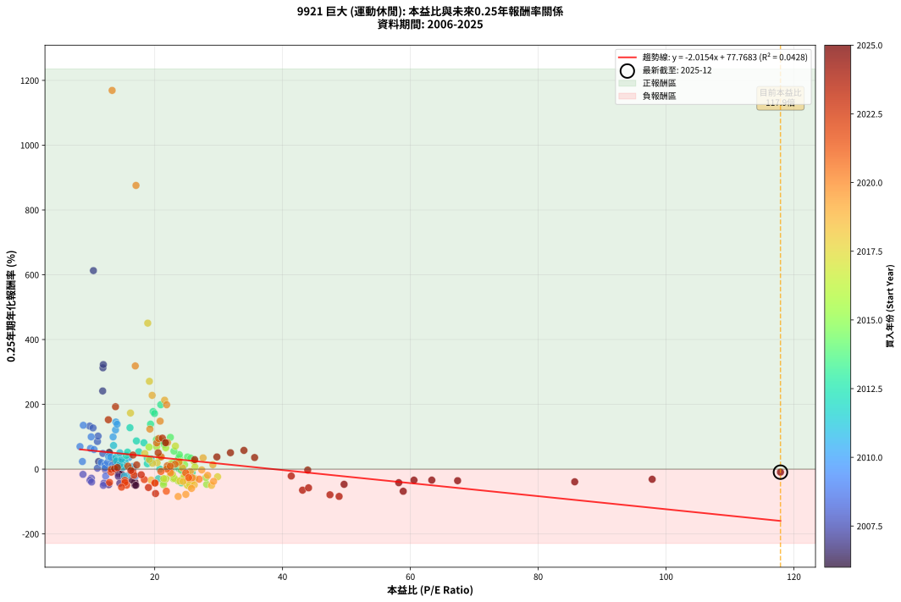
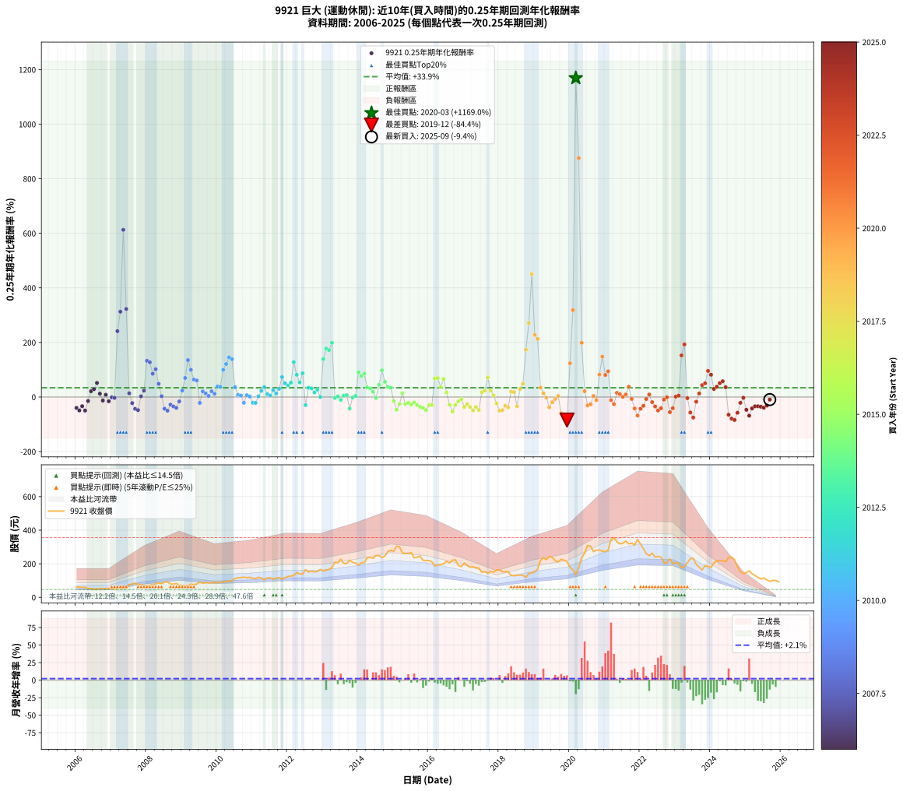

# 9921 巨大 - 本益比與未來報酬率分析

!!! info "報告資訊"
    - **股票代號**: 9921
    - **公司名稱**: 巨大
    - **產業別**: 運動休閒
    - **分析期間**: 2006-2025 (237 個數據點)
    - **資料來源**: Type 12 (ShowMonthlyK_ChartFlow) 月收盤價與本益比
    - **報酬率口徑**: 含現金股利 (簡化: 年度合計，假設每年7/1入帳)
    - **報告生成時間**: 2026-01-05 21:25:19 CST

## 📈 視覺化圖表

### 圖表1: 本益比 vs 未來報酬率關係

*圖表1：9921 巨大 本益比與0.25年期未來報酬率關係 (2006-2025)*

### 圖表2: 歷年買入時點的0.25年期實際報酬率

*圖表2：9921 巨大 歷年買入時點的0.25年期實際報酬率 (2006-2025)*

## 📍 買點訊號說明

本報告提供兩種買點提示訊號（顯示於圖表2的股價子圖中）：

### ▲ 小綠色三角形（回測驗證）
- **計算方式**: 使用全部歷史資料計算本益比第25百分位數
- **用途**: 事後驗證，顯示歷史上哪些時點確實為低估區
- **限制**: 當下無法判斷，僅供回測參考
- **特性**: 後見之明（Look-Ahead Bias）

### ▲ 小橘色三角形（即時訊號）
- **計算方式**: 使用截至當月的過去5年資料計算本益比第25百分位數
- **用途**: 實際投資決策，當時即可判斷
- **優勢**: 可操作性強，符合實務需求
- **特性**: 無後見之明，滾動窗口計算

!!! tip "如何使用兩種訊號"
    - **綠色▲** 幫助理解歷史估值機會，驗證策略有效性
    - **橘色▲** 可作為實際買進參考，但仍需搭配基本面分析
    - 兩種訊號重疊時，表示即時判斷與事後驗證一致，信心度較高
    - 僅有綠色▲時，表示當時無法判斷（需要未來資料才能確認）
    - 僅有橘色▲時，表示即時判斷為買點，但事後可能不是最佳時機

## 📊 估值分析摘要

| 指標 | 數值 |
|:---:|:---:|
| **目前本益比** (2025-09) | **117.90 倍** |
| **歷史平均本益比** | 21.75 倍 |
| **估值水準** | 🔴 相對高估 |
| **預期0.25年年化報酬率** | **-159.85%** |
| **歷史平均報酬率** | +33.94% |
| **相關係數 (R²)** | 0.0428 |
| **趨勢線斜率** | -2.0154 |

!!! abstract "核心洞察"
    目前本益比顯著高於歷史平均，預期未來報酬率可能較低

    根據歷史數據回測，9921 巨大 在目前本益比 **117.9倍** 的估值水準下，
    預期未來0.25年年化報酬率約為 **-159.8%**。

    **重要提醒**: 本分析基於歷史數據統計，實際報酬率會受到公司基本面變化、產業趨勢、
    總體經濟環境等多重因素影響。R² = 0.04 表示本益比可解釋約 4.3% 的報酬率變異。

## 📈 歷史估值統計

### 最佳買點 (最高報酬率)

| 項目 | 數值 |
|:---:|:---:|
| 起始時間 | 2020-03 |
| 當時本益比 | 13.34 倍 |
| 起始價格 | 134.0 元 |
| 0.25年後價格 | 308.5 元 |
| **0.25年年化報酬率** | **+1169.02%** |

### 最差買點 (最低報酬率)

| 項目 | 數值 |
|:---:|:---:|
| 起始時間 | 2019-12 |
| 當時本益比 | 23.67 倍 |
| 起始價格 | 213.0 元 |
| 0.25年後價格 | 134.0 元 |
| **0.25年年化報酬率** | **-84.44%** |

## 🎯 投資啟示

### 本益比與報酬率關係

趨勢線方程式: **y = -2.0154x + 77.7683**

!!! warning "強負相關"
    本益比與未來報酬率呈現強負相關。在高本益比時期買入，未來報酬率顯著較低；
    在低本益比時期買入，未來報酬率顯著較高。**估值紀律至關重要**。

### 估值區間建議

基於歷史數據分析:

- **🟢 低估區** (P/E < 17.4): 預期報酬率較高，可考慮增加持股
- **🟡 合理區** (P/E 17.4-26.1): 預期報酬率符合長期趨勢，正常持有
- **🔴 高估區** (P/E > 26.1): 預期報酬率較低，可考慮減碼或觀望

!!! danger "風險提示"
    - 過去表現不代表未來結果
    - 本分析假設公司基本面無重大結構性變化
    - 產業環境劇變可能使歷史規律失效
    - 應結合公司財報、產業趨勢、總體經濟等多重因素綜合判斷

!!! success "長期投資觀點"
    歷史數據顯示，在合理或低估的估值水準買入並長期持有，
    往往能獲得較佳的投資報酬。**耐心等待好價格**是價值投資的核心原則。

## 📊 數據品質

- **資料來源**: GoodInfo.tw Type 12 (ShowMonthlyK_ChartFlow)
- **資料頻率**: 月度收盤價與本益比
- **回測期間**: 2006-2025
- **數據點數量**: 237 個 (每個點代表一次0.25年期回測)

### 計算方法說明

1. **0.25年期年化報酬率**:
   - 對每個歷史時點，計算其後0.25年的實際投資報酬率
   - 期末價值(不含股利): 期末價格
   - 期末價值(含現金股利): 期末價格 + 持有期間內的現金股利合計 (簡化: 年度合計，假設每年7/1入帳)
   - 公式: 年化報酬率 = [(期末價值/期初價格)^(1/年數) - 1] × 100%

2. **本益比 (P/E Ratio)**:
   - 使用當時的月收盤價與EPS計算
   - 資料來源: Type 12 月度河流圖本益比數據

3. **趨勢線 (Linear Regression)**:
   - 使用最小平方法擬合線性趨勢線
   - R²值衡量本益比對報酬率的解釋能力

---

*本報告由 Stock Analysis System v1.9.0 自動生成*
*數據更新時間: 2026-01-05 21:25:19 CST*

## 📋 月度回測明細表

（每一列對應時間線圖中的一個買入點；可用來對照 SVG 圖上的每個點。）

| 買入月份 | 賣出月份 | 回測期限_年 | 實際持有年數 | 買入本益比_倍 | 買入收盤價_元 | 賣出收盤價_元 | 現金股利合計_元 | 總報酬率_pct | 年化報酬率_pct |
| --- | --- | --- | --- | --- | --- | --- | --- | --- | --- |
| 2006-01 | 2006-05 | 0.25 | 0.329 | 16.90 | 61.00 | 51.60 | 0.00 | -15.41 | -39.91 |
| 2006-02 | 2006-05 | 0.25 | 0.246 | 16.90 | 61.00 | 51.60 | 0.00 | -15.41 | -49.30 |
| 2006-03 | 2006-07 | 0.25 | 0.334 | 16.45 | 59.40 | 48.80 | 3.00 | -12.79 | -33.63 |
| 2006-04 | 2006-07 | 0.25 | 0.249 | 17.04 | 61.50 | 48.80 | 3.00 | -15.77 | -49.79 |
| 2006-05 | 2006-08 | 0.25 | 0.252 | 14.29 | 51.60 | 46.55 | 3.00 | -3.97 | -14.87 |
| 2006-06 | 2006-09 | 0.25 | 0.252 | 14.52 | 52.40 | 52.00 | 3.00 | +4.96 | +21.20 |
| 2006-07 | 2006-10 | 0.25 | 0.252 | 13.52 | 48.80 | 52.00 | 0.00 | +6.56 | +28.68 |
| 2006-08 | 2006-12 | 0.25 | 0.334 | 12.89 | 46.55 | 53.50 | 0.00 | +14.93 | +51.68 |
| 2006-09 | 2006-12 | 0.25 | 0.249 | 14.40 | 52.00 | 53.50 | 0.00 | +2.88 | +12.09 |
| 2006-10 | 2007-01 | 0.25 | 0.252 | 14.40 | 52.00 | 50.20 | 0.00 | -3.46 | -13.05 |
| 2006-11 | 2007-03 | 0.25 | 0.329 | 13.85 | 50.00 | 51.30 | 0.00 | +2.60 | +8.13 |
| 2006-12 | 2007-03 | 0.25 | 0.246 | 14.82 | 53.50 | 51.30 | 0.00 | -4.11 | -15.67 |
| 2007-01 | 2007-05 | 0.25 | 0.329 | 13.04 | 50.20 | 50.00 | 0.00 | -0.40 | -1.21 |
| 2007-02 | 2007-05 | 0.25 | 0.246 | 12.33 | 50.40 | 50.00 | 0.00 | -0.79 | -3.18 |
| 2007-03 | 2007-07 | 0.25 | 0.334 | 11.86 | 51.30 | 74.30 | 3.00 | +50.68 | +241.26 |
| 2007-04 | 2007-07 | 0.25 | 0.249 | 11.90 | 54.30 | 74.30 | 3.00 | +42.36 | +312.69 |
| 2007-05 | 2007-08 | 0.25 | 0.252 | 10.41 | 50.00 | 79.00 | 3.00 | +64.00 | +612.78 |
| 2007-06 | 2007-09 | 0.25 | 0.252 | 11.96 | 60.30 | 83.70 | 3.00 | +43.78 | +322.76 |
| 2007-07 | 2007-10 | 0.25 | 0.252 | 14.08 | 74.30 | 76.70 | 0.00 | +3.23 | +13.45 |
| 2007-08 | 2007-12 | 0.25 | 0.334 | 14.32 | 79.00 | 72.60 | 0.00 | -8.10 | -22.35 |
| 2007-09 | 2007-12 | 0.25 | 0.249 | 14.54 | 83.70 | 72.60 | 0.00 | -13.26 | -43.51 |
| 2007-10 | 2008-01 | 0.25 | 0.252 | 12.80 | 76.70 | 65.00 | 0.00 | -15.25 | -48.17 |
| 2007-11 | 2008-03 | 0.25 | 0.331 | 12.18 | 75.90 | 76.50 | 0.00 | +0.79 | +2.41 |
| 2007-12 | 2008-03 | 0.25 | 0.249 | 11.22 | 72.60 | 76.50 | 0.00 | +5.37 | +23.37 |
| 2008-01 | 2008-05 | 0.25 | 0.331 | 9.82 | 65.00 | 86.00 | 0.00 | +32.31 | +132.82 |
| 2008-02 | 2008-05 | 0.25 | 0.249 | 10.35 | 70.10 | 86.00 | 0.00 | +22.68 | +127.16 |
| 2008-03 | 2008-07 | 0.25 | 0.334 | 11.04 | 76.50 | 91.00 | 3.00 | +22.88 | +85.29 |
| 2008-04 | 2008-07 | 0.25 | 0.249 | 11.14 | 78.90 | 91.00 | 3.00 | +19.14 | +101.95 |
| 2008-05 | 2008-08 | 0.25 | 0.252 | 11.89 | 86.00 | 92.00 | 3.00 | +10.47 | +48.46 |
| 2008-06 | 2008-09 | 0.25 | 0.252 | 11.04 | 81.50 | 79.10 | 3.00 | +0.74 | +2.95 |
| 2008-07 | 2008-10 | 0.25 | 0.252 | 12.07 | 91.00 | 79.00 | 0.00 | -13.19 | -42.96 |
| 2008-08 | 2008-12 | 0.25 | 0.334 | 11.96 | 92.00 | 72.90 | 0.00 | -20.76 | -50.18 |
| 2008-09 | 2008-12 | 0.25 | 0.249 | 10.09 | 79.10 | 72.90 | 0.00 | -7.84 | -27.94 |
| 2008-10 | 2009-01 | 0.25 | 0.252 | 9.88 | 79.00 | 71.00 | 0.00 | -10.13 | -34.55 |
| 2008-11 | 2009-03 | 0.25 | 0.329 | 10.13 | 82.50 | 69.80 | 0.00 | -15.39 | -39.88 |
| 2008-12 | 2009-03 | 0.25 | 0.246 | 8.78 | 72.90 | 69.80 | 0.00 | -4.25 | -16.17 |
| 2009-01 | 2009-05 | 0.25 | 0.329 | 8.69 | 71.00 | 76.10 | 0.00 | +7.18 | +23.51 |
| 2009-02 | 2009-05 | 0.25 | 0.246 | 8.31 | 66.80 | 76.10 | 0.00 | +13.92 | +69.72 |
| 2009-03 | 2009-07 | 0.25 | 0.334 | 8.83 | 69.80 | 90.90 | 2.00 | +33.09 | +135.35 |
| 2009-04 | 2009-07 | 0.25 | 0.249 | 10.06 | 78.20 | 90.90 | 2.00 | +18.80 | +99.65 |
| 2009-05 | 2009-08 | 0.25 | 0.252 | 9.96 | 76.10 | 84.20 | 2.00 | +13.27 | +64.01 |
| 2009-06 | 2009-09 | 0.25 | 0.252 | 10.51 | 78.90 | 86.90 | 2.00 | +12.67 | +60.60 |
| 2009-07 | 2009-10 | 0.25 | 0.252 | 12.33 | 90.90 | 85.50 | 0.00 | -5.94 | -21.58 |
| 2009-08 | 2009-12 | 0.25 | 0.334 | 11.63 | 84.20 | 89.60 | 0.00 | +6.41 | +20.45 |
| 2009-09 | 2009-12 | 0.25 | 0.249 | 12.23 | 86.90 | 89.60 | 0.00 | +3.11 | +13.07 |
| 2009-10 | 2010-01 | 0.25 | 0.252 | 12.26 | 85.50 | 86.30 | 0.00 | +0.94 | +3.77 |
| 2009-11 | 2010-03 | 0.25 | 0.329 | 12.64 | 86.50 | 92.10 | 0.00 | +6.47 | +21.04 |
| 2009-12 | 2010-03 | 0.25 | 0.246 | 13.35 | 89.60 | 92.10 | 0.00 | +2.79 | +11.82 |
| 2010-01 | 2010-05 | 0.25 | 0.329 | 12.79 | 86.30 | 96.10 | 0.00 | +11.36 | +38.73 |
| 2010-02 | 2010-05 | 0.25 | 0.246 | 13.10 | 88.90 | 96.10 | 0.00 | +8.10 | +37.17 |
| 2010-03 | 2010-07 | 0.25 | 0.334 | 13.49 | 92.10 | 111.50 | 4.50 | +25.95 | +99.52 |
| 2010-04 | 2010-07 | 0.25 | 0.249 | 13.87 | 95.20 | 111.50 | 4.50 | +21.85 | +121.04 |
| 2010-05 | 2010-08 | 0.25 | 0.252 | 13.92 | 96.10 | 116.00 | 4.50 | +25.39 | +145.54 |
| 2010-06 | 2010-09 | 0.25 | 0.252 | 14.12 | 98.00 | 117.50 | 4.50 | +24.49 | +138.61 |
| 2010-07 | 2010-10 | 0.25 | 0.252 | 15.98 | 111.50 | 120.50 | 0.00 | +8.07 | +36.09 |
| 2010-08 | 2010-12 | 0.25 | 0.334 | 16.53 | 116.00 | 119.00 | 0.00 | +2.59 | +7.94 |
| 2010-09 | 2010-12 | 0.25 | 0.249 | 16.65 | 117.50 | 119.00 | 0.00 | +1.28 | +5.22 |
| 2010-10 | 2011-01 | 0.25 | 0.252 | 16.99 | 120.50 | 113.50 | 0.00 | -5.81 | -21.15 |
| 2010-11 | 2011-03 | 0.25 | 0.329 | 16.41 | 117.00 | 119.50 | 0.00 | +2.14 | +6.65 |
| 2010-12 | 2011-03 | 0.25 | 0.246 | 16.60 | 119.00 | 119.50 | 0.00 | +0.42 | +1.72 |
| 2011-01 | 2011-05 | 0.25 | 0.329 | 15.67 | 113.50 | 105.00 | 0.00 | -7.49 | -21.10 |
| 2011-02 | 2011-05 | 0.25 | 0.246 | 15.24 | 111.50 | 105.00 | 0.00 | -5.83 | -21.63 |
| 2011-03 | 2011-07 | 0.25 | 0.334 | 16.18 | 119.50 | 115.50 | 5.00 | +0.84 | +2.53 |
| 2011-04 | 2011-07 | 0.25 | 0.249 | 15.35 | 114.50 | 115.50 | 5.00 | +5.24 | +22.75 |
| 2011-05 | 2011-08 | 0.25 | 0.252 | 13.94 | 105.00 | 108.50 | 5.00 | +8.10 | +36.21 |
| 2011-06 | 2011-09 | 0.25 | 0.252 | 15.19 | 115.50 | 113.50 | 5.00 | +2.60 | +10.72 |
| 2011-07 | 2011-10 | 0.25 | 0.252 | 15.04 | 115.50 | 117.00 | 0.00 | +1.30 | +5.26 |
| 2011-08 | 2011-12 | 0.25 | 0.334 | 14.00 | 108.50 | 117.00 | 0.00 | +7.83 | +25.33 |
| 2011-09 | 2011-12 | 0.25 | 0.249 | 14.51 | 113.50 | 117.00 | 0.00 | +3.08 | +12.96 |
| 2011-10 | 2012-01 | 0.25 | 0.252 | 14.82 | 117.00 | 125.00 | 0.00 | +6.84 | +30.03 |
| 2011-11 | 2012-03 | 0.25 | 0.331 | 13.56 | 108.00 | 129.50 | 0.00 | +19.91 | +72.98 |
| 2011-12 | 2012-03 | 0.25 | 0.249 | 14.55 | 117.00 | 129.50 | 0.00 | +10.68 | +50.29 |
| 2012-01 | 2012-05 | 0.25 | 0.331 | 15.55 | 125.00 | 140.50 | 0.00 | +12.40 | +42.31 |
| 2012-02 | 2012-05 | 0.25 | 0.249 | 15.75 | 126.50 | 140.50 | 0.00 | +11.07 | +52.39 |
| 2012-03 | 2012-07 | 0.25 | 0.334 | 16.13 | 129.50 | 165.00 | 5.50 | +31.66 | +127.84 |
| 2012-04 | 2012-07 | 0.25 | 0.249 | 18.31 | 147.00 | 165.00 | 5.50 | +15.99 | +81.35 |
| 2012-05 | 2012-08 | 0.25 | 0.252 | 17.51 | 140.50 | 151.00 | 5.50 | +11.39 | +53.44 |
| 2012-06 | 2012-09 | 0.25 | 0.252 | 17.14 | 137.50 | 155.50 | 5.50 | +17.09 | +87.09 |
| 2012-07 | 2012-10 | 0.25 | 0.252 | 20.58 | 165.00 | 151.00 | 0.00 | -8.48 | -29.67 |
| 2012-08 | 2012-12 | 0.25 | 0.334 | 18.84 | 151.00 | 166.50 | 0.00 | +10.26 | +33.98 |
| 2012-09 | 2012-12 | 0.25 | 0.249 | 19.41 | 155.50 | 166.50 | 0.00 | +7.07 | +31.57 |
| 2012-10 | 2013-01 | 0.25 | 0.252 | 18.85 | 151.00 | 157.00 | 0.00 | +3.97 | +16.73 |
| 2012-11 | 2013-03 | 0.25 | 0.329 | 19.23 | 154.00 | 166.50 | 0.00 | +8.12 | +26.81 |
| 2012-12 | 2013-03 | 0.25 | 0.246 | 20.80 | 166.50 | 166.50 | 0.00 | +0.00 | +0.00 |
| 2013-01 | 2013-05 | 0.25 | 0.329 | 19.35 | 157.00 | 209.00 | 0.00 | +33.12 | +138.88 |
| 2013-02 | 2013-05 | 0.25 | 0.246 | 19.75 | 162.50 | 209.00 | 0.00 | +28.62 | +177.68 |
| 2013-03 | 2013-07 | 0.25 | 0.334 | 19.97 | 166.50 | 227.00 | 5.50 | +39.64 | +171.73 |
| 2013-04 | 2013-07 | 0.25 | 0.249 | 20.95 | 177.00 | 227.00 | 5.50 | +31.36 | +198.83 |
| 2013-05 | 2013-08 | 0.25 | 0.252 | 24.41 | 209.00 | 201.50 | 5.50 | -0.96 | -3.75 |
| 2013-06 | 2013-09 | 0.25 | 0.252 | 23.76 | 206.00 | 201.50 | 5.50 | +0.49 | +1.94 |
| 2013-07 | 2013-10 | 0.25 | 0.252 | 25.85 | 227.00 | 220.50 | 0.00 | -2.86 | -10.89 |
| 2013-08 | 2013-12 | 0.25 | 0.334 | 22.65 | 201.50 | 205.00 | 0.00 | +1.74 | +5.29 |
| 2013-09 | 2013-12 | 0.25 | 0.249 | 22.37 | 201.50 | 205.00 | 0.00 | +1.74 | +7.16 |
| 2013-10 | 2014-01 | 0.25 | 0.252 | 24.18 | 220.50 | 192.00 | 0.00 | -12.93 | -42.27 |
| 2013-11 | 2014-03 | 0.25 | 0.329 | 22.59 | 208.50 | 207.00 | 0.00 | -0.72 | -2.17 |
| 2013-12 | 2014-03 | 0.25 | 0.246 | 21.95 | 205.00 | 207.00 | 0.00 | +0.98 | +4.02 |
| 2014-01 | 2014-05 | 0.25 | 0.329 | 20.26 | 192.00 | 237.50 | 0.00 | +23.70 | +91.04 |
| 2014-02 | 2014-05 | 0.25 | 0.246 | 21.49 | 206.50 | 237.50 | 0.00 | +15.01 | +76.41 |
| 2014-03 | 2014-07 | 0.25 | 0.334 | 21.24 | 207.00 | 248.50 | 6.00 | +22.95 | +85.61 |
| 2014-04 | 2014-07 | 0.25 | 0.249 | 23.89 | 236.00 | 248.50 | 6.00 | +7.84 | +35.38 |
| 2014-05 | 2014-08 | 0.25 | 0.252 | 23.71 | 237.50 | 248.50 | 6.00 | +7.16 | +31.58 |
| 2014-06 | 2014-09 | 0.25 | 0.252 | 22.91 | 232.50 | 237.00 | 6.00 | +4.52 | +19.17 |
| 2014-07 | 2014-10 | 0.25 | 0.252 | 24.16 | 248.50 | 246.00 | 0.00 | -1.01 | -3.93 |
| 2014-08 | 2014-12 | 0.25 | 0.334 | 23.85 | 248.50 | 281.00 | 0.00 | +13.08 | +44.48 |
| 2014-09 | 2014-12 | 0.25 | 0.249 | 22.45 | 237.00 | 281.00 | 0.00 | +18.57 | +98.08 |
| 2014-10 | 2015-01 | 0.25 | 0.252 | 23.01 | 246.00 | 275.00 | 0.00 | +11.79 | +55.65 |
| 2014-11 | 2015-03 | 0.25 | 0.329 | 25.13 | 272.00 | 302.00 | 0.00 | +11.03 | +37.50 |
| 2014-12 | 2015-03 | 0.25 | 0.246 | 25.64 | 281.00 | 302.00 | 0.00 | +7.47 | +33.98 |
| 2015-01 | 2015-05 | 0.25 | 0.329 | 25.23 | 275.00 | 261.00 | 0.00 | -5.09 | -14.70 |
| 2015-02 | 2015-05 | 0.25 | 0.246 | 28.13 | 305.00 | 261.00 | 0.00 | -14.43 | -46.86 |
| 2015-03 | 2015-07 | 0.25 | 0.334 | 28.01 | 302.00 | 266.50 | 6.60 | -9.57 | -26.00 |
| 2015-04 | 2015-07 | 0.25 | 0.249 | 24.67 | 264.50 | 266.50 | 6.60 | +3.25 | +13.70 |
| 2015-05 | 2015-08 | 0.25 | 0.252 | 24.47 | 261.00 | 235.50 | 6.60 | -7.24 | -25.80 |
| 2015-06 | 2015-09 | 0.25 | 0.252 | 24.61 | 261.00 | 239.00 | 6.60 | -5.90 | -21.45 |
| 2015-07 | 2015-10 | 0.25 | 0.252 | 25.27 | 266.50 | 245.50 | 0.00 | -7.88 | -27.81 |
| 2015-08 | 2015-12 | 0.25 | 0.334 | 22.46 | 235.50 | 219.00 | 0.00 | -7.01 | -19.54 |
| 2015-09 | 2015-12 | 0.25 | 0.249 | 22.92 | 239.00 | 219.00 | 0.00 | -8.37 | -29.59 |
| 2015-10 | 2016-01 | 0.25 | 0.252 | 23.68 | 245.50 | 219.00 | 0.00 | -10.79 | -36.46 |
| 2015-11 | 2016-03 | 0.25 | 0.331 | 21.39 | 220.50 | 186.00 | 0.00 | -15.65 | -40.17 |
| 2015-12 | 2016-03 | 0.25 | 0.249 | 21.37 | 219.00 | 186.00 | 0.00 | -15.07 | -48.08 |
| 2016-01 | 2016-05 | 0.25 | 0.331 | 21.73 | 219.00 | 194.50 | 0.00 | -11.19 | -30.10 |
| 2016-02 | 2016-05 | 0.25 | 0.249 | 21.41 | 212.00 | 194.50 | 0.00 | -8.25 | -29.23 |
| 2016-03 | 2016-07 | 0.25 | 0.334 | 19.12 | 186.00 | 215.00 | 6.20 | +18.92 | +68.02 |
| 2016-04 | 2016-07 | 0.25 | 0.249 | 20.30 | 194.00 | 215.00 | 6.20 | +14.02 | +69.32 |
| 2016-05 | 2016-08 | 0.25 | 0.252 | 20.73 | 194.50 | 204.50 | 6.20 | +8.33 | +37.39 |
| 2016-06 | 2016-09 | 0.25 | 0.252 | 21.72 | 200.00 | 221.00 | 6.20 | +13.60 | +65.90 |
| 2016-07 | 2016-10 | 0.25 | 0.252 | 23.79 | 215.00 | 223.50 | 0.00 | +3.95 | +16.64 |
| 2016-08 | 2016-12 | 0.25 | 0.334 | 23.07 | 204.50 | 183.00 | 0.00 | -10.51 | -28.29 |
| 2016-09 | 2016-12 | 0.25 | 0.249 | 25.43 | 221.00 | 183.00 | 0.00 | -17.19 | -53.11 |
| 2016-10 | 2017-01 | 0.25 | 0.252 | 26.24 | 223.50 | 205.00 | 0.00 | -8.28 | -29.04 |
| 2016-11 | 2017-03 | 0.25 | 0.329 | 22.77 | 190.00 | 179.50 | 0.00 | -5.53 | -15.89 |
| 2016-12 | 2017-03 | 0.25 | 0.246 | 22.40 | 183.00 | 179.50 | 0.00 | -1.91 | -7.54 |
| 2017-01 | 2017-05 | 0.25 | 0.329 | 25.80 | 205.00 | 176.50 | 0.00 | -13.90 | -36.59 |
| 2017-02 | 2017-05 | 0.25 | 0.246 | 24.61 | 190.00 | 176.50 | 0.00 | -7.11 | -25.85 |
| 2017-03 | 2017-07 | 0.25 | 0.334 | 23.94 | 179.50 | 149.00 | 5.00 | -14.21 | -36.79 |
| 2017-04 | 2017-07 | 0.25 | 0.249 | 25.09 | 182.50 | 149.00 | 5.00 | -15.62 | -49.42 |
| 2017-05 | 2017-08 | 0.25 | 0.252 | 25.04 | 176.50 | 152.50 | 5.00 | -10.76 | -36.38 |
| 2017-06 | 2017-09 | 0.25 | 0.252 | 25.49 | 174.00 | 143.00 | 5.00 | -14.94 | -47.40 |
| 2017-07 | 2017-10 | 0.25 | 0.252 | 22.57 | 149.00 | 155.00 | 0.00 | +4.03 | +16.97 |
| 2017-08 | 2017-12 | 0.25 | 0.334 | 23.92 | 152.50 | 163.50 | 0.00 | +7.21 | +23.18 |
| 2017-09 | 2017-12 | 0.25 | 0.249 | 23.24 | 143.00 | 163.50 | 0.00 | +14.34 | +71.21 |
| 2017-10 | 2018-01 | 0.25 | 0.252 | 26.15 | 155.00 | 163.50 | 0.00 | +5.48 | +23.61 |
| 2017-11 | 2018-03 | 0.25 | 0.329 | 26.30 | 150.00 | 153.00 | 0.00 | +2.00 | +6.21 |
| 2017-12 | 2018-03 | 0.25 | 0.246 | 29.84 | 163.50 | 153.00 | 0.00 | -6.42 | -23.61 |
| 2018-01 | 2018-05 | 0.25 | 0.329 | 28.89 | 163.50 | 130.00 | 0.00 | -20.49 | -50.24 |
| 2018-02 | 2018-05 | 0.25 | 0.246 | 26.20 | 153.00 | 130.00 | 0.00 | -15.03 | -48.37 |
| 2018-03 | 2018-07 | 0.25 | 0.334 | 25.42 | 153.00 | 131.00 | 3.50 | -12.09 | -32.01 |
| 2018-04 | 2018-07 | 0.25 | 0.249 | 24.44 | 151.50 | 131.00 | 3.50 | -11.22 | -37.98 |
| 2018-05 | 2018-08 | 0.25 | 0.252 | 20.38 | 130.00 | 132.50 | 3.50 | +4.62 | +19.62 |
| 2018-06 | 2018-09 | 0.25 | 0.252 | 19.66 | 129.00 | 131.00 | 3.50 | +4.26 | +18.03 |
| 2018-07 | 2018-10 | 0.25 | 0.252 | 19.44 | 131.00 | 118.00 | 0.00 | -9.92 | -33.96 |
| 2018-08 | 2018-12 | 0.25 | 0.334 | 19.15 | 132.50 | 144.50 | 0.00 | +9.06 | +29.64 |
| 2018-09 | 2018-12 | 0.25 | 0.249 | 18.45 | 131.00 | 144.50 | 0.00 | +10.31 | +48.24 |
| 2018-10 | 2019-01 | 0.25 | 0.252 | 16.21 | 118.00 | 152.00 | 0.00 | +28.81 | +173.25 |
| 2018-11 | 2019-03 | 0.25 | 0.329 | 19.17 | 143.00 | 220.00 | 0.00 | +53.85 | +271.06 |
| 2018-12 | 2019-03 | 0.25 | 0.246 | 18.91 | 144.50 | 220.00 | 0.00 | +52.25 | +450.64 |
| 2019-01 | 2019-05 | 0.25 | 0.329 | 19.60 | 152.00 | 224.50 | 0.00 | +47.70 | +227.74 |
| 2019-02 | 2019-05 | 0.25 | 0.246 | 21.55 | 169.50 | 224.50 | 0.00 | +32.45 | +212.83 |
| 2019-03 | 2019-07 | 0.25 | 0.334 | 27.57 | 220.00 | 238.50 | 4.60 | +10.50 | +34.84 |
| 2019-04 | 2019-07 | 0.25 | 0.249 | 29.10 | 235.50 | 238.50 | 4.60 | +3.23 | +13.60 |
| 2019-05 | 2019-08 | 0.25 | 0.252 | 27.36 | 224.50 | 218.50 | 4.60 | -0.62 | -2.45 |
| 2019-06 | 2019-09 | 0.25 | 0.252 | 29.21 | 243.00 | 211.00 | 4.60 | -11.28 | -37.81 |
| 2019-07 | 2019-10 | 0.25 | 0.252 | 28.28 | 238.50 | 226.00 | 0.00 | -5.24 | -19.24 |
| 2019-08 | 2019-12 | 0.25 | 0.334 | 25.57 | 218.50 | 213.00 | 0.00 | -2.52 | -7.35 |
| 2019-09 | 2019-12 | 0.25 | 0.249 | 24.36 | 211.00 | 213.00 | 0.00 | +0.95 | +3.86 |
| 2019-10 | 2020-01 | 0.25 | 0.252 | 25.76 | 226.00 | 180.00 | 0.00 | -20.35 | -59.49 |
| 2019-11 | 2020-03 | 0.25 | 0.331 | 24.87 | 221.00 | 134.00 | 0.00 | -39.37 | -77.92 |
| 2019-12 | 2020-03 | 0.25 | 0.249 | 23.67 | 213.00 | 134.00 | 0.00 | -37.09 | -84.44 |
| 2020-01 | 2020-05 | 0.25 | 0.331 | 19.25 | 180.00 | 235.00 | 0.00 | +30.56 | +123.63 |
| 2020-02 | 2020-05 | 0.25 | 0.249 | 16.96 | 164.50 | 235.00 | 0.00 | +42.86 | +318.54 |
| 2020-03 | 2020-07 | 0.25 | 0.334 | 13.34 | 134.00 | 308.50 | 4.60 | +133.66 | +1169.02 |
| 2020-04 | 2020-07 | 0.25 | 0.249 | 17.07 | 177.50 | 308.50 | 4.60 | +76.39 | +875.72 |
| 2020-05 | 2020-08 | 0.25 | 0.252 | 21.87 | 235.00 | 305.00 | 4.60 | +31.74 | +198.78 |
| 2020-06 | 2020-09 | 0.25 | 0.252 | 23.79 | 264.00 | 272.50 | 4.60 | +4.96 | +21.20 |
| 2020-07 | 2020-10 | 0.25 | 0.252 | 26.96 | 308.50 | 281.00 | 0.00 | -8.91 | -30.97 |
| 2020-08 | 2020-12 | 0.25 | 0.334 | 25.86 | 305.00 | 275.00 | 0.00 | -9.84 | -26.65 |
| 2020-09 | 2020-12 | 0.25 | 0.249 | 22.44 | 272.50 | 275.00 | 0.00 | +0.92 | +3.73 |
| 2020-10 | 2021-01 | 0.25 | 0.252 | 22.49 | 281.00 | 272.50 | 0.00 | -3.02 | -11.48 |
| 2020-11 | 2021-03 | 0.25 | 0.329 | 22.00 | 282.50 | 344.00 | 0.00 | +21.77 | +82.12 |
| 2020-12 | 2021-03 | 0.25 | 0.246 | 20.85 | 275.00 | 344.00 | 0.00 | +25.09 | +148.07 |
| 2021-01 | 2021-05 | 0.25 | 0.329 | 20.32 | 272.50 | 331.00 | 0.00 | +21.47 | +80.75 |
| 2021-02 | 2021-05 | 0.25 | 0.246 | 20.62 | 281.00 | 331.00 | 0.00 | +17.79 | +94.37 |
| 2021-03 | 2021-07 | 0.25 | 0.334 | 24.85 | 344.00 | 322.00 | 8.00 | -4.07 | -11.70 |
| 2021-04 | 2021-07 | 0.25 | 0.249 | 25.31 | 356.00 | 322.00 | 8.00 | -7.30 | -26.24 |
| 2021-05 | 2021-08 | 0.25 | 0.252 | 23.18 | 331.00 | 335.00 | 8.00 | +3.63 | +15.19 |
| 2021-06 | 2021-09 | 0.25 | 0.252 | 21.97 | 318.50 | 318.50 | 8.00 | +2.51 | +10.35 |
| 2021-07 | 2021-10 | 0.25 | 0.252 | 21.88 | 322.00 | 322.50 | 0.00 | +0.16 | +0.62 |
| 2021-08 | 2021-12 | 0.25 | 0.334 | 22.43 | 335.00 | 345.00 | 0.00 | +2.99 | +9.21 |
| 2021-09 | 2021-12 | 0.25 | 0.249 | 21.02 | 318.50 | 345.00 | 0.00 | +8.32 | +37.82 |
| 2021-10 | 2022-01 | 0.25 | 0.252 | 20.98 | 322.50 | 316.50 | 0.00 | -1.86 | -7.18 |
| 2021-11 | 2022-03 | 0.25 | 0.329 | 19.98 | 311.50 | 260.50 | 0.00 | -16.37 | -41.97 |
| 2021-12 | 2022-03 | 0.25 | 0.246 | 21.82 | 345.00 | 260.50 | 0.00 | -24.49 | -68.02 |
| 2022-01 | 2022-05 | 0.25 | 0.329 | 20.05 | 316.50 | 263.00 | 0.00 | -16.90 | -43.08 |
| 2022-02 | 2022-05 | 0.25 | 0.246 | 18.37 | 289.50 | 263.00 | 0.00 | -9.15 | -32.27 |
| 2022-03 | 2022-07 | 0.25 | 0.334 | 16.56 | 260.50 | 244.00 | 10.00 | -2.50 | -7.29 |
| 2022-04 | 2022-07 | 0.25 | 0.249 | 15.82 | 248.50 | 244.00 | 10.00 | +2.21 | +9.18 |
| 2022-05 | 2022-08 | 0.25 | 0.252 | 16.77 | 263.00 | 239.50 | 10.00 | -5.13 | -18.88 |
| 2022-06 | 2022-09 | 0.25 | 0.252 | 15.33 | 240.00 | 205.50 | 10.00 | -10.21 | -34.79 |
| 2022-07 | 2022-10 | 0.25 | 0.252 | 15.61 | 244.00 | 205.50 | 0.00 | -15.78 | -49.43 |
| 2022-08 | 2022-12 | 0.25 | 0.334 | 15.34 | 239.50 | 200.50 | 0.00 | -16.28 | -41.26 |
| 2022-09 | 2022-12 | 0.25 | 0.249 | 13.19 | 205.50 | 200.50 | 0.00 | -2.43 | -9.41 |
| 2022-10 | 2023-01 | 0.25 | 0.252 | 13.21 | 205.50 | 205.00 | 0.00 | -0.24 | -0.96 |
| 2022-11 | 2023-03 | 0.25 | 0.329 | 14.81 | 230.00 | 176.00 | 0.00 | -23.48 | -55.71 |
| 2022-12 | 2023-03 | 0.25 | 0.246 | 12.93 | 200.50 | 176.00 | 0.00 | -12.22 | -41.08 |
| 2023-01 | 2023-05 | 0.25 | 0.329 | 13.72 | 205.00 | 206.00 | 0.00 | +0.49 | +1.49 |
| 2023-02 | 2023-05 | 0.25 | 0.246 | 14.16 | 203.50 | 206.00 | 0.00 | +1.23 | +5.08 |
| 2023-03 | 2023-07 | 0.25 | 0.334 | 12.75 | 176.00 | 232.00 | 7.80 | +36.25 | +152.45 |
| 2023-04 | 2023-07 | 0.25 | 0.249 | 13.87 | 183.50 | 232.00 | 7.80 | +30.68 | +192.72 |
| 2023-05 | 2023-08 | 0.25 | 0.252 | 16.27 | 206.00 | 196.00 | 7.80 | -1.07 | -4.17 |
| 2023-06 | 2023-09 | 0.25 | 0.252 | 19.02 | 230.00 | 178.50 | 7.80 | -19.00 | -56.68 |
| 2023-07 | 2023-10 | 0.25 | 0.252 | 20.13 | 232.00 | 163.00 | 0.00 | -29.74 | -75.37 |
| 2023-08 | 2023-12 | 0.25 | 0.334 | 17.89 | 196.00 | 184.00 | 0.00 | -6.12 | -17.23 |
| 2023-09 | 2023-12 | 0.25 | 0.249 | 17.18 | 178.50 | 184.00 | 0.00 | +3.08 | +12.95 |
| 2023-10 | 2024-01 | 0.25 | 0.252 | 16.60 | 163.00 | 178.50 | 0.00 | +9.51 | +43.42 |
| 2023-11 | 2024-03 | 0.25 | 0.331 | 20.54 | 190.00 | 217.50 | 0.00 | +14.47 | +50.39 |
| 2023-12 | 2024-03 | 0.25 | 0.249 | 21.20 | 184.00 | 217.50 | 0.00 | +18.21 | +95.69 |
| 2024-01 | 2024-05 | 0.25 | 0.331 | 21.70 | 178.50 | 217.50 | 0.00 | +21.85 | +81.58 |
| 2024-02 | 2024-05 | 0.25 | 0.249 | 26.25 | 204.00 | 217.50 | 0.00 | +6.62 | +29.33 |
| 2024-03 | 2024-07 | 0.25 | 0.334 | 29.73 | 217.50 | 237.00 | 5.00 | +11.26 | +37.65 |
| 2024-04 | 2024-07 | 0.25 | 0.249 | 31.85 | 218.50 | 237.00 | 5.00 | +10.76 | +50.68 |
| 2024-05 | 2024-08 | 0.25 | 0.252 | 33.96 | 217.50 | 239.00 | 5.00 | +12.18 | +57.84 |
| 2024-06 | 2024-09 | 0.25 | 0.252 | 35.63 | 212.00 | 224.00 | 5.00 | +8.02 | +35.83 |
| 2024-07 | 2024-10 | 0.25 | 0.252 | 43.13 | 237.00 | 182.00 | 0.00 | -23.21 | -64.95 |
| 2024-08 | 2024-12 | 0.25 | 0.334 | 47.42 | 239.00 | 141.50 | 0.00 | -40.79 | -79.18 |
| 2024-09 | 2024-12 | 0.25 | 0.249 | 48.85 | 224.00 | 141.50 | 0.00 | -36.83 | -84.18 |
| 2024-10 | 2025-01 | 0.25 | 0.252 | 44.07 | 182.00 | 146.50 | 0.00 | -19.51 | -57.74 |
| 2024-11 | 2025-03 | 0.25 | 0.329 | 41.36 | 152.00 | 140.50 | 0.00 | -7.57 | -21.29 |
| 2024-12 | 2025-03 | 0.25 | 0.246 | 43.94 | 141.50 | 140.50 | 0.00 | -0.71 | -2.84 |
| 2025-01 | 2025-05 | 0.25 | 0.329 | 49.63 | 146.50 | 119.00 | 0.00 | -18.77 | -46.89 |
| 2025-02 | 2025-05 | 0.25 | 0.246 | 58.88 | 158.00 | 119.00 | 0.00 | -24.68 | -68.35 |
| 2025-03 | 2025-07 | 0.25 | 0.334 | 58.18 | 140.50 | 115.00 | 2.20 | -16.58 | -41.89 |
| 2025-04 | 2025-07 | 0.25 | 0.249 | 60.56 | 130.00 | 115.00 | 2.20 | -9.85 | -34.03 |
| 2025-05 | 2025-08 | 0.25 | 0.252 | 63.35 | 119.00 | 105.00 | 2.20 | -9.92 | -33.94 |
| 2025-06 | 2025-09 | 0.25 | 0.252 | 67.39 | 108.50 | 94.90 | 2.20 | -10.51 | -35.64 |
| 2025-07 | 2025-10 | 0.25 | 0.252 | 85.71 | 115.00 | 101.50 | 0.00 | -11.74 | -39.09 |
| 2025-08 | 2025-12 | 0.25 | 0.334 | 97.83 | 105.00 | 92.60 | 0.00 | -11.81 | -31.36 |
| 2025-09 | 2025-12 | 0.25 | 0.249 | 117.90 | 94.90 | 92.60 | 0.00 | -2.42 | -9.38 |
