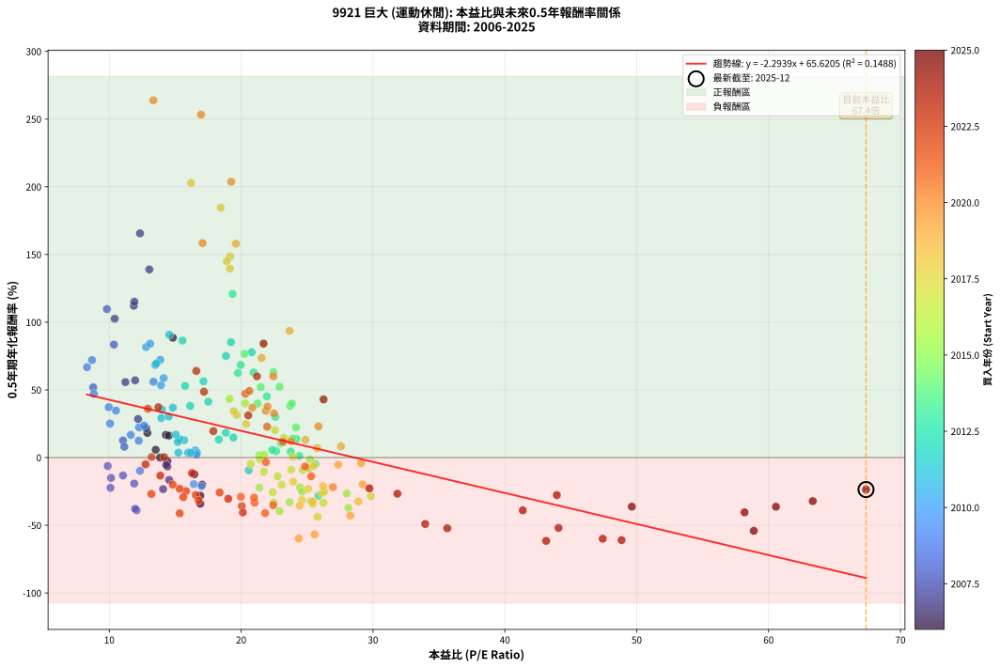
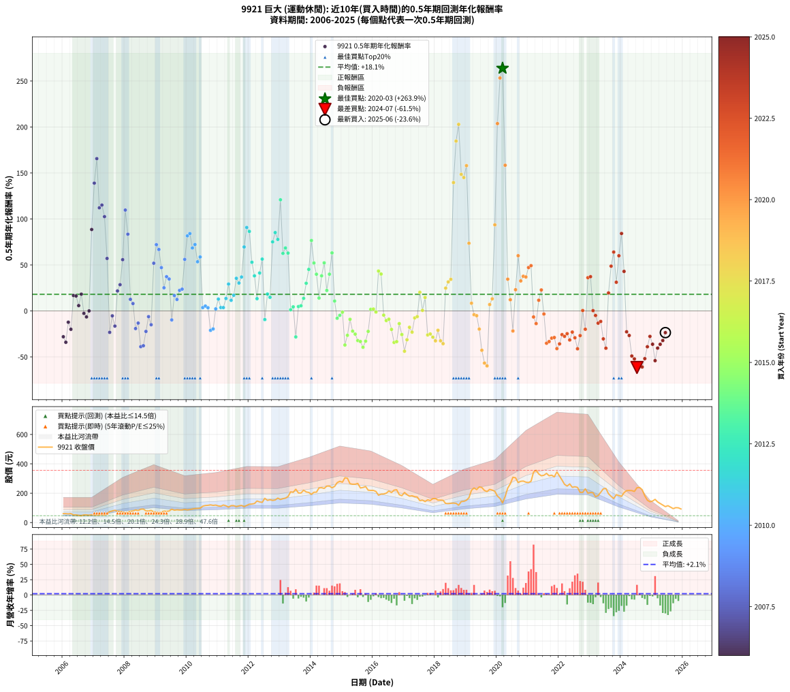

# 9921 巨大 - 本益比與未來報酬率分析

!!! info "報告資訊"
    - **股票代號**: 9921
    - **公司名稱**: 巨大
    - **產業別**: 運動休閒
    - **分析期間**: 2006-2025 (234 個數據點)
    - **資料來源**: Type 12 (ShowMonthlyK_ChartFlow) 月收盤價與本益比
    - **報酬率口徑**: 含現金股利 (簡化: 年度合計，假設每年7/1入帳)
    - **報告生成時間**: 2026-01-05 01:19:57 CST

## 📈 視覺化圖表

### 圖表1: 本益比 vs 未來報酬率關係

*圖表1：9921 巨大 本益比與0.5年期未來報酬率關係 (2006-2025)*

### 圖表2: 歷年買入時點的0.5年期實際報酬率

*圖表2：9921 巨大 歷年買入時點的0.5年期實際報酬率 (2006-2025)*

## 📍 買點訊號說明

本報告提供兩種買點提示訊號（顯示於圖表2的股價子圖中）：

### ▲ 小綠色三角形（回測驗證）
- **計算方式**: 使用全部歷史資料計算本益比第25百分位數
- **用途**: 事後驗證，顯示歷史上哪些時點確實為低估區
- **限制**: 當下無法判斷，僅供回測參考
- **特性**: 後見之明（Look-Ahead Bias）

### ▲ 小橘色三角形（即時訊號）
- **計算方式**: 使用截至當月的過去5年資料計算本益比第25百分位數
- **用途**: 實際投資決策，當時即可判斷
- **優勢**: 可操作性強，符合實務需求
- **特性**: 無後見之明，滾動窗口計算

!!! tip "如何使用兩種訊號"
    - **綠色▲** 幫助理解歷史估值機會，驗證策略有效性
    - **橘色▲** 可作為實際買進參考，但仍需搭配基本面分析
    - 兩種訊號重疊時，表示即時判斷與事後驗證一致，信心度較高
    - 僅有綠色▲時，表示當時無法判斷（需要未來資料才能確認）
    - 僅有橘色▲時，表示即時判斷為買點，但事後可能不是最佳時機

## 📊 估值分析摘要

| 指標 | 數值 |
|:---:|:---:|
| **目前本益比** (2025-06) | **67.39 倍** |
| **歷史平均本益比** | 20.74 倍 |
| **估值水準** | 🔴 相對高估 |
| **預期0.5年年化報酬率** | **-88.97%** |
| **歷史平均報酬率** | +18.05% |
| **相關係數 (R²)** | 0.1488 |
| **趨勢線斜率** | -2.2939 |

!!! abstract "核心洞察"
    目前本益比顯著高於歷史平均，預期未來報酬率可能較低

    根據歷史數據回測，9921 巨大 在目前本益比 **67.4倍** 的估值水準下，
    預期未來0.5年年化報酬率約為 **-89.0%**。

    **重要提醒**: 本分析基於歷史數據統計，實際報酬率會受到公司基本面變化、產業趨勢、
    總體經濟環境等多重因素影響。R² = 0.15 表示本益比可解釋約 14.9% 的報酬率變異。

## 📈 歷史估值統計

### 最佳買點 (最高報酬率)

| 項目 | 數值 |
|:---:|:---:|
| 起始時間 | 2020-03 |
| 當時本益比 | 13.34 倍 |
| 起始價格 | 134.0 元 |
| 0.5年後價格 | 281.0 元 |
| **0.5年年化報酬率** | **+263.86%** |

### 最差買點 (最低報酬率)

| 項目 | 數值 |
|:---:|:---:|
| 起始時間 | 2024-07 |
| 當時本益比 | 43.13 倍 |
| 起始價格 | 237.0 元 |
| 0.5年後價格 | 146.5 元 |
| **0.5年年化報酬率** | **-61.51%** |

## 🎯 投資啟示

### 本益比與報酬率關係

趨勢線方程式: **y = -2.2939x + 65.6205**

!!! warning "強負相關"
    本益比與未來報酬率呈現強負相關。在高本益比時期買入，未來報酬率顯著較低；
    在低本益比時期買入，未來報酬率顯著較高。**估值紀律至關重要**。

### 估值區間建議

基於歷史數據分析:

- **🟢 低估區** (P/E < 16.6): 預期報酬率較高，可考慮增加持股
- **🟡 合理區** (P/E 16.6-24.9): 預期報酬率符合長期趨勢，正常持有
- **🔴 高估區** (P/E > 24.9): 預期報酬率較低，可考慮減碼或觀望

!!! danger "風險提示"
    - 過去表現不代表未來結果
    - 本分析假設公司基本面無重大結構性變化
    - 產業環境劇變可能使歷史規律失效
    - 應結合公司財報、產業趨勢、總體經濟等多重因素綜合判斷

!!! success "長期投資觀點"
    歷史數據顯示，在合理或低估的估值水準買入並長期持有，
    往往能獲得較佳的投資報酬。**耐心等待好價格**是價值投資的核心原則。

## 📊 數據品質

- **資料來源**: GoodInfo.tw Type 12 (ShowMonthlyK_ChartFlow)
- **資料頻率**: 月度收盤價與本益比
- **回測期間**: 2006-2025
- **數據點數量**: 234 個 (每個點代表一次0.5年期回測)

### 計算方法說明

1. **0.5年期年化報酬率**:
   - 對每個歷史時點，計算其後0.5年的實際投資報酬率
   - 期末價值(不含股利): 期末價格
   - 期末價值(含現金股利): 期末價格 + 持有期間內的現金股利合計 (簡化: 年度合計，假設每年7/1入帳)
   - 公式: 年化報酬率 = [(期末價值/期初價格)^(1/年數) - 1] × 100%

2. **本益比 (P/E Ratio)**:
   - 使用當時的月收盤價與EPS計算
   - 資料來源: Type 12 月度河流圖本益比數據

3. **趨勢線 (Linear Regression)**:
   - 使用最小平方法擬合線性趨勢線
   - R²值衡量本益比對報酬率的解釋能力

---

*本報告由 Stock Analysis System v1.9.0 自動生成*
*數據更新時間: 2026-01-05 01:19:57 CST*

## 📋 月度回測明細表

（每一列對應時間線圖中的一個買入點；可用來對照 SVG 圖上的每個點。）

| 買入月份 | 賣出月份 | 回測期限_年 | 實際持有年數 | 買入本益比_倍 | 買入收盤價_元 | 賣出收盤價_元 | 現金股利合計_元 | 總報酬率_pct | 年化報酬率_pct |
| --- | --- | --- | --- | --- | --- | --- | --- | --- | --- |
| 2006-01 | 2006-07 | 0.5 | 0.496 | 16.90 | 61.00 | 48.80 | 3.00 | -15.08 | -28.10 |
| 2006-02 | 2006-08 | 0.5 | 0.498 | 16.90 | 61.00 | 46.55 | 3.00 | -18.77 | -34.11 |
| 2006-03 | 2006-10 | 0.5 | 0.586 | 16.45 | 59.40 | 52.00 | 3.00 | -7.41 | -12.31 |
| 2006-04 | 2006-10 | 0.5 | 0.501 | 17.04 | 61.50 | 52.00 | 3.00 | -10.57 | -19.98 |
| 2006-05 | 2006-12 | 0.5 | 0.586 | 14.29 | 51.60 | 53.50 | 3.00 | +9.50 | +16.75 |
| 2006-06 | 2006-12 | 0.5 | 0.501 | 14.52 | 52.40 | 53.50 | 3.00 | +7.82 | +16.23 |
| 2006-07 | 2007-01 | 0.5 | 0.504 | 13.52 | 48.80 | 50.20 | 0.00 | +2.87 | +5.78 |
| 2006-08 | 2007-03 | 0.5 | 0.580 | 12.89 | 46.55 | 51.30 | 0.00 | +10.20 | +18.22 |
| 2006-09 | 2007-03 | 0.5 | 0.496 | 14.40 | 52.00 | 51.30 | 0.00 | -1.35 | -2.70 |
| 2006-10 | 2007-05 | 0.5 | 0.580 | 14.40 | 52.00 | 50.00 | 0.00 | -3.85 | -6.53 |
| 2006-11 | 2007-05 | 0.5 | 0.496 | 13.85 | 50.00 | 50.00 | 0.00 | +0.00 | +0.00 |
| 2006-12 | 2007-07 | 0.5 | 0.580 | 14.82 | 53.50 | 74.30 | 3.00 | +44.49 | +88.52 |
| 2007-01 | 2007-07 | 0.5 | 0.496 | 13.04 | 50.20 | 74.30 | 3.00 | +53.98 | +138.96 |
| 2007-02 | 2007-08 | 0.5 | 0.498 | 12.33 | 50.40 | 79.00 | 3.00 | +62.70 | +165.59 |
| 2007-03 | 2007-10 | 0.5 | 0.586 | 11.86 | 51.30 | 76.70 | 3.00 | +55.36 | +112.12 |
| 2007-04 | 2007-10 | 0.5 | 0.501 | 11.90 | 54.30 | 76.70 | 3.00 | +46.78 | +115.10 |
| 2007-05 | 2007-12 | 0.5 | 0.586 | 10.41 | 50.00 | 72.60 | 3.00 | +51.20 | +102.51 |
| 2007-06 | 2007-12 | 0.5 | 0.501 | 11.96 | 60.30 | 72.60 | 3.00 | +25.37 | +57.04 |
| 2007-07 | 2008-01 | 0.5 | 0.504 | 14.08 | 74.30 | 65.00 | 0.00 | -12.52 | -23.31 |
| 2007-08 | 2008-03 | 0.5 | 0.583 | 14.32 | 79.00 | 76.50 | 0.00 | -3.16 | -5.36 |
| 2007-09 | 2008-03 | 0.5 | 0.498 | 14.54 | 83.70 | 76.50 | 0.00 | -8.60 | -16.52 |
| 2007-10 | 2008-05 | 0.5 | 0.583 | 12.80 | 76.70 | 86.00 | 0.00 | +12.13 | +21.68 |
| 2007-11 | 2008-05 | 0.5 | 0.498 | 12.18 | 75.90 | 86.00 | 0.00 | +13.31 | +28.49 |
| 2007-12 | 2008-07 | 0.5 | 0.583 | 11.22 | 72.60 | 91.00 | 3.00 | +29.48 | +55.73 |
| 2008-01 | 2008-07 | 0.5 | 0.498 | 9.82 | 65.00 | 91.00 | 3.00 | +44.62 | +109.67 |
| 2008-02 | 2008-08 | 0.5 | 0.501 | 10.35 | 70.10 | 92.00 | 3.00 | +35.52 | +83.43 |
| 2008-03 | 2008-10 | 0.5 | 0.586 | 11.04 | 76.50 | 79.00 | 3.00 | +7.19 | +12.58 |
| 2008-04 | 2008-10 | 0.5 | 0.501 | 11.14 | 78.90 | 79.00 | 3.00 | +3.93 | +8.00 |
| 2008-05 | 2008-12 | 0.5 | 0.586 | 11.89 | 86.00 | 72.90 | 3.00 | -11.74 | -19.20 |
| 2008-06 | 2008-12 | 0.5 | 0.501 | 11.04 | 81.50 | 72.90 | 3.00 | -6.87 | -13.24 |
| 2008-07 | 2009-01 | 0.5 | 0.504 | 12.07 | 91.00 | 71.00 | 0.00 | -21.98 | -38.90 |
| 2008-08 | 2009-03 | 0.5 | 0.580 | 11.96 | 92.00 | 69.80 | 0.00 | -24.13 | -37.86 |
| 2008-09 | 2009-03 | 0.5 | 0.496 | 10.09 | 79.10 | 69.80 | 0.00 | -11.76 | -22.31 |
| 2008-10 | 2009-05 | 0.5 | 0.580 | 9.88 | 79.00 | 76.10 | 0.00 | -3.67 | -6.24 |
| 2008-11 | 2009-05 | 0.5 | 0.496 | 10.13 | 82.50 | 76.10 | 0.00 | -7.76 | -15.04 |
| 2008-12 | 2009-07 | 0.5 | 0.580 | 8.78 | 72.90 | 90.90 | 2.00 | +27.43 | +51.84 |
| 2009-01 | 2009-07 | 0.5 | 0.496 | 8.69 | 71.00 | 90.90 | 2.00 | +30.85 | +72.03 |
| 2009-02 | 2009-08 | 0.5 | 0.498 | 8.31 | 66.80 | 84.20 | 2.00 | +29.04 | +66.81 |
| 2009-03 | 2009-10 | 0.5 | 0.586 | 8.83 | 69.80 | 85.50 | 2.00 | +25.36 | +47.07 |
| 2009-04 | 2009-10 | 0.5 | 0.501 | 10.06 | 78.20 | 85.50 | 2.00 | +11.89 | +25.14 |
| 2009-05 | 2009-12 | 0.5 | 0.586 | 9.96 | 76.10 | 89.60 | 2.00 | +20.37 | +37.22 |
| 2009-06 | 2009-12 | 0.5 | 0.501 | 10.51 | 78.90 | 89.60 | 2.00 | +16.10 | +34.70 |
| 2009-07 | 2010-01 | 0.5 | 0.504 | 12.33 | 90.90 | 86.30 | 0.00 | -5.06 | -9.79 |
| 2009-08 | 2010-03 | 0.5 | 0.580 | 11.63 | 84.20 | 92.10 | 0.00 | +9.38 | +16.71 |
| 2009-09 | 2010-03 | 0.5 | 0.496 | 12.23 | 86.90 | 92.10 | 0.00 | +5.98 | +12.44 |
| 2009-10 | 2010-05 | 0.5 | 0.580 | 12.26 | 85.50 | 96.10 | 0.00 | +12.40 | +22.31 |
| 2009-11 | 2010-05 | 0.5 | 0.496 | 12.64 | 86.50 | 96.10 | 0.00 | +11.10 | +23.66 |
| 2009-12 | 2010-07 | 0.5 | 0.580 | 13.35 | 89.60 | 111.50 | 4.50 | +29.46 | +56.03 |
| 2010-01 | 2010-07 | 0.5 | 0.496 | 12.79 | 86.30 | 111.50 | 4.50 | +34.41 | +81.64 |
| 2010-02 | 2010-08 | 0.5 | 0.498 | 13.10 | 88.90 | 116.00 | 4.50 | +35.55 | +84.11 |
| 2010-03 | 2010-10 | 0.5 | 0.586 | 13.49 | 92.10 | 120.50 | 4.50 | +35.72 | +68.42 |
| 2010-04 | 2010-10 | 0.5 | 0.501 | 13.87 | 95.20 | 120.50 | 4.50 | +31.30 | +72.21 |
| 2010-05 | 2010-12 | 0.5 | 0.586 | 13.92 | 96.10 | 119.00 | 4.50 | +28.51 | +53.44 |
| 2010-06 | 2010-12 | 0.5 | 0.501 | 14.12 | 98.00 | 119.00 | 4.50 | +26.02 | +58.66 |
| 2010-07 | 2011-01 | 0.5 | 0.504 | 15.98 | 111.50 | 113.50 | 0.00 | +1.79 | +3.59 |
| 2010-08 | 2011-03 | 0.5 | 0.580 | 16.53 | 116.00 | 119.50 | 0.00 | +3.02 | +5.25 |
| 2010-09 | 2011-03 | 0.5 | 0.496 | 16.65 | 117.50 | 119.50 | 0.00 | +1.70 | +3.46 |
| 2010-10 | 2011-05 | 0.5 | 0.580 | 16.99 | 120.50 | 105.00 | 0.00 | -12.86 | -21.12 |
| 2010-11 | 2011-05 | 0.5 | 0.496 | 16.41 | 117.00 | 105.00 | 0.00 | -10.26 | -19.62 |
| 2010-12 | 2011-07 | 0.5 | 0.580 | 16.60 | 119.00 | 115.50 | 5.00 | +1.26 | +2.18 |
| 2011-01 | 2011-07 | 0.5 | 0.496 | 15.67 | 113.50 | 115.50 | 5.00 | +6.17 | +12.84 |
| 2011-02 | 2011-08 | 0.5 | 0.498 | 15.24 | 111.50 | 108.50 | 5.00 | +1.79 | +3.63 |
| 2011-03 | 2011-10 | 0.5 | 0.586 | 16.18 | 119.50 | 117.00 | 5.00 | +2.09 | +3.60 |
| 2011-04 | 2011-10 | 0.5 | 0.501 | 15.35 | 114.50 | 117.00 | 5.00 | +6.55 | +13.50 |
| 2011-05 | 2011-12 | 0.5 | 0.586 | 13.94 | 105.00 | 117.00 | 5.00 | +16.19 | +29.19 |
| 2011-06 | 2011-12 | 0.5 | 0.501 | 15.19 | 115.50 | 117.00 | 5.00 | +5.63 | +11.55 |
| 2011-07 | 2012-01 | 0.5 | 0.504 | 15.04 | 115.50 | 125.00 | 0.00 | +8.23 | +16.99 |
| 2011-08 | 2012-03 | 0.5 | 0.583 | 14.00 | 108.50 | 129.50 | 0.00 | +19.35 | +35.45 |
| 2011-09 | 2012-03 | 0.5 | 0.498 | 14.51 | 113.50 | 129.50 | 0.00 | +14.10 | +30.30 |
| 2011-10 | 2012-05 | 0.5 | 0.583 | 14.82 | 117.00 | 140.50 | 0.00 | +20.09 | +36.87 |
| 2011-11 | 2012-05 | 0.5 | 0.498 | 13.56 | 108.00 | 140.50 | 0.00 | +30.09 | +69.55 |
| 2011-12 | 2012-07 | 0.5 | 0.583 | 14.55 | 117.00 | 165.00 | 5.50 | +45.73 | +90.74 |
| 2012-01 | 2012-07 | 0.5 | 0.498 | 15.55 | 125.00 | 165.00 | 5.50 | +36.40 | +86.45 |
| 2012-02 | 2012-08 | 0.5 | 0.501 | 15.75 | 126.50 | 151.00 | 5.50 | +23.72 | +52.92 |
| 2012-03 | 2012-10 | 0.5 | 0.586 | 16.13 | 129.50 | 151.00 | 5.50 | +20.85 | +38.16 |
| 2012-04 | 2012-10 | 0.5 | 0.501 | 18.31 | 147.00 | 151.00 | 5.50 | +6.46 | +13.31 |
| 2012-05 | 2012-12 | 0.5 | 0.586 | 17.51 | 140.50 | 166.50 | 5.50 | +22.42 | +41.24 |
| 2012-06 | 2012-12 | 0.5 | 0.501 | 17.14 | 137.50 | 166.50 | 5.50 | +25.09 | +56.33 |
| 2012-07 | 2013-01 | 0.5 | 0.504 | 20.58 | 165.00 | 157.00 | 0.00 | -4.85 | -9.39 |
| 2012-08 | 2013-03 | 0.5 | 0.580 | 18.84 | 151.00 | 166.50 | 0.00 | +10.26 | +18.34 |
| 2012-09 | 2013-03 | 0.5 | 0.496 | 19.41 | 155.50 | 166.50 | 0.00 | +7.07 | +14.79 |
| 2012-10 | 2013-05 | 0.5 | 0.580 | 18.85 | 151.00 | 209.00 | 0.00 | +38.41 | +75.07 |
| 2012-11 | 2013-05 | 0.5 | 0.496 | 19.23 | 154.00 | 209.00 | 0.00 | +35.71 | +85.20 |
| 2012-12 | 2013-07 | 0.5 | 0.580 | 20.80 | 166.50 | 227.00 | 5.50 | +39.64 | +77.76 |
| 2013-01 | 2013-07 | 0.5 | 0.496 | 19.35 | 157.00 | 227.00 | 5.50 | +48.09 | +120.86 |
| 2013-02 | 2013-08 | 0.5 | 0.498 | 19.75 | 162.50 | 201.50 | 5.50 | +27.38 | +62.54 |
| 2013-03 | 2013-10 | 0.5 | 0.586 | 19.97 | 166.50 | 220.50 | 5.50 | +35.74 | +68.45 |
| 2013-04 | 2013-10 | 0.5 | 0.501 | 20.95 | 177.00 | 220.50 | 5.50 | +27.68 | +62.87 |
| 2013-05 | 2013-12 | 0.5 | 0.586 | 24.41 | 209.00 | 205.00 | 5.50 | +0.72 | +1.23 |
| 2013-06 | 2013-12 | 0.5 | 0.501 | 23.76 | 206.00 | 205.00 | 5.50 | +2.18 | +4.41 |
| 2013-07 | 2014-01 | 0.5 | 0.504 | 25.85 | 227.00 | 192.00 | 0.00 | -15.42 | -28.28 |
| 2013-08 | 2014-03 | 0.5 | 0.580 | 22.65 | 201.50 | 207.00 | 0.00 | +2.73 | +4.75 |
| 2013-09 | 2014-03 | 0.5 | 0.496 | 22.37 | 201.50 | 207.00 | 0.00 | +2.73 | +5.58 |
| 2013-10 | 2014-05 | 0.5 | 0.580 | 24.18 | 220.50 | 237.50 | 0.00 | +7.71 | +13.65 |
| 2013-11 | 2014-05 | 0.5 | 0.496 | 22.59 | 208.50 | 237.50 | 0.00 | +13.91 | +30.06 |
| 2013-12 | 2014-07 | 0.5 | 0.580 | 21.95 | 205.00 | 248.50 | 6.00 | +24.15 | +45.16 |
| 2014-01 | 2014-07 | 0.5 | 0.496 | 20.26 | 192.00 | 248.50 | 6.00 | +32.55 | +76.59 |
| 2014-02 | 2014-08 | 0.5 | 0.498 | 21.49 | 206.50 | 248.50 | 6.00 | +23.24 | +52.11 |
| 2014-03 | 2014-10 | 0.5 | 0.586 | 21.24 | 207.00 | 246.00 | 6.00 | +21.74 | +39.90 |
| 2014-04 | 2014-10 | 0.5 | 0.501 | 23.89 | 236.00 | 246.00 | 6.00 | +6.78 | +13.99 |
| 2014-05 | 2014-12 | 0.5 | 0.586 | 23.71 | 237.50 | 281.00 | 6.00 | +20.84 | +38.14 |
| 2014-06 | 2014-12 | 0.5 | 0.501 | 22.91 | 232.50 | 281.00 | 6.00 | +23.44 | +52.25 |
| 2014-07 | 2015-01 | 0.5 | 0.504 | 24.16 | 248.50 | 275.00 | 0.00 | +10.66 | +22.28 |
| 2014-08 | 2015-03 | 0.5 | 0.580 | 23.85 | 248.50 | 302.00 | 0.00 | +21.53 | +39.92 |
| 2014-09 | 2015-03 | 0.5 | 0.496 | 22.45 | 237.00 | 302.00 | 0.00 | +27.43 | +63.08 |
| 2014-10 | 2015-05 | 0.5 | 0.580 | 23.01 | 246.00 | 261.00 | 0.00 | +6.10 | +10.74 |
| 2014-11 | 2015-05 | 0.5 | 0.496 | 25.13 | 272.00 | 261.00 | 0.00 | -4.04 | -7.99 |
| 2014-12 | 2015-07 | 0.5 | 0.580 | 25.64 | 281.00 | 266.50 | 6.60 | -2.81 | -4.79 |
| 2015-01 | 2015-07 | 0.5 | 0.496 | 25.23 | 275.00 | 266.50 | 6.60 | -0.69 | -1.39 |
| 2015-02 | 2015-08 | 0.5 | 0.498 | 28.13 | 305.00 | 235.50 | 6.60 | -20.62 | -37.09 |
| 2015-03 | 2015-10 | 0.5 | 0.586 | 28.01 | 302.00 | 245.50 | 6.60 | -16.52 | -26.53 |
| 2015-04 | 2015-10 | 0.5 | 0.501 | 24.67 | 264.50 | 245.50 | 6.60 | -4.69 | -9.14 |
| 2015-05 | 2015-12 | 0.5 | 0.586 | 24.47 | 261.00 | 219.00 | 6.60 | -13.56 | -22.02 |
| 2015-06 | 2015-12 | 0.5 | 0.501 | 24.61 | 261.00 | 219.00 | 6.60 | -13.56 | -25.24 |
| 2015-07 | 2016-01 | 0.5 | 0.504 | 25.27 | 266.50 | 219.00 | 0.00 | -17.82 | -32.27 |
| 2015-08 | 2016-03 | 0.5 | 0.583 | 22.46 | 235.50 | 186.00 | 0.00 | -21.02 | -33.28 |
| 2015-09 | 2016-03 | 0.5 | 0.498 | 22.92 | 239.00 | 186.00 | 0.00 | -22.18 | -39.54 |
| 2015-10 | 2016-05 | 0.5 | 0.583 | 23.68 | 245.50 | 194.50 | 0.00 | -20.77 | -32.92 |
| 2015-11 | 2016-05 | 0.5 | 0.498 | 21.39 | 220.50 | 194.50 | 0.00 | -11.79 | -22.26 |
| 2015-12 | 2016-07 | 0.5 | 0.583 | 21.37 | 219.00 | 215.00 | 6.20 | +1.00 | +1.73 |
| 2016-01 | 2016-07 | 0.5 | 0.498 | 21.73 | 219.00 | 215.00 | 6.20 | +1.00 | +2.03 |
| 2016-02 | 2016-08 | 0.5 | 0.501 | 21.41 | 212.00 | 204.50 | 6.20 | -0.61 | -1.22 |
| 2016-03 | 2016-10 | 0.5 | 0.586 | 19.12 | 186.00 | 223.50 | 6.20 | +23.49 | +43.36 |
| 2016-04 | 2016-10 | 0.5 | 0.501 | 20.30 | 194.00 | 223.50 | 6.20 | +18.40 | +40.09 |
| 2016-05 | 2016-12 | 0.5 | 0.586 | 20.73 | 194.50 | 183.00 | 6.20 | -2.72 | -4.61 |
| 2016-06 | 2016-12 | 0.5 | 0.501 | 21.72 | 200.00 | 183.00 | 6.20 | -5.40 | -10.49 |
| 2016-07 | 2017-01 | 0.5 | 0.504 | 23.79 | 215.00 | 205.00 | 0.00 | -4.65 | -9.02 |
| 2016-08 | 2017-03 | 0.5 | 0.580 | 23.07 | 204.50 | 179.50 | 0.00 | -12.22 | -20.12 |
| 2016-09 | 2017-03 | 0.5 | 0.496 | 25.43 | 221.00 | 179.50 | 0.00 | -18.78 | -34.28 |
| 2016-10 | 2017-05 | 0.5 | 0.580 | 26.24 | 223.50 | 176.50 | 0.00 | -21.03 | -33.42 |
| 2016-11 | 2017-05 | 0.5 | 0.496 | 22.77 | 190.00 | 176.50 | 0.00 | -7.11 | -13.82 |
| 2016-12 | 2017-07 | 0.5 | 0.580 | 22.40 | 183.00 | 149.00 | 5.00 | -15.85 | -25.71 |
| 2017-01 | 2017-07 | 0.5 | 0.496 | 25.80 | 205.00 | 149.00 | 5.00 | -24.88 | -43.86 |
| 2017-02 | 2017-08 | 0.5 | 0.498 | 24.61 | 190.00 | 152.50 | 5.00 | -17.11 | -31.37 |
| 2017-03 | 2017-10 | 0.5 | 0.586 | 23.94 | 179.50 | 155.00 | 5.00 | -10.86 | -17.82 |
| 2017-04 | 2017-10 | 0.5 | 0.501 | 25.09 | 182.50 | 155.00 | 5.00 | -12.33 | -23.10 |
| 2017-05 | 2017-12 | 0.5 | 0.586 | 25.04 | 176.50 | 163.50 | 5.00 | -4.53 | -7.61 |
| 2017-06 | 2017-12 | 0.5 | 0.501 | 25.49 | 174.00 | 163.50 | 5.00 | -3.16 | -6.21 |
| 2017-07 | 2018-01 | 0.5 | 0.504 | 22.57 | 149.00 | 163.50 | 0.00 | +9.73 | +20.24 |
| 2017-08 | 2018-03 | 0.5 | 0.580 | 23.92 | 152.50 | 153.00 | 0.00 | +0.33 | +0.57 |
| 2017-09 | 2018-03 | 0.5 | 0.496 | 23.24 | 143.00 | 153.00 | 0.00 | +6.99 | +14.61 |
| 2017-10 | 2018-05 | 0.5 | 0.580 | 26.15 | 155.00 | 130.00 | 0.00 | -16.13 | -26.14 |
| 2017-11 | 2018-05 | 0.5 | 0.496 | 26.30 | 150.00 | 130.00 | 0.00 | -13.33 | -25.08 |
| 2017-12 | 2018-07 | 0.5 | 0.580 | 29.84 | 163.50 | 131.00 | 3.50 | -17.74 | -28.57 |
| 2018-01 | 2018-07 | 0.5 | 0.496 | 28.89 | 163.50 | 131.00 | 3.50 | -17.74 | -32.56 |
| 2018-02 | 2018-08 | 0.5 | 0.498 | 26.20 | 153.00 | 132.50 | 3.50 | -11.11 | -21.05 |
| 2018-03 | 2018-10 | 0.5 | 0.586 | 25.42 | 153.00 | 118.00 | 3.50 | -20.59 | -32.53 |
| 2018-04 | 2018-10 | 0.5 | 0.501 | 24.44 | 151.50 | 118.00 | 3.50 | -19.80 | -35.62 |
| 2018-05 | 2018-12 | 0.5 | 0.586 | 20.38 | 130.00 | 144.50 | 3.50 | +13.85 | +24.77 |
| 2018-06 | 2018-12 | 0.5 | 0.501 | 19.66 | 129.00 | 144.50 | 3.50 | +14.73 | +31.55 |
| 2018-07 | 2019-01 | 0.5 | 0.504 | 19.44 | 131.00 | 152.00 | 0.00 | +16.03 | +34.33 |
| 2018-08 | 2019-03 | 0.5 | 0.580 | 19.15 | 132.50 | 220.00 | 0.00 | +66.04 | +139.55 |
| 2018-09 | 2019-03 | 0.5 | 0.496 | 18.45 | 131.00 | 220.00 | 0.00 | +67.94 | +184.67 |
| 2018-10 | 2019-05 | 0.5 | 0.580 | 16.21 | 118.00 | 224.50 | 0.00 | +90.25 | +202.87 |
| 2018-11 | 2019-05 | 0.5 | 0.496 | 19.17 | 143.00 | 224.50 | 0.00 | +56.99 | +148.47 |
| 2018-12 | 2019-07 | 0.5 | 0.580 | 18.91 | 144.50 | 238.50 | 4.60 | +68.24 | +145.03 |
| 2019-01 | 2019-07 | 0.5 | 0.496 | 19.60 | 152.00 | 238.50 | 4.60 | +59.93 | +157.96 |
| 2019-02 | 2019-08 | 0.5 | 0.498 | 21.55 | 169.50 | 218.50 | 4.60 | +31.62 | +73.57 |
| 2019-03 | 2019-10 | 0.5 | 0.586 | 27.57 | 220.00 | 226.00 | 4.60 | +4.82 | +8.36 |
| 2019-04 | 2019-10 | 0.5 | 0.501 | 29.10 | 235.50 | 226.00 | 4.60 | -2.08 | -4.11 |
| 2019-05 | 2019-12 | 0.5 | 0.586 | 27.36 | 224.50 | 213.00 | 4.60 | -3.07 | -5.19 |
| 2019-06 | 2019-12 | 0.5 | 0.501 | 29.21 | 243.00 | 213.00 | 4.60 | -10.45 | -19.78 |
| 2019-07 | 2020-01 | 0.5 | 0.504 | 28.28 | 238.50 | 180.00 | 0.00 | -24.53 | -42.80 |
| 2019-08 | 2020-03 | 0.5 | 0.583 | 25.57 | 218.50 | 134.00 | 0.00 | -38.67 | -56.76 |
| 2019-09 | 2020-03 | 0.5 | 0.498 | 24.36 | 211.00 | 134.00 | 0.00 | -36.49 | -59.79 |
| 2019-10 | 2020-05 | 0.5 | 0.583 | 25.76 | 226.00 | 235.00 | 0.00 | +3.98 | +6.93 |
| 2019-11 | 2020-05 | 0.5 | 0.498 | 24.87 | 221.00 | 235.00 | 0.00 | +6.33 | +13.12 |
| 2019-12 | 2020-07 | 0.5 | 0.583 | 23.67 | 213.00 | 308.50 | 4.60 | +47.00 | +93.59 |
| 2020-01 | 2020-07 | 0.5 | 0.498 | 19.25 | 180.00 | 308.50 | 4.60 | +73.94 | +203.72 |
| 2020-02 | 2020-08 | 0.5 | 0.501 | 16.96 | 164.50 | 305.00 | 4.60 | +88.21 | +253.30 |
| 2020-03 | 2020-10 | 0.5 | 0.586 | 13.34 | 134.00 | 281.00 | 4.60 | +113.13 | +263.86 |
| 2020-04 | 2020-10 | 0.5 | 0.501 | 17.07 | 177.50 | 281.00 | 4.60 | +60.90 | +158.39 |
| 2020-05 | 2020-12 | 0.5 | 0.586 | 21.87 | 235.00 | 275.00 | 4.60 | +18.98 | +34.53 |
| 2020-06 | 2020-12 | 0.5 | 0.501 | 23.79 | 264.00 | 275.00 | 4.60 | +5.91 | +12.14 |
| 2020-07 | 2021-01 | 0.5 | 0.504 | 26.96 | 308.50 | 272.50 | 0.00 | -11.67 | -21.83 |
| 2020-08 | 2021-03 | 0.5 | 0.580 | 25.86 | 305.00 | 344.00 | 0.00 | +12.79 | +23.04 |
| 2020-09 | 2021-03 | 0.5 | 0.496 | 22.44 | 272.50 | 344.00 | 0.00 | +26.24 | +60.03 |
| 2020-10 | 2021-05 | 0.5 | 0.580 | 22.49 | 281.00 | 331.00 | 0.00 | +17.79 | +32.60 |
| 2020-11 | 2021-05 | 0.5 | 0.496 | 22.00 | 282.50 | 331.00 | 0.00 | +17.17 | +37.67 |
| 2020-12 | 2021-07 | 0.5 | 0.580 | 20.85 | 275.00 | 322.00 | 8.00 | +20.00 | +36.91 |
| 2021-01 | 2021-07 | 0.5 | 0.496 | 20.32 | 272.50 | 322.00 | 8.00 | +21.10 | +47.16 |
| 2021-02 | 2021-08 | 0.5 | 0.498 | 20.62 | 281.00 | 335.00 | 8.00 | +22.06 | +49.20 |
| 2021-03 | 2021-10 | 0.5 | 0.586 | 24.85 | 344.00 | 322.50 | 8.00 | -3.92 | -6.60 |
| 2021-04 | 2021-10 | 0.5 | 0.501 | 25.31 | 356.00 | 322.50 | 8.00 | -7.16 | -13.79 |
| 2021-05 | 2021-12 | 0.5 | 0.586 | 23.18 | 331.00 | 345.00 | 8.00 | +6.65 | +11.61 |
| 2021-06 | 2021-12 | 0.5 | 0.501 | 21.97 | 318.50 | 345.00 | 8.00 | +10.83 | +22.79 |
| 2021-07 | 2022-01 | 0.5 | 0.504 | 21.88 | 322.00 | 316.50 | 0.00 | -1.71 | -3.36 |
| 2021-08 | 2022-03 | 0.5 | 0.580 | 22.43 | 335.00 | 260.50 | 0.00 | -22.24 | -35.17 |
| 2021-09 | 2022-03 | 0.5 | 0.496 | 21.02 | 318.50 | 260.50 | 0.00 | -18.21 | -33.35 |
| 2021-10 | 2022-05 | 0.5 | 0.580 | 20.98 | 322.50 | 263.00 | 0.00 | -18.45 | -29.63 |
| 2021-11 | 2022-05 | 0.5 | 0.496 | 19.98 | 311.50 | 263.00 | 0.00 | -15.57 | -28.93 |
| 2021-12 | 2022-07 | 0.5 | 0.580 | 21.82 | 345.00 | 244.00 | 10.00 | -26.38 | -41.00 |
| 2022-01 | 2022-07 | 0.5 | 0.496 | 20.05 | 316.50 | 244.00 | 10.00 | -19.75 | -35.85 |
| 2022-02 | 2022-08 | 0.5 | 0.498 | 18.37 | 289.50 | 239.50 | 10.00 | -13.82 | -25.80 |
| 2022-03 | 2022-10 | 0.5 | 0.586 | 16.56 | 260.50 | 205.50 | 10.00 | -17.27 | -27.65 |
| 2022-04 | 2022-10 | 0.5 | 0.501 | 15.82 | 248.50 | 205.50 | 10.00 | -13.28 | -24.75 |
| 2022-05 | 2022-12 | 0.5 | 0.586 | 16.77 | 263.00 | 200.50 | 10.00 | -19.96 | -31.62 |
| 2022-06 | 2022-12 | 0.5 | 0.501 | 15.33 | 240.00 | 200.50 | 10.00 | -12.29 | -23.03 |
| 2022-07 | 2023-01 | 0.5 | 0.504 | 15.61 | 244.00 | 205.00 | 0.00 | -15.98 | -29.23 |
| 2022-08 | 2023-03 | 0.5 | 0.580 | 15.34 | 239.50 | 176.00 | 0.00 | -26.51 | -41.18 |
| 2022-09 | 2023-03 | 0.5 | 0.496 | 13.19 | 205.50 | 176.00 | 0.00 | -14.36 | -26.85 |
| 2022-10 | 2023-05 | 0.5 | 0.580 | 13.21 | 205.50 | 206.00 | 0.00 | +0.24 | +0.42 |
| 2022-11 | 2023-05 | 0.5 | 0.496 | 14.81 | 230.00 | 206.00 | 0.00 | -10.43 | -19.94 |
| 2022-12 | 2023-07 | 0.5 | 0.580 | 12.93 | 200.50 | 232.00 | 7.80 | +19.60 | +36.12 |
| 2023-01 | 2023-07 | 0.5 | 0.496 | 13.72 | 205.00 | 232.00 | 7.80 | +16.98 | +37.22 |
| 2023-02 | 2023-08 | 0.5 | 0.498 | 14.16 | 203.50 | 196.00 | 7.80 | +0.15 | +0.30 |
| 2023-03 | 2023-10 | 0.5 | 0.586 | 12.75 | 176.00 | 163.00 | 7.80 | -2.95 | -4.99 |
| 2023-04 | 2023-10 | 0.5 | 0.501 | 13.87 | 183.50 | 163.00 | 7.80 | -6.92 | -13.34 |
| 2023-05 | 2023-12 | 0.5 | 0.586 | 16.27 | 206.00 | 184.00 | 7.80 | -6.89 | -11.48 |
| 2023-06 | 2023-12 | 0.5 | 0.501 | 19.02 | 230.00 | 184.00 | 7.80 | -16.61 | -30.41 |
| 2023-07 | 2024-01 | 0.5 | 0.504 | 20.13 | 232.00 | 178.50 | 0.00 | -23.06 | -40.57 |
| 2023-08 | 2024-03 | 0.5 | 0.583 | 17.89 | 196.00 | 217.50 | 0.00 | +10.97 | +19.54 |
| 2023-09 | 2024-03 | 0.5 | 0.498 | 17.18 | 178.50 | 217.50 | 0.00 | +21.85 | +48.67 |
| 2023-10 | 2024-05 | 0.5 | 0.583 | 16.60 | 163.00 | 217.50 | 0.00 | +33.44 | +63.99 |
| 2023-11 | 2024-05 | 0.5 | 0.498 | 20.54 | 190.00 | 217.50 | 0.00 | +14.47 | +31.16 |
| 2023-12 | 2024-07 | 0.5 | 0.583 | 21.20 | 184.00 | 237.00 | 5.00 | +31.52 | +59.98 |
| 2024-01 | 2024-07 | 0.5 | 0.498 | 21.70 | 178.50 | 237.00 | 5.00 | +35.57 | +84.19 |
| 2024-02 | 2024-08 | 0.5 | 0.501 | 26.25 | 204.00 | 239.00 | 5.00 | +19.61 | +42.96 |
| 2024-03 | 2024-10 | 0.5 | 0.586 | 29.73 | 217.50 | 182.00 | 5.00 | -14.02 | -22.73 |
| 2024-04 | 2024-10 | 0.5 | 0.501 | 31.85 | 218.50 | 182.00 | 5.00 | -14.42 | -26.71 |
| 2024-05 | 2024-12 | 0.5 | 0.586 | 33.96 | 217.50 | 141.50 | 5.00 | -32.64 | -49.06 |
| 2024-06 | 2024-12 | 0.5 | 0.501 | 35.63 | 212.00 | 141.50 | 5.00 | -30.90 | -52.17 |
| 2024-07 | 2025-01 | 0.5 | 0.504 | 43.13 | 237.00 | 146.50 | 0.00 | -38.19 | -61.51 |
| 2024-08 | 2025-03 | 0.5 | 0.580 | 47.42 | 239.00 | 140.50 | 0.00 | -41.21 | -59.96 |
| 2024-09 | 2025-03 | 0.5 | 0.496 | 48.85 | 224.00 | 140.50 | 0.00 | -37.28 | -60.99 |
| 2024-10 | 2025-05 | 0.5 | 0.580 | 44.07 | 182.00 | 119.00 | 0.00 | -34.62 | -51.91 |
| 2024-11 | 2025-05 | 0.5 | 0.496 | 41.36 | 152.00 | 119.00 | 0.00 | -21.71 | -38.98 |
| 2024-12 | 2025-07 | 0.5 | 0.580 | 43.94 | 141.50 | 115.00 | 2.20 | -17.17 | -27.72 |
| 2025-01 | 2025-07 | 0.5 | 0.496 | 49.63 | 146.50 | 115.00 | 2.20 | -20.00 | -36.26 |
| 2025-02 | 2025-08 | 0.5 | 0.498 | 58.88 | 158.00 | 105.00 | 2.20 | -32.15 | -54.09 |
| 2025-03 | 2025-10 | 0.5 | 0.586 | 58.18 | 140.50 | 101.50 | 2.20 | -26.19 | -40.45 |
| 2025-04 | 2025-10 | 0.5 | 0.501 | 60.56 | 130.00 | 101.50 | 2.20 | -20.23 | -36.31 |
| 2025-05 | 2025-12 | 0.5 | 0.586 | 63.35 | 119.00 | 92.60 | 2.20 | -20.34 | -32.16 |
| 2025-06 | 2025-12 | 0.5 | 0.501 | 67.39 | 108.50 | 92.60 | 2.20 | -12.63 | -23.62 |
