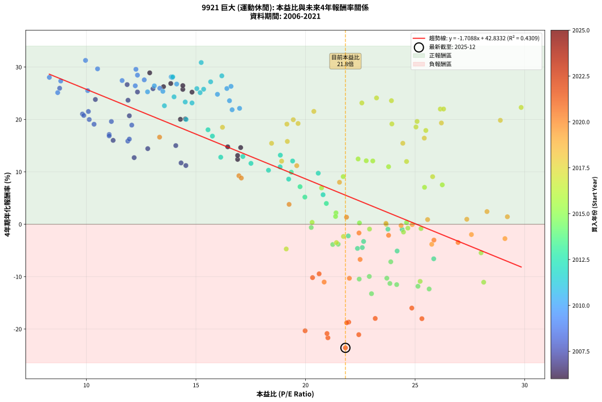
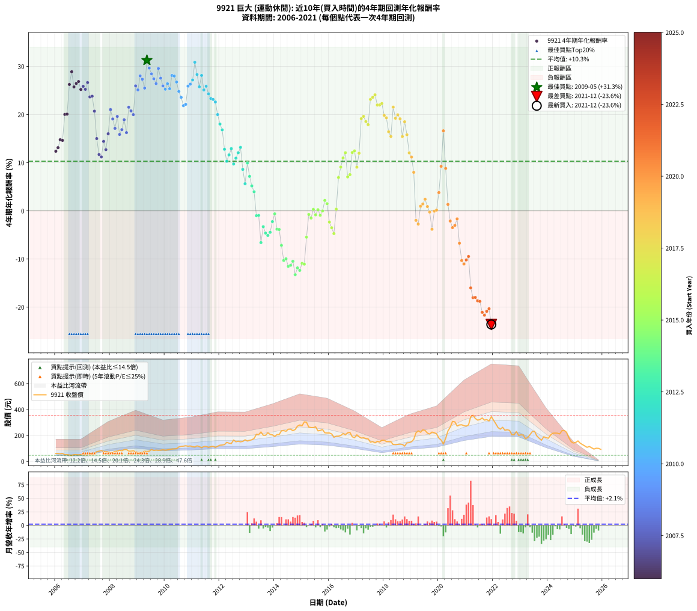

# 9921 巨大 - 本益比與未來報酬率分析

!!! info "報告資訊"
    - **股票代號**: 9921
    - **公司名稱**: 巨大
    - **產業別**: 運動休閒
    - **分析期間**: 2006-2021 (192 個數據點)
    - **資料來源**: Type 12 (ShowMonthlyK_ChartFlow) 月收盤價與本益比
    - **報酬率口徑**: 含現金股利 (簡化: 年度合計，假設每年7/1入帳)
    - **報告生成時間**: 2026-01-13 14:07:28 CST

## 📈 視覺化圖表

### 圖表1: 本益比 vs 未來報酬率關係

*圖表1：9921 巨大 本益比與4年期未來報酬率關係 (2006-2021)*

### 圖表2: 歷年買入時點的4年期實際報酬率

*圖表2：9921 巨大 歷年買入時點的4年期實際報酬率 (2006-2021)*

## 📍 買點訊號說明

本報告提供兩種買點提示訊號（顯示於圖表2的股價子圖中）：

### ▲ 小綠色三角形（回測驗證）
- **計算方式**: 使用全部歷史資料計算本益比第25百分位數
- **用途**: 事後驗證，顯示歷史上哪些時點確實為低估區
- **限制**: 當下無法判斷，僅供回測參考
- **特性**: 後見之明（Look-Ahead Bias）

### ▲ 小橘色三角形（即時訊號）
- **計算方式**: 使用截至當月的過去5年資料計算本益比第25百分位數
- **用途**: 實際投資決策，當時即可判斷
- **優勢**: 可操作性強，符合實務需求
- **特性**: 無後見之明，滾動窗口計算

!!! tip "如何使用兩種訊號"
    - **綠色▲** 幫助理解歷史估值機會，驗證策略有效性
    - **橘色▲** 可作為實際買進參考，但仍需搭配基本面分析
    - 兩種訊號重疊時，表示即時判斷與事後驗證一致，信心度較高
    - 僅有綠色▲時，表示當時無法判斷（需要未來資料才能確認）
    - 僅有橘色▲時，表示即時判斷為買點，但事後可能不是最佳時機

## 📊 估值分析摘要

| 指標 | 數值 |
|:---:|:---:|
| **目前本益比** (2021-12) | **21.82 倍** |
| **歷史平均本益比** | 19.04 倍 |
| **估值水準** | 🟡 合理範圍 |
| **預期4年年化報酬率** | **+5.55%** |
| **歷史平均報酬率** | +10.30% |
| **相關係數 (R²)** | 0.4309 |
| **趨勢線斜率** | -1.7088 |

!!! abstract "核心洞察"
    目前本益比接近歷史平均，預期報酬率符合長期趨勢

    根據歷史數據回測，9921 巨大 在目前本益比 **21.8倍** 的估值水準下，
    預期未來4年年化報酬率約為 **+5.5%**。

    **重要提醒**: 本分析基於歷史數據統計，實際報酬率會受到公司基本面變化、產業趨勢、
    總體經濟環境等多重因素影響。R² = 0.43 表示本益比可解釋約 43.1% 的報酬率變異。

## 📈 歷史估值統計

### 最佳買點 (最高報酬率)

| 項目 | 數值 |
|:---:|:---:|
| 起始時間 | 2009-05 |
| 當時本益比 | 9.96 倍 |
| 起始價格 | 76.1 元 |
| 4年後價格 | 209.0 元 |
| **4年年化報酬率** | **+31.27%** |

### 最差買點 (最低報酬率)

| 項目 | 數值 |
|:---:|:---:|
| 起始時間 | 2021-12 |
| 當時本益比 | 21.82 倍 |
| 起始價格 | 345.0 元 |
| 4年後價格 | 92.6 元 |
| **4年年化報酬率** | **-23.59%** |

## 🎯 投資啟示

### 本益比與報酬率關係

趨勢線方程式: **y = -1.7088x + 42.8332**

!!! warning "強負相關"
    本益比與未來報酬率呈現強負相關。在高本益比時期買入，未來報酬率顯著較低；
    在低本益比時期買入，未來報酬率顯著較高。**估值紀律至關重要**。

### 估值區間建議

基於歷史數據分析:

- **🟢 低估區** (P/E < 15.2): 預期報酬率較高，可考慮增加持股
- **🟡 合理區** (P/E 15.2-22.8): 預期報酬率符合長期趨勢，正常持有
- **🔴 高估區** (P/E > 22.8): 預期報酬率較低，可考慮減碼或觀望

!!! danger "風險提示"
    - 過去表現不代表未來結果
    - 本分析假設公司基本面無重大結構性變化
    - 產業環境劇變可能使歷史規律失效
    - 應結合公司財報、產業趨勢、總體經濟等多重因素綜合判斷

!!! success "長期投資觀點"
    歷史數據顯示，在合理或低估的估值水準買入並長期持有，
    往往能獲得較佳的投資報酬。**耐心等待好價格**是價值投資的核心原則。

## 📊 數據品質

- **資料來源**: GoodInfo.tw Type 12 (ShowMonthlyK_ChartFlow)
- **資料頻率**: 月度收盤價與本益比
- **回測期間**: 2006-2021
- **數據點數量**: 192 個 (每個點代表一次4年期回測)

### 計算方法說明

1. **4年期年化報酬率**:
   - 對每個歷史時點，計算其後4年的實際投資報酬率
   - 期末價值(不含股利): 期末價格
   - 期末價值(含現金股利): 期末價格 + 持有期間內的現金股利合計 (簡化: 年度合計，假設每年7/1入帳)
   - 公式: 年化報酬率 = [(期末價值/期初價格)^(1/年數) - 1] × 100%

2. **本益比 (P/E Ratio)**:
   - 使用當時的月收盤價與EPS計算
   - 資料來源: Type 12 月度河流圖本益比數據

3. **趨勢線 (Linear Regression)**:
   - 使用最小平方法擬合線性趨勢線
   - R²值衡量本益比對報酬率的解釋能力

---

*本報告由 Stock Analysis System v1.9.0 自動生成*
*數據更新時間: 2026-01-13 14:07:28 CST*

## 📋 月度回測明細表

（每一列對應時間線圖中的一個買入點；可用來對照 SVG 圖上的每個點。）

| 買入月份 | 賣出月份 | 回測期限_年 | 實際持有年數 | 買入本益比_倍 | 買入收盤價_元 | 賣出收盤價_元 | 現金股利合計_元 | 總報酬率_pct | 年化報酬率_pct |
| --- | --- | --- | --- | --- | --- | --- | --- | --- | --- |
| 2006-01 | 2010-01 | 4 | 4.000 | 16.90 | 61.00 | 86.30 | 11.00 | +59.51 | +12.38 |
| 2006-02 | 2010-02 | 4 | 4.000 | 16.90 | 61.00 | 88.90 | 11.00 | +63.77 | +13.13 |
| 2006-03 | 2010-03 | 4 | 4.000 | 16.45 | 59.40 | 92.10 | 11.00 | +73.57 | +14.78 |
| 2006-04 | 2010-04 | 4 | 4.000 | 17.04 | 61.50 | 95.20 | 11.00 | +72.68 | +14.63 |
| 2006-05 | 2010-05 | 4 | 4.000 | 14.29 | 51.60 | 96.10 | 11.00 | +107.56 | +20.03 |
| 2006-06 | 2010-06 | 4 | 4.000 | 14.52 | 52.40 | 98.00 | 11.00 | +108.02 | +20.09 |
| 2006-07 | 2010-07 | 4 | 4.000 | 13.52 | 48.80 | 111.50 | 12.50 | +154.10 | +26.26 |
| 2006-08 | 2010-08 | 4 | 4.000 | 12.89 | 46.55 | 116.00 | 12.50 | +176.05 | +28.90 |
| 2006-09 | 2010-09 | 4 | 4.000 | 14.40 | 52.00 | 117.50 | 12.50 | +150.00 | +25.74 |
| 2006-10 | 2010-10 | 4 | 4.000 | 14.40 | 52.00 | 120.50 | 12.50 | +155.77 | +26.46 |
| 2006-11 | 2010-11 | 4 | 4.000 | 13.85 | 50.00 | 117.00 | 12.50 | +159.00 | +26.86 |
| 2006-12 | 2010-12 | 4 | 4.000 | 14.82 | 53.50 | 119.00 | 12.50 | +145.79 | +25.21 |
| 2007-01 | 2011-01 | 4 | 4.000 | 13.04 | 50.20 | 113.50 | 12.50 | +151.00 | +25.87 |
| 2007-02 | 2011-02 | 4 | 4.000 | 12.33 | 50.40 | 111.50 | 12.50 | +146.03 | +25.24 |
| 2007-03 | 2011-03 | 4 | 4.000 | 11.86 | 51.30 | 119.50 | 12.50 | +157.31 | +26.65 |
| 2007-04 | 2011-04 | 4 | 4.000 | 11.90 | 54.30 | 114.50 | 12.50 | +133.89 | +23.67 |
| 2007-05 | 2011-05 | 4 | 4.000 | 10.41 | 50.00 | 105.00 | 12.50 | +135.00 | +23.81 |
| 2007-06 | 2011-06 | 4 | 4.000 | 11.96 | 60.30 | 115.50 | 12.50 | +112.27 | +20.70 |
| 2007-07 | 2011-07 | 4 | 4.000 | 14.08 | 74.30 | 115.50 | 14.50 | +74.97 | +15.01 |
| 2007-08 | 2011-08 | 4 | 4.000 | 14.32 | 79.00 | 108.50 | 14.50 | +55.70 | +11.70 |
| 2007-09 | 2011-09 | 4 | 4.000 | 14.54 | 83.70 | 113.50 | 14.50 | +52.93 | +11.20 |
| 2007-10 | 2011-10 | 4 | 4.000 | 12.80 | 76.70 | 117.00 | 14.50 | +71.45 | +14.43 |
| 2007-11 | 2011-11 | 4 | 4.000 | 12.18 | 75.90 | 108.00 | 14.50 | +61.40 | +12.71 |
| 2007-12 | 2011-12 | 4 | 4.000 | 11.22 | 72.60 | 117.00 | 14.50 | +81.13 | +16.01 |
| 2008-01 | 2012-01 | 4 | 4.000 | 9.82 | 65.00 | 125.00 | 14.50 | +114.62 | +21.04 |
| 2008-02 | 2012-02 | 4 | 4.000 | 10.35 | 70.10 | 126.50 | 14.50 | +101.14 | +19.09 |
| 2008-03 | 2012-03 | 4 | 4.000 | 11.04 | 76.50 | 129.50 | 14.50 | +88.24 | +17.13 |
| 2008-04 | 2012-04 | 4 | 4.000 | 11.14 | 78.90 | 147.00 | 14.50 | +104.69 | +19.61 |
| 2008-05 | 2012-05 | 4 | 4.000 | 11.89 | 86.00 | 140.50 | 14.50 | +80.23 | +15.87 |
| 2008-06 | 2012-06 | 4 | 4.000 | 11.04 | 81.50 | 137.50 | 14.50 | +86.50 | +16.86 |
| 2008-07 | 2012-07 | 4 | 4.000 | 12.07 | 91.00 | 165.00 | 17.00 | +100.00 | +18.92 |
| 2008-08 | 2012-08 | 4 | 4.000 | 11.96 | 92.00 | 151.00 | 17.00 | +82.61 | +16.25 |
| 2008-09 | 2012-09 | 4 | 4.000 | 10.09 | 79.10 | 155.50 | 17.00 | +118.08 | +21.52 |
| 2008-10 | 2012-10 | 4 | 4.000 | 9.88 | 79.00 | 151.00 | 17.00 | +112.66 | +20.76 |
| 2008-11 | 2012-11 | 4 | 4.000 | 10.13 | 82.50 | 154.00 | 17.00 | +107.27 | +19.99 |
| 2008-12 | 2012-12 | 4 | 4.000 | 8.78 | 72.90 | 166.50 | 17.00 | +151.71 | +25.96 |
| 2009-01 | 2013-01 | 4 | 4.000 | 8.69 | 71.00 | 157.00 | 17.00 | +145.07 | +25.12 |
| 2009-02 | 2013-02 | 4 | 4.000 | 8.31 | 66.80 | 162.50 | 17.00 | +168.71 | +28.03 |
| 2009-03 | 2013-03 | 4 | 4.000 | 8.83 | 69.80 | 166.50 | 17.00 | +162.89 | +27.33 |
| 2009-04 | 2013-04 | 4 | 4.000 | 10.06 | 78.20 | 177.00 | 17.00 | +148.08 | +25.50 |
| 2009-05 | 2013-05 | 4 | 4.000 | 9.96 | 76.10 | 209.00 | 17.00 | +196.98 | +31.27 |
| 2009-06 | 2013-06 | 4 | 4.000 | 10.51 | 78.90 | 206.00 | 17.00 | +182.64 | +29.66 |
| 2009-07 | 2013-07 | 4 | 4.000 | 12.33 | 90.90 | 227.00 | 20.50 | +172.28 | +28.46 |
| 2009-08 | 2013-08 | 4 | 4.000 | 11.63 | 84.20 | 201.50 | 20.50 | +163.66 | +27.43 |
| 2009-09 | 2013-09 | 4 | 4.000 | 12.23 | 86.90 | 201.50 | 20.50 | +155.47 | +26.43 |
| 2009-10 | 2013-10 | 4 | 4.000 | 12.26 | 85.50 | 220.50 | 20.50 | +181.87 | +29.57 |
| 2009-11 | 2013-11 | 4 | 4.000 | 12.64 | 86.50 | 208.50 | 20.50 | +164.74 | +27.56 |
| 2009-12 | 2013-12 | 4 | 4.000 | 13.35 | 89.60 | 205.00 | 20.50 | +151.67 | +25.95 |
| 2010-01 | 2014-01 | 4 | 4.000 | 12.79 | 86.30 | 192.00 | 20.50 | +146.23 | +25.27 |
| 2010-02 | 2014-02 | 4 | 4.000 | 13.10 | 88.90 | 206.50 | 20.50 | +155.34 | +26.41 |
| 2010-03 | 2014-03 | 4 | 4.000 | 13.49 | 92.10 | 207.00 | 20.50 | +147.01 | +25.37 |
| 2010-04 | 2014-04 | 4 | 4.000 | 13.87 | 95.20 | 236.00 | 20.50 | +169.43 | +28.12 |
| 2010-05 | 2014-05 | 4 | 4.000 | 13.92 | 96.10 | 237.50 | 20.50 | +168.47 | +28.00 |
| 2010-06 | 2014-06 | 4 | 4.000 | 14.12 | 98.00 | 232.50 | 20.50 | +158.16 | +26.76 |
| 2010-07 | 2014-07 | 4 | 4.000 | 15.98 | 111.50 | 248.50 | 22.00 | +142.60 | +24.80 |
| 2010-08 | 2014-08 | 4 | 4.000 | 16.53 | 116.00 | 248.50 | 22.00 | +133.19 | +23.57 |
| 2010-09 | 2014-09 | 4 | 4.000 | 16.65 | 117.50 | 237.00 | 22.00 | +120.43 | +21.85 |
| 2010-10 | 2014-10 | 4 | 4.000 | 16.99 | 120.50 | 246.00 | 22.00 | +122.41 | +22.12 |
| 2010-11 | 2014-11 | 4 | 4.000 | 16.41 | 117.00 | 272.00 | 22.00 | +151.28 | +25.90 |
| 2010-12 | 2014-12 | 4 | 4.000 | 16.60 | 119.00 | 281.00 | 22.00 | +154.62 | +26.32 |
| 2011-01 | 2015-01 | 4 | 4.000 | 15.67 | 113.50 | 275.00 | 22.00 | +161.67 | +27.19 |
| 2011-02 | 2015-02 | 4 | 4.000 | 15.24 | 111.50 | 305.00 | 22.00 | +193.27 | +30.86 |
| 2011-03 | 2015-03 | 4 | 4.000 | 16.18 | 119.50 | 302.00 | 22.00 | +171.13 | +28.32 |
| 2011-04 | 2015-04 | 4 | 4.000 | 15.35 | 114.50 | 264.50 | 22.00 | +150.22 | +25.77 |
| 2011-05 | 2015-05 | 4 | 4.000 | 13.94 | 105.00 | 261.00 | 22.00 | +169.52 | +28.13 |
| 2011-06 | 2015-06 | 4 | 4.000 | 15.19 | 115.50 | 261.00 | 22.00 | +145.02 | +25.11 |
| 2011-07 | 2015-07 | 4 | 4.000 | 15.04 | 115.50 | 266.50 | 23.60 | +151.17 | +25.89 |
| 2011-08 | 2015-08 | 4 | 4.000 | 14.00 | 108.50 | 235.50 | 23.60 | +138.80 | +24.31 |
| 2011-09 | 2015-09 | 4 | 4.000 | 14.51 | 113.50 | 239.00 | 23.60 | +131.37 | +23.33 |
| 2011-10 | 2015-10 | 4 | 4.000 | 14.82 | 117.00 | 245.50 | 23.60 | +130.00 | +23.15 |
| 2011-11 | 2015-11 | 4 | 4.000 | 13.56 | 108.00 | 220.50 | 23.60 | +126.02 | +22.61 |
| 2011-12 | 2015-12 | 4 | 4.000 | 14.55 | 117.00 | 219.00 | 23.60 | +107.35 | +20.00 |
| 2012-01 | 2016-01 | 4 | 4.000 | 15.55 | 125.00 | 219.00 | 23.60 | +94.08 | +18.03 |
| 2012-02 | 2016-02 | 4 | 4.000 | 15.75 | 126.50 | 212.00 | 23.60 | +86.25 | +16.82 |
| 2012-03 | 2016-03 | 4 | 4.000 | 16.13 | 129.50 | 186.00 | 23.60 | +61.85 | +12.79 |
| 2012-04 | 2016-04 | 4 | 4.000 | 18.31 | 147.00 | 194.00 | 23.60 | +48.03 | +10.30 |
| 2012-05 | 2016-05 | 4 | 4.000 | 17.51 | 140.50 | 194.50 | 23.60 | +55.23 | +11.62 |
| 2012-06 | 2016-06 | 4 | 4.000 | 17.14 | 137.50 | 200.00 | 23.60 | +62.62 | +12.93 |
| 2012-07 | 2016-07 | 4 | 4.000 | 20.58 | 165.00 | 215.00 | 24.30 | +45.03 | +9.74 |
| 2012-08 | 2016-08 | 4 | 4.000 | 18.84 | 151.00 | 204.50 | 24.30 | +51.52 | +10.95 |
| 2012-09 | 2016-09 | 4 | 4.000 | 19.41 | 155.50 | 221.00 | 24.30 | +57.75 | +12.07 |
| 2012-10 | 2016-10 | 4 | 4.000 | 18.85 | 151.00 | 223.50 | 24.30 | +64.11 | +13.18 |
| 2012-11 | 2016-11 | 4 | 4.000 | 19.23 | 154.00 | 190.00 | 24.30 | +39.16 | +8.61 |
| 2012-12 | 2016-12 | 4 | 4.000 | 20.80 | 166.50 | 183.00 | 24.30 | +24.50 | +5.63 |
| 2013-01 | 2017-01 | 4 | 4.000 | 19.35 | 157.00 | 205.00 | 24.30 | +46.05 | +9.93 |
| 2013-02 | 2017-02 | 4 | 4.000 | 19.75 | 162.50 | 190.00 | 24.30 | +31.88 | +7.16 |
| 2013-03 | 2017-03 | 4 | 4.000 | 19.97 | 166.50 | 179.50 | 24.30 | +22.40 | +5.18 |
| 2013-04 | 2017-04 | 4 | 4.000 | 20.95 | 177.00 | 182.50 | 24.30 | +16.84 | +3.97 |
| 2013-05 | 2017-05 | 4 | 4.000 | 24.41 | 209.00 | 176.50 | 24.30 | -3.92 | -1.00 |
| 2013-06 | 2017-06 | 4 | 4.000 | 23.76 | 206.00 | 174.00 | 24.30 | -3.74 | -0.95 |
| 2013-07 | 2017-07 | 4 | 4.000 | 25.85 | 227.00 | 149.00 | 23.80 | -23.88 | -6.59 |
| 2013-08 | 2017-08 | 4 | 4.000 | 22.65 | 201.50 | 152.50 | 23.80 | -12.51 | -3.28 |
| 2013-09 | 2017-09 | 4 | 4.000 | 22.37 | 201.50 | 143.00 | 23.80 | -17.22 | -4.61 |
| 2013-10 | 2017-10 | 4 | 4.000 | 24.18 | 220.50 | 155.00 | 23.80 | -18.91 | -5.11 |
| 2013-11 | 2017-11 | 4 | 4.000 | 22.59 | 208.50 | 150.00 | 23.80 | -16.64 | -4.45 |
| 2013-12 | 2017-12 | 4 | 4.000 | 21.95 | 205.00 | 163.50 | 23.80 | -8.63 | -2.23 |
| 2014-01 | 2018-01 | 4 | 4.000 | 20.26 | 192.00 | 163.50 | 23.80 | -2.45 | -0.62 |
| 2014-02 | 2018-02 | 4 | 4.000 | 21.49 | 206.50 | 153.00 | 23.80 | -14.38 | -3.81 |
| 2014-03 | 2018-03 | 4 | 4.000 | 21.24 | 207.00 | 153.00 | 23.80 | -14.59 | -3.87 |
| 2014-04 | 2018-04 | 4 | 4.000 | 23.89 | 236.00 | 151.50 | 23.80 | -25.72 | -7.16 |
| 2014-05 | 2018-05 | 4 | 4.000 | 23.71 | 237.50 | 130.00 | 23.80 | -35.24 | -10.29 |
| 2014-06 | 2018-06 | 4 | 4.000 | 22.91 | 232.50 | 129.00 | 23.80 | -34.28 | -9.96 |
| 2014-07 | 2018-07 | 4 | 4.000 | 24.16 | 248.50 | 131.00 | 21.30 | -38.71 | -11.52 |
| 2014-08 | 2018-08 | 4 | 4.000 | 23.85 | 248.50 | 132.50 | 21.30 | -38.11 | -11.30 |
| 2014-09 | 2018-09 | 4 | 4.000 | 22.45 | 237.00 | 131.00 | 21.30 | -35.74 | -10.47 |
| 2014-10 | 2018-10 | 4 | 4.000 | 23.01 | 246.00 | 118.00 | 21.30 | -43.37 | -13.25 |
| 2014-11 | 2018-11 | 4 | 4.000 | 25.13 | 272.00 | 143.00 | 21.30 | -39.60 | -11.84 |
| 2014-12 | 2018-12 | 4 | 4.000 | 25.64 | 281.00 | 144.50 | 21.30 | -41.00 | -12.36 |
| 2015-01 | 2019-01 | 4 | 4.000 | 25.23 | 275.00 | 152.00 | 21.30 | -36.98 | -10.90 |
| 2015-02 | 2019-02 | 4 | 4.000 | 28.13 | 305.00 | 169.50 | 21.30 | -37.44 | -11.07 |
| 2015-03 | 2019-03 | 4 | 4.000 | 28.01 | 302.00 | 220.00 | 21.30 | -20.10 | -5.46 |
| 2015-04 | 2019-04 | 4 | 4.000 | 24.67 | 264.50 | 235.50 | 21.30 | -2.91 | -0.74 |
| 2015-05 | 2019-05 | 4 | 4.000 | 24.47 | 261.00 | 224.50 | 21.30 | -5.82 | -1.49 |
| 2015-06 | 2019-06 | 4 | 4.000 | 24.61 | 261.00 | 243.00 | 21.30 | +1.26 | +0.31 |
| 2015-07 | 2019-07 | 4 | 4.000 | 25.27 | 266.50 | 238.50 | 19.30 | -3.26 | -0.83 |
| 2015-08 | 2019-08 | 4 | 4.000 | 22.46 | 235.50 | 218.50 | 19.30 | +0.98 | +0.24 |
| 2015-09 | 2019-09 | 4 | 4.000 | 22.92 | 239.00 | 211.00 | 19.30 | -3.64 | -0.92 |
| 2015-10 | 2019-10 | 4 | 4.000 | 23.68 | 245.50 | 226.00 | 19.30 | -0.08 | -0.02 |
| 2015-11 | 2019-11 | 4 | 4.000 | 21.39 | 220.50 | 221.00 | 19.30 | +8.98 | +2.17 |
| 2015-12 | 2019-12 | 4 | 4.000 | 21.37 | 219.00 | 213.00 | 19.30 | +6.07 | +1.48 |
| 2016-01 | 2020-01 | 4 | 4.000 | 21.73 | 219.00 | 180.00 | 19.30 | -9.00 | -2.33 |
| 2016-02 | 2020-02 | 4 | 4.000 | 21.41 | 212.00 | 164.50 | 19.30 | -13.30 | -3.51 |
| 2016-03 | 2020-03 | 4 | 4.000 | 19.12 | 186.00 | 134.00 | 19.30 | -17.58 | -4.72 |
| 2016-04 | 2020-04 | 4 | 4.000 | 20.30 | 194.00 | 177.50 | 19.30 | +1.44 | +0.36 |
| 2016-05 | 2020-05 | 4 | 4.000 | 20.73 | 194.50 | 235.00 | 19.30 | +30.75 | +6.93 |
| 2016-06 | 2020-06 | 4 | 4.000 | 21.72 | 200.00 | 264.00 | 19.30 | +41.65 | +9.09 |
| 2016-07 | 2020-07 | 4 | 4.000 | 23.79 | 215.00 | 308.50 | 17.70 | +51.72 | +10.98 |
| 2016-08 | 2020-08 | 4 | 4.000 | 23.07 | 204.50 | 305.00 | 17.70 | +57.80 | +12.08 |
| 2016-09 | 2020-09 | 4 | 4.000 | 25.43 | 221.00 | 272.50 | 17.70 | +31.31 | +7.05 |
| 2016-10 | 2020-10 | 4 | 4.000 | 26.24 | 223.50 | 281.00 | 17.70 | +33.65 | +7.52 |
| 2016-11 | 2020-11 | 4 | 4.000 | 22.77 | 190.00 | 282.50 | 17.70 | +58.00 | +12.12 |
| 2016-12 | 2020-12 | 4 | 4.000 | 22.40 | 183.00 | 275.00 | 17.70 | +59.95 | +12.46 |
| 2017-01 | 2021-01 | 4 | 4.000 | 25.80 | 205.00 | 272.50 | 17.70 | +41.56 | +9.08 |
| 2017-02 | 2021-02 | 4 | 4.000 | 24.61 | 190.00 | 281.00 | 17.70 | +57.21 | +11.97 |
| 2017-03 | 2021-03 | 4 | 4.000 | 23.94 | 179.50 | 344.00 | 17.70 | +101.50 | +19.14 |
| 2017-04 | 2021-04 | 4 | 4.000 | 25.09 | 182.50 | 356.00 | 17.70 | +104.77 | +19.62 |
| 2017-05 | 2021-05 | 4 | 4.000 | 25.04 | 176.50 | 331.00 | 17.70 | +97.56 | +18.56 |
| 2017-06 | 2021-06 | 4 | 4.000 | 25.49 | 174.00 | 318.50 | 17.70 | +93.22 | +17.90 |
| 2017-07 | 2021-07 | 4 | 4.000 | 22.57 | 149.00 | 322.00 | 20.70 | +130.00 | +23.15 |
| 2017-08 | 2021-08 | 4 | 4.000 | 23.92 | 152.50 | 335.00 | 20.70 | +133.25 | +23.58 |
| 2017-09 | 2021-09 | 4 | 4.000 | 23.24 | 143.00 | 318.50 | 20.70 | +137.20 | +24.10 |
| 2017-10 | 2021-10 | 4 | 4.000 | 26.15 | 155.00 | 322.50 | 20.70 | +121.42 | +21.98 |
| 2017-11 | 2021-11 | 4 | 4.000 | 26.30 | 150.00 | 311.50 | 20.70 | +121.47 | +21.99 |
| 2017-12 | 2021-12 | 4 | 4.000 | 29.84 | 163.50 | 345.00 | 20.70 | +123.67 | +22.29 |
| 2018-01 | 2022-01 | 4 | 4.000 | 28.89 | 163.50 | 316.50 | 20.70 | +106.24 | +19.84 |
| 2018-02 | 2022-02 | 4 | 4.000 | 26.20 | 153.00 | 289.50 | 20.70 | +102.75 | +19.33 |
| 2018-03 | 2022-03 | 4 | 4.000 | 25.42 | 153.00 | 260.50 | 20.70 | +83.79 | +16.43 |
| 2018-04 | 2022-04 | 4 | 4.000 | 24.44 | 151.50 | 248.50 | 20.70 | +77.69 | +15.46 |
| 2018-05 | 2022-05 | 4 | 4.000 | 20.38 | 130.00 | 263.00 | 20.70 | +118.23 | +21.54 |
| 2018-06 | 2022-06 | 4 | 4.000 | 19.66 | 129.00 | 240.00 | 20.70 | +102.09 | +19.23 |
| 2018-07 | 2022-07 | 4 | 4.000 | 19.44 | 131.00 | 244.00 | 27.20 | +107.02 | +19.95 |
| 2018-08 | 2022-08 | 4 | 4.000 | 19.15 | 132.50 | 239.50 | 27.20 | +101.28 | +19.11 |
| 2018-09 | 2022-09 | 4 | 4.000 | 18.45 | 131.00 | 205.50 | 27.20 | +77.63 | +15.45 |
| 2018-10 | 2022-10 | 4 | 4.000 | 16.21 | 118.00 | 205.50 | 27.20 | +97.20 | +18.50 |
| 2018-11 | 2022-11 | 4 | 4.000 | 19.17 | 143.00 | 230.00 | 27.20 | +79.86 | +15.81 |
| 2018-12 | 2022-12 | 4 | 4.000 | 18.91 | 144.50 | 200.50 | 27.20 | +57.58 | +12.04 |
| 2019-01 | 2023-01 | 4 | 4.000 | 19.60 | 152.00 | 205.00 | 27.20 | +52.76 | +11.17 |
| 2019-02 | 2023-02 | 4 | 4.000 | 21.55 | 169.50 | 203.50 | 27.20 | +36.11 | +8.01 |
| 2019-03 | 2023-03 | 4 | 4.000 | 27.57 | 220.00 | 176.00 | 27.20 | -7.64 | -1.97 |
| 2019-04 | 2023-04 | 4 | 4.000 | 29.10 | 235.50 | 183.50 | 27.20 | -10.53 | -2.74 |
| 2019-05 | 2023-05 | 4 | 4.000 | 27.36 | 224.50 | 206.00 | 27.20 | +3.88 | +0.96 |
| 2019-06 | 2023-06 | 4 | 4.000 | 29.21 | 243.00 | 230.00 | 27.20 | +5.84 | +1.43 |
| 2019-07 | 2023-07 | 4 | 4.000 | 28.28 | 238.50 | 232.00 | 30.40 | +10.02 | +2.42 |
| 2019-08 | 2023-08 | 4 | 4.000 | 25.57 | 218.50 | 196.00 | 30.40 | +3.62 | +0.89 |
| 2019-09 | 2023-09 | 4 | 4.000 | 24.36 | 211.00 | 178.50 | 30.40 | -1.00 | -0.25 |
| 2019-10 | 2023-10 | 4 | 4.000 | 25.76 | 226.00 | 163.00 | 30.40 | -14.42 | -3.82 |
| 2019-11 | 2023-11 | 4 | 4.000 | 24.87 | 221.00 | 190.00 | 30.40 | -0.27 | -0.07 |
| 2019-12 | 2023-12 | 4 | 4.000 | 23.67 | 213.00 | 184.00 | 30.40 | +0.66 | +0.16 |
| 2020-01 | 2024-01 | 4 | 4.000 | 19.25 | 180.00 | 178.50 | 30.40 | +16.06 | +3.79 |
| 2020-02 | 2024-02 | 4 | 4.000 | 16.96 | 164.50 | 204.00 | 30.40 | +42.49 | +9.26 |
| 2020-03 | 2024-03 | 4 | 4.000 | 13.34 | 134.00 | 217.50 | 30.40 | +85.00 | +16.63 |
| 2020-04 | 2024-04 | 4 | 4.000 | 17.07 | 177.50 | 218.50 | 30.40 | +40.23 | +8.82 |
| 2020-05 | 2024-05 | 4 | 4.000 | 21.87 | 235.00 | 217.50 | 30.40 | +5.49 | +1.34 |
| 2020-06 | 2024-06 | 4 | 4.000 | 23.79 | 264.00 | 212.00 | 30.40 | -8.18 | -2.11 |
| 2020-07 | 2024-07 | 4 | 4.000 | 26.96 | 308.50 | 237.00 | 30.80 | -13.19 | -3.48 |
| 2020-08 | 2024-08 | 4 | 4.000 | 25.86 | 305.00 | 239.00 | 30.80 | -11.54 | -3.02 |
| 2020-09 | 2024-09 | 4 | 4.000 | 22.44 | 272.50 | 224.00 | 30.80 | -6.50 | -1.66 |
| 2020-10 | 2024-10 | 4 | 4.000 | 22.49 | 281.00 | 182.00 | 30.80 | -24.27 | -6.71 |
| 2020-11 | 2024-11 | 4 | 4.000 | 22.00 | 282.50 | 152.00 | 30.80 | -35.29 | -10.31 |
| 2020-12 | 2024-12 | 4 | 4.000 | 20.85 | 275.00 | 141.50 | 30.80 | -37.35 | -11.03 |
| 2021-01 | 2025-01 | 4 | 4.000 | 20.32 | 272.50 | 146.50 | 30.80 | -34.94 | -10.19 |
| 2021-02 | 2025-02 | 4 | 4.000 | 20.62 | 281.00 | 158.00 | 30.80 | -32.81 | -9.46 |
| 2021-03 | 2025-03 | 4 | 4.000 | 24.85 | 344.00 | 140.50 | 30.80 | -50.20 | -16.00 |
| 2021-04 | 2025-04 | 4 | 4.000 | 25.31 | 356.00 | 130.00 | 30.80 | -54.83 | -18.02 |
| 2021-05 | 2025-05 | 4 | 4.000 | 23.18 | 331.00 | 119.00 | 30.80 | -54.74 | -17.98 |
| 2021-06 | 2025-06 | 4 | 4.000 | 21.97 | 318.50 | 108.50 | 30.80 | -56.26 | -18.68 |
| 2021-07 | 2025-07 | 4 | 4.000 | 21.88 | 322.00 | 115.00 | 25.00 | -56.52 | -18.80 |
| 2021-08 | 2025-08 | 4 | 4.000 | 22.43 | 335.00 | 105.00 | 25.00 | -61.19 | -21.07 |
| 2021-09 | 2025-09 | 4 | 4.000 | 21.02 | 318.50 | 94.90 | 25.00 | -62.35 | -21.67 |
| 2021-10 | 2025-10 | 4 | 4.000 | 20.98 | 322.50 | 101.50 | 25.00 | -60.78 | -20.86 |
| 2021-11 | 2025-11 | 4 | 4.000 | 19.98 | 311.50 | 100.50 | 25.00 | -59.71 | -20.33 |
| 2021-12 | 2025-12 | 4 | 4.000 | 21.82 | 345.00 | 92.60 | 25.00 | -65.91 | -23.59 |
